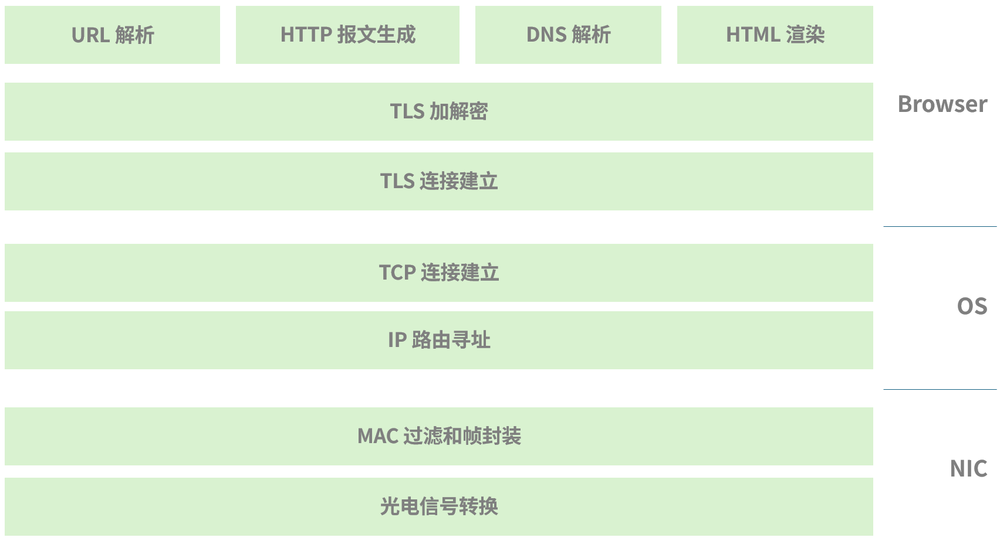
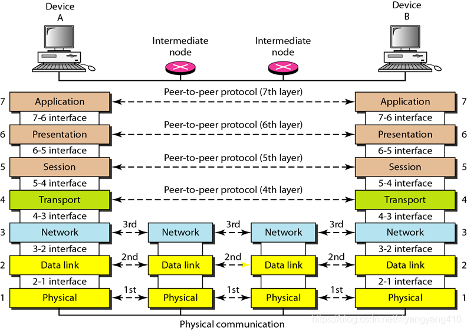
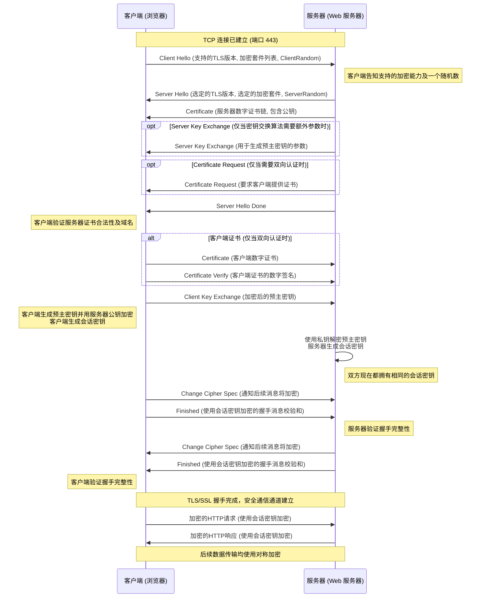
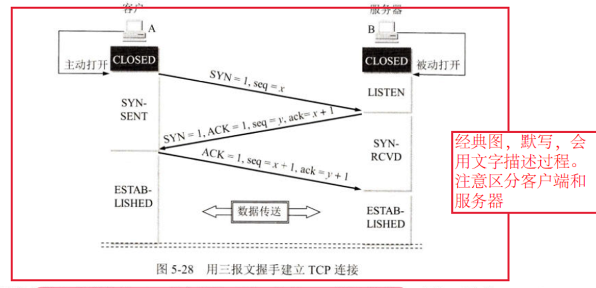
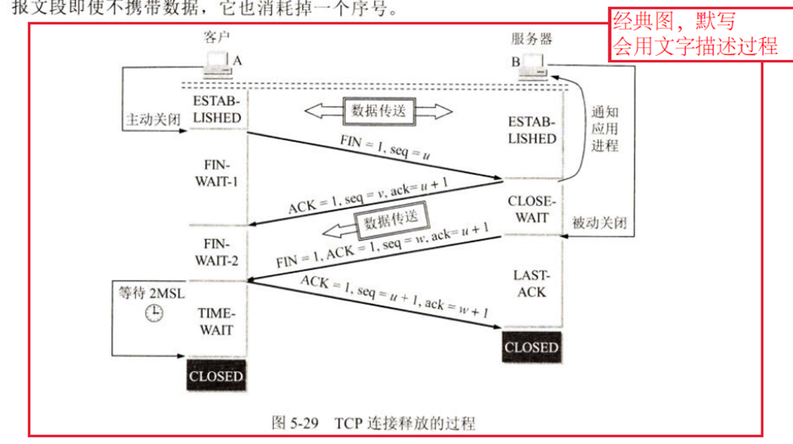
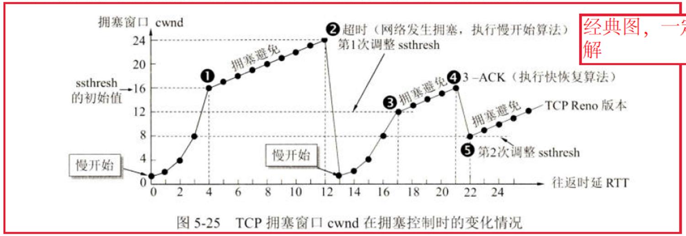
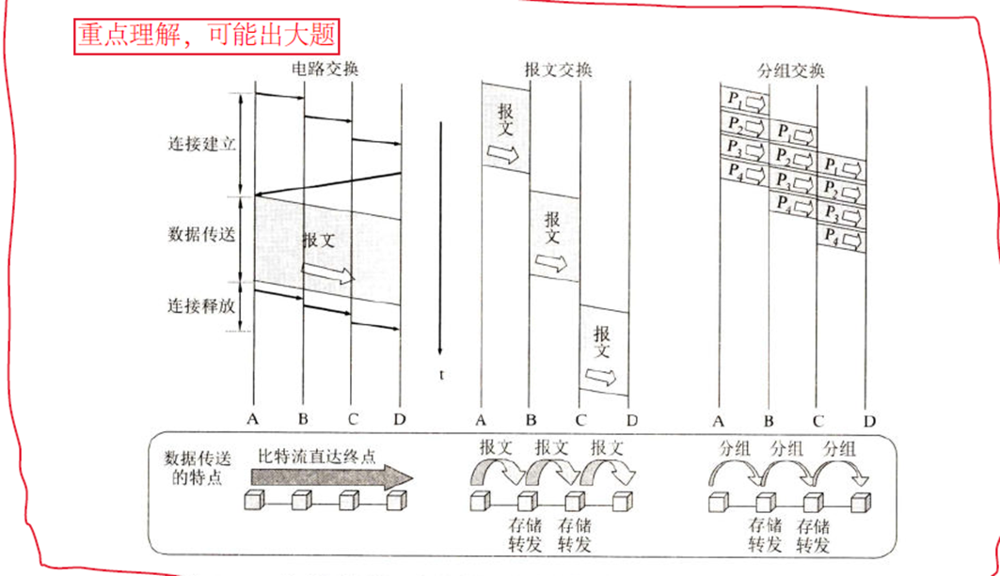
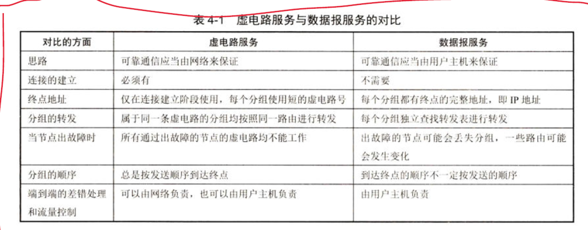

本文记录了我对计算机网络的理解，随着自己理解的变化会不断更新

> 我让 [Gemini](https://gemini.google.com/) 帮我起了 **悟记** 这个名字来表达此意

## 文章结构

本文先抛出了一个常见的面试题：**从键入网址到页面显示，这中间发生了什么？**

通过回答这个问题，让我能够理解现代计算机网络的运行方式，知道数据是怎么在计算机网络中传输的

在描述时，我会有意将数据在网络中的处理过程拆分为不同的阶段，同时会深入过程中涉及的各个协议的细节，藉此来引入计算机网络的分层模型：**OSI 模型**

然后会有意指出 **OSI 模型理论与实践的差异，** 藉此来引入另一个经典模型：**TCP/IP 模型**

通过这样从细节到宏观，自底向上地阐述，帮助自己建立起对计算机网络相对全面的理解

> 暂时不会深入 **网络接口层（链路层 和 物理层）** 的细节，那部分涉及硬件层面的东西平时工作中用到的不多，闲下来有时间再写（挖坑 × 1）

## 从键入网址到页面显示，这中间发生了什么？



先说大概流程：首先浏览器会对 **[URL](https://developer.mozilla.org/zh-CN/docs/Learn_web_development/Howto/Web_mechanics/What_is_a_URL)** 进行解析，从解析结果中得到目标域名，然后会遵循 **DNS 协议**试图找到目标域名对应的目标 **IP 地址**，拿到 IP 地址后，会尝试通过操作系统协议栈与目标 IP 建立 **TCP 连接**，TCP 连接建立后开始进行 **TLS 握手**，对信道进行加密，然后再用解析结果解析结果生成 **HTTP 请求报文**，将报文作为数据，通过**加密信道**传输给目标主机，目标主机收到来自浏览器的请求后，将被请求的内容通过加密信道回传给浏览器，浏览器收到结果后，通过 **HTML、CSS 和 JavaScript** 将结果渲染到页面上

> 这里是 **HTTP1.1/HTTP2** 的语境，现在 **[HTTP3](https://en.wikipedia.org/wiki/HTTP/3)** 已经不再使用 TCP，转而使用基于 UDP 的 **[QUIC](https://en.wikipedia.org/wiki/QUIC)** 来传输数据，但是 HTTP3 还没有大范围铺开，闲下来有时间再写（挖坑 × 2）

### URL 解析


> 图源：[MDN_Web_Doc: What is a URL?](https://developer.mozilla.org/en-US/docs/Learn_web_development/Howto/Web_mechanics/What_is_a_URL)

当我键入在浏览器地址栏键入地址按下回车后，浏览器会按照上图的模型提取需要的信息，然后对这些信息进行编解码、去冗余，然后开始对目标域名进行 **DNS 解析**

### DNS 解析

> 标准文档：[RFC 1034](https://datatracker.ietf.org/doc/html/rfc1034)、[RFC 1035](https://datatracker.ietf.org/doc/html/rfc1035)

**目的：**拿到域名对应主机的 IP 地址，以便后续通过 IP 协议在网络中找到对应的主机

带着这个目的，浏览器首先会检查自身的 **DNS 缓存**是否命中，如果没有命中，浏览器会向操作系统中的 **DNS 解析服务**发起 DNS 请求

> 主流操作系统都带有 DNS 解析服务，如
> - Windows 的 **DNS Client** 服务
> - Linux 和 Mac OS 在 **`/etc/resolv.conf`** 配置的本地解析器

典型的 DNS 请求是一串**二进制数据**，像是这样

`00000100000100000000000003777777076578616d706c6503636f6d0000010001`

里面各个部分的含义如下

> 此处不会深入各个字段的细节，工作中没遇到过要处理这么底层东西的时候，闲下来再写（挖坑 × 3）

```shell
# Header (12 字节)
00 00                   # ID: 0x0000 (随机生成，这里简化为0)
01 00                   # Flags: 0x0100 (QR=0:查询, OPCODE=0:标准查询, RD=1:请求递归)
00 01                   # QDCOUNT: 0x0001 (1个问题)
00 00                   # ANCOUNT: 0x0000 (0个回答)
00 00                   # NSCOUNT: 0x0000 (0个授权)
00 00                   # ARCOUNT: 0x0000 (0个附加记录)

# Question Section (问题部分)
03 77 77 77             # QNAME: "www" (长度3)
07 65 78 61 6d 70 6c 65 # QNAME: "example" (长度7)
03 63 6f 6d             # QNAME: "com" (长度3)
00                      # QNAME: 结束符 (长度0)
00 01                   # QTYPE: 0x0001 (A记录 - 请求IPv4地址)
00 01                   # QCLASS: 0x0001 (IN - Internet 类)
```

操作系统的 DNS 解析服务收到来自浏览器的 DNS 请求后，首先会检查操作系统的 **`hosts` 文件**，如果没有查到到域名对应的记录，DNS 解析服务检查操作系统自身的 **DNS 缓存**是否命中，如果没有命中，DNS 解析服务会向本地的 **DNS 网关**（通常是路由器）发起 DNS 请求，委托 DNS 网关来拿到目标 IP 地址，这一步也叫做**递归查询**

> **`hosts`** 文件里面是用户自定义的域名和 IP 的映射，作为本地的一个静态 DNS 查找表
> - **Windows: `C:\Windows\System32\drivers\etc\hosts`**
> - **Linux / MacOS: `/etc/hosts`**

DNS 网关服务器中的 DNS 解析器收到 DNS 请求后，会检查自身 DNS 缓存，如果没有命中，它会向**根 DNS 服务器**发起 DNS 请求，查询 **`.com`** 的 **NS 记录**，拿到对应的**顶级 DNS 服务器**的 IP 地址；DNS 网关服务器再向顶级 DNS 服务器发起 DNS 请求，查询 **`example.com`** 的 NS 记录，拿到对应的**权威 DNS 服务器**的 IP 地址；DNS 网关服务器再向权威 DNS 服务器发起 DNS 请求，查询 **`www.example.com`** 的 **A 记录（IPv4）或 AAAA 记录（IPv6）**，拿到目标 IP 地址，返回给操作系统的 DNS 解析服务。这个过程也叫**迭代查询**，整个流程如下图


> 图源：[cloudflare: what-is-dns?](https://www.cloudflare.com/zh-cn/learning/dns/what-is-dns/)

操作系统的 DNS 解析服务将此条 DNS 记录缓存起来后返回给浏览器，浏览器也将此条 DNS 记录缓存起来后，准备向目标 IP 发起 **TCP 连接**

### TCP 连接建立

### TLS 信道加密

### HTTP 请求报文生成

浏览器解析到 Scheme 为 HTTP(S)，并成功与目标主机建立连接后，会按照下图所示的 HTTP 格式生成 **HTTP 请求报文**

> 后面只能展示 HTTP/1.1 的示例原始报文。因为在 HTTP/2 下，其原始报文不再是 HTTP/1.1 那样的纯文本形式。HTTP/2 引入了二进制分帧，所有的请求和响应都被分割成更小的、二进制编码的帧。此外，Headers 还会被 HPACK 算法压缩，无法以人类可读的形式展示出来


> 图源：[小林 Coding：键入网址到网页显示，期间发生了什么？](https://xiaolincoding.com/network/1_base/what_happen_url.html#%E5%AD%A4%E5%8D%95%E5%B0%8F%E5%BC%9F-http)

一个典型的 HTTP/1.1 请求报文像是这样

```http
GET /path/to/myfile.html?key1=value1&key2=value2 HTTP/1.1
Host: www.example.com
User-Agent: Mozilla/5.0 (Windows NT 10.0; Win64; x64) AppleWebKit/537.36 (KHTML, like Gecko) Chrome/126.0.0.0 Safari/537.36
Accept: text/html,application/xhtml+xml,application/xml;q=0.9,image/avif,image/webp,image/apng,*/*;q=0.8,application/signed-exchange;v=b3;q=0.7
Accept-Encoding: gzip, deflate, br
Accept-Language: en-US,en;q=0.9,zh-CN;q=0.8,zh;q=0.7
Cookie: sessionid=your_session_id; user=your_username
Connection: keep-alive
Cache-Control: no-cache
Pragma: no-cache
```

由以下部分组成：

1.  **请求行 (Request Line)：`GET /path/to/myfile.html?key1=value1&key2=value2 HTTP/1.1`**

    * **`GET`**：HTTP 方法，表示客户端想要从服务器**获取资源**。其他比较常用的是 **`POST`**，表示向服务器**推送数据**（创建或修改资源，或者产生要返回的临时文件）
    * **`/path/to/myfile.html?key1=value1&key2=value2`**: 请求目标，指明了请求的资源在服务器上的**路径及查询参数**
    * **`HTTP/1.1`**: 客户端使用的 HTTP 协议版本，作为对期望的**响应版本**的指示符

2.  **请求头 (Request Headers)**

    * **`Host: www.example.com`**：（目标）主机，指定了目标服务器的**域名和（可选的）端口号**。在 HTTP/1.1 中，**`Host`** 头是**强制性**的，尤其在支持虚拟主机的服务器上，它告诉服务器要处理哪个域名下的请求
    * **`User-Agent: ...`**：用户代理，指明了代理用户向服务器发起 HTTP 请求的客户端（浏览器）的**类型和版本信息**
    * **`Accept: ...`**：接受（内容），声明了客户端能够处理的**响应内容**（如 HTML、XML、图片等）
    * **`Accept-Encoding: ...`**：接受编码，声明了客户端支持的**压缩算法**（如 gzip、deflate、br），服务器可以据此压缩响应体以节省带宽
    * **`Accept-Language: ...`**：接受语言，声明了客户端偏好的**语言**
    * **`Cookie: ...`**：客户端存储的与该域名相关的**一组键值对**，用于服务器识别用户或维护会话状态
    * **`Connection: keep-alive`**：连接类型，这是 HTTP/1.1 的一个重要特性。它告诉服务器，客户端希望在发送完当前请求/响应后，TCP 连接不要立即关闭，而是保持打开状态，以便**复用该连接**来发送后续的请求。这减少了频繁建立/关闭 TCP 连接的开销
    * **`Cache-Control: no-cache` / `Pragma: no-cache`**：缓存控制，用于指示服务器或中间缓存（如代理）不要直接返回缓存内容，而是重新验证或获取资源
3.  **空行**

    在所有请求头之后，必须有一个**单独的空行**（即一个回车换行符 **`CRLF`**），它作为请求头部分的结束标志。这是协议严格要求的

4.  **请求体 (Request Body) / 实体主体 (Entity Body)** (可选)

    对于 **`GET`** 请求，通常没有请求体，如果是一个 **`POST`** 或 **`PUT`** 请求，例如提交表单数据或 JSON 数据，那么请求体就会出现在空行之后。例如：

    ```http
    POST /api/users HTTP/1.1
    Host: api.example.com
    Content-Type: application/json
    Content-Length: 48
    Accept: application/json
    
    {
      "name": "kai",
      "email": "kai@example.com"
    }
    ```
    这里的
    ```json
    {
      "name": "kai",
      "email": "kai@example.com"
    }
    ```
    就是请求体。**`Content-Type`** 头告诉服务器请求体的媒体类型，**`Content-Length`** 头则指明了请求体的字节长度

## 计算机网络分层模型

这一节首先会描述计算机网络的经典模型：**OSI 模型**，这部分会回答这么几个问题：

- 什么是 OSI 模型？
- OSI 模型下的网络数据包是怎样交互的？
- 

然后会描述二者之间的关系

### OSI 模型



**OSI（Open Systems Interconnection，开放系统互连）模型** 是由国际标准化组织（ISO）创建的一个**概念性框架**，用于标准化和理解复杂的计算机网络通信过程。它将网络通信划分为七个独立的、逻辑上分层的职责。

数据在网络中传输时，从发送方主机的最高层（应用层）开始，逐层向下传递。在每一层，数据都会被添加特定的**协议头部**或进行格式转换，这个过程称为**封装（Encapsulation）**。当数据到达接收方主机时，会从最低层（物理层）开始，逐层向上解开相应的头部，并将数据递交给上一层，这个过程称为**解封装（Decapsulation）**。

OSI 模型各层职责如下：

每一层都专注于完成一组特定的任务，并为直接位于其上方的层提供服务，同时依赖于直接位于其下方的层所提供的服务。

**7. 应用层 (Application Layer)**
* **职责：** 直接面向用户和应用程序，提供各种网络服务。它是用户与网络交互的接口。
* **功能：**
    * 提供文件传输、电子邮件、远程登录、网页浏览等高级网络服务。
    * 与应用程序直接交互，例如 Web 浏览器、电子邮件客户端。
    * 处理特定的应用程序协议。
* **典型协议：** HTTP (超文本传输协议), FTP (文件传输协议), SMTP (简单邮件传输协议)等。
  > 这几个协议其实本身也体现了会话层和表示层的功能

**6. 表示层 (Presentation Layer)**
* **职责：** 负责数据的格式化、编码、解码、加密和解密，确保不同系统之间的数据能够正确地被理解和处理。
* **功能：**
    * 数据格式转换（如 ASCII 到 EBCDIC）。
    * 数据加密和解密。
    * 数据压缩和解压缩，以减少传输的数据量。
    * 定义数据的语法和语义。
* **典型协议/标准：** JPEG, MPEG, MIDI, ASCII, EBCDIC, SSL/TLS (通常被认为工作在表示层和会话层之间)。

**5. 会话层 (Session Layer)**
* **职责：** 建立、管理和终止应用程序之间的通信会话。
* **功能：**
    * **会话的建立、维护与终止：** 协商并建立两个应用进程之间的逻辑连接，并在通信结束后安全地断开。
    * **对话控制：** 确定哪个应用程序在何时可以发送数据（全双工、半双工或单工）。
    * **同步与恢复：** 在数据传输中设置检查点（同步点），以便在发生中断时能够从最近的检查点恢复会话，而不是从头开始。
* **典型协议：** RPC (远程过程调用), NetBIOS, Sockets (在概念上触及会话层功能)。

**4. 传输层 (Transport Layer)**
* **职责：** 提供**端到端**的可靠或不可靠数据传输服务。它负责将数据从源主机的**特定应用程序**传输到目的主机的**特定应用程序**。
* **功能：**
    * **端口寻址 (Port Addressing)：** 使用端口号来识别和区分不同的应用程序进程。
    * **多路复用与分用 (Multiplexing and Demultiplexing)：** 允许多个应用程序共享同一个网络连接，并在接收端将数据分发给正确的应用程序。
    * **可靠性传输 (仅 TCP)：** 提供错误检测、重传、排序、流量控制和拥塞控制机制，确保数据完整、按序、无错地到达。
    * **不可靠传输 (UDP)：** 提供无连接的、尽力而为的数据传输，不保证可靠性，但开销小、速度快。
* **典型协议：** TCP (传输控制协议), UDP (用户数据报协议)。

**3. 网络层 (Network Layer)**
* **职责：** 负责数据包的**逻辑寻址**和**路由**，将数据包从源主机传输到目的主机，可能跨越多个网络。
* **功能：**
    * **逻辑寻址：** 使用 IP 地址（逻辑地址）来唯一标识网络中的设备。
    * **路由 (Routing)：** 根据 IP 地址决定数据包的最佳传输路径，通过路由器进行转发。
    * **分段与重组（部分情况下）：** 将传输层的数据段进一步分段为数据包，并在接收端重组。
    * **流量控制：** 管理网络中的数据流量，防止网络拥塞（与传输层有所区别，网络层关注网络整体）。
* **典型协议：** IP (互联网协议), ICMP (互联网控制消息协议), ARP (地址解析协议，虽然常说在数据链路层，但与 IP 紧密相关), OSPF, BGP 等路由协议。

**2. 数据链路层 (Data Link Layer)**
* **职责：** 在**相邻的两个网络节点之间**提供可靠的数据传输。它处理物理寻址、帧的传输和错误检测。
* **功能：**
    * **帧的封装与解封装 (Framing)：** 将网络层的数据包封装成数据帧，并添加帧头和帧尾。
    * **物理寻址 (MAC Addressing)：** 使用 MAC 地址（物理地址）来标识同一网络中的设备。
    * **错误检测与纠正：** 检测数据在链路上是否发生错误，并可能进行纠正（如 CRC 校验、ARQ）。
    * **流量控制：** 控制相邻节点之间的数据发送速率。
    * **介质访问控制 (MAC)：** 管理多个设备对共享传输介质的访问（如 CSMA/CD 用于以太网，CSMA/CA 用于 Wi-Fi）。
    * 通常分为两个子层：逻辑链路控制 (LLC) 和媒体访问控制 (MAC)。
* **典型协议/标准：** 以太网 (Ethernet, IEEE 802.3), Wi-Fi (IEEE 802.11), PPP (点对点协议), 帧中继 (Frame Relay)。

**1. 物理层 (Physical Layer)**
* **职责：** 负责比特流在物理介质上的传输，定义了传输介质、信号类型、连接器等物理特性。
* **功能：**
    * **比特流传输：** 将数据链路层的数据帧转换为原始的比特流，并通过物理介质（如电缆、光纤、无线电波）传输。
    * **物理介质定义：** 规定网线、光纤、连接器（如 RJ45）的物理特性。
    * **信号编码与解码：** 将比特流转换为电信号、光信号或无线信号，并在接收端进行解码。
    * **电压、频率、传输速率：** 定义了信号的电压水平、频率、传输速度等物理参数。
    * **拓扑结构：** 在物理层定义了网络设备的物理连接方式（如星形、总线形）。
* **典型设备/标准：** 网线、光纤、网卡、集线器、调制解调器，以及各种物理接口标准（如 USB、蓝牙、RS-232C）。

### TCP/IP 模型


**TCP/IP 模型** 是当前互联网及其所有相关服务的**事实标准**。不像 OSI 模型，TCP/IP 模型没有标准化的文档，它通常由一整套协议族体现。

与 OSI 模型一样，在 TCP/IP 模型中，数据从发送方主机的应用层开始，逐层向下传递：

1.  **应用层**的数据加上应用层头部。
2.  传递给**传输层**，传输层将其封装成 TCP 数据段或 UDP 数据报，并加上传输层头部。
3.  传递给**互联网层**，互联网层将其封装成 IP 数据包，并加上 IP 头部。
4.  传递给**网络接口层**，网络接口层将其封装成特定链路的数据帧，并加上数据链路层头部和尾部，最终通过物理介质发送出去。

在接收方主机，数据从网络接口层开始，逐层向上解封装，直到应用层接收到原始数据。

我以**四层模型**为主进行描述：

> **关于层级数量的说明（四层或五层）：**
>
> TCP/IP 模型通常被描述为**四层模型**（更经典，由 DoD - 美国国防部模型演变而来），但在某些教学或为与 OSI 模型对比时，也常被描述为**五层模型**。这种差异主要体现在对最底层网络接口的划分上。

**4. 应用层 (Application Layer)**
* **对应 OSI 层：** OSI 的应用层、表示层、会话层。
* **核心职责：** 提供网络服务给最终用户应用程序。它封装了高层协议的所有逻辑，直接与应用程序交互。
* **主要功能：**
    * 定义特定应用程序的数据格式和通信规则。
    * 提供文件传输、电子邮件发送/接收、网页浏览、域名解析等服务。
    * 处理数据表示（如编码、加密/解密）和会话管理，这些功能通常由应用协议本身或其依赖的服务（如 SSL/TLS）实现。
* **典型协议：** HTTP (网页浏览), FTP (文件传输), SMTP (电子邮件发送), DNS (域名系统), SSH (安全外壳), Telnet, DHCP。

**3. 传输层 (Transport Layer)**
* **对应 OSI 层：** OSI 的传输层。
* **核心职责：** 提供端到端（End-to-End）的通信服务，将数据从源主机的特定应用程序（进程）传输到目的主机的特定应用程序（进程）。
* **主要功能：**
    * **端口寻址：** 使用端口号来区分不同应用程序的数据流。
    * **多路复用与分用：** 在发送端将多个应用程序的数据流复用到网络层，在接收端将数据流分发给正确的应用程序。
    * **可靠性（TCP）：** 通过序列号、确认应答、重传、流量控制和拥塞控制机制，确保数据完整、按序、无差错地到达。面向连接。
    * **不可靠性（UDP）：** 提供无连接的、尽力而为的数据传输，不保证可靠性，但开销小、效率高。
* **典型协议：** TCP (Transmission Control Protocol), UDP (User Datagram Protocol)。

**2. 互联网层 (Internet Layer)**
* **对应 OSI 层：** OSI 的网络层。
* **核心职责：** 负责数据包的**逻辑寻址**和**路由选择**，将数据包从源主机传输到目的主机，即使它们位于不同的网络中。
* **主要功能：**
    * **逻辑寻址：** 使用 IP 地址来唯一标识网络中的设备，实现全球范围内的唯一寻址。
    * **路由：** 根据目的 IP 地址，通过路由器决定数据包在互联网络中传输的最佳路径，并进行转发。
    * 数据包的分段与重组，以适应不同底层网络的 MTU (最大传输单元)。
* **典型协议：** IP (Internet Protocol - IPv4, IPv6), ICMP (Internet Control Message Protocol), IGMP (Internet Group Management Protocol), 路由协议（如 OSPF, BGP）。

**1. 网络接口层 (Network Access Layer)**
* **对应 OSI 层：** OSI 的数据链路层和物理层。
* **核心职责：** 处理与物理网络（如以太网、Wi-Fi）的连接细节，负责将 IP 数据包封装成帧并通过物理介质进行传输。
* **主要功能：**
    * 将 IP 数据包封装成适合特定物理链路的数据帧。
    * **物理寻址：** 使用 MAC 地址等物理地址来标识同一局域网内的设备。
    * **介质访问控制：** 管理对共享传输介质的访问（如 CSMA/CD, CSMA/CA）。
    * 错误检测（但不一定纠正）和流量控制。
    * 将数据转换为物理信号并在介质上传输。
* **典型协议/标准：** 以太网 (IEEE 802.3), Wi-Fi (IEEE 802.11), PPP (Point-to-Point Protocol), 各种物理层标准（如光纤、电缆）。

### 两种模型之间的关系

简单来讲，二者都是网络模型，但 **OSI 只是一个参考协议，而 TCP/IP 模型是现今事实上的标准**，原因主要有这么几点：

1. **发展顺序和时机：**
   * **TCP/IP 模型是先有协议，后有模型。** TCP/IP 协议栈是在互联网实际建设和发展过程中，由 ARPANET 的需求驱动而逐步形成并投入使用的。它是 “边干边学” 的产物，其设计更加实用和灵活，以适应不断变化的互联网需求。
   * **OSI 模型是先有模型，后有协议（尝试）。** OSI 模型是由 ISO（国际标准化组织）在 TCP/IP 已经开始广泛使用之后，作为一个理想的、通用的、分层通信系统蓝图而提出的。它试图为所有的网络协议提供一个统一的参考框架，甚至尝试开发自己的 OSI 协议栈。
2. **实用性与复杂性：**
   * **TCP/IP 模型的精简与实用：** TCP/IP 模型只有四层（或五层），合并了 OSI 的一些层（如会话层、表示层和应用层合并为应用层；数据链路层和物理层合并为网络接口层）。这种简化使得其更易于实现和部署，直接对应了互联网的核心协议。它没有为了 “理论完整性” 而引入在实际中不那么必要的独立层。
   * **OSI 模型的理想与复杂：** OSI 模型有七层，分工明确，职责清晰。但这种过于细致的划分在实际中导致了额外的复杂性。例如，会话层和表示层在很多实际应用中并没有独立且明确的协议，它们的功能往往被合并到应用层协议中，或者由底层协议隐式处理。试图为每一层都开发独立协议的 OSI 协议栈在实际中非常难以实现，也效率不高。
3. **协议的成功与失败：**
   * **TCP/IP 协议栈的统治地位：** TCP、IP、UDP、HTTP、DNS 等协议是互联网的基石，它们都是 TCP/IP 模型的一部分。这些协议在性能、可扩展性、互操作性方面都非常成功，并成为了全球事实上的标准。
   * **OSI 协议栈的失败：** 虽然 OSI 模型很美观，但基于 OSI 模型开发的 OSI 协议栈（如 X.25、OSI TP4 等）并未能获得市场的广泛认可和采用。它们在商业和技术上都未能与已经成熟和普及的 TCP/IP 协议竞争。

**举一个具体的例子来理解：**

假设你正在开发一个网页浏览器。

* **如果遵循 TCP/IP 模型：** 你知道你的应用层需要使用 HTTP 协议，HTTP 会调用传输层的 TCP 协议来发送数据，TCP 会调用互联网层的 IP 协议来路由，IP 会调用网络接口层的以太网或 Wi-Fi 驱动来发送到物理介质。这个流程非常直接，你在编程时会直接使用 Socket API 来访问传输层（TCP/UDP），然后由操作系统负责下面的层。

* **如果严格遵循 OSI 模型：** 你可能需要为应用层、表示层和会话层分别定义独立的接口和协议。这会使得应用程序的开发和协议栈的实现变得更加复杂。例如，可能需要一个独立的表示层协议来处理数据编码，一个独立的会话层协议来管理会话，然后再与应用层协议交互。在实际中，这些功能通常直接嵌入到像 HTTP 这样的应用层协议中，或者由底层的 TCP 处理。

## 应用层

TCP/IP 模型中的应用层是**最顶层**。它与 OSI 模型中的应用层、表示层和会话层的功能进行了合并，因此它负责的任务范围更广，直接面向用户应用程序提供各种网络服务。

**核心职责：** **为最终用户应用程序提供访问网络服务的接口和协议**。它处理特定的应用程序逻辑和数据格式，以便不同主机上的应用程序能够通过网络进行有效通信。

**主要功能：**

1.  **应用程序特定协议定义：**
    * 应用层定义了各种特定应用程序的通信协议，这些协议规定了数据交换的格式、请求/响应的流程以及错误处理机制。
    * **示例：** HTTP 定义了 Web 浏览器和 Web 服务器如何交换网页内容；SMTP 定义了电子邮件客户端和服务器如何发送和接收邮件。

2.  **数据表示与格式化：**
    * 尽管 TCP/IP 没有独立的表示层，但数据表示和格式化的功能是**在应用层协议内部或通过应用层使用的库来实现**。
    * 例如，HTTP 协议通过 `Content-Type` 头部字段来指示内容的类型（如 `text/html`, `application/json`, `image/jpeg`），应用程序根据这些信息来解析数据。数据编码（如 UTF-8）和数据压缩（如 Gzip）也通常在应用层进行协商和处理。
    * 在 HTTPS 中，SSL/TLS 协议在应用层（或更准确地说，在应用层和传输层之间）提供加密和解密服务，这也是 OSI 表示层的一部分功能。

3.  **应用程序级别的会话管理：**
    * TCP/IP 应用层负责建立、维护和终止应用程序之间的**逻辑会话**。虽然底层的 TCP 提供了传输层连接的建立和拆除，但应用层会话通常涉及更复杂的、与应用程序逻辑相关的状态管理。
    * **示例：** HTTP 的 `Cookie` 和 `Session ID` 机制用于在无状态的 HTTP 上维护用户会话状态；FTP 使用单独的控制连接来管理文件传输会话（命令、状态），同时建立数据连接进行实际数据传输。

4.  **用户接口与服务访问：**
    * 应用层协议是用户直接通过应用程序（如浏览器、邮件客户端、FTP 客户端）访问网络服务的接口。应用程序调用应用层协议来请求或提供网络资源。

**TCP/IP 应用层如何与下层交互：**

应用层协议不会直接处理网络路由或传输的可靠性。它们会依赖下层的**传输层**协议（如 TCP 或 UDP）来提供端到端的通信服务。应用层将数据和请求交给传输层，并指示使用哪个传输层协议（通过端口号）。传输层则负责将这些数据可靠（TCP）或不可靠（UDP）地传输到目的主机上的对应应用程序。

**常见的应用层协议示例：**

* **HTTP (Hypertext Transfer Protocol) / HTTPS (HTTP Secure)：**
    * **用途：** 万维网（World Wide Web）的核心协议，用于在 Web 浏览器和 Web 服务器之间传输超文本。HTTPS 通过 SSL/TLS 提供加密和身份验证。
* **FTP (File Transfer Protocol)：**
    * **用途：** 用于在客户端和服务器之间传输文件。它维护两个独立的连接：一个控制连接和一个数据连接。
* **SMTP (Simple Mail Transfer Protocol)：**
    * **用途：** 用于从邮件客户端发送邮件到邮件服务器，以及在邮件服务器之间转发邮件。
* **POP3 (Post Office Protocol version 3) / IMAP (Internet Message Access Protocol)：**
    * **用途：** 用于邮件客户端从邮件服务器接收邮件。POP3 通常将邮件下载到本地并从服务器删除，而 IMAP 允许在服务器上管理邮件。
* **DNS (Domain Name System)：**
    * **用途：** 将人类可读的域名（如 `www.example.com`）解析为机器可读的 IP 地址，是互联网的电话簿。
* **SSH (Secure Shell)：**
    * **用途：** 提供加密的网络服务，用于远程安全登录到计算机、远程执行命令、文件传输等。
* **Telnet：**
    * **用途：** 提供不加密的远程登录服务，已几乎被 SSH 取代。
* **DHCP (Dynamic Host Configuration Protocol)：**
    * **用途：** 自动为网络中的设备分配 IP 地址、子网掩码、网关和 DNS 服务器信息等网络配置参数。
* **SNMP (Simple Network Management Protocol)：**
    * **用途：** 用于网络设备的管理和监控，允许网络管理员收集网络设备的信息、配置设备以及接收设备发出的告警。

### HTTPS 详解

HTTPS (Hypertext Transfer Protocol Secure) 并非一个全新的协议，而是 **HTTP 协议与 SSL/TLS 协议的结合**。它的核心是在 HTTP 通信的基础上，通过 SSL/TLS (Secure Sockets Layer / Transport Layer Security，SSL 是 TLS 的前身，现在通常统称为 TLS) 协议提供**数据加密、身份验证和数据完整性**保护。

HTTPS 的工作流程可以分为两个主要阶段：
1.  **SSL/TLS 握手阶段 (Handshake)：** 用于建立加密通道，协商加密算法和生成会话密钥。
2.  **数据传输阶段：** 在加密通道建立后，使用协商好的密钥进行加密通信。



#### 阶段一：SSL/TLS 握手 (Handshake)

这是 HTTPS 工作流程中最复杂和关键的部分，目的是在客户端和服务器之间建立一个安全的、加密的通信通道。

**前提条件：**
* **服务器拥有数字证书：** 服务器必须安装一个由受信任的证书颁发机构（CA）签发的 SSL/TLS 数字证书。这个证书包含了服务器的公钥、服务器身份信息以及 CA 的数字签名。
* **客户端拥有根证书：** 客户端（如浏览器）内置了许多受信任的 CA 的根证书，用于验证服务器证书的合法性。

**握手步骤详解：**

1.  **客户端发起连接 (Client Hello)：**
    * 当用户在浏览器中输入 HTTPS 地址（例如 `https://www.example.com`）或点击 HTTPS 链接时，客户端（浏览器）会向服务器的 443 端口（HTTPS 默认端口）发起 TCP 连接请求。
    * TCP 连接建立后，客户端会发送一个 "Client Hello" 消息，包含以下信息：
        * 支持的 TLS 版本（如 TLS 1.2, TLS 1.3）。
        * 一个由客户端生成的随机数 `ClientRandom`。
        * 客户端支持的加密套件列表 (Cipher Suites)：包括密钥交换算法（如 RSA, ECDHE）、数字签名算法（如 RSA, ECDSA）、对称加密算法（如 AES, ChaCha20）和散列算法（如 SHA256）。
        * 支持的压缩算法列表。
        * 其他扩展信息。

2.  **服务器回应 (Server Hello)：**
    * 服务器收到 "Client Hello" 后，从客户端提供的列表中选择一个它支持且优先的 TLS 版本、加密套件和压缩算法。
    * 服务器发送 "Server Hello" 消息，包含：
        * 选定的 TLS 版本。
        * 一个由服务器生成的随机数 `ServerRandom`。
        * 选定的加密套件。
        * 选定的压缩算法。

3.  **服务器发送证书 (Server Certificate)：**
    * 服务器紧接着发送 "Server Certificate" 消息，其中包含服务器的数字证书链（通常包括服务器证书、中间 CA 证书，直至根 CA 证书，但不包含根证书本身）。
    * 客户端会验证服务器证书的合法性：
        * **验证证书链：** 检查证书是否由受信任的 CA 签发，并逐级向上验证证书链的有效性。
        * **验证域名：** 检查证书中的域名是否与当前访问的域名匹配。
        * **检查有效期：** 检查证书是否在有效期内。
        * **检查撤销状态：** 通过 CRL (Certificate Revocation List) 或 OCSP (Online Certificate Status Protocol) 检查证书是否被吊销。

4.  **服务器密钥交换 (Server Key Exchange - 可选，取决于密钥交换算法)：**
    * 如果服务器选择的密钥交换算法（如 ECDHE）需要额外的参数，服务器会发送 "Server Key Exchange" 消息，包含生成预主密钥所需的参数。
    * 如果是 RSA 密钥交换（较老、不推荐），服务器不会发送此消息，客户端会直接使用服务器公钥加密预主密钥。

5.  **服务器发送证书请求 (Certificate Request - 可选)：**
    * 如果服务器需要对客户端进行身份验证（即双向认证），会发送 "Certificate Request" 消息，请求客户端提供其数字证书。

6.  **服务器发送 Server Hello Done：**
    * 服务器发送 "Server Hello Done" 消息，表示服务器的协商部分已完成。

7.  **客户端密钥交换 (Client Key Exchange)：**
    * 客户端生成一个随机数，称为**预主密钥 (Pre-Master Secret)**。
    * 客户端使用服务器证书中的**公钥**加密这个预主密钥，然后发送 "Client Key Exchange" 消息到服务器。
    * **（重要）** 此时，客户端和服务器都拥有以下三个关键信息：`ClientRandom`、`ServerRandom` 和**未加密的预主密钥**（客户端自己生成，服务器用私钥解密得到）。这三个值是生成**会话密钥 (Session Key)** 的基础。

8.  **客户端发送 Change Cipher Spec：**
    * 客户端发送 "Change Cipher Spec" 消息，通知服务器：从现在开始，后续的通信将使用新协商的加密套件和会话密钥进行加密。

9.  **客户端发送 Finished：**
    * 客户端发送 "Finished" 消息，该消息是使用新协商的会话密钥和加密算法加密的第一个消息。它包含了之前握手消息的散列值，用于验证握手过程是否被篡改。

10. **服务器发送 Change Cipher Spec：**
    * 服务器收到客户端的 "Finished" 消息后，如果验证成功，服务器也发送 "Change Cipher Spec" 消息，表示它也准备好使用新的加密参数进行通信。

11. **服务器发送 Finished：**
    * 服务器发送自己的 "Finished" 消息，同样是使用新协商的会话密钥和加密算法加密的，也包含握手消息的散列值，供客户端验证。

至此，SSL/TLS 握手完成。一个安全的、加密的通道已经建立。客户端和服务器现在都拥有相同的**会话密钥**，这个密钥将用于后续的数据加密和解密。

#### 阶段二：数据传输

1.  **对称加密传输：**
    * 在握手阶段成功协商并生成会话密钥后，客户端和服务器之间的所有应用层数据（HTTP 请求和响应）都将使用这个**会话密钥进行对称加密**。
    * 对称加密相比非对称加密（公钥/私钥）效率更高，更适合大量数据的传输。
    * 数据在传输前会被加密，接收方使用相同的会话密钥进行解密。
    * 传输层（TCP）继续负责数据的分段、可靠传输和流量控制。

2.  **数据完整性校验：**
    * SSL/TLS 还会使用散列函数（如 HMAC-SHA256）对传输的数据进行完整性校验。
    * 发送方在加密数据前计算数据的散列值，并与加密数据一起发送。
    * 接收方解密数据后，重新计算散列值并与收到的散列值进行比对，以确保数据在传输过程中未被篡改。

#### HTTPS 的关键机制

* **混合加密系统：** 握手阶段使用**非对称加密（公钥/私钥）**来安全地交换对称密钥，而数据传输阶段则使用**对称加密**进行高效的加密通信。
* **数字证书：** 提供了服务器身份的**认证**和**信任链**，防止中间人攻击（Man-in-the-Middle Attack）。
* **散列函数：** 保证了数据在传输过程中的**完整性**，防止数据被篡改。
* **会话密钥的临时性：** 每个会话都会生成新的会话密钥，即使某个密钥被泄露，也只会影响一个会话的数据，提高了安全性（特别是使用了前向保密 Perfect Forward Secrecy 的密钥交换算法，如 ECDHE）。

通过以上工作流程，HTTPS 确保了用户与网站之间的通信是加密的、可验证的且完整的，极大地提升了网络通信的安全性。

## 传输层

**通信的抽象终点**

- 端口：分为硬件端口和软件端口。硬件端口是硬件设备上用于和其他硬件连接的物理接口。软件端口是通信的抽象起点或抽象终点，每个端口都与一个特定的进程或服务相关，可以实现传输层的复用分用。

  > 复用是指应用层的多个应用的数据都通过传输层传给网络层
  >
  > 分用是指网络层的数据都由传输层根据端口传给不同的进程或服务

**核心协议**

- UDP：用户数据报协议。传输层协议。用于在端到端之间进行无连接的、不可靠的数据传输。此外还有复用分用、差错检测的功能。协议数据单元是 UDP 用户数据报。

- TCP：传输控制协议。传输层协议。用于在端到端之间进行有连接的、可靠的数据传输。此外还有复用分用、差错检测、流量控制、拥塞控制的功能。协议数据单元是 TCP 报文段。

|              |       TCP        |                    UDP                     |
| :----------: | :--------------: | :----------------------------------------: |
|   连接性质   |     面向连接     |                   无连接                   |
|    可靠性    |       可靠       |          不可靠（尽最大努力交付）          |
| 面向数据单元 |      字节流      |                   数据报                   |
|   传输速度   |  延时大，速度慢  |               延时小，速度快               |
|   首部开销   |   至少 20 字节   |                固定 8 字节                 |
|   信道特点   | 一对一全双工信道 | 一对一、一对多、多对一、多对多的半双工信道 |

> 三次握手
>
> 
>
> 第三个报文的作用：
>
> 防止已经失效的连接请求报文（第一个报文）突然又传送到了服务器。如果没有第三个报文，客户端向服务器发送多个连接请求报文，服务器就可能会返回个确认报文，进而建立多个冗余的连接，浪费了资源。加入第三个报文之后，无论服务器返回几个确认报文，客户端只对需要建立的连接进行再次确认，连接才会建立，避免了资源浪费。

> 四次挥手
>
> 
>
> 等待 2MSL 的作用
>
> 1. 保证客户端发给服务器的最后一个报文段能够到达服务器。
> 2. 防止已经失效的连接请求报文突然又传送到了服务器。2MSL 的时间可以保证这个连接产生的所有报文都从网络中消失。

**用于保证可靠传输的技术**

- ARQ：自动重传请求。是可靠传输技术的一种。用于保证数据传输的可靠性。采用确认机制保证帧有序、不重复，采用重传机制保证帧不丢失。主要分为停止等待 ARQ 和连续 ARQ 两种实现。

**用于拥塞控制的一个算法和一个策略**

- AIMD：加法增加乘法减少。用于拥塞控制的算法。拥塞避免阶段，拥塞窗口线性增大，一旦出现超时或连续三个重复确认，就把门限值设为当前拥塞窗口大小的一半，并大大减小拥塞窗口的大小。（慢开始 + 拥塞避免）

> 拥塞控制的慢开始、拥塞避免、快重传、快恢复
>
> 
>
> 快重传：接收方需要立刻确认（不能延迟确认），发送方一旦收到连续 3 个重复确认，则立即重传丢失的报文段。

- AQM：主动队列管理。用于拥塞控制的策略。在队列长度达到某个警戒值（但没有达到最大值）时，主动丢弃到达的分组。

## 互联网层

**核心协议**

- IP：网际协议。网络层协议。用于在不同网络之间对分组进行路由和寻址，以及在不同网络的设备之间进行无连接的、不可靠的的分组传输。协议数据单元是 IP 分组。

  > IP 地址的分类：
  >
  > A：1 ～ 127
  >
  > B：128 ～ 191
  >
  > C：192 ～ 223
  >
  > D：224 ～ 239
  >
  > E：240 ～ 255
  >
  > 主机号全 0 表示这是一个网络的地址，全 1 表示广播地址
  >
  > 网络号全 0 表示这是本网络，127 表示回环测试地址
  >
  > 其中 A、B、C 类是单播地址
  >
  > D 类是多播地址
  >
  > E 类是保留地址
  >
  > 对于单播地址还会有私有地址空间，用于私网中
  >
  > 10.0.0.0 ～ 10.255.255.255
  >
  > 172.16.0.0 ～ 172.31.255.255
  >
  > 192.168.0.0 ～ 192.168.255.255

- ARP：地址解析协议。网络层协议。用于将 IP 地址映射为 MAC 地址。通过设备的 ARP 高速缓存中维护着的 IP 地址到 MAC 地址的动态映射表提供服务。ARP 报文封装在 MAC  帧中传输。

  > 当源主机需要目的主机的 MAC 地址时，首先查询本机的 ARP 缓存
  >
  > 若缓存命中则直接把缓存中的 MAC 地址写入 MAC 帧中
  >
  > 否则，源主机会向局域网中的其他主机广播携带着本机 IP 地址和 MAC 地址的 ARP 请求分组
  >
  > 非目的主机会直接过滤掉该分组，而目的主机接收到该分组后会把源主机的 IP 地址和 MAC 地址写入本机的 ARP 缓存，并返回一个携带着目的主机 IP 地址和 MAC 地址的 ARP 响应分组
  >
  > 源主机收到 ARP 响应分组后，将目的主机与对应的 MAC 地址写入本机的 ARP 缓存，再将该 MAC 地址写入 MAC 帧
  >
  > “一次请求，两次写入”

- IPX：互联网分组交换协议。OSI 模型的网络层协议。用于在不同网络之间对分组进行路由和寻址，以及在不同网络的设备之间进行无连接的、不可靠的的分组传输。协议数据单元是 IPX 分组。相当于 TCP/IP 模型中的 IP 协议。（很少见）

- RARP：逆地址解析协议。网络层协议。用于为主机提供 IP 地址。根据事先配置好的 RARP 表，为局域网内的主机提供从 MAC 地址到 IP 地址映射。（过时，已经被 DHCP 协议取代）

**IP 分配和路由方法**

- CIDR：无分类域间路由选择。是 IP 编址和 IP 路由方法的一种。用于进行无分类的 IP 编址和路由。由可变长度网络前缀和主机号组成。可以通过路由聚合将多个子网聚合成一个超网，减少转发表查询时间。缓解了 IP 地址不足的问题。

  > 路由聚合的方法
  >
  > 把下一跳相同的转发表项的目的地址写成二进制形式，聚合后的目的地址即是最长相同前缀的点分十进制，网络号位数就是最长相同前缀的二进制位数，写好之后，按照网络号位数从大到小以自上而下的顺序写成最终的转发表项

  > 路由配置指令格式
  >
  > `ip route {网络号} {子网掩码} {下一跳 IP 地址或出站接口}`

**IP 地址转换技术**

- NAT：网络地址转换。用于缓解公共 IP 地址不足的问题。利用 NAT 路由器中的 NAT 转换表，提供本地地址和公共地址之间的相互转换，使得单个私有 IP 地址可以通过单个公共 IP 地址进行通信。

  > 局域网中的 NAT 路由器把来自局域网数据报中源 IP 地址修改为路由器的公网 IP，把来自外部的数据报中的目的地址修改为局域网中对应主机的私网 IP 地址

  NAPT：网络地址和端口号转换。用于缓解公共 IP 地址不足的问题。在 NAT 的基础上增加了对端口号的映射，使得多个不同的私有 IP 地址可以通过单个公共 IP 地址互相通信。

**路由协议，两个内部网关协议，一个外部网关协议，路由器中既有路由表，也有转发表**

- RIP：路由信息协议。网络层协议。用于路由器在自治系统内部进行路由选择，生成路由表。基于距离向量。每个路由器定期跟周围的路由器交换路由表。优点是简单，缺点是坏消息传得慢。RIP 报文封装在 UDP 数据报中传输。

  > 路由器收到相邻路由器 A 发来的路由表之后，将收到的路由表的每一项的下一条修改为 A 并将其距离加一；对于修改后的路由表中的每一项，如果本机没有对应目的地址的路由项，则直接将该路由项添加到本机路由表中；如果已有该目的地址的路由项且但下一跳不是 A，则比较二者的距离，如果修改后的距离更短则执行替换；如果下一跳是 A，则跳过比较，直接替换。

- OSPF：开放最短路径优先。网络层协议。用于路由器在自治系统内部进行路由选择，生成路由表。基于链路状态。每个路由器定期地或在链路状态发生变化时采用洪泛法向所有路由器发送链路状态信息。优点是更新收敛快，灵活，缺点是比较复杂。OSPF 报文封装在 IP 数据报中传输。

  > 洪泛法：本结点向周围发送，周围向周围的周围发送

- BGP：边界网关协议。网络层协议。用于路由器在自治系统之间进行路由选择，生成路由表。基于路径向量。不同自治系统的边界路由器之间交换可达性信息，并将之转发给本自治系统内部的所有路由器。该协议力求选择出一条不兜圈子的路径，而不是计算出最佳路由。BGP 数据报封装在 TCP 报文段中传输。

|  | RIP | OSPF | BGP |
| :----: | :----: | :----:| :----: |
| 基于 | 距离向量协议 | 链路状态协议 | 路径向量协议 |
| 度量 | 距离（跳数） | 代价（自定义、通常是带宽） | 混合策略决定 |
| 交换 | 路由表 | 相邻链路状态 | 可达性信息 |
| 交换对象 | 相邻路由器 | 所有路由器（洪泛法） | 相邻边界路由器 |
| 交换时机 | 较短时间（比如 30 s） | 链路状态变化时或间隔较长时间（比如 30 min） | 可达性信息发送变化 |
| 封包载体协议 | UDP | IP | TCP |
| 优点 | 简单、开销小 | 收敛迅速，灵活 |  |
| 缺点 | 坏消息传的慢、最大距离限制 15 | 实现复杂、建立网络时的广播开销大 |  |
| 适用场景 | 小型网络 | 大型网络 |  |

**特殊的网络，路由器中没有路由表只有转发表**

- SDN：软件定义网络。是中心化路由控制的网络。由掌握整个网络状态的逻辑控制器为每一个分组计算最佳路由，并将转发表下发给每一个路由器。路由器之间不交换信息，内部也没有路由表，仅根据下发得到的转发表转发分组。

> 路由器转发分组时查的是转发表，转发表是路由表生成的，而路由表又是由路由选择协议生成的。
>
> 即：路由选择协议 -> 路由表 -> 转发表

**用于分组过滤的技术**

- ACL：访问控制列表。分组过滤技术的一种。用于路由器对入站的分组进行自定义过滤。通过配置多条安全策略，在分组到达时路由器从上到下检查 ACL，决定转发或是丢弃该分组。

**用于网络问题诊断的协议**

- ICMP：网际控制报文协议。网络层协议。用于诊断当前网络存在的问题，确定分组能否被正确转发到目的地。ICMP 报文类别可以分为 ICMP 差错报告报文和 ICMP 询问报文。ICMP 报文封装在 IP 数据报中传输。
- PING：分组网间探测。网络层协议。用于测试分组能否被正确转发到目的地。利用了 ICMP 回送请求报文和回送回答报文。

**组播相关协议**

- IGMP：网际组管理协议。网络层协议。用于管理组播组成员的参加和退出。IGMP 报文封装在 IP 数据报中传输。

**自治系统相关**

- AS：自治系统。采用单一路由策略的 IP 网络和路由器的集合。
- IGP：内部网关协议。自治系统内部采用的路由选择协议。主要包括：RIP、OSPF
- EGP：外部网关协议。自治系统之间采用的路由选择协议。主要是指 BGP

**IP 协议的增强协议**

- MPLS：多协议标签交换。介于数据链路层和网络层之间的协议。用于在不同网络之间对分组进行路由和寻址，以及在不同网络的设备之间进行有连接的、可靠的的分组传输。为每个分组打上标签，标签交换路由器根据标签和转发表转发分组，使分组沿着预定的路径传输，加速了分组转发。

  > 这个协议介于第二层和第三层之间，因为它只需要根据分组标签执行硬件式交换，也因此加速了分组转发。

**网络代理技术**

- VPN：虚拟私人网络。用于在公网上提供私网访问。主要原理是利用隧道技术，把私网数据封装在隧道中，使之在公网上透明传播，从而实现利用公网进行虚拟的私网通信。

  > 源主机直接使用私网 IP 作为源地址和目的地址发送数据报，其所属局域网的 VPN 路由器收到使用私网 IP 的数据报时，会将整个数据报加密并将之封装成源地址为路由器公网 IP，目的地址为目的局域网 VPN 路由器的公网 IP 的数据报，目的局域网的 VPN 路由器收到后，将数据报拆封并解密，随后发送给局域网内部的目的主机。对于通信双方的主机来讲，他们直接使用私网 IP 进行通信，整个过程是透明的。

**设备，可以同时分隔冲突域和广播域**

- 路由器：用于在不同网络之间进行分组转发。

  原理：路由器提取 IP 数据报首部中的目的地址，如果转发表中有为该目的地址配置的特定主机路由，则按照特定主机路由将 IP 数据报转发到下一跳所在的端口，否则，路由器会将目的地址和转发表中每一项的子网掩码按位与之后用最长前缀匹配的方法和该项的目的地址进行匹配，如果匹配成功则将 IP 数据报转发到下一跳所在的端口，匹配失败则继续进行下一项匹配，直到匹配到默认路由，将 IP 数据报转发到默认路由指向的下一跳所在的端口，如果没有配置默认路由，则报告转发分组错误，转发过程结束。

## 网络接口层

网络接口层的核心职责是处理与物理网络（如以太网、Wi-Fi）的连接细节，负责将 IP 数据包封装成帧并通过物理介质进行传输。

### 物理层

**信道划分技术**

- FDM：频分复用。是多路复用技术的一种。用于使多个用户可以在同一信道上通信。通过静态划分信道使不同的用户在同一时间段的不同频段下进行通信。
- TDM：时分复用。是多路复用技术的一种。用于使多个用户可以在同一信道上通信。通过静态划分信道使不同的用户在不同时间片的同一频段下进行通信。时间片长度和同一用户多个时间片的间隔时间是固定的。
- STDM：统计时分复用。是多路复用技术的一种。用于使多个用户可以在同一信道上通信。通过静态划分信道使不同的用户在不同时间片的同一频段下进行通信。时间片长度和同一用户多个时间片的间隔时间是根据用户的数量确定的。
- WDM：波分复用。是多路复用技术的一种。用于使多个用户可以在同一信道上通信。通过静态划分信道使不同的用户在同一时间段的不同波段下进行通信。即光的频分复用。
- CDM：码分复用。是多路复用技术的一种。用于使多个用户可以在同一信道上通信。通过静态划分信道使不同的用户在同一时间段的同一频段下使用不同的码型进行通信。
- CDMA：码分多址。是多路复用技术的一种。用于使不同地址的多个用户可以在同一信道上通信。通过静态划分信道使不同的用户在同一时间段的同一频段下使用不同的码型进行通信。即多个不同地址的 CDM。

**协议，主要是宽带接入技术**

- xDSL：数字用户线。是宽带接入技术的一种。用于在有线电话网的铜缆上传输数据。低频用于通话，高频用于数据传输。

  > 比如 ADSL：非对称数字用户线。是宽带接入技术的一种，用于在有线电话网的铜缆上传输数据。低频用于通话，高频用于数据传输。因为上行带宽远小于上行带宽，所以说是 “非对称” 的。（过时）

- HFC：光纤同轴混合。是宽带接入技术的一种。用于在光纤和有线电视网的铜缆上传输数据。干线传输部分使用光纤，用户分配网部分使用同轴电缆。（过时）

- FTTX：光纤到 x。是宽带接入技术的一种。用于把光纤网线直接接入 x 中进行数据传输。全线使用光纤进行数据传输。

**设备，都不可以分隔冲突域和广播域**

- 中继器：把数字信号整形放大再转发
- 集线器：多端口的中继器

> 原理貌似没啥可写的

### 数据链路层

**点对点信道的协议，主要用在广域网，都是面向连接的，一个可靠一个不可靠**

- HDLC：高级链路控制协议。数据链路层协议。通常用于点对点或点对多点的可靠数据传输。协议数据单元是帧。（过时）

- PPP：点对点协议。数据链路层协议。用于点对点的有连接的、不可靠的的数据传输。组成部分包括一个用于封装成帧的方法、一个用于链路管理的 LCP 和一套向不同网络层协议服务的 NCP。协议数据单元是帧。

  > PPP 工作状态
  >
  > 

**广播信道的协议，主要用在局域网，属于共享信道的动态随机接入技术**

- CSMA/CD：载波侦听多点接入/碰撞检测。数据链路层协议。用于在局域网有线链路两端进行无连接的、不可靠的数据传输。发送前和发送时侦听信道状态，在信道空闲时发送，信道繁忙时停发并等待，等待时间由指数退避算法确定。协议数据单元是帧。

  > CSMA/CD 的工作机制
  >
  > 1. 准备发送。将要发送的数据封装成帧，然后开始检测链路状态。
  > 2. 发送前检测。链路繁忙则一直检测，直到检测到在一个最小帧间间隔的时间内链路都处于空闲状态，然后开始发送。
  > 3. 发送中检测。如果检测到争用期内无碰撞，则发送成功，回到准备发送阶段，否则，立即停止发送数据并向链路中发送一个干扰信号，然后根据指数退避算法，等待若干个争用期后，回到发送前检测阶段。如果重发 16 次还不成功，则停止重发并向上报告错误。

- CSMA/CA：载波侦听多点接入/碰撞避免。数据链路层协议。用于在局域网无线链路两端进行无连接的、不可靠的数据传输。为了尽量避免碰撞，所有的站发送完成后，必须再等待一段很短的时间才能发送下一帧，等待时间由 CSMA/CA 退避算法确定。协议数据单元是帧。

**两个子层**

- LLC：逻辑链路控制。数据链路层的一个子层。在 MAC 层上方，利用 MAC 层提供的服务向不用的网络层协议提供统一的接口。（过时）
- MAC：媒体接入控制。数据链路层的一个子层。用于在局域网中为 LLC 子层和网络层提供所需的功能，主要包括帧定界、物理寻址、透明传输、差错检测、媒体接入控制等。其中媒体接入控制主要包括静态划分（如：TDM、FDM 等）和动态接入（如 CSMA/CD、CSMA、CA）。

**一个缓解广播风暴问题的技术和一个解决环路问题的协议**

- VLAN：虚拟局域网。是数据链路层的一个广播域划分技术。用于缓解广播风暴问题。在以太网帧中加入 VLAN 标签，交换机根据不同的 VLAN 标签将帧转发给不同的端口，从而在数据链路层上分隔广播域。
- STP：生成树协议。数据链路层协议。用于解决网络环路问题。任意一交换机中如果到达根交换机有两条或者两条以上的链路，则会根据算法把其中一条切断，从而保证任意两个交换机之间只有一条单一的活动链路。

**早古的电话网中的通信标准，用在电路交换网中进行窄带通信**

- ISDN：综合业务数字网。是电路交换网通信标准的一种。用于在公共电话的电路交换网中同时进行语音、视频、数据和其他网络服务的数字传输。（过时）
- ATM：异步传输模式。是电路交换网通信标准的一种。以前提出的用于和 IP 网络竞争的通信模型，规定了以信元为单位的多种类型流量的传输方式。（过时）

> 用户上网方式的变化大概可以这么描述
>
> 拨号上网 -> ISDN -> HFC -> xDSL -> FTTx
>
> ATM 实施难度太大，生命周期很短，死得很快。现在基本都是 FTTx 了。
>
> 可以看到是从数据链路层逐渐向物理层改造，这也是为什么上网用的技术同时分布在这两个层次。

**设备，可以分隔冲突域，不可以分隔广播域**

- 网桥：用于分隔冲突域。（过时）

- 交换机：多端口的网桥。

  工作原理：本质上是一个多端口的网桥，每个端口一个碰撞域。通过自学习的方式建立交换表，再根据交换表进行存储转发或者直接转发。当交换机收到一个目的地址未知的帧时，会把这个帧的源地址和端口记录下来，并把这个帧广播给其他所有端口，非目的主机收到后会丢弃这个帧，以此一步步建立交换表；后续收到目的地址已知的帧时会查找交换表，把帧从目的地址对应的端口转发出去。

  > 交换表项 = MAC 地址 + 端口 + 老化时间
  >
  > ARP 缓存项 = IP 地址 + MAC 地址+  老化时间
  >
  > 转发表项 = 目的网络（IP 地址+子网掩码）+下一跳（IP 地址）+距离（仅 RIP）

- 网卡：用于将计算机连接到局域网

  工作原理：TODO

## 历史演进

电路交换、报文交换和分组交换对比（分组交换优点）

>
>
>3个角度：**延时、资源利用率、开销**
>
>电路交换需要事先建立连接，通信结束后要释放连接，优点是延时低，缺点是通信时始终占用链路资源，资源利用率低
>
>报文交换不需要建立连接，基于存储转发，优点比较高效、比较灵活、比较可靠，缺点是存储转发时延高、报文长度不确定、可能存在缓存队列溢出的问题
>
>分组交换不需要建立连接，基于存储转发，优点是高效、灵活、迅速、可靠

虚电路服务与数据报服务的对比

> 虚电路（现在已淘汰）：先指定 VC 编号，建立虚电路，各路由器根据 VC 号转发，结束后拆除虚电路
>
> 数据报：发送分组时为该分组加上地址，然后将该分组推进网络中
>
> 
