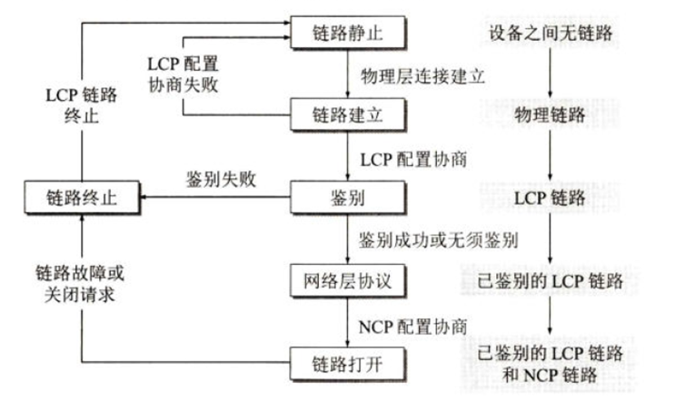

每层需要知道的东西大概三类

技术：中英文 + 是... + 用于... + 大致原理

协议：中英文 + XX 层协议 + 用于... + 大致原理（重要的话）+ 协议数据单元（如果是通信协议的话）

设备：XX 层设备 + 用于... + 工作原理

大概是这个书写框架，不过有些技术和协议不是很重要，感觉可以写得相对简单一些

时间不够的话，"是..." 和 "XX 层协议" 感觉可以省去

这三类之外还有少数专业名词，这些东西没法用固定的话术来答，只能理解多少写多少了

## 概述

OSI 七层模型及其功能

> 应用层：为应用程序和用户提供多种网络接口和服务。包括文件传输、邮件传输、域名解析、超文本传输等。传输单位是消息。
>
> 表示层：为应用层提供数据的标准化编码服务。将不同类型的应用层数据统一编码为适合网络传输的结构。也可以对应用层数据进行加密、解密和压缩等。
>
> 会话层：为表示层提供端到端的会话管理服务。对端到端的连接进行建立、维护和销毁，使得经过表示层编码的数据可以在已有的会话中进行传输。
>
> 传输层：为会话层提供端到端的可靠传输服务。除此之外，还提供链路管理、差错控制、流量控制、拥塞控制、复用分用等功能。传输单位是报文段或用户数据报。
>
> 网络层：为传输层提供不同主机之间可靠或不可靠的传输服务。对分组进行路由和寻址使得分组可以被交付到目的主机。除此之外，还提供链路管理、差错控制、流量控制、拥塞控制等功能。传输单位是分组。
>
> 数据链路层：为网络层提供点对点的传输服务。有成帧、链路管理、差错控制、流量控制、媒体访问控制的功能。传输单位是帧。
>
> 物理层：在物理媒介上为数据链路层提供透明的比特传输服务。传输单位是比特。

OSI 和 TCP/IP 模型的对比

> 相同点：
>
> 1. 都是分层结构
> 2. 都有网络层和传输层
> 3. 都提供面向连接的、无连接的、可靠的、不可靠的数据通信服务
>
> 不同点
>
> 1. OSI 模型七层结构，TCP/IP 模型四层结构
> 2. OSI 属于学术界的理论标准，TCP/IP 是事实上的国际标准
> 3. OSI 模型的数据链路层和物理层对应 TCP/IP 模型中的网络接口层； OSI 模型的会话层、表示层、应用层对应 TCP/IP 模型中的应用层
> 4. OSI 模型的网络层提供面向连接的和无连接的服务，传输层只提供面向连接的服务；TCP/IP 模型的网络层只提供无连接的服务，传输层提供面向连接的和无连接的服务

分层结构的优缺点

> 优点：
>
> 1. 层次清晰易于理解
> 2. 不同层次可以并行迭代开发
> 3. 不同层次内部的修改不会影响其他层次，高可复用性和可修改性；
>
> 分层：
>
> 1. 层次之间的交互协议难以修改
> 2. 跨层次交互会产生性能损失
> 3. 层次数量和粒度难以很好地界定

电路交换、报文交换和分组交换对比（分组交换优点）

>
>
>3个角度：**延时、资源利用率、开销**
>
>电路交换需要事先建立连接，通信结束后要释放连接，优点是延时低，缺点是通信时始终占用链路资源，资源利用率低
>
>报文交换不需要建立连接，基于存储转发，优点比较高效、比较灵活、比较可靠，缺点是存储转发时延高、报文长度不确定、可能存在缓存队列溢出的问题
>
>分组交换不需要建立连接，基于存储转发，优点是高效、灵活、迅速、可靠

虚电路服务与数据报服务的对比

> 虚电路（现在已淘汰）：先指定 VC 编号，建立虚电路，各路由器根据 VC 号转发，结束后拆除虚电路
>
> 数据报：发送分组时为该分组加上地址，然后将该分组推进网络中
>
> 

## 物理层

**信道划分技术**

- FDM：频分复用。是多路复用技术的一种。用于使多个用户可以在同一信道上通信。通过静态划分信道使不同的用户在同一时间段的不同频段下进行通信。
- TDM：时分复用。是多路复用技术的一种。用于使多个用户可以在同一信道上通信。通过静态划分信道使不同的用户在不同时间片的同一频段下进行通信。时间片长度和同一用户多个时间片的间隔时间是固定的。
- STDM：统计时分复用。是多路复用技术的一种。用于使多个用户可以在同一信道上通信。通过静态划分信道使不同的用户在不同时间片的同一频段下进行通信。时间片长度和同一用户多个时间片的间隔时间是根据用户的数量确定的。
- WDM：波分复用。是多路复用技术的一种。用于使多个用户可以在同一信道上通信。通过静态划分信道使不同的用户在同一时间段的不同波段下进行通信。即光的频分复用。
- CDM：码分复用。是多路复用技术的一种。用于使多个用户可以在同一信道上通信。通过静态划分信道使不同的用户在同一时间段的同一频段下使用不同的码型进行通信。
- CDMA：码分多址。是多路复用技术的一种。用于使不同地址的多个用户可以在同一信道上通信。通过静态划分信道使不同的用户在同一时间段的同一频段下使用不同的码型进行通信。即多个不同地址的 CDM。

**协议，主要是宽带接入技术**

- xDSL：数字用户线。是宽带接入技术的一种。用于在有线电话网的铜缆上传输数据。低频用于通话，高频用于数据传输。

  > 比如 ADSL：非对称数字用户线。是宽带接入技术的一种，用于在有线电话网的铜缆上传输数据。低频用于通话，高频用于数据传输。因为上行带宽远小于上行带宽，所以说是 “非对称” 的。（过时）

- HFC：光纤同轴混合。是宽带接入技术的一种。用于在光纤和有线电视网的铜缆上传输数据。干线传输部分使用光纤，用户分配网部分使用同轴电缆。（过时）

- FTTX：光纤到 x。是宽带接入技术的一种。用于把光纤网线直接接入 x 中进行数据传输。全线使用光纤进行数据传输。

**设备，都不可以分隔冲突域和广播域**

- 中继器：把数字信号整形放大再转发
- 集线器：多端口的中继器

> 原理貌似没啥可写的

## 数据链路层

**点对点信道的协议，主要用在广域网，都是面向连接的，一个可靠一个不可靠**

- HDLC：高级链路控制协议。数据链路层协议。通常用于点对点或点对多点的可靠数据传输。协议数据单元是帧。（过时）

- PPP：点对点协议。数据链路层协议。用于点对点的有连接的、不可靠的的数据传输。组成部分包括一个用于封装成帧的方法、一个用于链路管理的 LCP 和一套向不同网络层协议服务的 NCP。协议数据单元是帧。

  > PPP 工作状态
  >
  > 

**广播信道的协议，主要用在局域网，属于共享信道的动态随机接入技术**

- CSMA/CD：载波侦听多点接入/碰撞检测。数据链路层协议。用于在局域网有线链路两端进行无连接的、不可靠的数据传输。发送前和发送时侦听信道状态，在信道空闲时发送，信道繁忙时停发并等待，等待时间由指数退避算法确定。协议数据单元是帧。

  > CSMA/CD 的工作机制
  >
  > 1. 准备发送。将要发送的数据封装成帧，然后开始检测链路状态。
  > 2. 发送前检测。链路繁忙则一直检测，直到检测到在一个最小帧间间隔的时间内链路都处于空闲状态，然后开始发送。
  > 3. 发送中检测。如果检测到争用期内无碰撞，则发送成功，回到准备发送阶段，否则，立即停止发送数据并向链路中发送一个干扰信号，然后根据指数退避算法，等待若干个争用期后，回到发送前检测阶段。如果重发 16 次还不成功，则停止重发并向上报告错误。

- CSMA/CA：载波侦听多点接入/碰撞避免。数据链路层协议。用于在局域网无线链路两端进行无连接的、不可靠的数据传输。为了尽量避免碰撞，所有的站发送完成后，必须再等待一段很短的时间才能发送下一帧，等待时间由 CSMA/CA 退避算法确定。协议数据单元是帧。

**两个子层**

- LLC：逻辑链路控制。数据链路层的一个子层。在 MAC 层上方，利用 MAC 层提供的服务向不用的网络层协议提供统一的接口。（过时）
- MAC：媒体接入控制。数据链路层的一个子层。用于在局域网中为 LLC 子层和网络层提供所需的功能，主要包括帧定界、物理寻址、透明传输、差错检测、媒体接入控制等。其中媒体接入控制主要包括静态划分（如：TDM、FDM 等）和动态接入（如 CSMA/CD、CSMA、CA）。

**一个缓解广播风暴问题的技术和一个解决环路问题的协议**

- VLAN：虚拟局域网。是数据链路层的一个广播域划分技术。用于缓解广播风暴问题。在以太网帧中加入 VLAN 标签，交换机根据不同的 VLAN 标签将帧转发给不同的端口，从而在数据链路层上分隔广播域。
- STP：生成树协议。数据链路层协议。用于解决网络环路问题。任意一交换机中如果到达根交换机有两条或者两条以上的链路，则会根据算法把其中一条切断，从而保证任意两个交换机之间只有一条单一的活动链路。

**早古的电话网中的通信标准，用在电路交换网中进行窄带通信**

- ISDN：综合业务数字网。是电路交换网通信标准的一种。用于在公共电话的电路交换网中同时进行语音、视频、数据和其他网络服务的数字传输。（过时）
- ATM：异步传输模式。是电路交换网通信标准的一种。以前提出的用于和 IP 网络竞争的通信模型，规定了以信元为单位的多种类型流量的传输方式。（过时）

> 用户上网方式的变化大概可以这么描述
>
> 拨号上网 -> ISDN -> HFC -> xDSL -> FTTx
>
> ATM 实施难度太大，生命周期很短，死得很快。现在基本都是 FTTx 了。
>
> 可以看到是从数据链路层逐渐向物理层改造，这也是为什么上网用的技术同时分布在这两个层次。

**设备，可以分隔冲突域，不可以分隔广播域**

- 网桥：用于分隔冲突域。（过时）

- 交换机：多端口的网桥。

  工作原理：本质上是一个多端口的网桥，每个端口一个碰撞域。通过自学习的方式建立交换表，再根据交换表进行存储转发或者直接转发。当交换机收到一个目的地址未知的帧时，会把这个帧的源地址和端口记录下来，并把这个帧广播给其他所有端口，非目的主机收到后会丢弃这个帧，以此一步步建立交换表；后续收到目的地址已知的帧时会查找交换表，把帧从目的地址对应的端口转发出去。

  > 交换表项 = MAC 地址 + 端口 + 老化时间
  >
  > ARP 缓存项 = IP 地址 + MAC 地址+  老化时间
  >
  > 转发表项 = 目的网络（IP 地址+子网掩码）+下一跳（IP 地址）+距离（仅 RIP）

- 网卡：用于将计算机连接到局域网

  工作原理：TODO

## 网络层

**核心协议**

- IP：网际协议。网络层协议。用于在不同网络之间对分组进行路由和寻址，以及在不同网络的设备之间进行无连接的、不可靠的的分组传输。协议数据单元是 IP 分组。

  > IP 地址的分类：
  >
  > A：1 ～ 127
  >
  > B：128 ～ 191
  >
  > C：192 ～ 223
  >
  > D：224 ～ 239
  >
  > E：240 ～ 255
  >
  > 主机号全 0 表示这是一个网络的地址，全 1 表示广播地址
  >
  > 网络号全 0 表示这是本网络，127 表示回环测试地址
  >
  > 其中 A、B、C 类是单播地址
  >
  > D 类是多播地址
  >
  > E 类是保留地址
  >
  > 对于单播地址还会有私有地址空间，用于私网中
  >
  > 10.0.0.0 ～ 10.255.255.255
  >
  > 172.16.0.0 ～ 172.31.255.255
  >
  > 192.168.0.0 ～ 192.168.255.255

- ARP：地址解析协议。网络层协议。用于将 IP 地址映射为 MAC 地址。通过设备的 ARP 高速缓存中维护着的 IP 地址到 MAC 地址的动态映射表提供服务。ARP 报文封装在 MAC  帧中传输。

  > 当源主机需要目的主机的 MAC 地址时，首先查询本机的 ARP 缓存
  >
  > 若缓存命中则直接把缓存中的 MAC 地址写入 MAC 帧中
  >
  > 否则，源主机会向局域网中的其他主机广播携带着本机 IP 地址和 MAC 地址的 ARP 请求分组
  >
  > 非目的主机会直接过滤掉该分组，而目的主机接收到该分组后会把源主机的 IP 地址和 MAC 地址写入本机的 ARP 缓存，并返回一个携带着目的主机 IP 地址和 MAC 地址的 ARP 响应分组
  >
  > 源主机收到 ARP 响应分组后，将目的主机与对应的 MAC 地址写入本机的 ARP 缓存，再将该 MAC 地址写入 MAC 帧
  >
  > “一次请求，两次写入”

- IPX：互联网分组交换协议。OSI 模型的网络层协议。用于在不同网络之间对分组进行路由和寻址，以及在不同网络的设备之间进行无连接的、不可靠的的分组传输。协议数据单元是 IPX 分组。相当于 TCP/IP 模型中的 IP 协议。（很少见）

- RARP：逆地址解析协议。网络层协议。用于为主机提供 IP 地址。根据事先配置好的 RARP 表，为局域网内的主机提供从 MAC 地址到 IP 地址映射。（过时，已经被 DHCP 协议取代）

**IP 分配和路由方法**

- CIDR：无分类域间路由选择。是 IP 编址和 IP 路由方法的一种。用于进行无分类的 IP 编址和路由。由可变长度网络前缀和主机号组成。可以通过路由聚合将多个子网聚合成一个超网，减少转发表查询时间。缓解了 IP 地址不足的问题。
  
  > 路由聚合的方法
  >
  > 把下一跳相同的转发表项的目的地址写成二进制形式，聚合后的目的地址即是最长相同前缀的点分十进制，网络号位数就是最长相同前缀的二进制位数，写好之后，按照网络号位数从大到小以自上而下的顺序写成最终的转发表项
  
  > 路由配置指令格式
  >
  > `ip route {网络号} {子网掩码} {下一跳 IP 地址或出站接口}`

**IP 地址转换技术**

- NAT：网络地址转换。用于缓解公共 IP 地址不足的问题。利用 NAT 路由器中的 NAT 转换表，提供本地地址和公共地址之间的相互转换，使得单个私有 IP 地址可以通过单个公共 IP 地址进行通信。

  > 局域网中的 NAT 路由器把来自局域网数据报中源 IP 地址修改为路由器的公网 IP，把来自外部的数据报中的目的地址修改为局域网中对应主机的私网 IP 地址
  
  NAPT：网络地址和端口号转换。用于缓解公共 IP 地址不足的问题。在 NAT 的基础上增加了对端口号的映射，使得多个不同的私有 IP 地址可以通过单个公共 IP 地址互相通信。

**路由协议，两个内部网关协议，一个外部网关协议，路由器中既有路由表，也有转发表**

- RIP：路由信息协议。网络层协议。用于路由器在自治系统内部进行路由选择，生成路由表。基于距离向量。每个路由器定期跟周围的路由器交换路由表。优点是简单，缺点是坏消息传得慢。RIP 报文封装在 UDP 数据报中传输。

  > 路由器收到相邻路由器 A 发来的路由表之后，将收到的路由表的每一项的下一条修改为 A 并将其距离加一；对于修改后的路由表中的每一项，如果本机没有对应目的地址的路由项，则直接将该路由项添加到本机路由表中；如果已有该目的地址的路由项且但下一跳不是 A，则比较二者的距离，如果修改后的距离更短则执行替换；如果下一跳是 A，则跳过比较，直接替换。

- OSPF：开放最短路径优先。网络层协议。用于路由器在自治系统内部进行路由选择，生成路由表。基于链路状态。每个路由器定期地或在链路状态发生变化时采用洪泛法向所有路由器发送链路状态信息。优点是更新收敛快，灵活，缺点是比较复杂。OSPF 报文封装在 IP 数据报中传输。

  > 洪泛法：本结点向周围发送，周围向周围的周围发送

- BGP：边界网关协议。网络层协议。用于路由器在自治系统之间进行路由选择，生成路由表。基于路径向量。不同自治系统的边界路由器之间交换可达性信息，并将之转发给本自治系统内部的所有路由器。该协议力求选择出一条不兜圈子的路径，而不是计算出最佳路由。BGP 数据报封装在 TCP 报文段中传输。

|  | RIP | OSPF | BGP |
| :----: | :----: | :----:| :----: |
| 基于 | 距离向量协议 | 链路状态协议 | 路径向量协议 |
| 度量 | 距离（跳数） | 代价（自定义、通常是带宽） | 混合策略决定 |
| 交换 | 路由表 | 相邻链路状态 | 可达性信息 |
| 交换对象 | 相邻路由器 | 所有路由器（洪泛法） | 相邻边界路由器 |
| 交换时机 | 较短时间（比如 30 s） | 链路状态变化时或间隔较长时间（比如 30 min） | 可达性信息发送变化 |
| 封包载体协议 | UDP | IP | TCP |
| 优点 | 简单、开销小 | 收敛迅速，灵活 |  |
| 缺点 | 坏消息传的慢、最大距离限制 15 | 实现复杂、建立网络时的广播开销大 |  |
| 适用场景 | 小型网络 | 大型网络 |  |

**特殊的网络，路由器中没有路由表只有转发表**

- SDN：软件定义网络。是中心化路由控制的网络。由掌握整个网络状态的逻辑控制器为每一个分组计算最佳路由，并将转发表下发给每一个路由器。路由器之间不交换信息，内部也没有路由表，仅根据下发得到的转发表转发分组。

> 路由器转发分组时查的是转发表，转发表是路由表生成的，而路由表又是由路由选择协议生成的。
>
> 即：路由选择协议 -> 路由表 -> 转发表

**用于分组过滤的技术**

- ACL：访问控制列表。分组过滤技术的一种。用于路由器对入站的分组进行自定义过滤。通过配置多条安全策略，在分组到达时路由器从上到下检查 ACL，决定转发或是丢弃该分组。

**用于网络问题诊断的协议**

- ICMP：网际控制报文协议。网络层协议。用于诊断当前网络存在的问题，确定分组能否被正确转发到目的地。ICMP 报文类别可以分为 ICMP 差错报告报文和 ICMP 询问报文。ICMP 报文封装在 IP 数据报中传输。	
- PING：分组网间探测。网络层协议。用于测试分组能否被正确转发到目的地。利用了 ICMP 回送请求报文和回送回答报文。

**组播相关协议**

- IGMP：网际组管理协议。网络层协议。用于管理组播组成员的参加和退出。IGMP 报文封装在 IP 数据报中传输。

**自治系统相关**

- AS：自治系统。采用单一路由策略的 IP 网络和路由器的集合。
- IGP：内部网关协议。自治系统内部采用的路由选择协议。主要包括：RIP、OSPF
- EGP：外部网关协议。自治系统之间采用的路由选择协议。主要是指 BGP

**IP 协议的增强协议**

- MPLS：多协议标签交换。介于数据链路层和网络层之间的协议。用于在不同网络之间对分组进行路由和寻址，以及在不同网络的设备之间进行有连接的、可靠的的分组传输。为每个分组打上标签，标签交换路由器根据标签和转发表转发分组，使分组沿着预定的路径传输，加速了分组转发。 

  > 这个协议介于第二层和第三层之间，因为它只需要根据分组标签执行硬件式交换，也因此加速了分组转发。

**网络代理技术**

- VPN：虚拟私人网络。用于在公网上提供私网访问。主要原理是利用隧道技术，把私网数据封装在隧道中，使之在公网上透明传播，从而实现利用公网进行虚拟的私网通信。

  > 源主机直接使用私网 IP 作为源地址和目的地址发送数据报，其所属局域网的 VPN 路由器收到使用私网 IP 的数据报时，会将整个数据报加密并将之封装成源地址为路由器公网 IP，目的地址为目的局域网 VPN 路由器的公网 IP 的数据报，目的局域网的 VPN 路由器收到后，将数据报拆封并解密，随后发送给局域网内部的目的主机。对于通信双方的主机来讲，他们直接使用私网 IP 进行通信，整个过程是透明的。

**设备，可以同时分隔冲突域和广播域**

- 路由器：用于在不同网络之间进行分组转发。

  原理：路由器提取 IP 数据报首部中的目的地址，如果转发表中有为该目的地址配置的特定主机路由，则按照特定主机路由将 IP 数据报转发到下一跳所在的端口，否则，路由器会将目的地址和转发表中每一项的子网掩码按位与之后用最长前缀匹配的方法和该项的目的地址进行匹配，如果匹配成功则将 IP 数据报转发到下一跳所在的端口，匹配失败则继续进行下一项匹配，直到匹配到默认路由，将 IP 数据报转发到默认路由指向的下一跳所在的端口，如果没有配置默认路由，则报告转发分组错误，转发过程结束。

## 传输层

**通信的抽象终点**

- 端口：分为硬件端口和软件端口。硬件端口是硬件设备上用于和其他硬件连接的物理接口。软件端口是通信的抽象起点或抽象终点，每个端口都与一个特定的进程或服务相关，可以实现传输层的复用分用。

  > 复用是指应用层的多个应用的数据都通过传输层传给网络层
  >
  > 分用是指网络层的数据都由传输层根据端口传给不同的进程或服务

**核心协议**

- UDP：用户数据报协议。传输层协议。用于在端到端之间进行无连接的、不可靠的数据传输。此外还有复用分用、差错检测的功能。协议数据单元是 UDP 用户数据报。

- TCP：传输控制协议。传输层协议。用于在端到端之间进行有连接的、可靠的数据传输。此外还有复用分用、差错检测、流量控制、拥塞控制的功能。协议数据单元是 TCP 报文段。

|              |       TCP        |                    UDP                     |
| :----------: | :--------------: | :----------------------------------------: |
|   连接性质   |     面向连接     |                   无连接                   |
|    可靠性    |       可靠       |          不可靠（尽最大努力交付）          |
| 面向数据单元 |      字节流      |                   数据报                   |
|   传输速度   |  延时大，速度慢  |               延时小，速度快               |
|   首部开销   |   至少 20 字节   |                固定 8 字节                 |
|   信道特点   | 一对一全双工信道 | 一对一、一对多、多对一、多对多的半双工信道 |

> 三次握手
>
> 
>
> 第三个报文的作用：
>
> 防止已经失效的连接请求报文（第一个报文）突然又传送到了服务器。如果没有第三个报文，客户端向服务器发送多个连接请求报文，服务器就可能会返回个确认报文，进而建立多个冗余的连接，浪费了资源。加入第三个报文之后，无论服务器返回几个确认报文，客户端只对需要建立的连接进行再次确认，连接才会建立，避免了资源浪费。

> 四次挥手
>
> 
>
> 等待 2MSL 的作用
>
> 1. 保证客户端发给服务器的最后一个报文段能够到达服务器。
> 2. 防止已经失效的连接请求报文突然又传送到了服务器。2MSL 的时间可以保证这个连接产生的所有报文都从网络中消失。

**用于保证可靠传输的技术**

- ARQ：自动重传请求。是可靠传输技术的一种。用于保证数据传输的可靠性。采用确认机制保证帧有序、不重复，采用重传机制保证帧不丢失。主要分为停止等待 ARQ 和连续 ARQ 两种实现。

**用于拥塞控制的一个算法和一个策略**

- AIMD：加法增加乘法减少。用于拥塞控制的算法。拥塞避免阶段，拥塞窗口线性增大，一旦出现超时或连续三个重复确认，就把门限值设为当前拥塞窗口大小的一半，并大大减小拥塞窗口的大小。（慢开始 + 拥塞避免）

> 拥塞控制的慢开始、拥塞避免、快重传、快恢复
>
> 
>
> 快重传：接收方需要立刻确认（不能延迟确认），发送方一旦收到连续 3 个重复确认，则立即重传丢失的报文段。

- AQM：主动队列管理。用于拥塞控制的策略。在队列长度达到某个警戒值（但没有达到最大值）时，主动丢弃到达的分组。

## 应用层

**WEB 相关**

WWW：万维网。是通过超文本链接起来的大规模、分布式的信息系统。这些信息主要是 HTML 文档，使用 HTTP 传输。

DNS：域名系统。是存储域名到 IP 地址映射的分布式数据库。用于将域名转换为 IP 地址。主机在通过域名访问网络之前，会先从 DNS 缓存或 DNS 服务器中拿到对应的 IP 地址。DNS 消息封装在 UDP 数据报中传输。

URL：统一资源定位符。用于唯一定位万维网上的资源。格式为 `协议://主机名:端口/路径`

HTTP：超文本传输协议。应用层协议。用于传输 HTML 文档。采用 C/S 方式在客户端和服务器之间进行无连接、无状态的消息传输。HTTP 消息封装在 TCP 报文段中传输。

HTML：超文本标记语言。用于编写超文本文档。编写出的文档可以使用 HTTP 协议传输，并在浏览器中渲染。

CDN：内容分发网络。是暂存最近的 HTTP 请求和对应响应的分布式网络。用于加速网络资源的访问。利用最靠近每位用户的服务器直接响应已暂存的 HTTP 请求对应的响应，减少对源服务器的访问。

CGI：通用网关接口。应用层协议。用于在 Web 服务器和 CGI 程序之间传输数据。CGI 程序是一种能够接收 HTTP 请求并返回动态 HTML 页面的程序。

**文件共享协议**

FTP：文件传输协议。应用层协议。用于在主机之间共享文件。采用 C/S 方式传输文件副本或者对文件副本进行修改，再传输回原服务器。FTP 消息封装在 TCP 报文段中传输。

TFTP：简单文件传输协议。应用层协议。用于在主机之间传输文件。采用 C/S 方式传输文件副本。FTP 消息封装在 UDP 数据报中传输。

**邮件相关协议**

SMTP：简单邮件传输协议。应用层协议。用于发送电子邮件。邮件先被用户代理发送给发送端服务器，再被发送端服务器发送给接收端服务器。

> 

POP：邮局协议。应用层协议。用于接收电子邮件。用户代理从接收端邮件服务器接收到邮件后，服务器中的邮件便被删除。

IMAP：网际报文存取协议。应用层协议。用于接收电子邮件。用户代理从接收端邮件服务器接收到邮件后，服务器中的邮件仍然保留。用户可以在本地联机操作邮箱。

MIME：通用互联网邮件扩充。用于标准化多媒体电子邮件的格式。定义了非 ASCII 码的编码规则。

**虚拟终端协议**

TELNET：电传机网络。应用层协议。用于在本地操作远程服务器。采用 C/S 方式，在本地的虚拟终端中输入的命令会被传输到远程服务器并执行，输出结果会被传回本地的虚拟终端。

**网络相关协议**

DHCP：动态主机配置协议。应用层协议。用于为局域网中的客户端提供即插即用的网络连接服务。采用 C/S 方式，局域网中需要 IP 地址的客户端广播 “发现报文”，DHCP 服务器响应一个已经配置好的或者地址池中随机的 IP 地址。DHCP 消息封装在 UDP 数据报中传输。

> 需要 IP 地址的 DHCP 客户端向局域网内广播 DHCP 发现报文；DHCP 服务器收到后，取事先配置好的 IP 地址或地址池中空闲的 IP 地址，将其封装在 DHCP 提供报文中，并向局域网内广播；DHCP 客户端从收到的多个 DHCP 提供报文中选择一个，取其中的 IP 地址作为自己的 IP 地址，并向局域网中广播 DHCP 租用请求报文；DHCP 服务器收到后，向局域网中广播 DHCP 租用确认报文或者 DHCP  租用否认报文；租用成功之后每隔一段时间重复租用请求和租用确认以更新租期，或者广播 DHCP 释放报文以释放租用的 IP 地址。

SNMP：简单网络管理协议。应用层协议。用于检测网络状况、管理网络设备。采用 C/S 方式，在被管理设备上运行的 SNMP 服务器监听来自管理设备的 SNMP 客户端请求，根据请求响应某些信息或执行某些动作。SNMP 消息封装在 UDP 数据报中传输。

**熟知端口号**

- FTP：控制 21、数据 20
- SSH：22
- TELNET：23
- SMTP：25
- DNS：53
- TFTP：69
- HTTP：80
- HTTPS：443
- SNMP：161
- 客户端：49152 ~ 65535

