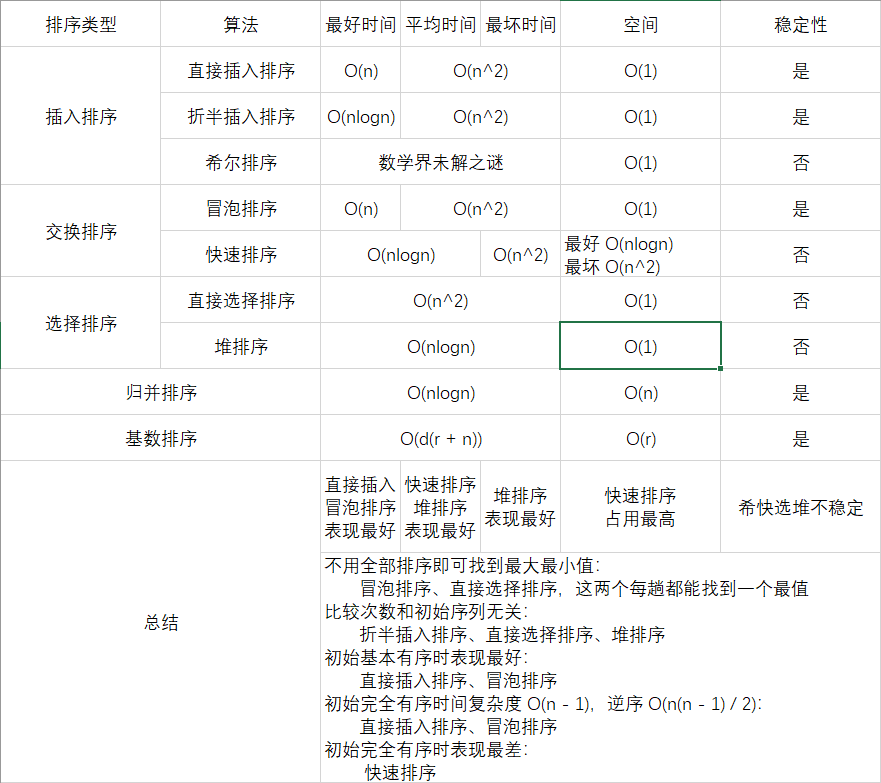

## 基础知识

基础概念性的东西，一般不怎么考，感觉知道这些足够了

- 算法时间复杂度和空间复杂度的衡量，并写出推导过程，主要会用到求和公式

   $$ \sum_{i = 1}^{n} i = \frac{n(n + 1)}{2} $$ 

   $$ \sum_{i = 1}^{n} i^2 = \frac{n(n + 1)(2n + 1)}{6} $$ 

   $$ \sum_{i = 1}^{n} i^3 = [\frac{n(n + 1)}{2}]^2 $$ 

   $$ \sum_{i = 1}^{n} i^4 = \frac{n(n + 1)(2n + 1)(3n^2 + 3n - 1)}{30} $$ 

  > 不专门考这个的话，知道主要的排序、查找算法的时间空间复杂度即可
  >
  > 专门考这个的话最多应该只到这种难度，三层依赖嵌套
  >
  > ```java
  > for (int i = 1; i <= n; i++) {
  >     for (int j = 1; j <= i; j++) {
  >         for (int k = 1; k <= j; k++)
  >             x = x + y;
  >     }
  > }
  > ```
  >
  > 执行次数：
  >
  >  $$ \sum_{i = 1}^{n}\sum_{j = 1}^{i}\sum_{k = 1}^{j} 1 = \sum_{i = 1}^{n} \frac{i(i + 1)}{2} = \frac{n(n + 1)(n + 2)}{6} $$ 
  >
  > 时间复杂度：
  >
  >  $$ O(n^3) $$ 
  >
  > 
  >
  > 对于递归题，用递归树结点的数量乘以每个结点的时间复杂度即可
  >
  > 不必非常精确

- ADT：抽象数据类型。封装了数据的组织结构及其对应的操作

- 算法的特性：确定性、有穷性、可行性、输入、输出

- 理解递归程序，能写递归程序

**算法题**

1. 递归求  $$ n! $$ 

   ```java
   // 时间复杂度 O(n)
   // 空间复杂度 O(n)
   public int factorial(int n) {
       if (n <= 1)
           return 1;
   
       return n * factorial(n - 1);
   }
   ```

2. 斐波那契数

   ```java
   // 时间复杂度 O(2^n)
   // 空间复杂度 O(n)
   public int fibonacci(int n) {
       if (n <= 1) return n;
       else return fibonacci(n - 1) + fibonacci(n - 2);
   }
   ```

3. 汉诺塔问题

   ```java
   // 时间复杂度 O(2^n)
   // 空间复杂度 O(n)
   private void hanoi(int n, char srcTower, char mediaTower, char distTower) {
       if (n == 1) {
           System.out.println(srcTower + " -> " + distTower);
           return;
       }
   
       hanoi(n - 1, srcTower, distTower, mediaTower);
       System.out.println(srcTower + " -> " + distTower);
       hanoi(n - 1, mediaTower, srcTower, distTower);
   }
   ```

4. 二进制表示中 1 的个数

   ```java
   // 时间复杂度 O(logn)
   // 空间复杂度 O(logn)
   public int numOfOnes(int N) {
       if (N == 0 || N == 1) return N;
       else if (N % 2 == 1) return numOfOnes(N / 2) + 1;
       else return numOfOnes(N / 2);
   }
   ```


## 数据结构分类

**按逻辑存储结构**

- 线性
  
  顺序表、链表、索引表、哈希表
  
- 线性（受限）
  
  栈、队列
  
- 推广的线性
  
  数组
  
- 非线性
  
  树、图、集合

**按物理存储结构**

顺序、链式、索引、哈希


## 各数据结构知识点

### 数组

**概念**

相同元素，逻辑上和物理上都连续存储。

**操作的主要思想**

查找：从前往后遍历或者从后往前遍历

插入删除：插入之前腾地方，删除之后往紧靠，主要注意挪动元素保持紧凑即可

**优缺点**

存储效率高，可以随机存取，但是插入删除代价比较大

**算法题**

1. 递归求和

   ```java
   // 时间复杂度 O(n)
   // 空间复杂度 O(n)
   public int sum_recursion(int[] nums, int posStart, int posEnd) {
       if (posStart == posEnd)
           return nums[posStart];
   
       return nums[posEnd] + sum_recursion(nums, posStart, --posEnd);
   }
   ```

2. 递归求最大值

   ```java
   // 时间复杂度 O(n)
   // 空间复杂度 O(n)
   public int max_recursion(int[] nums, int posStart, int posEnd) {
       if (posStart == posEnd)
           return nums[posStart];
   
       return Math.max(nums[posEnd], max_recursion(nums, posStart, --posEnd));
   }
   ```

3. 递归求平均值

   ```java
   // 时间复杂度 O(n)
   // 空间复杂度 O(n)
   public double avg_recursion(int[] nums, int posStart, int posEnd) {
       if (posStart == posEnd)
           return nums[posStart];
   
       double cnt = posEnd - posStart + 1;
       double lastAvg = nums[posEnd] / cnt;
       double preAvg = avg_recursion(nums, posStart, --posEnd) * (cnt - 1) / cnt;
   
       return lastAvg + preAvg;
   }
   ```

**数组的推广**（感觉考的概率不大）

多维数组

多维数组的行优先列优先存储

主要知道特殊矩阵的压缩存储方式（行列值三元组、十字链表法）和元素下标计算方式


### 链表

**概念**

相同元素，逻辑上连续，物理上通过指针连接。

> 头结点：不是必须的，不存数据，可有可无
>
> 首节点：第一个元素的结点，它是头结点后面的第一个结点

**操作的主要思想**

建立：头插法、尾插法

查找：从前往后遍历

插入删除：先找到位置，然后操作指针。

**优缺点**

插入删除代价低，但是存储效率不是很高，不能随机存取

**变体**

双向链表，添加反向指针使链表可以双向遍历

循环链表，尾结点之后连接首结点

**算法题**

1. 递归求和

   ```java
   // 时间复杂度 O(n)
   // 空间复杂度 O(n)
   public int sum_recursion(LinkedNode head) {
       if (head.next == null)
           return head.val;
   
       return head.val + sum_recursion(head.next);
   }
   ```

2. 递归求最大值

   ```java
   // 时间复杂度 O(n)
   // 空间复杂度 O(n)
   public int max_recursion(LinkedNode head) {
       if (head.next == null)
           return head.val;
   
       return Math.max(head.val, max_recursion(head.next));
   }
   ```

3. 递归求平均值

   ```java
   // 时间复杂度 O(n)
   // 空间复杂度 O(n)
   public double avg_recursion(LinkedNode head, double n) {
       if (head.next == null)
           return head.val;
   
       double firstAvg = head.val / n;
       double postAvg = avg_recursion(head.next, n - 1) * (n - 1) / n;
   
       return firstAvg + postAvg;
   }
   ```

4. 递归求链表长度

   ```java
   // 时间复杂度 O(n)
   // 空间复杂度 O(n)
   public int length(LinkedNode head) {
       if (head.next == null)
           return 1;
   
       return 1 + length(head.next);
   }
   ```

5. 链表逆置

   ```java
   // 非递归实现
   // 时间复杂度 O(n)
   // 空间复杂度 O(1)
   public LinkedNode reverse(LinkedNode head) {
       if (head == null || head.next == null)
           return head;
   
       // dummy 是虚拟的表头结点，如果链表本身带表头结点，直接用自带的即可
       LinkedNode dummy = new LinkedNode(0);
       dummy.next = head;
   
       while (head.next != null) {
           LinkedNode newHead = head.next;
           
           head.next = head.next.next;
           newHead.next = dummy.next;
           dummy.next = newHead;
       }
   
       return dummy.next;
   }
   
   // 递归实现
   // 时间复杂度 O(n)
   // 空间复杂度 O(n)
   public LinkedNode reverse_recursion(LinkedNode head) {
       if (head == null || head.next == null)
           return head;
   
       LinkedNode reversedEnd = head.next;
       LinkedNode reversed = reverse(head.next);
   
       reversedEnd.next = head;
       head.next = null;
   
       return reversed;
   }
   ```

6. 多项式相加问题

   > 两两比较结点的次数，次数高的作为新多项式的下一项，次数相同且系数相加不为 0，新建结点作为新多项式的下一项，直到其中一个多项式遍历完毕，把没遍历完的另一个多项式直接接在新多项式后面即可
   >
   > 理解过程之后可以知道，对于分别有  $$ n $$  和  $$ m $$  项的多项式链表相加，最少需要比较的次数是  $$ min(n, m) $$ ，最多需要比较的次数是  $$ \min(n, m) \times 2 - 1 $$ 
   >
   > 没什么思维难度，但很繁琐，考验代码控制能力
   >
   > 这个感觉长得不像是考题

   ```java
   // 时间复杂度 O(n)
   // 空间复杂度 O(1)
   public PolyNode addPoly(PolyNode poly1, PolyNode poly2) {
       PolyNode dummy = new PolyNode();
       PolyNode curr = dummy;
       
       while (poly1 != null && poly2 != null) {
           if (poly1.power > poly2.power) {
               curr.next = poly1;
               curr = curr.next;
               poly1 = poly1.next;
           } else if (poly1.power < poly2.power) {
               curr.next = poly2;
               curr = curr.next;
               poly2 = poly2.next;
           } else {
               int c = poly1.coefficient + poly2.coefficient;
               if (c != 0) {
                   curr.next = new PolyNode(c, poly1.power);
                   curr = curr.next;
               }
               poly1 = poly1.next;
               poly2 = poly2.next;
           }
       }
       
       if (poly1 == null)
           curr.next = poly2;
   
       if (poly2 == null)
           curr.next = poly1;
   
       return dummy.next;
   }
   ```

7. 用循环链表解决约瑟夫问题

   有编号为  $$ 1 $$  到  $$ n $$  的  $$ n $$  个员工坐在饭桌周围，老板指定一个数字  $$ m $$ ，从  $$ 1 $$  号员工开始报数，报到  $$ m $$  的人今晚自愿加班，求最后一个加班员工的编号

   > 单纯用循环链表去模拟这个过程即可
   >
   > 没什么思维难度，但很繁琐，考验代码控制能力
   >
   > 感觉长得不像是考题
   
   ```java
   // 时间复杂度 O(n * m)
   // 空间复杂度 O(n)
   
   public int josephus(int n, int m) {
       // 建立 n 个员工的循环链表
       LinkedNode worker = buildCircular(n);
       
       int counter = 1;
       int rest = n;
   
       while (rest > m) {
           if (counter != m - 1)
               ++counter;
           else {
               counter = 1;
               worker.next = worker.next.next;
               --rest;
           }
           
           worker = worker.next;   
       }
   
       while (counter < m) {
           worker = worker.next;
           ++counter;
       }
   
       return worker.val;
   }
   ```


### 索引表

用单独的索引表来存放元素存储地址，南软 PPT 没提过这个东西


### 哈希表

用哈希函数计算元素存储位置。

要知道哈希碰撞怎么解决

> 见插入操作

还有怎么计算平均搜索长度

> 搜索所有元素需要的比较次数之和除以元素数量
>
> 加起来一起除 和 除一个加一个 两种方法都行
>
> 前者计算量更少

**操作的主要思想**

建立：主要注意哈希函数的选择标准：1. 计算简单 2. 地址分布比较均匀

插入：主要注意解决哈希碰撞的问题：1. 开地址法（线性探测法、平方探测法、二次哈希） 2. 链地址法

> 线性探测：计算到 d 位置已有元素，那么挨个看 d + 1, d + 2, d + 3... 直到位置空闲
>
> 平方探测：计算到 d 位置已有元素，那么挨个看 d + 1, d + 2^2^, d + 3^3^... 直到位置空闲
>
> 二次哈希：南软 PPT 没提，这个有争议，有的说是要有第二个哈希函数计算下一次的增量，有的说是同一个哈希函数重复两次哈希
>
> 链地址法：直接链到已有元素后面

删除：开地址法找到位置然后直接置空，链地址法找到位置然后按照链表元素的删除进行操作

**优缺点**

插入删除查找都很快，可以随机存取，但是需要慎重选择哈希函数，并且要处理哈希碰撞的问题


### 栈

**概念**

后进先出的线性表，可以有不同的物理实现

**考点**

要知道怎么把中缀表达式转为后缀表达式

> 同级符号后置，比如：
>
>  $$ a + b \rightarrow ab+ $$  
>
>  $$ a + (b + c) \rightarrow a+bc+ \rightarrow abc++ $$  

要知道给定入栈顺序，可能的出栈顺序

要知道卡特兰数： $$ n $$  个不同的元素进栈，可能的出栈序列个数为  $$ C_n = \frac{C_{2n}^n}{n + 1} = \frac{(2n)!}{(n + 1)!n!} $$ 

**算法题**

1. 中缀表达式转后缀表达式

   > 步骤：
   >
   > 1. 初始化运算符栈 `op` 和中间结果栈 `res`
   >
   > 2. 从左到右扫描中缀表达式：
   >
   >    1. 遇到数时，将其压入 `res`
   >
   >    2. 遇到运算符时：
   >
   >       如果 `op` 为空或栈顶运算符号为 `(` ，则将其压入符号栈 `op`
   >
   >       否则比较它与 `op` 栈顶运算符的优先级：
   >
   >       ​	如果优先级比栈顶运算符高，将其压入符号栈 `op`
   >
   >       ​	否则将 `op` 栈顶的运算符弹出，并压入到 `res` 中
   >
   >       ​	重复，与新的栈顶运算符比较
   >
   >    3. 遇到括号时：
   >
   >       如果是左括号 `(` ，将其压入 `op`
   >
   >       如果是右括号 `)`，依次弹出 `op` 栈顶的运算符，并压入 `res`，直到遇到 `(` 为止，此时将这一对括号丢弃
   >
   > 3. 重复步骤 2，直到表达式最右端
   >
   > 4. 将 `op` 中的运算符依次弹出并压入 `res`
   >
   > 5. 依次弹出 `res` 中的元素并输出，结果的逆序即为：中缀表达式转后缀表达式
   >
   > 因为最后要对 `res` 的弹出序列取逆，所以也可以直接把 `res` 初始化成 `List`，这样最后就不用再专门取逆
   >
   > 
   >
   > 考的概率应该不大，因为这个代码量有点多

   ```java
    private ArrayList<String> infixList2SuffixList(List<String> infixList) {
        Deque<String> op = new ArrayDeque<>();
        ArrayList<String> res = new ArrayList<>();
    
        for (String item : infixList) {
            if (item.matches("\\d+"))
                res.add(item);
            else if (item.equals("("))
                op.push(item);
            else if (item.equals(")")) {
                while (!op.peek().equals("("))
                    res.add(op.pop());
                op.pop();
            } else {
                while (!op.isEmpty() && priority(op.peek().charAt(0)) >= priority(item.charAt(0)))
                    res.add(op.pop());
                op.push(item);
            }
        }
    
        while (!op.isEmpty())
            res.add(op.pop());
    
        return res;
    }
    
    // 操作符优先级
    private int priority(char ch) {
        return switch (ch) {
            case '+', '-' -> 0;
            case '*', '/' -> 1;
            default -> -1;
        };
    }
    ```

2. 后缀表达式求值

   > 遍历后缀表达式，遇到数字压栈，遇到操作符，取栈顶两个元素做对应操作后压栈

   ```java
   // 时间复杂度 O(n)
   // 空间复杂度 O(n)
   public int evalRPN(String[] tokens) {
       Deque<Integer> stack = new LinkedList();
       
       for (String s : tokens) {
           if ("+".equals(s))
               stack.push(stack.pop() + stack.pop());
           else if ("-".equals(s))
               stack.push(- stack.pop() + stack.pop());
           else if ("*".equals(s))
               stack.push(stack.pop() * stack.pop());
           else if ("/".equals(s))
               int temp1 = stack.pop();
               int temp2 = stack.pop();
               stack.push(temp2 / temp1);
           else
               stack.push(Integer.valueOf(s));
       }
       
       return stack.pop();
   }
    ```


### 队列

先进先出的线性表，可以有不同的物理实现，不过主要强调的还是逻辑概念

**循环队列**

`front` 指向队头元素，`rear` 指向队尾元素位置后一位（下次插入位置）

循环队列已知 `rear` 与元素的个数，求队头元素的位置：`front = (rear - length + 1 + m) % m`

**优先队列**

优先队列中的每个元素都有优先级，用大根堆或小根堆实现

> [详见推排序](# 排序)


### 树

要知道树和二叉树、森林和二叉树的相互转化方式

> 左孩子、右兄弟

**二叉树**

可以为空，每个结点最多两颗子树

要知道给定两个遍历序列怎么唯一确定一个二叉树

**二叉树性质**

1. 非空二叉树上的叶结点数等于度为 2 的结点数加 1，即  $$ n_0 = n_2 + 1 $$ 。这是二叉树最重要的性质，计算题很常用。推导也很重要，知道推导之后可以拓展到多叉树。

    > 推导：设度为 0、1 和 2 的结点个数分别为  $$ n_0 $$ ， $$ n_1 $$  和  $$ n_2 $$ ，结点总数  $$ n = n_0 + n_1 + n_2 $$ ，再看二叉树中的分支数，除根结点外，其余结点都有一个分支进入，设  $$ b $$  为分支总数， 则  $$ n = b + 1 $$ ，由于这些分支是由度为 1 或 2 的结点射出的，所以又有  $$ b = 0n_0 + 1n_1 + 2n_2 = n_1 + 2n_2 $$ 。 于是得  $$ n_0 + n_1 + n_2 = n_1 + 2n_2 + 1 $$ ，则  $$ n_0 = n_2 + 1 $$ 。

2. 结点  $$ i $$  所在层次（深度）为  $$ \lfloor log_2n \rfloor + 1 $$ ，即该层第一个结点所在的层次，具体操作时，对 5、6、7 可以先取 4，然后再套公式

3.  $$ n $$  个结点的完全二叉树的高度，就是上述编号为  $$ n $$  的结点所在的层次：  $$ \lfloor log_2n \rfloor + 1 $$  或者  $$ \lceil log_2(n + 1) \rceil $$ 

**二叉线索树**

利用空指针域作为线索， $$ n $$  个结点， $$ 2n $$  个指针域， $$ n - 1 $$  个被占用，所以有  $$ n + 1 $$  个线索域

南软 PPT 上作为补充内容出现，没有过多涉及

**哈夫曼树**

带权路径长度最短的树

需要知道概念和构建方式以及哈夫曼编码（一种前缀码，没有一个编码是另一个编码的前缀）

> 每次取最小的两个元素加入哈夫曼树
>
> 
>
> 扩展到多叉哈夫曼树，在元素不够的时候需要补充占位元素
>
> 给定  $$ n_0 $$  个结点，构造  $$ k $$  叉哈夫曼树：
>
>  $$ n_0 + n_k = 0 \times n_0 + k \times n_k + 1 $$ 
>
>  $$ \Rightarrow n_0 = (k - 1)n_k + 1 $$ 
>
>  $$ n_0 $$  的数量要保证能让  $$ n_k $$  取整，即：
>
>   $$ (n_0 - 1) \% (k - 1) = 0 $$ 
>
> 
>
> 11 个结点构造 4 叉哈夫曼树
>  $$ (11 - 1) \% (4 - 1)  = 10 \% 3 \neq 0 $$ 
> 所以，要补 2 个结点，使之
>  $$ (13 - 1) \% (4 - 1) = 12 \% 3 = 0 $$ 

**二叉搜索树**

左小右大的二叉树，中序遍历结果是递增的序列

**带索引的二叉搜索树**

在经典二叉搜索树结点的基础上加了一个字段 `leftsize`，它的值是 “左子树的结点数加一”

通过 `leftsize` 字段可以快速找到 “第 k 小的元素”

**AVL 树**

平衡的二叉搜索树，平衡因子（左子树高度 - 右子树高度）的绝对值不超过一

要知道插入新元素后怎么调整，使得整个树再次平衡

> 先找到最小不平衡子树
>
> 新插入的结点如果是左子树的左孩子（LL），那么直接顺时针旋转最小不平衡子树
>
> 如果是左子树的右孩子（LR），先逆时针旋转左子树，再顺时针旋转最小不平衡子树
>
> 右子树则相反
>
> 如果新插入的结点时右子树的右孩子（RR），那么直接逆时针旋转最小不平衡子树
>
> 如果是右子树的左孩子（RL），先顺时针旋转右子树，再逆时针旋转最小不平衡子树。

删除后的调整是一样的，判定最小不平衡子树是哪个，直接按部就班调整即可

**B 树**

一种外排序方法，就是多叉搜索树，每个结点有  $$ m $$  个关键字， $$ m + 1 $$  颗子树，叫做  $$ m + 1 $$  阶 B 树

要注意一个性质：如果是  $$ m $$  阶子树，除根节点之外的非叶结点至少有  $$ \lceil m/2 \rceil $$  颗子树，就是至少要有一半

B 树的高度就是磁盘的存取次数

要知道插入新元素后怎么调整，使得整个树仍然满足性质

> 插入后关键字个数要是没有溢出，不用管。要是溢出了，取  $$ \lceil m/2 \rceil $$  处的关键字，提升到父结点，左右两边的关键字拆分成两个新结点，父结点溢出也是同样的操作。
>
> 删除需要分情况：
>
> 要是被删除的关键字不在叶结点，用其前驱或后继补位，极端情况下会一步步转化为删除叶结点关键字的情况
>
> 要是被删除的关键字在叶结点，兄弟结点数量足够，那么前驱或者后继逐位补位；兄弟结点数量不够，把父节点的位于两兄弟之间的关键字拉下来，和兄弟一起作为新的结点。

**遍历方式**

树因为无法区分中间，所以只有先序遍历和后序遍历，遍历方式和二叉树没区别

森林分为先序遍历和中序遍历（也叫后序遍历），先序遍历就是分别先序遍历每一棵树，中序遍历就是分别后序遍历每一棵树

> 其实森林的中序遍历和后序遍历是同一回事

二叉树的遍历分为先序遍历、中序遍历、后序遍历

树转化为二叉树后：先序遍历结果不变，后序遍历结果和对应二叉树的中序遍历结果相同

森林转化为二叉树后：先序遍历结果不变，中序遍历（后续遍历）结果和对应二叉树的中序遍历结果相同

> 其实就是先序遍历结果不变，后序遍历结果等同于二叉树的中序遍历结果
>
> 只不过森林的后序遍历和中序遍历是同一回事而已

**存储方式**

顺序存储：按照层次遍历序列存储

链式存储：一般用双亲表示法。孩子兄弟表示法少见，主要用在森林和二叉树的相互转化

**算法题**

1. 统计叶子结点个数

   ```java
   // 时间复杂度 O(n)
   // 空间复杂度 O(n)
   public int leafNum(TreeNode root) {
       if (root == null)
           return 0;
   
       if (root.left == null && root.right == null)
           return 1;
   
       return leafNum(root.left) + leafNum(root.right);
   }
   ```

2. 交换左右子树

   ```java
   // 时间复杂度 O(n)
   // 空间复杂度 O(n)
   public TreeNode swapLR(TreeNode root) {
       if (root == null)
           return null;
   
       TreeNode swapedL = swapLR(root.left);
       root.left = swapLR(root.right);
       root.right = swapedL;
   
       return root;
   }
   ```

3. 树的前中后序遍历（递归和非递归）

   ```java
   // 递归实现
   // 时间复杂度 O(n)
   // 空间复杂度 O(n)
   public void traverse(TreeNode root) {
       if (root == null)
           return;
   
       // 先序位置 visit(root);
       traverse(root.left);
       // 中序位置 visit(root);
       traverse(root.right);
       // 后序位置 visit(root);
   }
   
   // 非递归实现
   // 前序
   // 时间复杂度 O(n);
   // 空间复杂度 O(n);
   // 前序遍历顺序：中-左-右
   // 访中-入右-入左
   public void preOrder(TreeNode root) {
       if (root == null)
           return;
       
       Deque<TreeNode> stack = new ArrayDeque<>();
       stack.push(root);
       
       while (!stack.isEmpty()) {
           TreeNode curr = stack.pop();
           visit(curr);
           
           if (curr.right != null)
               stack.push(curr.right);
           if (curr.left != null)
               stack.push(curr.left);
       }
   }
   
   // 中序
   // 时间复杂度 O(n);
   // 空间复杂度 O(n);
   // 中序遍历顺序: 左-中-右
   // 入左-访中-入右
   public void inOrder(TreeNode root) {
       if (root == null)
           return;
       
       Deque<TreeNode> stack = new ArrayDeque<>();
       TreeNode curr = root;
       
       while (curr != null || !stack.isEmpty()) {
           if (curr != null) {
               stack.push(curr);
               curr = curr.left;
           } else {
               curr = stack.pop();
               visit(curr);
               curr = curr.right;
           }
       }
   }
   
   // 后序
   // 时间复杂度 O(n);
   // 空间复杂度 O(n);
   // 后序遍历顺序 左-右-中 
   // 访中-入左-入右 
   // 出栈顺序：中-右-左，最后翻转结果
   public List<Integer> postOrder(TreeNode root) {
       List<Integer> result = new ArrayList<>();
       
       if (root == null){
           return result;
       }
       
       Stack<TreeNode> stack = new Stack<>();
       stack.push(root);
       
       while (!stack.isEmpty()){
           TreeNode curr = stack.pop();
           result.add(curr.val);
           
           if (curr.left != null)
               stack.push(curr.left);
           if (curr.right != null)
               stack.push(curr.right);
       }
       
       Collections.reverse(result);
       return result;
   }
   ```

4. 树的层次遍历

   ```java
   // 时间复杂度 O(n)
   // 空间复杂度 O(n)
   public void levelOrder(TreeNode root) {
       Queue<TreeNode> q = new ArrayDeque<>();
       q.offer(root);
   
       while (!q.isEmpty()) {
           TreeNode cur = q.poll();
           System.out.println(cur.val);
   
           if (cur.left != null)
               q.offer(cur.left);
   
           if (cur.right != null)
               q.offer(cur.right);
       }
   }
   ```

5. 根据给定前中序遍历序列，生成一颗二叉树

   ```java
   //时间复杂度：O(n)，其中 n 是树中的节点个数。
   //空间复杂度：O(n)
   private Map<Integer, Integer> val2InIdx;
   
   public TreeNode buildTree(int[] preorder, int[] inorder) {
       val2InIdx = new HashMap<>();
       
       // 记录中序元素和对应下标的映射
       for (int i = 0; i < inorder.length; ++i)
           val2InIdx.put(inorder[i], i);
       
       return build(preorder, 0, preorder.length - 1, inorder, 0, inorder.length - 1);
   }
   
   private TreeNode build(int[] preorder, int preStart, int preEnd, int[] inorder, int inStart, int inEnd) {
       if (inStart > inEnd)
           return null;
   
       int rootVal = preorder[preStart];
       int rootInIdx = val2InIdx.get(rootVal);
       int leftSize = rootInIdx - inStart;
   
       TreeNode root = new TreeNode(rootVal);
       root.left = build(preorder, preStart + 1, preStart + leftSize, inorder, inStart, rootInIdx - 1);
       root.right = build(preorder, preStart + leftSize + 1, preEnd, inorder, rootInIdx + 1, inEnd);
   
       return root;
   }
   ```

6. 带索引的 AVL 树中查找第 k 小的元素

   ```java
   // 时间复杂度 O(logn)
   // 空间复杂度 O(n)
   public TreeNode findK(TreeNode root, int k) {
   	if (root == null)
           return null;
       
       if (k < root.leftSize)
   		findK(root.left, k);
   	else if (k > root.leftSize)
   		findK(root.right, k - root.leftSize);
       else
           return root;
   }
   ```

   

### 图

结点之间是多对多的关系，分为有向和无向两种图

**存储方式**

邻接矩阵：`matrix[i][j] = 1` 表示结点 `i` 到结点 `j` 连通，不是 1 的话，代表权重

邻接表：`LinkedList<Integer>[]` 每条链表存储着这个从这个点直接指向相邻结点，带权的话链表节点还得多加一个权值字段

**遍历方式**

深度优先、广度优先

**最小代价生成树相关**

普利姆算法：适用于稠密图。

> 初始时从图中任取一顶点加入，之后选择一个与当前 T 中顶点集合距离最近的顶点，并将该顶点和相应的边加入结果，每次操作后结果中的顶点数和边数都增 1

克鲁斯卡尔算法：适用于稀疏图。

> 每个顶点自成一个连通分量，不断选取当前未被选取过且权值最小的边，若该边依附的顶点落在图中不同的连通分量上，则将此边加入 T，否则舍弃此边而选择下一条权值最小的边

**最短路径**

迪杰斯特拉算法A（单源，权值非负）

> `dist[i]` 用于保存源点到 `i` 的最短路径长度
>
> `path[i]` 用于保存源点到 `i` 的最短路径的前驱结点
>
> 每次从最短的一条路径往出延申，更新这两个数组，直到所有结点都已经计算完毕

弗洛伊德算法（多源，权值为正）

**活动网络**

AOV 网的拓扑排序

> 每次选取无入度的点输出，直到所有点都输出结束

AOE 网的关键路径

> 耗时最长的路径

**算法题**

1. DFS
2. BFS
3. Dijkstra


## 算法

掌握算法思想与时间复杂度的分析

### 查找

- 顺序查找

  从前往后，或者从后往前遍历

- 二分查找

  只能用在有序表，把元素从中间分成左右两个区间，一直分到区间里只有对应元素或者空集查找失败

- 树形查找

  AVL 树查找，递归查

- 哈希查找

  哈希表查找，直接到对应哈希地址处取，注意处理哈希碰撞问题


### 排序

排序算法需要注意稳定性（关键字相同的元素排序前后的相对位置不变）。

这里只有内排序，就是对内存中的元素排序

另外还有外排序，内存放不下，需要借助外存才能完成的排序。

- **插入排序**
  
  - **直接插入排序**
  
    从前往后，每次把一个元素插入前面已经排好序的序列中合适的位置（从后往前也可以）。
  
    稳定
  
    时间复杂度：最好： $$ O(n) $$ 、平均： $$ O(n^2) $$ 、最坏： $$ O(n^2) $$ 
  
    空间复杂度： $$ O(1) $$ 
  
    特性：初始序列已经有序，时间复杂度最低；初始序列逆序，时间复杂度最高。
  
  - **折半插入排序**
  
    相较于直接插入排序，插入的时候用二分查找法找该插入的位置。
  
    稳定
  
    时间复杂度：最好： $$ O(nlog_2n) $$ 、平均： $$ O(n^2) $$ 、最坏： $$ O(n^2) $$ 
  
    空间复杂度： $$ O(1) $$ 
  
    特性：关键字比较次数和初始序列无关。
  
  - **希尔排序（考得概率不大）**
  
    按固定间隔把原序列拆分成多个子序列，分别对子序列进行直接插入排序，再以更小的间隔重复这样，直到间隔为 1。
  
    不稳定
  
    时间复杂度：数学界未解之谜。
  
    空间复杂度： $$ O(1) $$ 
  
- **交换排序**
  
  - **冒泡排序**
  
    从前往后，两两比较，每趟把一个最值冒泡到合适的位置。直到所有元素冒泡到正确位置。（从后往前也可以）
  
    稳定
  
    时间复杂度：最好： $$ O(n) $$ 、平均： $$ O(n^2) $$ 、最坏： $$ O(n^2) $$ 
  
    空间复杂度： $$ O(1) $$ 
  
    特性：不必完成排序即可找到最大最小值；初始序列已经有序，时间复杂度最低；初始序列逆序，时间复杂度最高。
  
  - **快速排序**
  
    基于分治，有递归思想。任取枢轴元素，对枢轴元素两边进行快速排序，再把两边合并起来。
  
    不稳定
  
    时间复杂度：最好： $$ O(nlog_2n) $$ 、平均： $$ O(nlog_2n) $$ 、最坏： $$ O(n^2) $$ 
  
    空间复杂度： $$ O(log~2~n) $$ 
  
    特性：在所有内部排序算法中最快的算法；就算法本身在初始序列基本有序或逆序时，时间复杂最高。
  
- **选择排序**
  
  - **简单选择排序**
  
    每次在未排序的元素中遍历选取一个最值，放在适合的位置。
  
    不稳定
  
    时间复杂度：最好： $$ O(n^2) $$ 、平均： $$ O(n^2) $$ 、最坏： $$ O(n^2) $$ 
  
    空间复杂度： $$ O(1) $$ 
  
    特性：关键字比较次数和初始序列无关；不必完成排序即可找到最大最小值。内部排序中最慢的。
  
  - **推排序**
  
    > 堆是一个完全二叉树
    >
    > 大根堆的父结点值大于子结点值，根节点最大
    >
    > 小根堆的父节点值小于子节点值，根结点最小
    >
    > 堆的兄弟结点之间没有确定的大小关系
  
    不稳定
  
    时间复杂度：最好： $$ O(nlog_2n) $$ 、平均： $$ O(nlog_2n) $$ 、最坏： $$ O(nlog_2n) $$ 
  
    空间复杂度： $$ O(1) $$ 
  
    特性：理论复杂度虽然优于快排，但是比较的都不是相邻元素，对缓存很不友好，所以实际时间开销不如快排少。
  
    另外，要知道怎么调整堆
  
    > 给定一个初始堆：
    >
    > 从下往上，对于每一颗子树，如果不符合性质
    >
    > 对于大根堆，父结点和较大的子结点交换位置
    >
    > 对于小根堆，父结点和较小的子结点交换位置
    >
    > 
    >
    > 往已有堆中插入新结点：
    >
    > 从插入的子树往上，对于每一颗被更改的子树
    >
    > 对于大根堆，父结点和较大的子结点交换位置
    >
    > 对于小根堆，父结点和较小的子结点交换位置
    >
    > 
    >
    > 删除已有结点（只能是根节点）后：
    >
    > 大根堆在大的方向向上补位
    >
    > 小根堆在小的方向向上补位
  
- **归并排序**

  一一归并、两两归并、四四归并、八八归并...

  稳定

  时间复杂度： $$ O(nlog_2n) $$ 

  空间复杂度： $$ O(n) $$ 

- **基数排序**

  先按照个位大小排序，再按照十位大小排序，再按百位大小排序...（反过来也可以）

  稳定

  时间复杂度： $$ O(d(r + n)) $$ 

  空间复杂度： $$ O(r) $$ 

  >  $$ r $$  是基数（每位可取位数，其实就是进制数）， $$ d $$  是元素位数， $$ n $$  是元素个数


