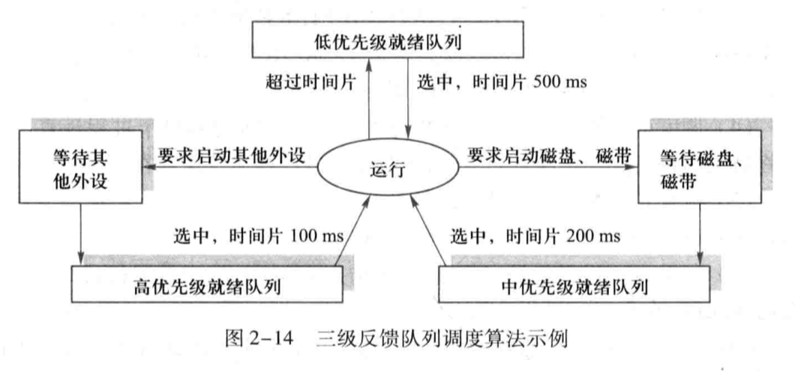

- **操作系统**

  一种系统软件，它管理系统资源、控制程序执行、改善人机界面、提供各种服务、合理组织计算机工作流程、为用户方便有效地使用计算机提供良好的运行环境。

- **操作系统分类**

  - 批处理操作系统：采用批处理方式工作的操作系统。

    > 也是最先采用多道程序设计技术的系统。不过在多道程序设计技术出现之前也有单道批处理操作系统。
    >
    > > 多道程序设计技术只是使得当前正在运行的作业可以被打断，进而使多道程序可以在宏观上并发运行，由此有了进程的概念，不过还没有时间片的概念。

    优点：系统资源利用率高；作业吞吐量大。

    缺点：作业周转时间长，无法交互，不利于程序的开发和调试。

  - 分时操作系统：处理器时间被划分成时间片供若干交互式用户多路复用的操作系统。

    > 是多道程序的一个变种。这个时候才有了时间片的概念。

    优点：同时性，多用户可以同时使用；独立性，用户之间彼此独立；及时性，用户请求可以被及时响应；交互性，用户可以直接控制程序运行。

  > 批处理操作系统和分时操作系统都基于多道程序设计技术。
  >
  > 批处理操作系统以提高作业吞吐量和系统资源利用率为目标，适合已经调试好的大型作业，通过合理安排负载，可以使系统资源利用率达到最高；分时操作系统以快速响应用户请求为目标，适合正在调试的小型作业，更加强调公平地分配处理器和内存资源。

  - 实时操作系统：能够以足够快的速度处理外部事件和数据，使所得结果能够在规定时间内控制生产过程或对控制对象做出响应，并控制所有实时任务协调运行的操作系统。

    优点：及时响应；高可靠性。

  - 通用操作系统：兼具批处理、分时和实时处理的全部或两种功能的操作系统。

- **操作系统的五功能三特性**

  五功能：处理器管理、存储管理、设别管理、文件管理、联网与通信管理

  三特性：并发性、共享性、异步性

  > 问四个就再加一个虚拟性。前两个是基本特性。
  >
  > 并发性：多个程序在同一时间间隔内运行。
  >
  > 共享性：多个程序可以共享系统资源。
  >
  > 异步性：也叫随机性。指系统事件随机发生，无法预知。

- **操作系统的资源管理技术**

  - 复用：空分复用，比如内存、外存；时分复用，独占式比如磁带机，共享式比如处理器
  - 虚拟：通过转化、模拟和整合，把物理资源转化为逻辑资源，打破物理资源独占性和有限性的限制。
  - 抽象：把物理资源的使用接口与实现细节分离，屏蔽细节的同时，只对外暴露易于使用的接口。

  > 复用和虚拟的主要目标都是解决物理资源数量不足的问题，区别在于
  >
  > 复用是分割实际的物理资源；虚拟是实现对应的逻辑资源。
  >
  > 另外虚拟还可以带来打破物理资源独占性限制的额外好处，比如 SPOOLING 技术。

- **系统调用**

  操作提供提供给用户程序的接口，用户程序可以通过系统调用请求操作系统服务。

- **系统调用的实现**

  通过陷阱机制实现。如图，应用程序执行系统调用，产生中断转向内核态，进入陷阱处理程序，它按功能号查询入口地址表，并转至对应的服务例程执行；完成后退出中断，返回应用程序断点继续运行。

  

  > 由于系统调用而引起处理器中断的指令称为访管指令、自陷指令或中断指令。

- **操作系统结构分类**

  单体式、层次式、虚拟机、微内核

- **内核**

  一组程序模块，作为可信软件提供支持进程并发执行的基本功能和基本操作，通常驻留在内核空间，运行于内核态，具有直接访问硬件设备和所有内存空间的权限，是仅有的能够执行特权指令的程序。

- **特权指令**

  仅在内核态下才能使用的指令。

- **内核态和用户态**

  处理器的不同状态。内核态时的处理器可以执行任何指令，用户态时的处理器只能执行非特权指令。

- **原语**

  不可中断的指令序列。

- **中断和异常及其关系**

  中断也叫外中断或异步中断，指来自处理器外部，由其他硬件发送给处理器的中断信号；异常也叫内中断或同步中断，指来自处理器内部，由正在执行的程序引起的中断信号。中断不可以被阻塞，异常可以被阻塞。

  > 广义的中断包括软中断、硬中断，硬中断中又分为外中断和内中断。不过一般提及中断的时候，默认指外中断。
  >
  > 中断因为中断信号来自处理器外部，跟处理器当前的状态是无关的，所以中断发生时，处理器可能处于内核态，也可能处于用户态。
  >
  > 异常也可能发生在内核态或者用户态，不过一般发生在用户态，唯一发生在内核态的异常是 ”缺页异常“。

- **中断处理过程**

  

  - **进程**

    具有独立功能的程序在某个数据集合上面的一次运行活动，也是操作系统进行资源分配和保护的基本单位。

    > 特性有：并发性、共享性、动态性、独立性、制约性

  - **进程的状态模型**

    三态模型

    

    七态模型（挂起模型）

    

  - **进程映像**

    进程控制块（PCB）：每个进程捆绑一个。进程创建时建立，撤销时回收。用于存储进程的标识信息、现场信息和控制信息。

    进程程序块：被进程执行的程序。

    进程数据块：进程的私有内存空间，用于存放私有数据，用户栈在此开辟。

    进程核心栈：每个进程捆绑一个。进程在内核态工作时使用，用于保存中断/异常现场和函数调用的相关数据等。

    > PCB 也是进程存在的唯一标志，是操作系统中最重要的数据结构。
    >
    > 标识信息：用于为唯一标识一个进程的信息。
    >
    > 现场信息：用于保留进程在运行时存放在处理器现场的各种信息。
    >
    > > 中断发生时保存的现场信息就是这个信息，包括通用寄存器内容、控制寄存器内容、栈指针、程序状态字等。程序状态字（包括 EFLAGS 和 EIP）由硬件保存至 PCB，其他的现场信息由操作系统保存至 PCB。
    >
    > 控制信息：用于管理和调用进程的信息。

  - **程序状态字（PSW）**

    用来指示运行程序状态，控制指令执行顺序，并且保留与指示和运行程序有关的各种信息，主要作用是实现程序状态的保留和恢复。
    
    > X86 机器中，PSW 由标志寄存器 EFLAGS 和指令指针寄存器 EIP 组成。
    
  - **进程与线程及其关系**

    进程具有独立功能的程序在某个数据集合上面的一次运行活动，也是操作系统进行资源分配和保护的基本单位。

    线程是进程中能够并发执行的实体，也是被操作系统调度和分派的基本单位。

    关系

    1. 进程是资源分配的基本单位，线程是调度的基本单位。
    2. 一个进程可以有多个线程，一个线程只能属于一个进程。
    3. 同一进程的线程共享本进程的地址空间，而进程之间的地址空间是独立的。

  - **多线程结构进程**

    

  - **模式切换与进程切换及其关系**

    模式切换指处理器状态在内核态和用户态之间的转换。

    进程切换指不同进程的上下文在处理器上的转换。

    关系：进程切换必然引起模式切换，模式切换不一定引起进程切换。

  - **线程的实现方式**

    - 内核级线程（KLT）

      线程管理工作由内核完成，并提供线程 API 来使用线程。

      优点

      1. 多处理器上内核可以调度多线程可以并行执行。
      2. 进程中一个线程被阻塞不会导致整个进程被阻塞。
      3. 线程只占用很小的数据结构和堆栈，切换速度快。
      4. 内核本身可以用多线程实现，系统执行效率高。

      缺点：线程的运行在用户态，调度和管理在内核态，线程切换需要模式切换，系统开销大。

    - 用户级线程（ULT）

      线程管理工作由应用程序来完成，在用户态实现，内核不知道线程的存在。

      优点

      1. 线程切换无需模式切换，系统开销小。
      2. 进程可以自行选择线程调度算法，跟系统低级调度算法无关。
      3. 可以在任何操作系统上实现。

      缺点

      1. 进程中一个线程被阻塞会导致整个进程被阻塞。
      2. 多线程无法并发执行。

    - 混合式线程

      既支持内核级线程，又支持用户级线程。综合了二者的优点，克服了二者的缺点。

  - **处理器的调度层次**

    - 高级调度：又称作业调度、长程调度，指按照预定的调度策略选择外存中的作业进入内存并为其分配资源。
    - 中级调度：又称平衡调度、中程调度，指根据内存资源的使用情况对外存和内存中的进程进行对换。
    - 低级调度：又称进程调度/线程调度、短程调度。指按照预定的调度策略选择就绪队列中的进程/线程获得处理器使用权。

    > 低级调度是所有操作系统都有的，纯粹分时操作系统或实时操作系统中一般不需要高级调度，除此之外一般操作系统都有高级调度和低级调度，功能完善的操作系统为了提高内存利用率和作业吞吐量引入了中级调度。

  - **作业和进程及其关系**

    作业是用户提交给操作系统计算的一个独立任务。

    关系

    1. 作业是任务实体，进程是完成任务的执行实体。
    2. 没有作业，进程无事可做，没有进程，作业无法完成。

  - **调度算法**

    - 先来先服务（FCFS）：按先来后到的顺序在就绪队列中选取作业/进程/线程进行调度。

      类型：剥夺式

      适用范围：作业调度、进程调度/线程调度

      优点：易于实现

      缺点：只考虑等待时间，忽视了计算时间，不利于短作业/进程/线程；效率不高。

    - 最短作业优先（SJF）：总是选取就绪队列中预计计算时间最短的作业/进程/线程进行调度。

      类型：非剥夺式

      适用范围：作业调度、进程调度/线程调度

      优点：克服了 FCFS 不利于短作业/进程/线程的缺点；易于实现。

      缺点：需要提前知道但无法准确估计作业/进程/线程的运行时间；只考虑计算时间，忽视了等待时间，长作业/进程/线程会饥饿；缺乏剥夺机制、不利于分时/实时处理。

    - 最短剩余时间优先（SRTF）：总是选取就绪队列中剩余计算时间最短的进程/线程进行调度。

      类型：剥夺式

      适用范围：进程调度/线程调度

      优点：克服了 FCFS 不利于短进程/线程的缺点；加入剥夺机制、有利于分时/实时处理。

      缺点：需要提前知道但无法准确估计进程/线程的运行时间；只考虑计算时间，忽视了等待时间，长进程/线程会饥饿。

      > 也叫抢占式最短作业优先，就是把 SJF 改造成了剥夺式的。

    - 最高响应比优先（HRRF）：总是选取就绪队列中响应比最高的作业/进程/线程进行调度。

      类型：非剥夺式

      适用范围：作业调度、进程调度/线程调度

      优点：克服了 FCFS 和 SJF 在等待时间和计算时间之间的片面性，将二者一起纳入了考量范围。

      缺点：计算响应比会导致额外的时间开销

      > 响应比 = 周转时间 / 处理时间 = (等待时间 + 处理时间) / 处理时间 = 1 + 等待时间 / 处理时间
      >
      > 性能略低于 SJF，介于 SJF 和 FCFS 之间

    - 优先级调度（PSA）：总是选取就绪队列中优先级最高的作业/进程/线程进行调度。

      类型：非剥夺式、剥夺式

      适用范围：作业调度、进程调度/线程调度

      > 进程/线程优先级的确定可以采用静态和动态两种方式。
      >
      > 静态优先级在进程/线程创建时确定，整个生命周期中不再改变。具体可以由用户直接指定，称为外部指定，或由系统根据各项数据综合计算，称为内部指定。动态优先级使进程/线程的优先级随时间改变，基本原则等待时间和占有处理器的时间越长，优先级越高，可以克服静态优先级的低优先级饥饿问题。

    - 轮转调度（RR）：就绪队列中的进程/线程轮流运行一个时间片时间，循环往复。

      类型：剥夺式

      适用范围：进程/线程调度

      > 可以防止很少使用设备的进程/线程长时间占用处理器，导致要使用设备的进程/线程没有机会启动设备。
      >
      > 系统耗费在进程/线程切换上的开销比较大，这个开销和时间片大小有关。

    - 多级反馈队列调度（MLQF）：系统事先建立多个不同优先级的就绪队列，最低优先级的就绪队列中的进程/线程采用 FCFS 进行调度，其它就绪队列中的进程/线程采用 RR 进行调度，优先级越高的就绪队列中的进程/线程得到的时间片越短，同优先级就绪队列的进程/线程按照 FCFS 原则排队，处理器每次调度都从最高优先级的就绪队列中选择进程/线程，只有在当前优先级的就绪队列中无进程/线程时，才从下一优先级的就绪队列中选取，直到最低优先级的就绪队列。

      类型：剥夺式

      适用范围：进程/线程调度

      > 进程/线程优先级可以事先确定。一般 I/O 型进程/线程的优先级较高，使其能尽快启动设备进入 I/O，提高资源利用率，计算型进程/线程优先级较低；终端用户优先级较高，使其能尽快得到响应，非终端用户优先级较低。
      >
      > 进程/线程优先级也可以不事先确定，新进程/线程直接被移入最高优先级的就绪队列末尾，规定时间片内未结束运行则移入低一个优先级的就绪队列末尾，直至进入最低优先级的就绪队列。
      >
      > MLQF 会导致长进程/线程饥饿，解决方法是定期将所有的进程/线程移入最高优先级队列中，即 Level Boost。
      >
      > 
    
  - **临界区和临界资源**

    临界区：并发进程中与共享变量有关的程序段

    临界资源：共享变量所代表的资源

    > 换言之，临界区就是用于访问临界资源的代码段

  - **临界区管理的基本方法**

    软件算法：Peterson 算法

    ```pseudocode
    bool inside[2]; // inside[i] == true 表示 Pi 要求进入临界区
    inside[0] = false;
    inside[1] = false;
    enum{0, 1} turn; // turn == i 表示 Pi 可以进入临界区
    
    cobegin
    	process P0() {
    		inside[0] = true;
    		turn = 1; // 一次谦让
    		while (inside[1] && turn == 1);
    		// 临界区
    		inside[0] = false;
    	}
    	
        process P1() {
    		inside[1] = true;
    		turn = 0; // 一次谦让
    		while (inside[0] && turn == 0);
    		// 临界区
    		inside[1] = false;
    	}
    coend
    ```

    硬件设施

    - 关中断

    - TEST AND SET

      ```pseudocode
      bool TS(bool &x) {
      	if (x) {
      		x = false;
      		return true;
      	} else
      		return false;
      }
      
      bool s = true; // s == true 表示无进程在临界区
      
      cobegin
      	process Pi() {
      		while(!TS(s));
      		// 临界区
      		s = true;
      	}
      coend
      ```

    - SWAP

      ```pseudocode
      void SWAP(bool &a, bool &b) {
      	bool temp = a;
      	a = b;
      	b = temp;
      }
      
      bool lock = false; // lock == false 表示无进程在临界区
      
      cobegin
      	process Pi() {
      		bool keyi = true;
      		do {
      			SWAP(keyi, lock);
      		} while(keyi);
      		// 临界区
      		SWAP(keyi, lock);
      	}
      coend
      ```

  - **信号量**

    与队列有关的整形变量，表示物理资源的实体。除了赋初值之外，信号量只能由同步原语 PV 对其进行操作。

  - **管程**

    把分散在各进程中的临界区集中起来管理，并把共享资源用数据结构抽象地表示，其中用于管理到来的访问的程序就是管程。

  - **死锁与饥饿及其关系**

    死锁：一个进程集合中的每个进程都在等待只能由此集合中的其他进程才能引发的事件，而无限期陷入僵持的局面。

    饥饿：进程的执行被无限期拖延。

    关系：死锁必然饥饿，饥饿不一定死锁。

    >  饥饿是堵死部分，死锁是全部堵死

  - **死锁产生的原因**

    进程推进顺序不当、PV 操作使用不当、资源分配不合理。

  - **死锁产生的必要条件**

    1. 互斥：进程之间互斥地使用临界资源。
  2. 不剥夺：进程持有的资源只能由自己释放，不会被其他进程剥夺。
    3. 占有并等待：进程请求资源得不到满足而等待时，不释放已占有的资源。
    4. 循环等待：存在循环等待链条。
  
  - **死锁的解决方法**

    - 死锁防止：破坏死锁四必要条件之一，防止产生死锁。
  - 死锁避免：银行家算法，避免循环等待，进而避免死锁。
    - 死锁检测和恢复：定期检测死锁，检测到死锁再采取措施恢复死锁。
  
  - **程序的编译、链接、装载和执行**

    

    编译：源程序模块经过编译或汇编生成目标模块的过程

    链接：根据目标模块之间的调用和依赖关系，将主调模块、被调模块和所用到的库模块装配和链接成一个完整的可装载的执行模块的过程。

    装载：将可执行模块装入物理地址空间的过程。

    > 链接的三种方式
  >
    > - 静态链接：在程序被装载之前将它所有的目标模块和所需要的库模块链接起来。
    > - 动态链接：在程序被装载时边装载边链接。
    > - 运行时链接：将某些目标模块或库模块的链接推迟到执行时进行。
    >
    > 装载的三种方式
    >
    > - 绝对装载：装载模块中的物理地址始终与其内存中的地址相同。模块内使用的是绝对地址。
    > - 可重定位装载：根据内存的使用情况决定装载模块的物理地址。模块内使用的是相对地址。
    > - 动态运行时装载：允许进程的内存映像在不同时候处于不同位置。模块内使用的是相对地址。
    >
    > > 重定位即将模块内使用的逻辑地址转换为物理地址的过程，重定位的三种方式
    > >
    > > - 静态地址重定位：地址转换工作由装载程序在进程执行前一次性完成。
    > > - 动态地址重定位：地址转换工作由装载程序在进程访问内存时依赖重定位寄存器动态计算完成。
    > > - 运行时链接地址重定位：地址转换工作由装载程序在进程执行指令时依赖重定位寄存器动态计算完成。
  
  - **存储管理方案**

    

    > 实存管理和虚存管理的区别
  >
    > 实存管理必须为进程分配足够的内存空间，装入其全部信息，否则就无法运行。
    >
    > 虚存管理中，进程的程序和数据部分在内存中部分在外存中，不必为其分配需要的全部内存空间，通过 “部分装入” 和 “部分替换” 技术，可以使进程在内存空间小于进程需要量时也能运行。
    >
    > > 对换技术和虚存管理虽说都是在内存和磁盘之间交换信息，但二者有很大区别
    > >
    > > 对换技术以进程为单位，进程所需空间超出当前内存空闲空间大小时，进程无法被对换进内存进行工作。
    > >
    > > 虚存管理以页或段为单位，即使进程所需空间超出当前内存空闲空间大小时，系统也可以通过将其他进程的部分页或段换出到外存，使当前进程得以运行。
  
    - 单连续分区：内存被划分为系统区和用户区，一段时间内只有一个作业在内存用户区。

      

    - 固定分区：内存被划分成若干大小不一的分区，每个分区只能装入一个作业。

      

      > 分区的数量、大小、位置一旦被确定，就固定下来不再发生改变。

    - 可变分区：根据作业的需要在内存空闲区中划分出相应大小的分区给该作业，剩余部分成为新的空闲区。

      

      > 分区的数量、大小、位置都是可变的
    >
      > 不连续的空闲区往往用链表连接起来，常用的可变分区分配算法如下
      >
      > - 最先适应：从头顺序查找满足大小的第一个空闲区，划出所需大小的分区给作业，其余部分成为新的空闲区。
      > - 下次适应：从上次查找结束的位置开始查找满足大小的第一个空闲区...
      > - 最优适应：查找所有空闲分区，找到能满足大小的最小空闲分区...
      > - 最坏适应：查找所有空闲分区，找到能满足大小的最大空闲分区...
      > - 快速适应：为常用大小的空闲分区建立单独的空闲区链表。查表找到对应链表，进而找到满足大小的空闲区。
      >
      > 可变分区导致的外部碎片可以使用内存移动技术解决。
  
    - 分页

      - 进程逻辑地址空间被划分为大小相等的区，每个区称为页或页面，从 0 开始编号。

      - 内存物理地址空间按同样页面大小划分为多个区，称为页框或页帧，从 0 开始编号。

      - 逻辑地址 = 页号 + 页内位移。

        

      内存以页为单位按进程需要的页数分配相应数量的页框，页面是连续的，但页框之间可以不相邻。

      页面和页框基址之间的映射由页表记录，每个进程一个页表。

      

      > 进行读写时需要访问两次内存 ，第一次找页表，第二次执行指令。
    >
      > 可以加入快表缓存最近访问过的页表项，如果缓存命中可以减少一次内存访问，加速地址转换。
      >
      > 
      >
      > 页表需要占用连续内存物理地址空间，页表占用的内存空间过大时，可以采用多级页表和反置页表解决这个问题。
      >
      > 多级页表是指把整张页表分割成大小等同于页框长度的许多小页表，称为页表页，页表页从 0 开始编号，允许被分散存放在不同的页框中，并建立页目录表记录这些页表页到页框的映射。
      >
      > 
      >
      > 反置页表将内存中的每个进程的传统页表移到外存中，在内存中统一为所有进程建立一张记录了物理地址到逻辑地址映射的反置页表。
      >
      > 
      >
      > > 此时逻辑地址的组成变成了 “进程标识符 + 页号 + 业内位移”，进程标识符和页号经过哈希运算找到记录了对应反置页表项指针的哈希表项，该哈希表项指针指向的反置页表项可能就是匹配的表项，如果不是，则继续遍历哈希链直到找到匹配的表项，找不到则出发缺页异常，此时说明该页未被调入内存，需要访问外存中该进程对应的传统页表，将对应页面调入内存。
  
    - 分段

      - 进程逻辑地址空间按程序自身的逻辑结构划分为若干个段，每个段都有一个段名。

      - 内存物理地址空间被动态划分为若干长度不相同的区，称为物理段，每个物理段由起始地址和长度确定。

      - 逻辑地址 = 段号 + 段内位移。

        

      内存根据进程中各段的需要划分出对应大小不段分配给该段，每段在内存中占据连续空间，但各段之间可以不相邻。

      段号和段基址之间的映射由段表记录，每个进程一个段表。

      

      > 段表长度记录的不是段表的大小，而是段表中段的数量，最低为 1，和段号比较用于判定是否越界。
    >
      > 分页的逻辑地址是一维地址结构，分段的逻辑地址是二维地址结构。
      >
      > > 虽然二者的逻辑地址组成相似，但对于任意一个给定的逻辑地址：对于分页来说，由于每页的页面大小是固定的，所以可以直接知道逻辑地址中哪几位是页号，哪几位是页内偏移，进而得到物理地址；对于分段式来说，每段的段长是不固定的，所以逻辑地址中哪几位是段号，哪几位是段内位移是不能直接知道的，需要由用户显式地给出这两个数据。所以说分页是一维的，而分段是二维的。
  
    - 段页式

      - 进程逻辑地址先按段划分，每一段再按页划分

      - 内存物理地址空间按同样页面大小划分为多个区，称为页框或页帧，从 0 开始编号。

      - 逻辑地址 = 段号 + 页号 + 页内位移。

        

      内存以页为单位按进程各段需要的页数分配相应数量的页框，页面是连续的，但页框之间可以不相邻。

      段号和段页表基址之间的映射由段表记录，每个进程一个段表。页面和页框之间的映射由页表记录，每段一个页表。

    - 请求分页

      - 进程开始运行之前，不是装入全部页面，而是装入一个或零个页面
    - 进程运行时，根据进程的需要，动态装入其他页面
      - 当内存空间已满，而又需要装入新的页面时，则根据某种算法置换内存中的某个页面，以便装入新的页面
  
      

      请求分页地址转换流程

      

    - 请求段页式：对段页式做类似请求分页式的改造，即虚拟内存 + 段页式管理。

  - **虚存页面替换算法**

    

    工作集：最近 n 次内存访问的页面的集合。

    抖动：也称颠簸，因为替换算法不合适，导致页面被频繁换入换出。

    局部性原理：包括时间局部性和空间局部性。时间局部性指最近引用过的内存位置近期很容易被再次引用，空间局部性指最近引用过的内存位置及其附近很容易被再次引用。

- **I/O 控制方式**

  - 轮询：又称程序直接控制方式。使用查询指令测试设备控制器的忙闲状态位，确定设备是否空闲。

  - 中断：处理器向设备发出 I/O 请求后继续执行，设备完成 I/O 后向处理器发出 I/O 中断信号，中断处理程序将设备缓存中的数据读入内存。

  - DMA：设备经过 DMA 控制器通过总线连通内存。处理器向 DMA 控制器发出 I/O 请求后继续执行，由 DMA 控制器控制设备完成 I/O 操作，设备完成后由 DMA 控制器通过系统总线直接将设备缓存中的数据读入内存。

    

  - 通道：又称 I/O 处理器。通道通过 I/O 控制器与设备相连，通过通道总线与处理器和内存相连，处理器向通道发出 I/O 请求后继续执行，由通道控制设备完成 I/O 操作，设备完成后由通道通过通道总线直接将设备缓存中的数据读入内存。

    

  > DMA 和通道都在处理器和内存之间引入第三方进行 I/O 操作，但二者有很大区别。
  >
  > DMA 控制器和处理器都要连接到系统总线，二者不能同时使用系统总线，所以会出现 “周期窃取” 的问题，即发生冲突时处理器总是把系统总线让给 DMA 控制器，另外，DMA 方式下处理器每发出一次 I/O 请求只能读写一个数据块。
  >
  > 通道方式下，加入了通道总线，通道和处理器不再抢占系统总线，实现了设备、处理器、通道之间的并行操作，另外，通道方式下可以有多个通道连接多个设备以不同的方式读写数据。

- **I/O 软件层次及其主要功能**

  

  1. 用户进程执行 I/O 系统调用，对 I/O 数据进行格式化，为假脱机 I/O 作准备。
  2. 独立于设备的软件执行适用于所有设备的常用 I/O 操作，并向用户进程提供一致性接口。
  3. 设备驱动程序把逻辑 I/O 请求转化为物理 I/O 操作的启动和执行。
  4. 中断处理程序在 I/O 操作完成时，唤醒设备驱动程序进程，进行中断处理。

- **磁盘调度算法**

  - 先来先服务：按先后顺序寻道。

  - 最短查找时间优先：按距距离由近到远寻道。

    > 可能会导致 “磁臂黏着”，即一段时间内进程重复请求访问同一柱面会垄断整个设备，造成磁臂停留在柱面上不动。

  - 扫描算法：也称 SCAN 算法沿当前方向扫描到头，换方向继续。

  - 电梯调度：也称 LOOK 算法，沿当前方向扫描到最后一个请求，换方向继续。

  - 循环扫描算法：也称 C-SCAN 算法，算法沿当前方向扫描到头，从头继续。

- **虚拟设备**

  操作系统利用 “预输入” 和 “缓输出” 技术将独占设备改造后，提供给作业的可以共享的逻辑设备称为虚拟设备。

  > 预输入：操作系统将一批作业从输入设备上预先输入至磁盘的输入缓冲区中暂存，此后，作业使用数据时不必再启动设备，而是直接从磁盘的输入缓冲区中读取。
  >
  > 缓输出：作业输出时不必启动设备，而是将输出数据暂存在磁盘的输出缓冲区，作业结束后，由操作系统组织输出缓冲区中的数据成批输出。

- **SPOOLing 技术**

  假脱机技术，用于将独占设备改造成共享设备。利用预输入程序、缓输出程序和井管理程序实现。原理是预输入和缓输出。

  

- **文件**

  由信息按一定结构方式组成，可持久性保存的抽象机制。

- **文件的组成**

  文件控制块（FCB）：操作系统为每个文件建立的唯一数据结构，包含了文件的全部属性，用于方便操作系统对文件进行管理、控制和存取。

  文件体：即文件信息。

- **文件目录**

  文件控制块的有序集合，用于将文件名转换成此文件信息在磁盘上的物理位置，加快文件查找速度。

  > Linux 系统中将 FCB 中的文件名和其他管理信息分开，其他信息单独组成一个数据结构，称为索引结点 inode，单独存放在磁盘 inode 区，其位置在内存 inode 表中由 inode 号标识，目录项中仅保存文件名和 inode 号，称为基本目录项。

  目录文件就是全部由目录项组成的文件。

- **文件组织结构**

  - 逻辑结构
    - 流式文件：无结构的文件，文件内的数据不组成记录，只是一串顺序的信息集合，称为字节流文件。
    - 记录式文件：有结构的文件，文件内的数据由若干逻辑记录组成。
  - 物理结构
    - 顺序文件：顺序存储，物理块连续。
    - 连接文件：链式存储，物理块可以不连续，由指针指向下一物理块。
    - 索引文件：建立索引表，记录流式文件的物理块号序列或记录式文件的记录键与物理块号的映射，可以多级索引。
    - 直接文件：构造哈希函数直接将记录映射到对应的物理块地址。

- **文件共享方式**

  - 静态共享：多个进程通过文件链接共享同一文件，无论进程是否运行，链接关系都存在。
  - 动态共享：多个进程在运行时并发访问同一文件。
  - 符号链接共享：通过硬链接或软链接共享文件。

  > 硬链接是直接把文件名和被共享文件的 inode 链接起来，软链接是把文件名和和被共享文件的路径链接起来。

- **常用文件操作**

  ```c
  // int fd 文件描述符
  // char* filenamep 文件路径名的字符串指针
  // int mode 文件读写权限
  
  // 创建文件
  int fd = create(filenamep, mode);
  // 打开文件
  int fd = open(filenamep, mode);
  // 关闭文件
  close(fd);
  // 删除文件
  unlink(fd);
  
  // int rc 实际读入的字节数
  // int wc 实际写入的字节数
  // int count 要求读写的字节数
  // char buf[] 读写缓冲区
  
  // 读文件
  int rc = read(fd, buf, count);
  // 写文件
  int wc = write(fd, buf, count);
  
  // long offset 要读写位置的文件偏移量
  // int whence 是否从当前读写指针位置开始偏移
  
  // 文件随机寻址
  lseek(fd, offset, whence);
  
  // char* oldnamep 已有文件的文件名
  // char* newnamep 新文件的文件名
  
  // 文件链接
  link(oldnamep, newnamep);
  ```

- **操作系统的安全保护机制**

  认证：用于阻止非法用户入侵系统，措施包括标识、鉴别和身份认证。

  > 典型例子是用户需要输入密码登录系统。

  授权：用于拒绝或防止已进入系统的进程执行违反安全策略的任何行为。

  > 当一个主体被认证后，通过访问控制策略确定它是否有权访问客体，认证是第一道墙，授权是第二道墙。
  >
  > 访问控制策略包括 DAC 和 MAC。

  加密：用某种方式伪装信息以隐藏其内容。

  审计：对系统中有关安全活动进行完整记录、检查和审核，作为一种事后追踪手段来保证系统的安全性。

- **访问控制策略**

  DAC 指自主访问控制。由资源属主或超级用户指定或更改系统中其他用户对资源的访问权。

  MAC 指强制访问控制。把系统中的信息划分密集和范围，用户只能访问自己权限范围的信息。
