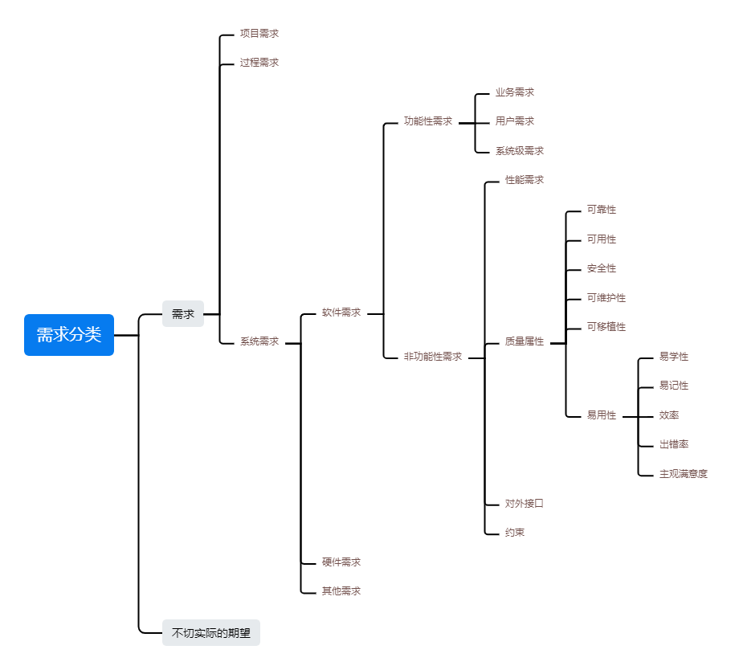
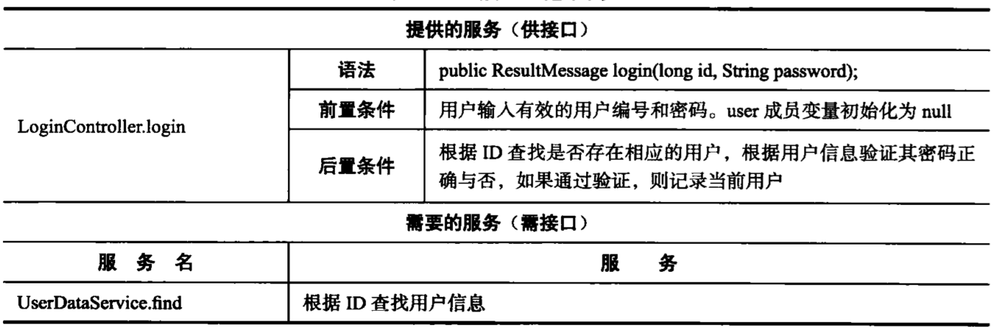
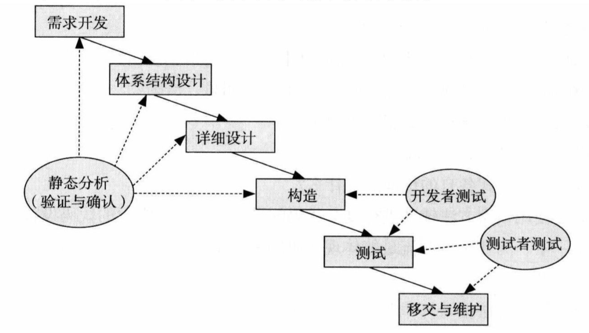

- **软件**

  以程序代码为核心，由程序、文档和数据组成，独立于硬件的工具。它基于现实又高于现实，其开发远比编程更复杂。

- **软件工程**

  应用系统、规范、可量化的方法来开发、运行和维护软件，即将工程应用到软件，以及对上述各种方法的研究。

- **软件开发的具体步骤**

  1. 需求开发：产品包括 SRS（需求规格说明文档）和需求分析模型，分别描述了软件解决方案的内容和复杂技术方案。
  2. 软件设计：产品包括 SDD（软件设计描述文档）和软件设计模型，分别描述了软件构建方案的内容和复杂细节。
  3. 软件构造：产品包括源代码和可执行程序。
  4. 软件测试：产品是测试报告。
  5. 软件交付和维护

- **科学和工程的区别**

  科学的主要目标是探索规律和建立理论以理解自然现象。科学家致力于揭示事物的基本原理，通过实验和观察来获取数据，并构建理论以解释这些观察结果。工程的主要目标是解决实际问题以满足人类需求。工程师致力于设计、构建和维护各种产品、系统和设备，通过应用科学原理将理论转化为实际可用的解决方案。

- **项目管理的目标**

  在限定的时间和成本下高效地利用资源，达到要求的质量水平，得到客户的认可。

- **项目管理的过程组**

  项目启动、项目计划、项目执行、项目跟踪和控制、项目收尾

  > 具体包括计划制定、团队管理、成本控制、质量保障、度量、过程管理、进度跟踪与控制、风险管理、配置管理等。

- **典型的团队结构**

  - 主程序员团队：由一名技术能力出色的成员被指定为主程序员，负责领导团队完成任务。交流路径以主程序员为中心。

    优点：项目规模不大或主程序员能力非常突出时，能取得很高的工作效率，也可以最大限度地保证产品中不同元素的一致性。

    缺点：项目规模较大或主程序员能力不足时，主程序员会称为瓶颈，导致其他团队成员无法发挥主动性，降低了团队成员的工作积极性。

    适用情况：项目规模不大且时间要求比较紧迫时可以采用主程序员团队以取得较高的工作效率。

  - 民主团队：没有明确的技术领导，所有团队成员都可以在自己擅长的领域担任技术领导。交流路径没有明确的中心。

     优点：每个团队成员都可以发挥自己的能动性，能取得较高的团队士气和工作成就感。

     缺点：需要额外花时间统一思想和解决冲突，防止陷入混乱，交流成本较高。

     适用情况：项目采用敏捷过程或者具有挑战性时可以采用民主团队以发挥所有成员的积极性。

  - 开放团队：团队自己按照合适的方式进行自我管理。内部交流路径对外不可见。

     优点：能够极大地激励成员的主动性，也可以最大化团队成员的创新能力。

     缺点：项目进展缺乏可视度。

     适用情况：项目具有创新性且没有明确限定时间时可以采取开放团队以激励团队成员并最大化团队成员的创造性。

- **典型的团建措施**

  建立团队章程、持续成功、和谐沟通、避免团队杀手

- **质量属性**

  将系统的某些质量要素进行量化处理后形成的质量特征。

- **质量模型**

  为了用质量属性描述和评价系统的整体质量而选取的一些可以相互配合、相互联系的特征集。

- **IEEE 质量模型**

  功能性、可靠性、易用性、效率、可维护性、可移植性。

- **质量保障的手段**

  评审：又称同级评审。由作者之外的其他人来检查产品问题，属于静态分析手段。

  测试：考察软件的运行时表现，完成验证与确认任务，也就是动态测试。

  质量度量：给软件产品和中间制品建立度量描述，通过量化分析确定他们的质量。

- **质量保障活动**

  需求开发：需求评审、需求度量

  体系结构：体系结构评审、集成测试（持续集成）

  详细设计：详细设计评审、集成测试（持续集成）、设计度量

  实现（构造）：代码评审、测试（持续集成、测试驱动）、代码度量

  测试：测试、测试度量

- **配置管理**

  用技术的和管理的指导和监督方法，来标识并说明配置项的功能和物理特征，控制对这些特征的变更，记录和报告变更处理及其实现状态，并验证与需求规格的一致性。配置管理活动包括

  1. 标识配置项
  2. 版本管理
  3. 变更控制
  4. 配置审计
  5. 状态报告
  6. 软件发布管理

- **配置项**

  置于软件配置管理之下的软件配置的各种有关项目，包括各类管理文档、评审记录与文档、软件文档、源码及其可执行码、运行所需的系统软件和支持软件以及有关数据等。

- **基线**

  已经经过正式评审的规格说明或制品，可以作为进一步开发的基础，并且只有经过正式的变更控制过程才能变更。

- **变更控制**

  以可控、一致的方式进行变更处理，包括对变化的评估、协调、批准或拒绝、实现和验证。

- **获取需求的方法**

  面谈、集体获取方法（开会）、头脑风暴、原型

- **需求的定义**

  1. 用户为了解决问题或达到某些目标所需要具备的条件或者能力。
  2. 系统或系统部件为了满足合同、标准、规范或其他正式文档所规定的要求而需要具备的条件或能力。
  3. 对 1 和 2 中的一个条件或一种能力的一种文档化表述。

- **需求的层次**

  - 业务需求：系统建立的战略出发点，表现为高层次的目标，它描述了组织为什么要开发系统。
  - 用户需求：执行具体工作的用户对系统所能完成的具体任务的期望，它描述了系统能够帮助用户做什么。
  - 系统级需求：用户对系统行为的期望，每个系统级需求反映了一次外界与系统的交互行为，或者系统的一个是实现细节，它描述了开发人员需要实现什么。

  > 业务需求指导用户需求的获取，用户需求被分析转化为用于开发的系统级需求。

- **需求的分类**

  

- **功能需求**

  和系统主要工作相关的需求，即在不考虑物理约束的情况下，用户希望系统能够执行的活动，这些活动可以帮助用户完成任务，给用户带来业务价值。

  > 非功能需求主要包括性能需求、质量属性、对外即可、约束，其中最主要的是质量属性。
  >
  > 质量属性包括
  >
  > - 可靠性：规定实践间隔和规定条件下，能够容忍故障，甚至抵制故障的能力。
  >
  > - 可用性：系统在投入使用后能正常工作的概率。
  >
  > - 安全性：软件阻止对其程序和数据进行非法访问的能力。
  >
  > - 可维护性：对已有的软件系统进行修改和扩展的容易程度。
  >
  > - 可移植性：系统或部件能从一种软硬件环境转换至另外一种软硬件环境的容易程度。
  >
  > - 易用性：用户使用软件所花费的努力及对其使用的评价相关的特性。
  >
  >   > 新手易学、老手效率、旧手易记、低出错率、主观满意度

- **用例描述模板的组成**

  ID、名称、参与者和目标、三条件两流程一需求（触发条件、前置条件、后置条件、正常流程、扩展流程、特殊需求）

- **测试用例模板的组成**

  ID、输入、预期输出

- **软件设计的核心思想**

  分解和抽象是软件设计的核心思想。分解是指在横向上将复杂系统分割为几个相对简单的子系统以及各子系统之间的关系。分解之后每次只需关注经过抽象的相对简单的子系统及其相互之间的关系，从而降低了复杂度。抽象是在纵向上聚焦各子系统的接口，将接口和实现分离，让人们更好地关注系统本质，从而降低复杂度。分解和抽象通常结合适用，对于复杂系统一般先将其分解为多个简单的子系统，再通过抽象将各个子系统的接口和实现分离。

  > 分解就是模块化，信息隐藏就是抽象，也可以说模块化和信息隐藏是软件设计的核心思想。

- **设计视角 / 体系结构视角**

  上下文、组合、逻辑、依赖、信息、模式、接口、结构、交互、动态状态、算法、资源

  > 一般答出五个即可：组合、逻辑、依赖、信息、接口、交互

- **体系结构视图的 4 + 1 视图模型**

  1. 逻辑视图：显示了系统中对象和对象类的一些主要抽象。用于将系统需求和实体关联起来。
  2. 进程视图：显示了运行时系统是如何被组织为一组交互的进程的。用于评价系统的非功能性需求。
  3. 开发视图：显示了软件是如何为了开发而被分解的。用于开发人员和管理人员理解系统。
  4. 物理视图：显示了系统硬件和软件组件是如何分布在处理器上的。用于系统工程师规划系统部署。
  5. 概念视图：显示了系统的抽象视图。作为把高层次需求分解为详细描述的基础，帮助工程师做出决策。

- **体系结构的组成**

  部件 + 连接件 + 配置

- **体系结构风格**

  - 主程序 / 子程序：将系统组织成层次结构，包括一个主程序和一系列子程序。主程序是系统的控制器，负责调度各子程序的执行。各子程序又是一个局部的控制器，负责调度子子程序的执行。

    优点：流程清晰、易于理解；强控制性使得程序的正确性更容易保证。

    缺点：程序调用这种强耦合的连接方式使得系统难以修改和复用，也限制了不同部件之间的数据交互。

  - 面向对象式：将系统组织为多个独立的对象，每个对象封装其内部数据，并基于数据对外提供服务。不同对象之间通过协作机制共同完成系统任务。

    优点：对象的封装使得其内部实现具有可修改性；契合模块化思想，易开发、易理解、易复用。

    缺点：方法调用的连接机制带来了接口的耦合性和标识的耦合性；面向对象的副作用使得程序的正确性难以保证。

  - 分层：根据不同的抽象层次，将系统组织为层次结构。每个层次被建立为一个部件，不同部件之间通常用程序调用的方式进行连接。

    优点：设计机制清晰、易于理解；支持并行开发；具有更好的可复用性和内部可修改性。

    缺点：交互协议难以修改；禁止跨层调用带来了不必要的性能损失；层次的数量和粒度难以确定。

  - 模型 - 视图 - 控制（MVC）：以程序调用为连接件，将系统功能组织为模型、视图和控制三个部件。其中模型封装了系统的数据和状态信息，实现业务逻辑，对外提供数据服务和执行业务逻辑；视图封装了用户交互，提供业务展现，接收用户行为；控制封装了系统的控制逻辑，根据用户行为调用需要的业务逻辑和数据更新，并根据执行后的系统状态决定后续的业务展现。

    优点：设计机制清晰、易于开发；具有对视图和控制的可修改性；逻辑、表现和控制的分离使得其非常适用网络系统开发。

    缺点：逻辑、表现和控制的分离增加了系统的复杂度，不利于理解；模型修改困难。

- **体系结构设计过程**

  1. 分析关键需求和项目约束
  2. 选择体系结构风格
  3. 进行体系结构逻辑设计
  4. 实现体系结构逻辑设计
  5. 完善体系结构设计
  6. 定义构建接口
  7. 迭代 3 - 6

- **包创建原则（实现时物理包创建的原则）**

  逻辑设计中的每一个包对应一个开发包。

- **包设计原则（实现时进行调整的根据）**

  - 用于提高内聚性
    - 复用等价发布原则：功能相似、需求相同、目的相同的模块应该放在同一个包中。发布的包应该就是被复用的包。
    - 共同封闭原则：一个包应该只有一个被修改的原因。
    - 共同复用原则：包被复用时，包内的所有模块应该全部被复用。
  - 用于降低耦合性
    - 单向依赖原则：包的依赖结构应当是一个有向无环图，不能出现循环依赖。
    - 稳定依赖原则：被依赖的包应该尽量是不会发生修改的，是稳定的。
    - 稳定抽象原则：稳定的包中应该是抽象的模块。

- **接口编写规范**

  

- **集成的策略**

  - 大爆炸式：将所有模块一次性组合在一起。

  - 增量式
    - 自顶向下式：对分层次的架构，先集成和测试上层的模块，下层的模块使用伪装的具有相同接口的桩。然后不断加入下层的模块，直到所有模块都被集成进来，才结束整个集成测试。
    
    - 自底向上式：对分层次的架构，先集成和测试下层的模块，上层的模块使用伪装的具有相同接口的驱动来替换。然后不断加入上层的模块，直到所有模块都被集成进来，才结束整个集成测试。
    
    - 持续集成：提倡尽早集成和频繁集成。尽早集成是指不需要总是等待一个模块开发完成才把它集成起来，而是在这个模块开发之初就把它利用桩集成起来；频繁集成是指开发者每次完成一些开发任务之后，就可以用开发结果替换桩中的相应组件，进行集成和测试。
    
      > 问特点的话还有增量集成

- **桩和驱动**

  - 桩：用于替换下层模块以测试上层模块。一般和所替换的模块具有相同的接口，并且用简单实现模拟了所替换模块的行为。
  - 驱动：用于替换上层模块以测试下层模块。一般和所替换的模块具有相同的接口，利用下层模块提供的服务模拟所替换模块的行为。驱动代码中执行的是用于测试模块接口的集成测试用例。

- **易用性（人机交互设计追求的目标）**

  - 易学性：新手易学。
  - 效率：老手高效。
  - 易记性：旧手易记。
  - 出错率：错误的数量、严重性、易恢复性。
  - 主观满意度：用户体验良好。

- **人机交互设计中的人类因素**

  - 精神模型：用户进行人机交互时头脑中的任务模型。人机交互设计需要根据精神模型进行视觉隐喻设计。
  - 差异性：不同用户群体的任务模型不同。人机交互设计需要针对不同用户群体提供差异化的交互机制。

- **人机交互设计原则**

  - 简洁设计：同时给用户传递的信息要遵循 7 +- 2 原则，并且在有效表达交互信息的情况下越简洁越好。
  - 一致性设计：设计应当遵循用户的精神模型。
  - 低出错率设计：设计应当不让用户犯严重错误。错误出现时要提供简洁、有建设性、具体的指导来帮助用户消除错误。
  - 易记性设计：设计应当使用户的记忆负担更少。

- **面向对象设计过程**

  1. 设计模型建立
     1. 通过职责建立静态模型
        1. 抽象对象的职责
        2. 抽象类之间的关系
        3. 添加辅助类
     2. 通过协作建立动态模型
        1. 抽象类之间的协作
        2. 明确对象的创建
        3. 选择合适的控制风格
           1. 集中式
           2. 委托式
           3. 分散式
  2. 设计模型重构

- **职责分配原则**

  GRASP 模式（General Responsibility Assignment Software Pattern）：高内聚、低耦合、信息专家、创建者模式、控制者模式

  > 高内聚、低耦合是最基本最重要的
  >
  > 信息专家：对于实现业务需求的职责，应当被分配给那些持有该职责所需的信息的类
  >
  > 创建者模式：对于创建类的职责，应该被分配给那些聚合或包含了本类的类、记录了本类状态的类（Container 或 Pool）、频繁使用本类的类或持有本类初始化所需信息的类。
  >
  > 控制者模式：对于处理系统事件（主要是用户发起的点击）的职责，应当交给已有的类或者增加一个新的类来扮演 Controller 或者 Handler。当交给已有的类时，一般交给这样的类：1. 能代笔整个 Business 或 Organization 的类 2. 能代表整个 System 的类 3. 能代表某个角色的类。

- **耦合**

  1. 内容耦合：一个模块直接修改或依赖另一个模块的内容。

     > 极其糟糕的设计，最高的耦合性，直接破坏了封装。比如：GOTO 语句；直接修改另一模块的数据或代码。

  2. 公共耦合：模块之间共享全局数据。

     > 比如全局变量

  3. 重复耦合：模块之间有相同逻辑的重复代码。

  4. 控制耦合：一个模块给另一个模块传递控制信息。

     > 控制耦合传递的控制信息叫 Control Flag，判别 Control Flag 的条件：
     >
     > 1. 不是有意义的或有业务价值的数据
     > 2. 会影响对方的执行路径 
     >
     > 往往伴随着逻辑内聚，所以虽然在耦合性上可以接受，但在内聚性上是无法接受的。

  5. 印记耦合：共享一个数据结构，但是却只用了其中的一部分。

  6. 数据耦合：传递的数据不多不少刚刚好。

  内容耦合、公共耦合和重复耦合是不可接受，必须消除的。

  > 整体上从内容耦合到数据耦合的耦合性依次递减，但是印记耦合和数据耦合的耦合性其实差不多小。

- **内聚**

  1. 偶然内聚：模块执行多个完全不相关的操作。

  2. 逻辑内聚：模块执行一系列相关的操作，每个操作的调用由其他模块决定。

     > 最大的特点是会有一个 Control Flag。

  3. 时间内聚：模块执行一系列与时间有关的操作。

  4. 过程内聚：模块执行一些与步骤顺序有关的操作。

  5. 通信内聚：模块执行一系列与步骤有关的操作，并且这些操作在相同的数据上进行。

  6. 功能内聚：模块只执行一个操作或达到一个单一的目的（这个目的来自需求，所以这个要结合给出的需求判断）。

  7. 信息内聚：模块进行许多操作，每个都有独立的入口点，每个操作的代码相对独立，而且所有操作都在相同数据结构上完成。

  偶然内聚和逻辑内聚是不可接受，必须消除的。

  > 整体上从偶然内聚到信息内聚的内聚性依次递增，但其实时间内聚、过程内聚和通信内聚的内聚性是等价的，功能内聚和信息内聚的内聚性是等价的，而且是最好的。在方法模块的级别谈不上信息内聚。
  >
  > 时间内聚的操作发生在相同时间；过程内聚的操作解决同一个问题；通信内聚的操作在同一数据上进行。

- **信息隐藏**

  隐藏未来可能会发生变化的设计决策，主要包括需求分配的职责和内部的实现机制，把每个设计决策指派给单独的模块，对外只暴露不容易变化的接口，使得即使发生变化，变化也不会对其他部分产生影响。

  > 主要目的是为了通过抽象将接口和实现分离，提高软件系统的可理解性、可维护性和可演化性。

- **面向对象下的信息隐藏**

  1. 封装类的职责，隐藏职责的实现。
  2. 预计将会发生的变更，抽象它的接口，隐藏它的内部机制。

- **封装**

  1. 集中信息和行为
  2. 分离接口和内部实现

- **面向对象设计原则**

  降低访问耦合

  - 针对接口编程：为每个类定义明确的契约（包括供接口和需接口），并按照契约组织和理解软件结构。
  - 接口分离原则：将一个统一的接口匹配为多个更独立的接口，避免不必要的耦合。
  - 迪米特法则：每个单元只能和它的直接朋友交谈。

  降低继承耦合

  - 里氏替换原则：子类必须能够替换父类而起到相同的作用。
  - 组合复用原则：希望复用代码又不能满足里氏替换原则时，使用组合代替继承。

  提高内聚

  - 集中信息和行为：类的信息应该和访问这些信息的行为放在一个类中。
  - 单一职责原则：一个类有且仅有一个被修改的原因。

  提高可修改性

  - 开闭原则：好的设计应当对扩展开放，对修改关闭。
  - 依赖倒置原则：抽象不应该依赖于细节，细节应该依赖于抽象；高层模块不应该依赖于低层模块，双方都应该依赖于抽象。

  > 只有符合里氏替换原则，才有可能符合依赖倒置原则；只有符合依赖倒置原则，才有可能符合开闭原则。

- **软件构造**

  通过编码、验证、单元测试、集成测试和调试等工作的结合，生产可工作的、有意义的软件的详细创建过程。

- **常见构造实践方法**

  - 重构：修改软件系统的严谨方法，它在不改变代码外部表现的情况下改进其内部结构。即不改变软件系统功能的情况下，提升详细设计结构的质量，使其能继续演化下去。

    > 重构的时机
    >
    > 1. 增加新功能之后
    > 2. 发现缺陷进行修复时
    > 3. 代码评审发现坏味道时

  - 测试驱动开发：又称为测试优先开发。要求程序员在编写一段代码之前，优先完成该段代码的测试代码，之后在编写程序代码时不断执行测试代码，以验证程序代码的正确性。

  - 结对编程：两个程序员挨着坐在一起，共同协作进行软件构造活动。

- **表驱动编程**

  对于特别复杂的决策可以将其包装为决策表，利用决策表进行编程。

- **契约式设计**

  又称为断言式设计。如果一个函数或方法，在前置条件满足的情况下开始执行，完成后能够满足后置条件，那么这个函数或方法就是正确可靠的。

  > 有两种具体的做法：异常和断言，就是不满足条件的时候抛异常和下断言

- **防御式编程**

  在一个方法与其他方法、操作系统、硬件等外界环境交互时，不能确保外界都是正确的，所以要在外界发生错误时，保护方法内部不受损害。

  > 与契约式设计的异同
  >
  > 同：都检查输入参数的有效性。
  >
  > 异：防御式编程检查的输入参数范围不仅包括前置条件，还包括所有的外界交互；防御式编程不检查输出和后置条件。

- **验证与确认**

  通常被简称为 "V&V"，验证（Verification），检查开发者是否正确地使用技术建立系统；确认（Validation），检查开发者建立了正确的系统（主要根据需求规格说明）。

  > 验证和确认主要有两种手段：静态分析和动态测试。静态分析中最常用的是评审。
  >
  > 

- **软件测试的目标**

  1. 向开发者和用户展示软件满足了需求，表明软件产品是一个合格的产品。
  2. 找出软件中的缺陷和不足（尽可能多的而不是所有的）。

- **缺陷、错误和失败**

  缺陷：系统代码中存在的不正确的地方。

  错误：系统执行到缺陷代码，可能使得执行结果不符合预期且无法预测，由此表现出来的不稳定状态就称为错误。

  失败：错误的发生使得软件的功能失效。

  缺陷如果不被检测出来，会长期存在，直到触发了特定条件被激活，这时就会出现错误，显示在终端输出上，并最终导致系统功能失效，即导致失败。

- **软件测试的层次**

  单元测试：对程序单元的正确性检验的测试工作。

  集成测试：又称为组装测试，即对程序模块一次性或采用增量方式组装起来，对系统的接口进行正确性检验的测试工作。

  系统测试：关注整个系统的行为，评价系统功能性和非功能性需求，也评价系统与外界环境的交互。

- **黑盒测试**

  把测试对象看作一个黑盒子，完全基于输入和输出来判定测试对象的正确性。具体方法包括

  - 等价类划分：把所有可能的输入数据划分成若干子集，从每个子集中选取少数有代表性的数据作为测试用例

  - 边界值分析：等价类划分的补充。在等价类划分的基础上，把边界处的数据也选取为测试用例

  - 决策表和状态转换

  优点

  1. 测试效率高
  1. 可以检验需求规格

  缺点

  1. 覆盖率低
  2. 可以发现的缺陷数量少

- **白盒测试**

  把测试对象看作是透明的，不关心测试对象的规格，而是按照测试对象内部的程序结构来设计测试用例进行测试工作。具体方法包括

  - 语句覆盖：确保被测试对象的每一行代码都至少执行一次

  - 条件覆盖：确保程序中每个判断的结果都至少满足一次

  - 路径覆盖：确保程序中每条独立的执行路径都至少执行一次

  优点

  1. 覆盖率高
  2. 可以发现的缺陷数量多

  缺点

  1. 测试开销大
  2. 不能检验需求规格

- **软件演化生命周期模型**

  传统典型软件生命周期模型将演化仅简单描述为一个 “维护” 阶段，实际上演化要复杂得多，为了更好地描述演化，提出了软件演化生命周期模型将演化进一步划分成五个阶段：初始开发、演化、服务、逐步淘汰、停止。

  > 初始开发：第一版软件产品开发
  >
  > 演化：保持软件产品的持续增值
  >
  > 服务：软件产品不再增值，仅周期性修复已有缺陷
  >
  > 逐步淘汰：开发者不再维护，但用户可能会继续使用
  >
  > 停止：开发者不再维护，用户也不再使用

- **逆向工程**

  分析系统目标，标识系统的部件及其交互关系，并且使用其他形式或者更高层次的抽象创建系统表现的过程。其主要关注点在于理解软件，但并不修改软件。

- **再工程**

  检查和改造一个目标系统，用新的模式及其实现复原该目标系统。其主要关注点在于修改软件以提高软件的可维护性、可复用性和可演化性，而不会花很大力气来理解软件。

> 二者的关系在于关注点不同，而且再工程之前往往需要一个前导的逆向工程。

- **软件生命周期模型**

  为了从宏观上清晰地描述软件开发活动，人们将软件从生产到报废的生命周期分隔为不同阶段，典型的软件生命周期模型包括：需求工程、软件设计、软件实现、软件测试、软件交付、软件维护。

- **软件过程模型**

  对软件生命周期模型的更详细和准确的描述，进一步详细说明了软件生命周期模型各个阶段的任务、活动、对象及其组织、控制过程。

- **常见的软件过程模型**

  - 构建 - 修复模型：对软件开发活动没有任何规划和组织，完全依靠开发者个人能力进行软件开发的开发方式。开发者在开始生产软件时，依靠个人分析和理解直接构建软件的第一个版本，并提交给用户使用，之后如果发现缺陷，开发者就修改代码以修复缺陷，直到把发现的缺陷都修复完成后才算是完成了有效的交付，进入维护阶段。

    缺点

    1. 随着软件系统复杂度的提升，开发活动会超出个人的控制能力，导致开发活动无法有效进行而失败
    2. 没有分析需求的真实性，给软件开发带来很大风险
    3. 没有考虑软件结构的质量，也没有任何文档，可维护性和可演化性较低。
    
    适用场景

    1. 软件规模很小，开发复杂度是个人能够胜任的
    2. 对质量要求不高，即使出错也无所谓
    3. 对后期维护要求不高，甚至不需要维护
    
  - 瀑布模型：按照典型软件生命周期模型将软件开发活动组织为需求开发、软件设计、软件实现、软件测试、软件交付、软件维护等基本活动，并且规定了它们自上而下、相互衔接的次序，中间允许反复迭代，以此来组织软件开发活动。

    > 瀑布模型特别重视模型和文档，因为这是可执行代码产生之前唯一能够用来验证的东西，所以是 “文档驱动” 的

    缺点

    1. 对文档期望过高。实际开发中往往无法建立完备可靠的文档
    2. 对开发活动的线性顺序假设。实际开发中往往需要一定的后续工作才能验证当前工作的正确性
    3. 客户、用户参与度不够，开发风险较高。
    4. 里程碑粒度过粗。
    
    适用场景
  
    1. 需求非常成熟、稳定，没有不确定的内容，也不会发生变化
    2. 所需技术非常成熟、可靠，没有不确定的技术难点，也没有开发人员不熟悉的技术问题
    3. 复杂度适中，不至于产生太大的文档负担和过粗的里程碑
    
  - 增量迭代模型：项目开始时，先通过系统需求开发和核心体系结构设计活动完成项目对前景和范围的界定，然后再将后续开发活动组织为多个迭代、并行的瀑布式开发活动。
  
    > 增量需求是增量迭代模型进行迭代规划、开发活动组织和控制的主要依据，因此它是 “需求驱动” 的

    优点

    1. 更符合软件开发的实践情况，适用性更加广泛
  2. 并行开发可以缩短软件开发周期
    3. 渐进交付可以加强用户反馈，降低开发风险
  
    缺点

    1. 往软件体系结构中逐渐并入各个构件的做法要求软件具有开放性的体系结构
  2. 在一些不确定性较高的领域很难在项目开始就确定前景和范围
  
    适用场景
  
    大规模软件系统的开发，尤其是比较成熟和稳定的领域
  
  - 演化模型：项目开始时就将开发活动组织为多个迭代、并行的瀑布式开发活动。初始开发迭代时澄清和明确系统的核心需求，建立和交付核心系统，开发人员根据用户反馈规划后续迭代，精化和增强系统。

    > 用户反馈的需求是演化模型进行迭代规划、开发活动组织和控制的主要依据，因此它是 “需求驱动” 的

    优点

    1. 更符合软件开发的实践情况，适用性更加广泛，即使是在不确定的领域。
    2. 并行开发可以缩短软件开发周期
    3. 渐进交付可以加强用户反馈，降低开发风险
    
    缺点

    1. 无法在项目早期阶段确定项目范围，导致项目的整体计划、进度调度等无法准确把握。
    2. 后续迭代是在前导迭代的基础上进行的，容易导致后续迭代忽略分析和设计工作，蜕变为构建修复模型
    
  - 原型模型：为了解决不确定性，将需求开发活动展开为抛弃式原型开发的迭代，充分利用抛弃式原型解决新颖领域的需求不确定问题，得到清晰的需求，再按照瀑布模型方式安排后续开发活动。
  
    优点
  
    1. 加强了与客户、用户的交流，可以让最终产品取得更好的满意度
  2. 适用于非常新颖的领域，因为这些领域有很大的不确定性
  
    缺点
  
    1. 原型方法的使用可能会带来原型开发成本过高的问题
  2. 实践中很多项目负责人不舍得抛弃 “抛弃式原型”，导致最终产品的低质量
  
    适用场景

    有大量不确定性的新颖领域
  
  - 螺旋模型：将软件开发活动组织为风险解决的迭代：确定目标、解决方案和约束 -> 评估方案，发现风险 -> 寻找风险解决方法 -> 落实风险解决方案 -> 计划下一个迭代。
  
    > 螺旋模型是 "风险驱动" 的
  
    优点

    降低风险，减少损失

    缺点

    1. 原型方法的使用可能会带来原型开发成本过高的问题
    2. 过于复杂，不利于组织开发活动
    
    适用场景
  
    高风险的大规模软件系统开发
  
    > 以上各个软件过程模型都使用经典的软件生命周期，也有不使用经典软件生命周期的。
    >
    > **Rational 统一过程模型（RUP）**
    >
    > 为了减少了过程模型方法选择上的困难而提出，同时又充分吸收和利用了各种过程模型方法下的最佳实践。把开发活动划分为 9 种工作流，同时不使用经典的软件生命周期，而是把软件开发的生命周期定义为初始、细化、构造和交付四个阶段。每个阶段都可以根据开发需要安排多次迭代，每次迭代都可能有 9 种工作流中的多数甚至全部并发进行。
    >
    > > 视项目实际情况，RUP 可以是风险驱动，也可以是需求驱动
    
  - **敏捷过程**

    并不为软件开发活动的组织提供一种特定的过程模型，而是倡导一些指导性的思想和原则，其中最重要的是敏捷思想是敏捷联盟宣言所声明的价值观：个体和互动 高于 流程和工具；工作的软件 高于 详尽的文档；客户合作 高于 合同谈判；响应变化 高于 遵循计划。
  
    > 敏捷过程不是特定的一个过程模型，只要是践行敏捷思想和原则的过程方法都属于敏捷过程，应用较为广泛的包括极限编程和 Scrum。
  
  - **云原生**
  
    云原生技术使组织能够在新式动态环境（如公有云、私有云和混合云）中构建和运行可扩展的应用程序。 典型的云原生技术包括容器、服务网格、微服务、不可变基础结构和声明性 API。这些技术实现了高容错、易管理且易理解的松耦合系统。 它们与强大的自动化技术相结合，使工程师能够在尽量减少工作量的情况下，以可预测的方式频繁地进行具有重大影响力的更改。
  
  - **DevOps**
  
    使软件开发（Dev）和运营（Ops）团队能够通过自动化、协作、快速反馈和迭代改进，以最快的速度构思、构建和交付安全的软件。 其源于软件开发的敏捷方法，扩展了构建的跨职能方法并以更快、更迭代的方式交付应用程序。在敏捷、精益实践和系统理论的基础上，DevOps 专注于增量开发和软件的快速交付。
  
  - **CI/CD**
  
    持续集成/持续交付，是 DevOps 的最佳实践之一。将传统开发过程中新代码从提交到生产所需的大部分或全部手动人工干预进行自动化，包括构建、测试（包括单元测试、集成测试和回归测试）和部署阶段以及基础设施供应。通过 CI/CD 工作流，开发团队可以对代码进行更改，然后自动测试并推送以进行交付和部署，最大限度地减少停机时间，更快地发布代码。
  
    
