设计模式是在特定环境下为解决某一通用软件设计问题提供的一套定制的解决方案，该方案描述了对象和类之间的相互作用。

对于每个设计模式要知道：名字、问题（使用场景）、解决方案、效果（优缺点）、示例代码

设计模式的类型有：创建型（用于创建对象）、结构型（用于组织结构）、行为型（用于处理职责和交互），根据处理范围也可以分为类模式和对象模式

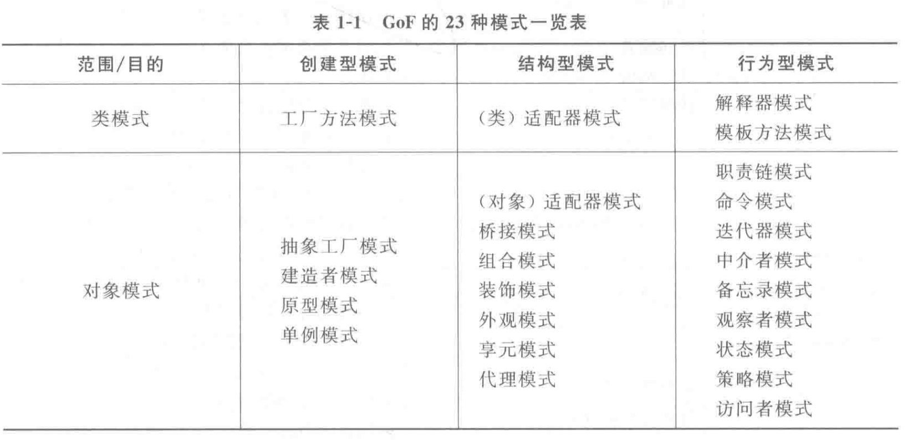

重点是简单工厂模式、工厂方法模式、抽象工厂模式、单例模式、桥接模式、策略模式、观察者模式、中介者模式，这几个考过。

## 创建型模式

把对象的创建单独分离出来，隐藏对象创建的细节。

与对象有关的职责有三类：对象本身的职责、创建对象的职责、使用对象的职责。

这类设计模式强调，一个对象不能同时创建和使用另一个对象。

这类设计模式使对象的创建和使用解耦，更符合单一职责原则；也使得对象的创建不至于散落在系统各处，利于维护。

分为类创建型模式和对象创建型模式。

类创建型模式用于创建多个类的对象，对象创建型模式用于创建单个对象。

### 简单工厂模式

概念：把一个抽象产品类的所有子类放在一个工厂类里面实例化，工厂根据参数不同返回不同子类的实例。

> 因为工厂类本身不维护任何属性，所以这专门用于实例化的方法可以是静态方法，所以简单工厂模式也叫静态工厂方法模式。甚至可以直接把对象的实例化静态方法拿到抽象产品类中，达成最简工厂模式。
>
> 这个不属于 GoF 设计模式，但是是理解其他工厂模式的基础。
>
> 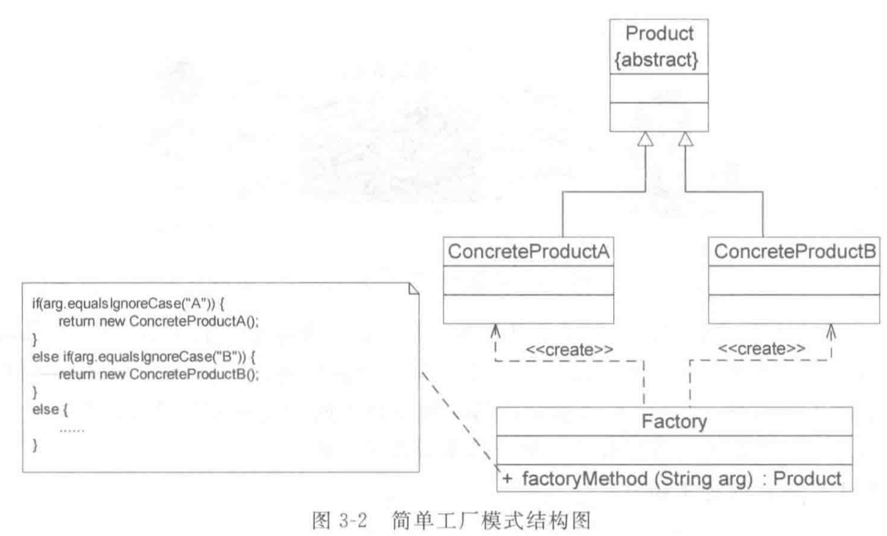

代码实现

```java
public class Factory {
	public static Product factoryMethod(String arg) {
        return switch (arg) {
            case "A" -> new ConcreteProductA();
            case "B" -> new ConcreteProductB();
            default -> null;
        };
    }
}

public abstract class Product { }

public class ConcreteProductA extends Product { }

public class ConcreteProductB extends Product { }
```

适用环境

1. 工厂类负责创建的对象比较少，以免造成工厂方法中的业务逻辑太过复杂。
2. 客户端只知道传人工厂类的参数，对于如何创建对象并不关心。

优点

1. 实现了对象创建和使用的分离。客户端可以免除创建产品对象的职责，而仅仅 “消费” 产品。
2. 减少了使用者对于复杂类名的记忆量。客户端无须知道所创建的具体产品类的类名，只需要知道具体产品类所对应的参数即可。
3. 提高了系统的灵活性。通过引入配置文件，可以在不修改任何客户端代码的情况下更换具体产品类。

缺点

1. 工厂类职责过重。由于工厂类集中了所有产品的创建逻辑，一旦不能正常工作，整个系统都要受到影响。
2. 增加了系统的复杂度和理解难度。工厂类的引入使得系统中类的个数增加了。
3. 不符合开闭原则。添加新产品需要修改工厂判断逻辑，在产品类型较多时会使得工厂逻辑过于复杂，难以维护。
4. 静态工厂方法的使用使得工厂角色无法形成基于继承的等级结构。

### 工厂方法模式

概念：把一个抽象产品类的不同具体产品子类放在一个抽象工厂类的不同具体工厂子类里面实例化。

> 具体产品 : 具体工厂 = 1 : 1，这样就不用在一个大工厂类里面写很多判断逻辑了，增加新产品的时候也不用修改原有代码了，直接对应增加新的具体工厂即可。
>
> 可以不用抽象工厂类，用抽象接口也可以，把创建对象的方法给抽象出来就行。
>
> 配合反射机制可以完全实现开闭原则。
>
> 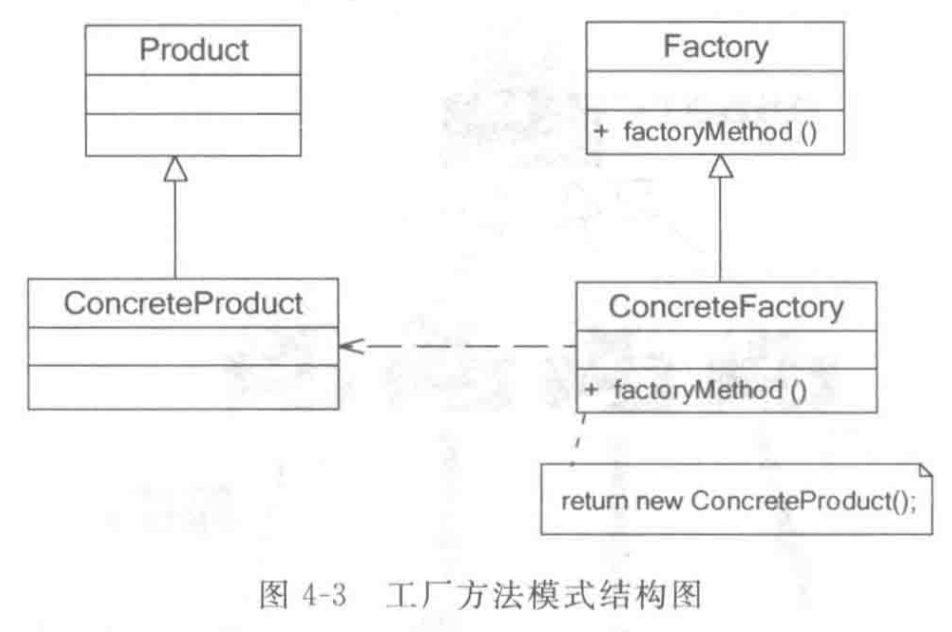

代码实现

```java
public abstract class Factory {
    public abstract Product factoryMethod();
}

public class ConcreteFactoryA extends Factory {
    public Product factoryMethod() {
        return new ConcreteProductA();
    }
}

public class ConcreteFactoryB extends Factory {
    public Product factoryMethod() {
        return new ConcreteProductB();
    }
}

public abstract class Product { }

public class ConcreteProductA extends Product { }

public class ConcreteProductB extends Product { }
```

适用环境

1. 客户端不知道它所需要的对象的类。客户端不需要知道具体产品类的类名，只需要知道所对应的工厂即可。
2. 抽象工厂类通过其子类来指定创建哪个对象。抽象工厂类只提供创建产品的接口，由其具体工厂子类来确定具体要创建的对象。

优点

1. 实现了对象创建和使用的分离。客户端可以免除创建产品对象的职责，而仅仅 “消费” 产品。
2. 减轻了单个具体工厂类的负担。基于工厂角色和产品角色的多态性设计让对应的具体工厂确定创建何种产品对象。
3. 加入新产品时完全符合开闭原则。无须修改原有代码，只要添加一个具体工厂和具体产品即可，系统的可扩展性非常好。

缺点

1. 增加了系统的复杂度和额外开销。添加新产品时还要添加与之对应的具体工厂，有更多的类需要编译和运行。
2. 增加了系统的抽象性和理解难度。引入了抽象层，客户端中也都使用抽象层进行定义。

### 抽象工厂模式

概念：多个抽象产品类的不同具体产品子类共同组成一个整体大产品的不同形态的时候，可以把这些抽象产品类放在一个抽象工厂的不同具体工厂中一起创建。

> 类似小米手机、小米电视、小米平板都在小米工厂里面生产的关系
>
> 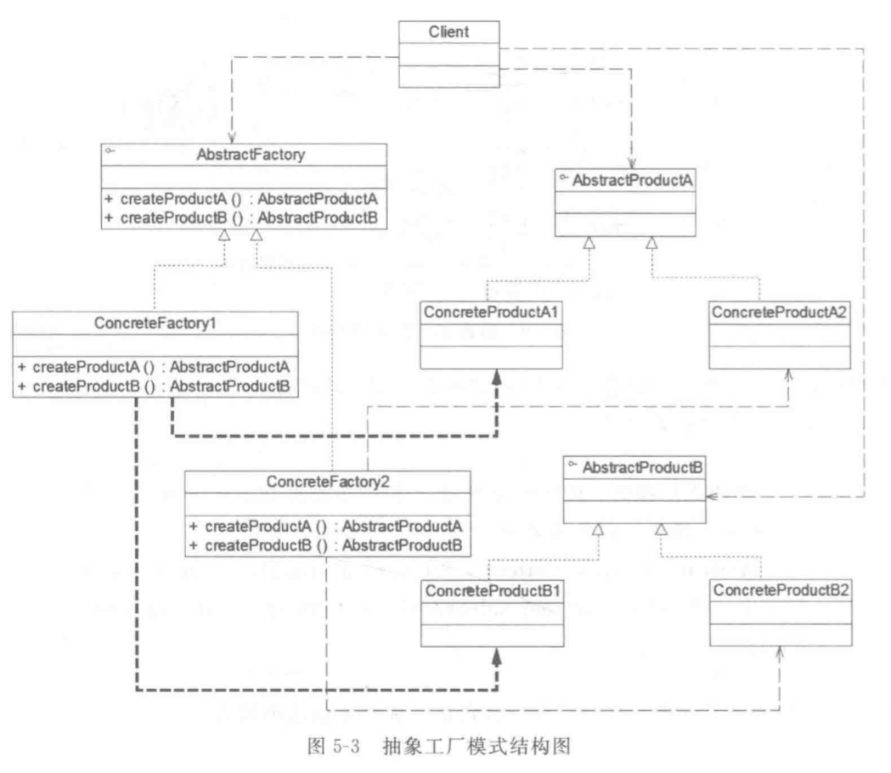

代码实现

```java
public abstract class Factory {
    public abstract Product factoryMethodA();
    public abstract Product factoryMethodB();
}

public class ConcreteFactoryA extends Factory {
    public Product factoryMethodA() {
        return new ConcreteProductAA();
    }
    
    public Product factoryMethodB() {
        return new ConcreteProductBA();
    }
}

public class ConcreteFactoryB extends Factory {
    public Product factoryMethodA() {
        return new ConcreteProductBA();
    }
    
    public Product factoryMethodB() {
        return new ConcreteProductBB();
    }
}

public abstract class ProductA { }

public class ConcreteProductAA extends Product { }

public class ConcreteProductAB extends Product { }

public abstract class ProductB { }

public class ConcreteProductBA extends Product { }

public class ConcreteProductBB extends Product { }
```

适用环境

1. 一个系统不关心产品类实例创建、组合和表达的细节。这对于所有类型的工厂模式都是很重要的，用户无须关心对象的创建过程，将对象的创建和使用解耦。
2. 系统中有多于一个的产品族，而每次只使用其中某一产品族，比如切换 UI 这种。可以通过配置文件等方式来使用户能够动态改变产品族，也可以很方便地增加新的产品族。
3. 同一产品族的产品将在一起使用。这一约束必须在系统的设计中体现出来，同一个产品族中的产品可以是没有任何关系的对象，但是它们都具有一些共同的约束。比如多个 UI 组件一起在界面中使用，这些组件就会受到 UI 主题的约束。
4. 产品等级结构稳定。在设计完成之后不会向系统中增加新的产品等级结构或者删除已有的产品等级结构。

优点

1. 实现了对象创建和使用的分离。客户端可以免除创建产品对象的职责，而仅仅 “消费” 产品。
2. 保证客户端始终只使用同一个产品族中的对象。一个产品族中的多个对象被设计成一起工作。
3. 增加新的产品族时符合开闭原则。无须修改已有系统即可添加新的产品族。

缺点

1. 增加新的产品等级结构时不符合开闭原则。需要对原有系统进行较大的修改，甚至需要修改抽象层代码。

### 建造者模式

概念：把一个产品的多个部件交给单独的建造者生产。

> 类似手机的生产，包含多个组成部分，像是 CPU、屏幕、内存等
>
> 这是对象创建模式，最后创建出一个复杂产品
>
> 区别于类创建模式，最后创建出一系列产品
>
> 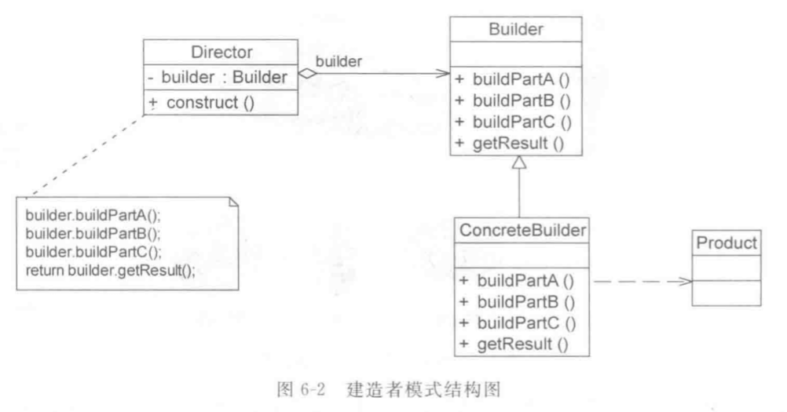
>
> 客户端直接用 `Director` 来创建产品，把复杂对象的创建过程完全隔离
>
> 
>
> 其实 `Builder` 和 `Product` 之间应该是一个组合关系
>
> 然后 `Director` 和 `Builder` 之间不一定是聚合关系，也有可能是简单的依赖关系
>
> 比如，直接用 `construct(Builder builder)`，在里面建造对象，返回对象，这样就不需要关联 `Builder`
>
> 这种情况时这个 `Director` 一般属于 `Controller`
>
> 如果不是 `Controller` 的话，得看需求决定是聚合还是组合
>
> 
>
> 也就是说，建造者模式的核心在于右半部分，至于怎么关联 `Builder`，得看需求的具体情况

代码实现

```java
public class Director {
    private Builder builder;
    
    public Director(Builder builder) {
        this.builder = builder;
    }
    
    public void setBuilder(Builder builder) {
        this.builder = builder;
    }
    
    public Product constract() {
        builder.buildPartA();
        builder.buildPartB();
        builder.buildPartC();
        return builder.getResult();
    }
}

public abstract class Builder {
    protected Product product = new Product();
    
    public abstract void buildPartA();
    public abstract void buildPartB();
    public abstract void buildPartC();
    
    public Product getResult() {
        return product;
    }
}

public class ConcreteBuilder extends Builder {
    public void buildPartA() {
        prooduct.setPartA("A1");
    }
    
    public void buildPartB() {
        prooduct.setPartB("B1");
    }
    
    public void buildPartC() {
        prooduct.setPartC("C1");
    }
}

public class Product {
    private String partA;
    private String partB;
    private String partC;
    
    // Setter and Getter
}
```

适用场景

1. 需要生成的产品对象有复杂的内部结构，这些产品对象通常包含多个成员变量。
2. 需要生成的产品对象的属性相互依赖，需要指定其生成顺序。
3. 对象的创建过程独立于创建该对象的类。将创建过程封装在单独的指挥者类中，而不在建造者类和客户类中。
4. 隔离复杂对象的创建和使用。相同的创建过程可以创建不同的产品。

优点

1. 将产品本身与产品的创建过程解耦。客户端不必知道产品内部组成的细节，使得相同的创建过程可以创建不同的产品对象。
2. 符合开闭原则。替换具体建造者或增加新的具体建造者而无须修改原有类库的代码。
3. 可以更加精细地控制产品的创建过程。复杂产品的创建步骤被分解在不同的方法中，不仅使得创建过程更加清晰，也更有利于创建过程的控制。

缺点

1. 使用范围受到一定的限制。差异性很大的产品不适合使用建造者模式。
2. 增加了系统的理解难度和运行成本。产品内部的变化如果过于复杂，会导致需要定义很多具体建造者类来实现这种变化，导致整个系统变得非常庞大。

### 原型模式

概念：直接克隆对象

> 就直接通过 `clone()` 方法把自己克隆一份返回即可，克隆体和原型体属性完全相同但是地址不同，是一个新的对象
>
> 克隆的时候需要注意深拷贝和浅拷贝的问题
>
> Java 里面可以直接让类实现 `Cloneable` 接口，然后就可以调用 `Object.clone()` 来实现浅拷贝
>
> 深拷贝可以让类实现 `Serializable` 接口，然后把当前对象序列化成一个流，用这个流创建新对象
>
> 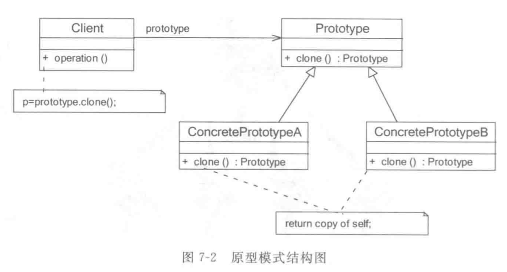

代码实现

```java
public abstract class Prototype {
    public abstract Prototype clone();
}

public class ConcretePrototype extends Prototype {
   	// some attribute\getter\seter
    
    public Prototype clone() {
        Prototype copy = new Prototype();
        // set same attribute to copy
        return copy;
    }
}
```

适用场景

1. 创建新对象成本较大（例如初始化需要占用较长的时间、占用太多的CPU资源或网络资源）。新对象可以通过复制已有对象获得,如果是相似对象，也可以对其成员变量稍作修改。
2. 系统需要保存对象的状态，而对象的状态变化又很小。

优点

1. 提高新实例的创建效率。当创建新的对象实例较为复杂时，使用原型模式可以简化对象的创建过程。
2. 扩展性较好。在客户端可以针对抽象原型类进行编程，增加或减少产品类对原有系统没有任何影响。
3. 可以使用深拷贝的方式保存对象的状态。将对象复制一份并将其状态保存起来，以便在需要的时候使用（例如恢复到某一历史状态），可辅助实现撤销操作。

缺点

1. 改造类时违背开闭原则。原型模式要求每个类实现一个克隆方法，且该方法位于类的内部。
2. 深拷贝实现起来较为复杂。在类之间存在多层嵌套关系时，每一层类都必须支持深拷贝，实现较为繁琐。

### 单例模式

概念：私有化构造方法，对外提供统一的静态方法返回同一个实例对象。

> 三步走：私有化构造函数、私有化自身静态实例、公开静态获取实例方法
>
> 分为饿汉式和懒汉式
>
> 饿汉式类加载时就创建好了这个对象，懒汉式在需要的时候再创建对象
>
> 饿汉式在类加载时开销会比较大，懒汉式在需要的时候可能会比较慢
>
> 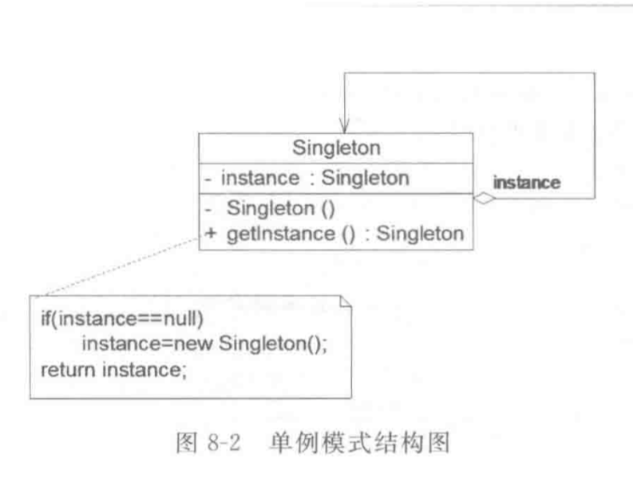

代码实现

```java
// 懒汉式，考试写这种即可
// 实际情况下，如果预期是多线程环境的话，需要加双检锁
public class Singleton {
    private static Singleton instance = null;
    
    private Singleton() { }
    
    public static Singleton getInstance() {
        if (instance == null)
            instance = new Singleton();
        return instance;
    }
}

// 单锁，性能不好
public class Singleton {
    private static Singleton instance = null;
    
    private Singleton() { }
    
    synchronized public static Singleton getInstance() {
        if (instance == null)
            instance = new Singleton();
        return instance;
    }
}

// 双检锁，这种性能较好
public class Singleton {
    private volatile static Singleton instance = null;
    
    private Singleton() { }
    
    public static Singleton getInstance() {
        if (instance == null) {
            synchronized(Singleton.class) {
                if (instance == null)
                	instance = new Singleton();
            }
        }

        return instance;
    }
}

// 静态内部类，比较完美的方法
// 不要让 Singleton 本身持有实例对象，交给一个静态内部类做这个事情
// isntance 不是 Singleton 的成员变量，所以类加载时不会实例化，免去了开销
// 调用 getInstance 时加载 InnerClass，初始化静态成员变量 instance，把线程安全交给虚拟机去做，不会有性能损失
public class Singleton {
    private Singleton() { }
    
    private static class InnerClass {
        private static final Singleton instance = new Singleton();
    }
    
    public static Singleton getInstance() {
        return InnerClass.instance;
    }
}

// 饿汉式
public class Singleton {
    private static final Singleton instance = new Singleton();
    
    private Singleton() { }
    
    public static Singleton getInstance() {
        return instance;
    }
}
```

适用环境

1. 系统只需要一个实例对象。
2. 单个实例只允许使用一个公共访问点，除了该公共访问点，不能通过其他途径访问该实例。

优点

1. 提供了对唯一实例的受控访问。因为单例类封装了它的唯一实例，所以它可以严格控制客户怎样以及何时访问它。
2. 节约系统资源。减少了多余实例的创建。对于一些需要频繁创建和销毁的对象，单例模式也可以提高系统的性能。
3. 允许可变数目的实例。基于单例模式可以进行扩展，使用与控制单例对象相似的方法来获得指定个数的实例对象，既节省系统资源，又解决了由于单例对象共享过多有损性能的问题。（称为多例类）

缺点

1. 违背了开闭原则。单例模式中没有抽象层，因此难以扩展。
2. 违背了单一职责原则。单例类的职责过重，它将对象的创建和对象本身的功能耦合在了一起。
3. 单例对象状态可能会丢失。某些语言的垃圾回收技术会使得系统会认为长时间不被使用的单例类是垃圾，会将之销毁并回收资源。下次利用时又将重新实例化。

## 结构型模式

分为类结构型模式和对象结构型模式。

类结构型模式用于组合多个类，对象结构型模式用于组合类和对象。

### 适配器模式

概念：当客户端期望的接口和类提供的接口不一致时，用适配器类包装该类，客户端通过调用适配器的方法来使用该类

> 分为类适配器模式和对象适配器模式，对象适配器符合组合复用原则，更灵活，使用频率更高。
>
> 类适配器中的`Adapter` 通过继承来封装`Adaptee` ，通过实现 `Target` 来提供客户端期望的接口。
>
> 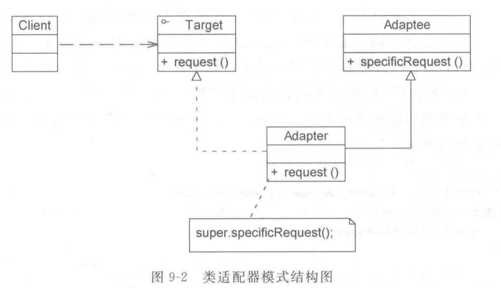
>
> 对象适配器模式中，`Adapter` 通过组合代替继承来封装`Adaptee` ，通过继承或实现 `Target` 来提供客户端期望的接口。类适配器模式中因为 Java 不支持多继承，所以只能是实现接口。
>
> 为了保持统一，`Adapter` 最好通过实现 `Target` 接口来提供客户端期望的接口。
>
> 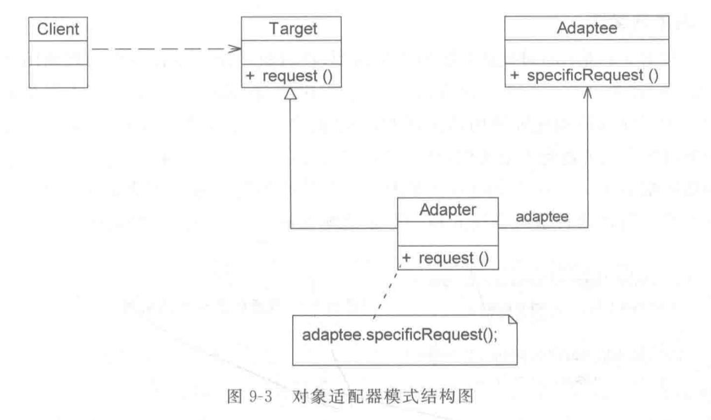

代码实现

```java
public interface Target {
    void request();
}

public class Adaptee {
    public void specificRequest() { }
}

// 类适配器
public class Adapter extends Adaptee implements Target {
    public void request() {
        super.specificRequest();
        // some adapt
    }
}

// 对象适配器
public class Adapter implements Target {
    private Adaptee adaptee;

    public Adapter(Adaptee adaptee) {
        this.adaptee = adaptee;
    }

    public void request() {
        adaptee.specificRequest();
        // some adapt
    }
}
```

适用环境

1. 系统需要使用一些现有的类，而这些类的接口（例如方法名）不符合系统的需要，甚至没有这些类的源代码。
2. 想创建一个可以重复使用的类，用于和一些彼此之间没有太大关联的类（包括一些可能在将来引进的类）一起工作。

优点

1. 将目标类和适配者类解耦。通过引入一个适配器类来重用现有的适配者类，无须修改原有结构。
2. 增加了类的透明性和复用性。将具体的业务实现过程封装在适配者类中，对于客户端类而言是透明的，而且提高了适配者的复用性，同一个适配者类可以在多个不同的系统中复用。
3. 完全符合开闭原则。灵活性和扩展性都非常好，通过使用配置文件可以很方便地更换适配器，也可以在不修改原有代码的基础上增加新的适配器类。

类适配器模式的额外优点

1. 由于适配器类是适配者类的子类，因此可以在适配器类中置换一些适配者的方法，使得适配器的灵活性更强。

对象适配器模式的额外优点

1. 一个对象适配器可以把多个不同的适配者适配到同一个目标。

2. 可以适配一个适配者的子类。由于适配器和适配者之间是关联关系，根据里氏代换原则，适配者的子类也可通过该适配器进行适配。

类适配器模式的缺点

1. 对于不支持多重类继承的语言，一次最多只能适配一个适配者类，不能同时适配多个适配者。
2. 对于不支持多重类继承的语言，类适配器模式中的目标抽象类只能为接口，不能为类，其使用有一定的局限性。
3. 适配者类不能为最终类。

对象适配器模式的缺点

1. 与类适配器模式相比，在该模式下要在适配器中置换适配者类的某些方法比较麻烦。

### 桥接模式

概念：把两个变化维度拆成两个等级结构，并将二者在抽象层关联起来，进而隔离两个维度的变化。

> 对象结构型模式
>
> 这个模式要特别注意区分抽象部分和实现部分这两个变化维度。
>
> 类的一些普通业务方法和与之关系最密切的维度设计为 “抽象类” 层次结构，而将另一个维度设计为 “实现类” 层次结构。
>
> 比如对于毛笔来说，毛笔就是用于绘图的，所以 “绘图” 属于普通业务方法，与绘图关系最密切的维度是毛笔的型号，另一个维度是颜色，所以我们可以得到以下的抽象部分和实现部分。或者说，毛笔对于不同型号的毛笔来说是抽象，不同型号的毛笔对于毛笔来说具象，与之区别，不同颜色对于毛笔来说是同一事物的不同实现。
>
> 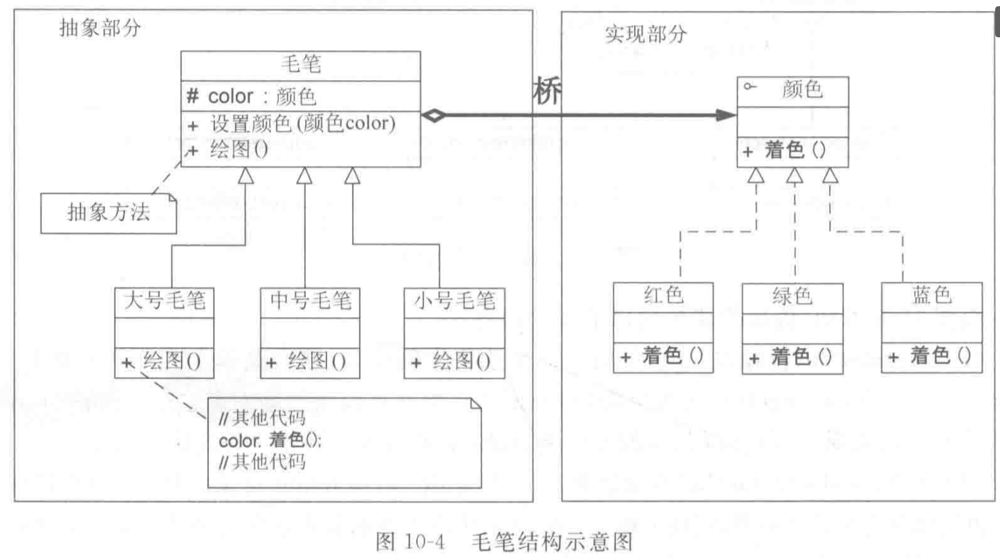
>
> 一般意义上的桥接模式如下
>
> 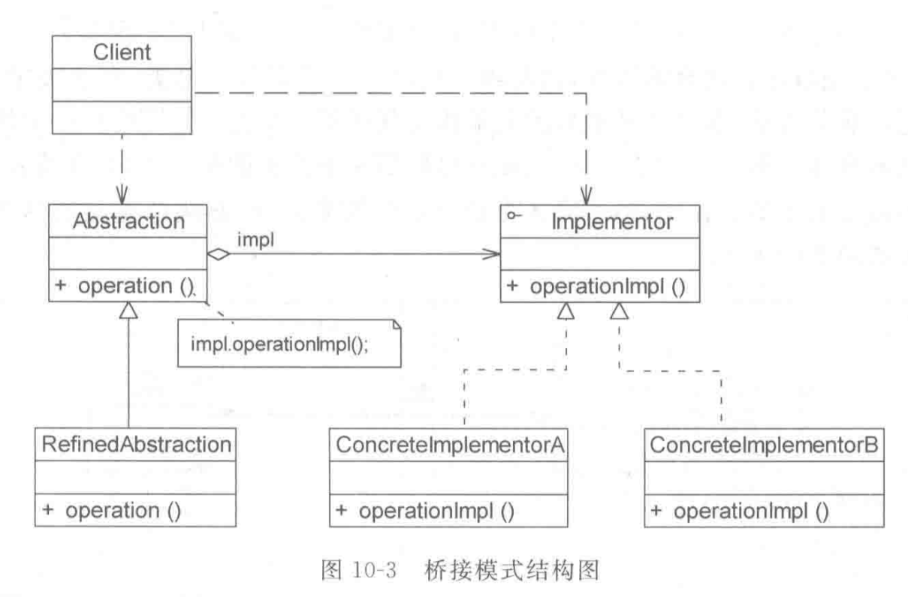

代码实现

```java
public abstract class Abstraction {
    private Implementor implementor = null;
    
    public void setImplementor(Implementor implementor) {
        this.implementor = implementor;
    }
    
    public abstract void oprtation();
}

public class RefinedAbstraction {
    public void opration() {
        // do something
        implementor.operationImpl();
        // do something
    }
}

public interface Implementor {
    void operationImpl();
}

public class ConcreteImplementorA {
    public void operationImpl() { }
}

public class ConcreteImplementorB {
    public void operationImpl() { }
}
```

适用环境

1. 如果一个系统需要在抽象化和具体化之间增加更多的灵活性，避免在两个层次之间建立静态的继承关系，通过桥接模式可以使它们在抽象层建立一个关联关系。
2. 系统需要对抽象化角色和实现化角色进行动态耦合。抽象部分和实现部分可以用继承的方式独立扩展而互不影响，在程序运行时可以动态地将一个抽象化子类的对象和一个实现化子类的对象进行组合。
3. 一个类存在两个（或多个）独立变化的维度，且这两个（或多个）维度都需要独立进行扩展。
4. 对于那些不希望使用继承或因为多层继承导致系统类的个数急剧增加的系统，桥接模式尤为适用。

优点

1. 分离抽象接口及其实现部分。使用 “对象间的关联关系” 解耦了抽象和实现之间固有的绑定关系，使得抽象和实现可以沿着各自的维度来变化。
2. 在很多情况下，桥接模式可以取代多层继承方案，极大地减少了子类的个数。多层继承方案违背了单一职责原则，复用性较差，并且类的个数非常多，桥接模式是比多层继承方案更好的解决方法。
3. 符合开闭原则。提高了系统的可扩展性,在两个变化维度中任意扩展一个维度都不需要修改原有系统。

缺点

1. 增加系统的理解与设计难度，由于关联关系建立在抽象层，要求开发者一开始就针对抽象层进行设计与编程。
2. 要求正确地识别出系统中的两个独立变化的维度，因此其使用范围具有定的局限性，如何正确识别两个独立维度也需要一定的经验积累。

### 组合模式

概念：组合多个对象形成树状结构以表示具有整体-部分关系的层次结构。使客户端可以统一地对待单个对象和组合对象。

> 属于对象结构型模式
>
> 在文件树结构中，文件就是单个对象，也叫叶子对象，文件夹就是组合对象，也叫组合对象
>
> 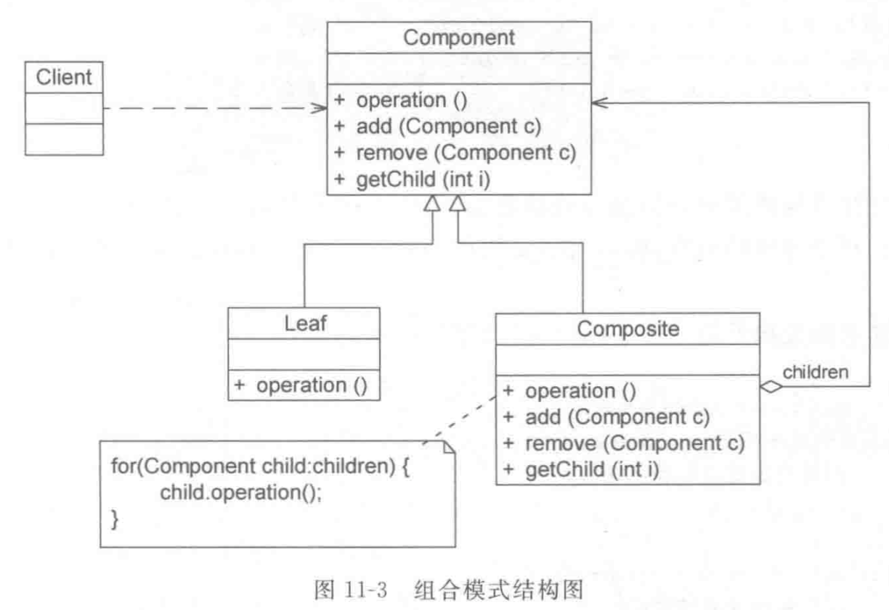

代码实现

```java
public abstract class Component {
    public abstract void operation();
    public abstract void add(Component c);
    public abstract void remove(Component c);
    public abstract Component getChild(int i);
}

public class Leaf extends Component {
    public void operation() { }
    
    public void add(Component c) {
        // exception
    }
    
    public void remove(Component c) {
        // exception
    }
    
    public Component getChild(int i) {
        // exception
        return null;
    }
}

public class Composite extends Component {
    private List<Component> children = new ArrayList<>();
    
    public void operation() {
        for (Component child : children)
            child.operation();
    }
    
    public void add(Component c) {
        children.add(c);
    }
    
    public void remove(Component c) {
        children.remove(c);
    }
    
    public Component getChild(int i) {
        return children.get(i);
    }
}
```

适用环境

1. 在具有整体和部分的层次结构中希望通过一种方式忽略整体与部分的差异，客户端可以一致地对待它们。
2. 在一个使用面向对象语言开发的系统中需要处理一个树形结构。
3. 在一个系统中能够分离出叶子对象和容器对象，而且它们的类型不固定，需要增加一此新的类型。

优点

1. 方便对整个层次结构进行控制。清楚地定义分层次的复杂对象，让客户端忽略了层次的差异。
2. 简化了客户端代码。客户端可以一致地使用一个组合结构或其中单个对象，不必关心处理的是单个对象还是整个组合结构。
3. 符合开闭原则。增加新的容器构件和叶子构件都很方便，无须对现有类库进行任何修改。
4. 为树形结构的面向对象实现提供了一种灵活的解决方案。叶子对象和容器对象的递归组合可以形成复杂的树形结构，但是对树形结构的控制却非常简单。

缺点

增加新构件时很难对容器中的构件类型进行限制。有时候希望一个容器中只能有某些特定类型的对象，例如在某个文件夹中只能包含文本文件，在使用组合模式时不能依赖类型系统来施加这些约束，因为它们都来自于相同的抽象层，在这种情况下必须通过在运行时进行类型检查来实现，这个实现过程较为复杂。

### 装饰模式

概念：动态给一个对象增加额外的职责。但就扩展功能来讲，装饰模式提供了比继承更加灵活的替代方案。

> 就是让被装饰的类和用抽象装饰类继承同一个抽象父类
>
> 抽象装饰类持有抽象父类的引用，这个引用会指向被装饰的类的对象
>
> 这样客户端就可以针对最开始的抽象父类编程，其引用指向具体装饰类
>
> 抽象装饰类可以是普通类
>
> 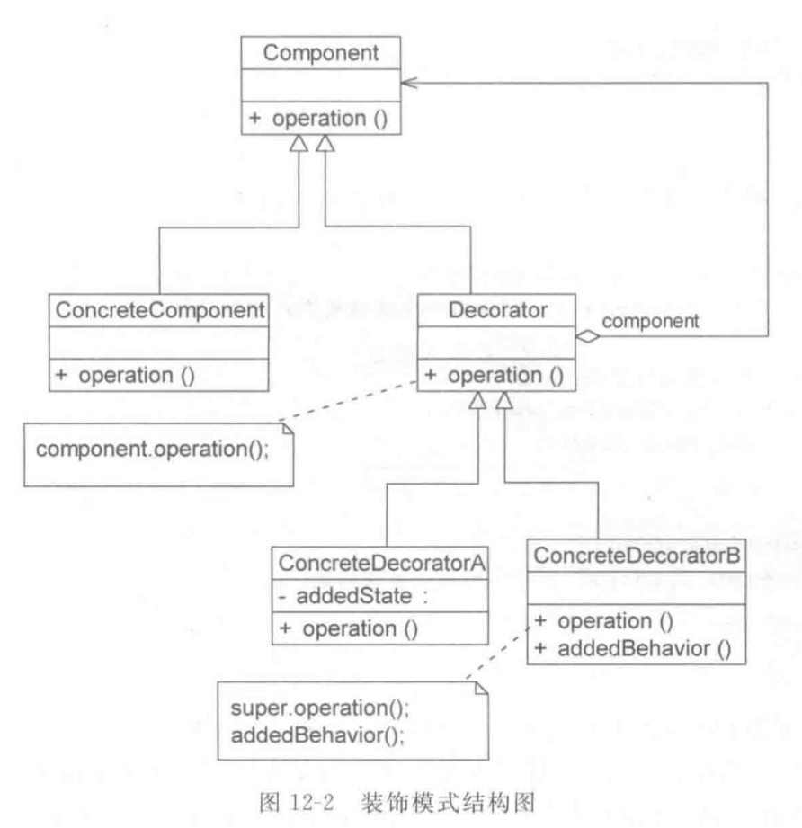

代码实现

```java
public abstract Component {
    public abstract void operation;
}

public class ConcreteComponent {
    public void operation() { }
}

public class Decorator {
    private Component c;
    
    public Decorator(Component c) {
        this.c = c;
    }
    
    public void operation() {
        c.operation();
    }
}

public class ConcreteDecoratorA {
    private int addedState = 0;
    
    public ConcreteDecoratorA(Component c) {
        super(c);
    }
    
    public void operation() {
        super.operation();
        addedOperation();
    }
    
    // 如果不希望被客户端单独调用也可以设置成 private，此时被称作透明装饰器
    public void addedOperation() { }
}
```

适用环境

1. 在不影响其他对象的情况下以动态、透明的方式给单个对象添加职责。

2. 当不能采用继承的方式对系统进行扩展或者采用继承不利于系统扩展和维护时可以使用装饰模式。

   > 不能采用继承的情况主要有两类
   >
   > 第一类是系统中存在大量独立的扩展，为支持每一种扩展或者扩展之间的组合将产生大量的子类，使得子类数目呈爆炸
   > 性增长；第二类是因为类已定义为不能被继承（例如在Java语言中使用 final关键字修饰的类）。

优点

1. 对于扩展一个对象的功能，装饰模式比继承更加灵活，不会导致类的个数急剧增加。
2. 可以通过一种动态的方式来扩展一个对象的功能。通过配置文件可以在运行时选择不同的具体装饰类，从而实现不同的行为。
3. 可以对一个对象进行多次装饰，得到功能更加强大的对象。通过使用不同的具体装饰类以及这些装饰类的排列组合可以创造出很多不同行为的组合。
4. 符合开闭原则。具体构件类与具体装饰类可以独立变化。增加新的具体构件类和具体装饰类，原有类库代码无须改变。

缺点

1. 在一定程度上影响程序的性能。在使用装饰模式进行系统设计时将产生很多小对象，这些对象的区别在于它们之间相互连接的方式有所不同，而不是它们的类或者属性值有所不同，大量小对象的产生会占用更多的系统资源。
2. 比继承更加易于出错，排错也更困难。对于多次装饰的对象，在调试时寻找错误可能需要逐级排查，较为烦琐。

### 外观模式

概念：为子系统中的一组接口提供一个统一的入口。

> 就是把客户端对子系统的请求委托给一个专门的类来处理。
>
> 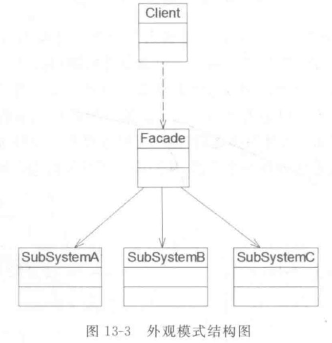

代码实现

```java
public class Facade {
    private SubSystemA sysA = new SubSystemA();
    private SubSystemB sysB = new SubSystemB();
    private SubSystemC sysC = new SubSystemC();
    
    private void method() {
        sysA.methondA();
        sysB.methondB();
        sysC.methondC();
    }
}

public class SubSystemA {
    private void methodA() { }
}

public class SubSystemB {
    private void methodA() { }
}

public class SubSystemC {
    private void methodA() { }
}
```

适用环境

1. 当要为访问一系列复杂的子系统提供一个简单入口时可以使用外观模式。
2. 客户端程序与多个子系统之间存在很大的依赖性。引入外观类可以将子系统与客户端解耦，提高子系统的独立性和可移植性。
3. 在层次化结构中可以使用外观模式定义系统中每一层的人口，层与层之间不直接产生联系，而通过外观类建立联系，降低层之间的耦合度。

优点

1. 客户端代码将变得很简单，与之关联的对象也很少。它对客户端屏蔽了子系统组件，减少了客户端所需处理的对象数目，并使子系统使用起来更加容易。
2. 它实现了子系统与客户端之间的松耦合关系，这使得子系统的变化不会影响到调用它的客户端，只需要调整外观类即可
3. 一个子系统的修改对其他子系统没有任何影响，而且子系统内部变化也不会影响到外观对象。

缺点

1. 不能很好地限制客户端直接使用子系统类，如果对客户端访问子系统类做太多的限制则减少了可变性和灵活性。
2. 如果设计不当，增加新的子系统可能需要修改外观类的源代码，违背了开闭原则。

### 享元模式

概念：运用共享技术有效支持大量细粒度对象的复用。

> 对象结构型模式的一种
>
> 就是让需要共享的元素继承一个抽象享元类，然后享元工厂维护一个享元池。
>
> 共享具体享元类可以通过工厂结合单例模式返回实例对象
>
> 非共享具体享元类直接实例化即可
>
> 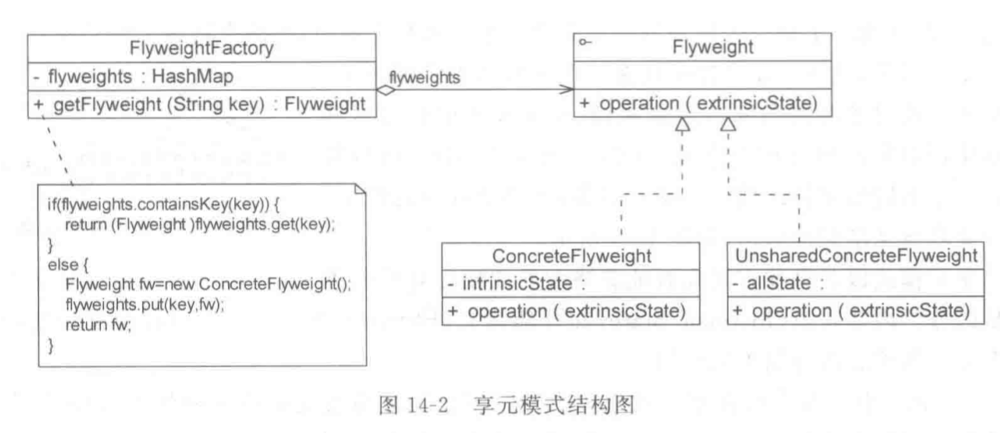

代码实现

```java
public class FlyweightFactory {
    private Map<String, Flyweight> flyweights = new HashMap<>();
    
    public Flyweight getFlyweight(String key) {
        if (flyweights.containsKey(key))
            return flyweights.get(key);
        
        Flyweight fw = new ConcreteFlyweight();
        flyweights.put(key, fw);
        return fw;
    }
}

public abstract class Flyweight {
    public abstract void operation(String extrinsicState);
}

public class ConcreteFlyweight extends Flyweight {
    private String intrinsicState;
    
    public ConreteFlyweight(String intrinsicState) {
        this.intrinsicState = intrinsicState;
    }
    
    public void operation(String extrinsicState) { }
}

public class UnsharedConcreteFlyweight extends Flyweight {
    public void operation(String extrinsicState) { }
}
```

适用环境

1. 一个系统有大量相同或者相似的对象，造成内存的大量耗费。
2. 对象的大部分状态都可以外部化，可以将这些外部状态传入对象中。
3. 需要维护一个存储享元对象的享元池，这需要耗费一定的系统资源，应当在需要多次重复使用享元对象时才使用享元模式。

优点

1. 节约系统资源，提高系统性能。享元模式可以减少内存中对象的数量，使得相同或者相似对象在内存中只保存一份。
2. 享元模式的外部状态相对独立，而且不会影响其内部状态，从而使享元对象可以在不同的环境中被共享。

缺点

1. 享元模式使系统变得复杂，需要分离出内部状态和外部状态，这使得程序的逻辑复杂化。
2. 为了使对象可以共享，享元模式需要将享元对象的部分状态外部化，而读取外部状态将使运行时间变长。

### 代理模式

概念：给某一个对象提供一个代理或占位符，并由代理对象来控制对原对象的访问。

> 对象结构型模式
>
> 就是让代理对象和真实对象都继承同一个抽象类，然后代理对象持有真实对象的引用。
>
> 然后客户端针对抽象编程，实例使用代理对象而非真实对象。
>
> `preRequest()` 和 `postResquest()` 不是必须的，需要的时候再用
>
> `Proxy` 中 `requset()` 的适用方式决定了代理模式的类型
>
> 分为远程代理、虚拟代理、保护代理、缓冲代理、智能引用代理
>
> 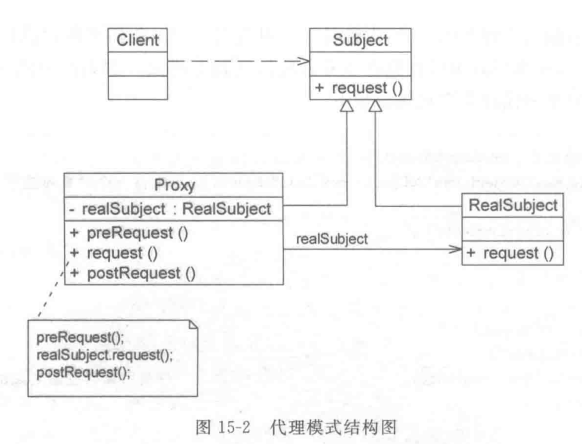

代码实现

```java
public abstract class Subject {
    public abstract void request();
}

public class Proxy extends Subject {
    private RealSbject realSbject = new RealSubject();
    
    public void preRequest() { }
    
    public void request() {
        preRequest();
        realSbject.request();
        postRequest();
    }
    
    public void postRequest() { }
}

public class RealSubject extends Subject {
    public void request() { }
}
```

适用场景

1. 当客户端对象需要访问远程主机中的对象时可以使用远程代理。
2. 当需要用一个消耗资源较少的对象来代表一个消耗资源较多的对象，从而降低系统开销、缩短运行时间时可以使用虚拟代理，例如一个对象需要很长时间才能完成加载时。
3. 当需要为某一个被频繁访问的操作结果提供一个临时存储空间，以供多个客户端共享访问这些结果时可以使用缓冲代理。通过使用缓冲代理，系统无须在客户端每一次访问时都重新执行操作，只需直接从临时缓冲区获取操作结果即可。
4. 当需要控制对一个对象的访问为不同用户提供不同级别的访问权限时可以使用保护代理。
5. 当需要为一个对象的访问（引用）提供一些额外的操作时可以使用智能引用代理。

优点

1. 降低了系统的耦合度。能够协调调用者和被调用者。
2. 符合开闭原则。客户端针对抽象主题角色编程，增加和更换代理类无须修改源代码，系统具有较好的灵活性和可扩展性。

此外，不同类型的代理模式具有独特的优点，例如:

1. 远程代理为位于两个不同地址空间的对象的访问提供了一种实现机制，可以将一些消耗资源较多的对象和操作移至性能更好的计算机上，提高了系统的整体运行效率。
2. 虚拟代理通过一个消耗资源较少的对象来代表一个消耗资源较多的对象，可以在定程度上节省系统的运行开销。
3. 缓冲代理为某一个操作的结果提供临时的缓存存储空间，以便在后续使用中能够共享这些结果，优化系统性能，缩短执行时间。
4. 保护代理可以控制对一个对象的访问权限，为不同用户提供不同级别的使用权限。

缺点

1. 由于在客户端和真实主题之间增加了代理对象，因此有些类型的代理模式可能会造成请求的处理速度变慢，例如保护代理。
2. 实现代理模式需要额外的工作，而且有些代理模式的实现过程较为复杂，例如远程代理。

## 行为型模式

关注类的行为或者职责，或者说对象之间的交互

分为类行为型模式和对象行为型模式

类行为型模式通过继承为多个类分配职责；对象行为型模式通过关联来分配行为

大部分都是对象行为型模式，因为合成复用原则

### 责任链模式

概念：避免将一个请求的发送者与接收者耦合在一起，让多个对象都有机会处理请求。将接收请求的对象连接成一条链，并且沿着这条链传递请求，直到有一个对象能够处理它为止。

> 定义抽象 `Handler`，持有自身引用，这样就可以把请求发送给下一个 `Handler`
>
> 责任链类自身并不创建对象，由使用责任链的客户端创建
>
> 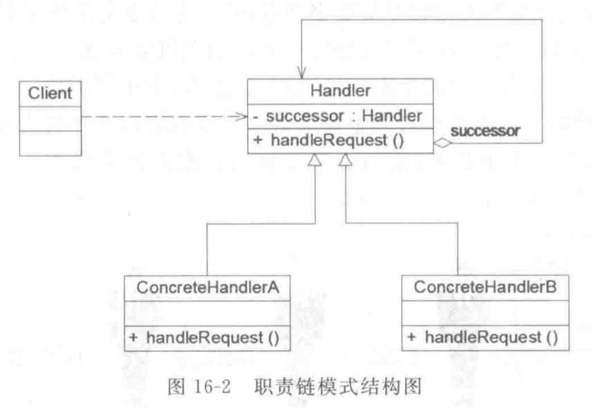

代码实现

```java
public static class QualifierUtils {
    public static boolean isQualified(String request) {
        boolean result = false;
        // do some thing
        return result;
    }
}


public abstract class Handler {
    private Handler successor;
    
    public void setSuccessor(Handler succseeor) {
        this.succseeor = succseeor;
    }
    
    public abstract void handleRequest(String request);
}

public class ConcreteHandlerA extends Handler {
    public abstract void handleRequest(String request) {
        if (QualifierUtils.isQualified(request)) {
            // ...
        } else {
            this.successor.handleRequest(request);
        }
    }
}

public class ConcreteHandlerB extends Handler {
    public abstract void handleRequest(String request) {
        if (QualifierUtils.isQualified(request)) {
            // ...
        } else {
            this.successor.handleRequest(request);
        }
    }
}
```

适用环境

1. 有多个对象可以处理同一个请求，具体哪个对象处理该请求待运行时刻再确定，客户端只需将请求提交到链上，而无须关心请求的处理对象是谁以及它是如何处理的。
2. 在不明确指定接收者的情况下向多个对象中的一个提交一个请求。
3. 可动态指定一组对象处理请求，客户端可以动态创建职责链来处理请求，还可以改变链中处理者之间的先后次序。

优点

1. 降低了系统的耦合度。使得一个对象无须知道是其他哪一个对象处理其请求，对象仅需知道该请求会被处理即可，接收者和发送者都没有对方的明确信息，并且链中的对象不需要知道链的结构，由客户端负责链的创建。
2. 可简化对象之间的相互连接。请求处理对象仅需维持一个指向其后继者的引用，而不需要维持它对所有的候选处理者的引用。
3. 可以带来更多的灵活性。给对象分派职责时，可以通过运行时对该链进行动态的增加或修改来增加或改变处理一个请求的职责。
4. 增加一个新的具体请求处理者时符合开闭原则。增加一个新的具体请求处理者时无须修改原代码，只需在客户端重新建链即可。

缺点

1. 由于一个请求没有明确的接收者，那么就不能保证它一定会被处理，该请求可能一直到链的末端都得不到处理；一个请求也可能因职责链没有被正确配置而得不到处理。
2. 系统性能受到一定的影响。对于比较长的职责链，请求的处理可能涉及多个处理对象。而且在进行代码调试时不太方便。
3. 如果建链不当，可能会造成循环调用，将导致系统陷入死循环。

### 命令模式

概念：将一个请求封装为一个对象，从而可用不同的请求对客户进行参数化，对请求排队或者记录请求日志，以及支持可撤销的
操作。

> 就是在中间加了一层命令抽象层
>
> 把 `Recriver.action()` 单独抽象出来，然后再通过中间层 `Invoker` 调用
>
> 从而达到将请求发送者和接收者分离的目的
>
> 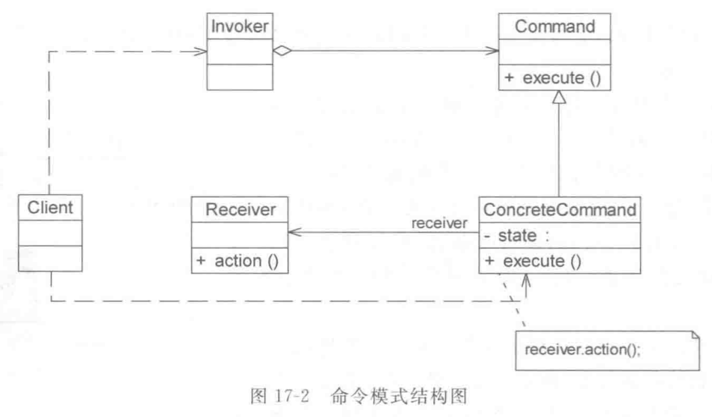

代码实现

```java
public class Invoker {
    private Command command;
    
    public Invoker(Command command) {
        this.command = command;
    }
    
    public void setCommand(Command command) {
        this.command = command;
    }
    
    public void call() {
        command.execute();
    }
}

public abstract class Command {
    public abstract void executed();
}

public class ConcreteCommand extends Command {
    private Receiver receiver;
    
    public ConcreteCommand(Receiver receiver) {
        this.receiver = receiver;
    }
    
    public void execute() {
        receiver.action();
    }
}

public class Receiver {
    public void action() { }
}
```

适用场景

1. 系统需要将请求调用者和请求接收者解耦。请求调用者无须知道接收者的存在，也无须知道接收者是谁，接收者也无须关心何时被调用。
2. 系统需要在不同的时间指定请求、将请求排队和执行请求。一个命令对象和请求的初始调用者可以有不同的生命期，换言之，最初的请求发出者可能已经不在了，而命令对象本身仍然是活动的，可以通过该命令对象去调用请求接收者，并且无须关心请求调用者的存在性，可以通过请求日志文件等机制来具体实现。
3. 系统需要支持命令的撤销（Undo）操作和恢复（Redo）操作。
4. 系统需要将一组操作组合在一起形成宏命令。

优点

1. 降低系统的耦合度。请求者与接收者之间不存在直接引用，因此请求者与接收者之间实现完全解耦，相同的请求者可以对应不同的接收者，同样相同的接收者也可以供不同的请求者使用，两者之间具有良好的独立性。
2. 增加新命令时满足开闭原则的要求。由于增加新的具体命令类不会影响到其他类，因此增加新的具体命令类很容易，无须修改原有系统源代码，甚至客户类代码。
3. 可以比较容易地设计一个命令队列或宏命令（组合命令）。
4. 为请求的撤销（Undo）和恢复（Redo）操作提供了一种设计和实现方案。

缺点

使用命令模式可能会导致某些系统有过多的具体命令类。因为针对每一个对请求接收者的调用操作都需要设计一个具体命令类，所以在某些系统中可能需要提供大量的具体命令类，这将影响命令模式的使用。

### 解释器模式

概念：给定一个语言，定义它的文法的一种表示，并定义个解释器，这个解释器使用该表示来解释语言中的句子。

> 适用频率很低，并且理解困难，需要先写出语法树，肯定不考

### 迭代器模式

概念：提供一种方法顺序访问一个聚合对象中的各个元素，而又不用暴露该对象的内部表示。

> 定义抽象集合和抽象迭代器
>
> 客户端针对抽象层编程，用抽象迭代器操作抽象集合
>
> 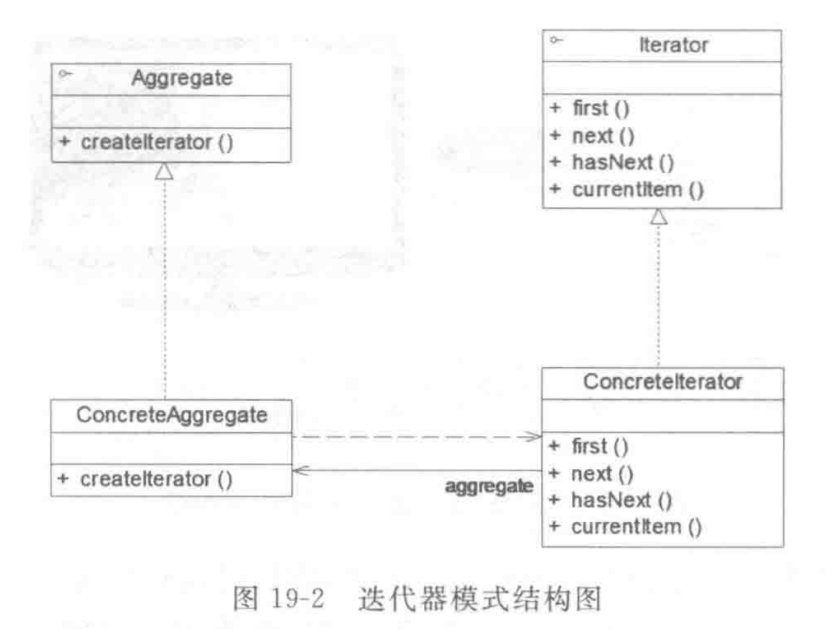

代码实现：

```java
public abstract class Aggregate {
    public abstract Iterator createIterator();
}

public class ConcreteAggregate {
    public void createIterator() {
        return new ConcreteIterator(this);
    }
}

public abstract class Iterator {
    public abstract void first();
    public abstract void next();
    public abstract boolean hasNext();
    public abstract Object currentItem();
}

public class ConcreteIterator {
    private ConcreteAggregate objects;
    private int cursor;
    
    public ConcreteIterator(ConcreteAggregate objects) {
        this.objects = objects;
    }
    
    public void first() { }
    public void next() { }
    public boolean hasNext() { }
    public Object currentItem() { }
}
```

适用环境

1. 访问一个聚合对象的内容而无须暴露它的内部表示。将聚合对象的访问与内部数据的存储分离，使得访问聚合对象时无须了解其内部实现细节。
2. 需要为一个聚合对象提供多种遍历方式。
3. 为遍历不同的聚合结构提供一个统一的接口，在该接口的实现类中为不同的聚合结构提供不同的遍历方式，而客户端可以一致性地操作该接口。

优点

1. 支持以不同方式遍历一个聚合对象。只需要用一个不同的迭代器来替换原有迭代器即可改变遍历算法。
2.  迭代器模式简化了聚合类。引人了迭代器，在原有的聚合对象中不需要再自行提供数据遍历等方法。
3. 满足开闭原则。在迭代器模式中由于引人了抽象层，增加新的聚合类和迭代器类都很方便，无须修改原有代码。

缺点

1. 增加了系统的复杂性。在增加新的聚合类时需要对应增加新的迭代器类，类的个数成对增加。
2. 抽象迭代器的设计难度较大，需要充分考虑到系统将来的扩展。

### 中介者模式

概念：:定义一个对象来封装一系列对象的交互。中介者模式使各对象之间不需要显式地相互引用，从而使其耦合松散，而且用户可以独立地改变它们之间的交互。

> 就是把对象之间的依赖关系从网状结构变成以中介者对象为核心的星型结构
>
> 原本的对象叫同时 `Colleague` 
>
> 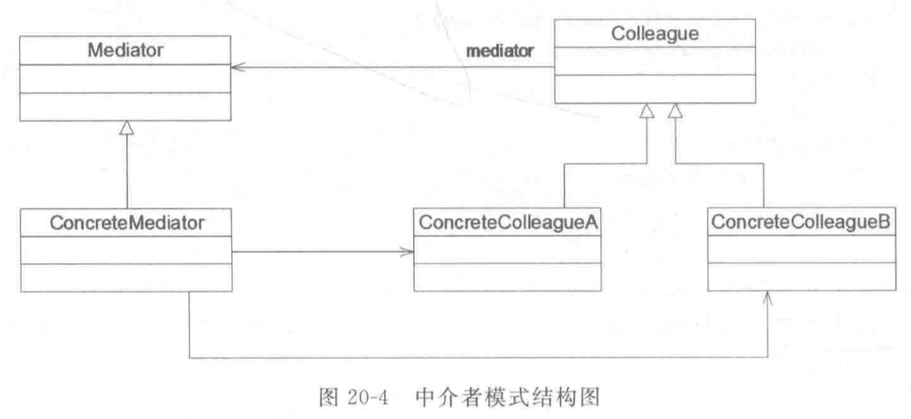

代码实现

```java
public abstract class Mediator {
	protected List<Colleague> colleagues = new ArrayList<>();
    
    public void register(Colleague colleague) {
        colleagues.add(colleague);
    }
    
    public abstract void operation();
}

public class ConcreteMediator {
    public void operation() {
        // ...
        colleagues.get(0).methodA();
    }
}

public abstract class Colleague {
    protected Mediator mediator;
    
    public Colleague(Mediator mediator) {
        this.mediator = mediator;
    }
    
    public abstract void methodA();
    
    public abstract void methodB() {
        mediator.operation();
    }
}

public abstract class Colleague {
    public Colleague(Mediator mediator) {
        super(mediator);
    }
    
    public abstract void methodA() { }
}
```

适用环境

1. 系统中对象之间存在复杂的引用关系，系统结构混乱且难以理解。
2. 一个对象由于引用了其他很多对象并且直接和这些对象通信，导致难以复用该对象。
3. 想通过一个中间类来封装多个类中的行为，而又不想生成太多的子类，此时可以通过引人中介者类来实现，在中介者中定义对象交互的公共行为，如果需要改变行为则可以增加新的具体中介者类。

优点

1. 简化了对象之间的交互。将原本难以理解的网状结构转换成相对简单且更容易理解、维护和扩展的星形结构。
2. 增加新中介者类和新同时类时符合开闭原则。各同事对象解耦，可以独立地改变和复用每一个同事和中介者。
3. 减少子类生成。中介者将原本分布于多个对象间的行为集中在一起，改变这些行为只需生成新的中介者子类即可，这使得各个同事类可以被重用，无须直接对同事类进行扩展。

缺点

在具体中介者类中包含了大量同事之间的交互细节，可能会导致具体中介者类非常复杂，使得系统难以维护。

### 备忘录模式

概念：在不破坏封装的前提下捕获一个对象的内部状态，并在该对象之外保存这个状态，这样可以在以后将对象恢复到原先保存的状态。

>`Originator` 是一般业务类，状态由 `Caretaker` 以 `Memento` 的形式在外部保存
>
>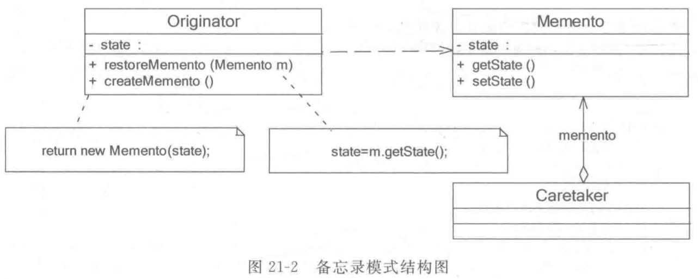

代码实现

```java
public class Originator {
    private String state;
    
    public Originator(String state) {
        this.state = state;
    }
    
    public Memento createMemento() {
        return new Memento(this);
    }
    
    public void restoreMemento(Memento memento) {
        state = memento.getState();
    }
    
    public void getState() {
        return state;
    }
    
    public void setState(String state) {
        this.state = state;
    }
}

// 基本上就是一个 JavaBean，只用来暂存状态
// 默认可见性，包内可见
// 一般把这个和 Originator 放在同一包内，保证只有原发器能访问它，从而避免状态被第三者修改
// 或者可以把这个设计成 Originator 的内部类
class Memento {
    private String state;
    
    public Memento(Originator originator) {
        this.state = originator.getState();	
    }

    public String getState() {
        return state;
    }
    
    public void setState(String state) {
        this.state = state;
    }
}

public class Caretaker {
    private Memento memento;
    
    public Memento getMemento() {
        return memento;
    }
    
    public void setMemento(Memento memento) {
        this.memento = memento;
    }
}
```

适用场景

1. 保存一个对象在某一时刻的全部或部分状态，这样以后需要时它能够恢复到先前的状态，实现撤销操作。
2. 防止外界对象破坏一个对象历史状态的封装性，避免将对象历史状态的实现细节暴露给外界对象。

优点

1. 提供了一种状态恢复的实现机制。用户可以方便地回到一个特定的历史步骤，当新的状态无效或者存在问题时可以使用暂时存储起来的备忘录将状态复原。
2. 备忘录实现了对信息的封装，一个备忘录对象是一种原发器对象状态的表示，不会被其他代码所改动。备忘录保存了原发器的状态，采用列表、堆栈等集合来存储备忘录对象可以实现多次撤销操作。

缺点

资源消耗过大，如果需要保存的原发器类的成员变量太多，就不可避免地需要占用大量的存储空间，每保存一次对象的状态都需要消耗一定的系统资源。

### 观察者模式

概念：定义对象之间的一种一对多的依赖关系，使得每当一个对象状态发生改变时其相关依赖对象皆得到通知并被自动更新。

> 被观察者持有对观察者引用，被观察者自身状态发生变化时，通知观察者们
>
> 下面那条关联关系不是必须的
>
> 观察者做出响应的动作，这个动作如果依赖于被观察者的状态，那么需要持有被观察者的引用
>
> 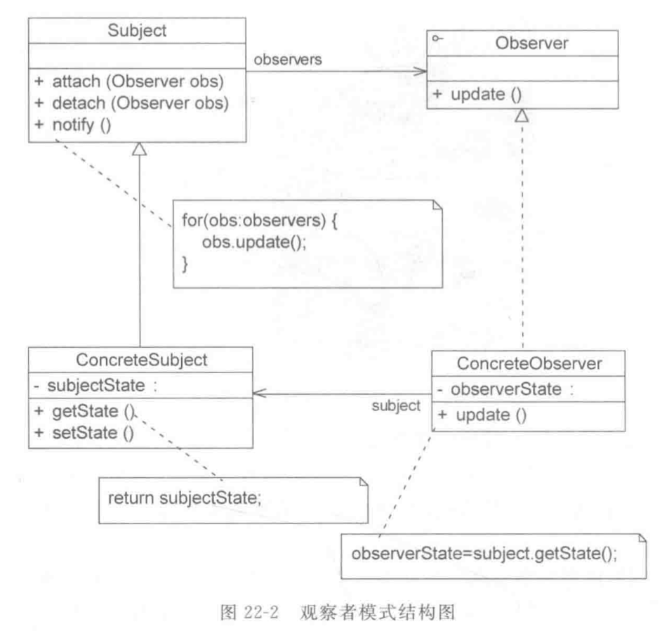

代码实现

```java
public abstract class Subject {
    private List<Obsever> obsevers = new ArrayList<>();
    
    public void attach(Obsever obsever) {
        obsevers.add(obsever);
    }
    
    public void detach(Obsever obsever) {
        obsevers.remove(obsever);
    }
    
    public abstract void notify();
}

public class ConcreteSubject {
    public void notify() {
        for (Obsever obsever : obsevers) {
            obsever.update();
        }
    }
}

public abstract class Obsever {
    public abstract void update();
}

public class ConcreteObsever {
    public void update() { }
}
```

适用环境

1. 一个抽象模型的其中一个方面依赖于另一个方面，将这两个方面封装在独立的对象中使它们可以各自独立地改变和复用。
2. 一个对象的改变将导致一个或多个其他对象也发生改变，而并不知道具体有多少对象将发生改变，也不知道这些对象是谁。
3. 需要在系统中创建一个触发链，A 对象的行为将影响 B对象，B对象的行为将影响C对象……，可以使用观察者模式创建一种链式触发机制。

优点

1. 可以实现表示层和数据逻辑层的分离。定义了稳定的消息更新传递机制，并抽象了更新接口，使得可以有各种各样不同的表示层充当具体观察者角色。
2. 在观察目标和观察者之间建立一个抽象的耦合。观察目标只需要维持一个抽象观察者的集合，无须了解其具体观察者。由于观察目标和观察者没有紧密地耦合在一起，因此它们可以属于不同的抽象化层次。
3. 支持广播通信。观察目标会向所有已注册的观察者对象发送通知，简化了一对多系统设计的难度。
4.  增加新的具体观察者时符合开闭原则。增加新的具体观察者无须修改原有系统代码，在具体观察者与观察目标之间不存在关联关系的情况下增加新的观察目标也很方便。

缺点

1. 如果一个观察目标对象有很多直接和间接观察者，将所有的观察者都通知到会花费很多时间。
2.  如果在观察者和观察目标之间存在循环依赖，观察目标会触发它们之间进行循环调用，可能导致系统崩溃。
3. 观察者模式没有相应的机制让观察者知道所观察的目标对象是怎么发生变化的，而仅仅只是知道观察目标发生了变化。

### 状态模式

概念：允许一个对象在其内部状态改变时改变它的行为。对象看起来似乎修改了它的类。

> 就是把会变动的状态和跟变动状态相关的行为给分离出去再关联起来
>
> 需要实现画出状态图，定义好各个状态
>
> 可以在环境类中定义一个 `setter` 来进行状态转换或者在具体状态类中定义带参 `setter` 进行状态转换
>
> 后者会使具体状态类依赖于环境类
>
> 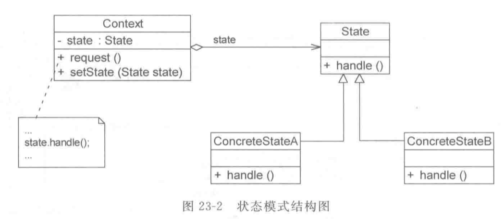

代码实现

```java
public class Context {
    private State state;
    
    public void setState(State state) {
        this.state = state;
    }
    
    public void request() {
        // ...
        state.handle();
    }
}

public abstract class State {
    public abstract void handle();
}

public class ConcreteStateA extends State {
    public void handle() { }
}

public class ConcreteStateB extends State {
    public void handle() { }
}
```

适用环境

1. 对象的行为依赖于它的状态（例如某些属性值），状态的改变将导致行为的变化。
2. 在代码中包含大量与对象状态有关的条件语句，这些条件语句的出现会导致代码的可维护性和灵活性变差，不能方便地增加和删除状态，并且导致客户类与类库之间的耦合增强。

优点

1. 状态模式封装了状态的转换规则，在状态模式中可以将状态的转换代码封装在环境类或者具体状态类中，可以对状态转换代码进行集中管理，而不是分散在一个个业务方法中。
2. 状态模式将所有与某个状态有关的行为放到一个类中，只需要注入一个不同的状态对象即可使环境对象拥有不同的行为。
3. 状态模式允许状态转换逻辑与状态对象合成一体，而不是提供一个巨大的条件语句块，状态模式可以避免使用庞大的条件语句将业务方法和状态转换代码交织在一起。
4. 状态模式可以让多个环境对象共享一个状态对象，从而减少系统中对象的个数。

缺点

1. 导致系统运行开销增大。状态模式会增加系统中类和对象的个数。
2. 增加了系统设计的难度。状态模式的结构与实现都较为复杂，如果使用不当将导致程序结构和代码的混乱。
3. 状态模式对开闭原则的支持并不太好。增加新的状态类需要修改那些负责状态转换的源代码，否则无法转换到新增状态；而且修改某个状态类的行为也需要修改对应类的源代码。

### 策略模式

概念：定义一系列算法，将每一个算法封装起来，并让它们可以相互替换。策略模式让算法可以独立于使用它的客户而变化。

> 把算法单独抽象出来再组合回去，和状态模式异曲同工
>
> 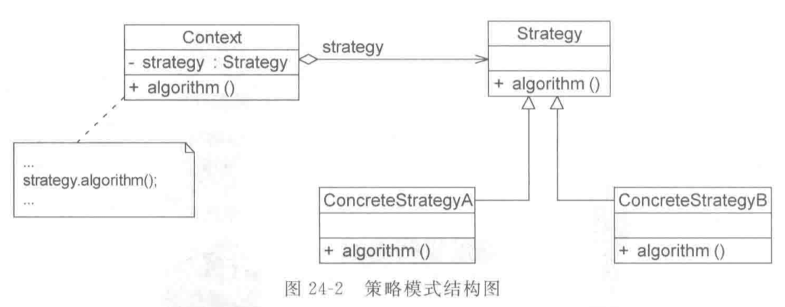

代码实现

```java
public class Context {
	private Strategy strategy;
    
    public Context(Strategy strategy) {
        this.strategy = strategy;
    }
    
    public void setStrategy(Strategy strategy) {
        this.trategy = strategy;
    }
    
    public void algorithm() {
        strategy.algorithm();
    }
}

public abstract class Strategy {
    public abstract void algorithm();
}

public class ConcreteStrategyA {
    public void algorithm() { }
}

public class ConcreteStrategyB {
    public void algorithm() { }
}
```

适用环境

1. 一个系统需要动态地在几种算法中选择一种，那么可以考虑使用策略模式。
2. 一个对象有很多行为，如果不用恰当的模式，这些行为则只好使用多重条件选择语句来实现。此时使用策略模式把这些行为转移到相应的具体策略类里面，就可以避免使用难以维护的多重条件选择语句。
3. 不希望客户端知道复杂的与算法相关的数据结构，在具体策略类中封装算法与相关的数据结构，可以提高算法的保密性与安全性。

优点

1. 完全符合开闭原则的要求。用户可以在不修改原有系统的基础上选择算法或行为，也可以灵活地增加新的算法或行为。
2. 提供了管理相关的算法族的办法。策略类的等级结构定义了一个算法或行为族，恰当地使用继承可以把公共的代码移到抽象策略类中，从而避免重复的代码。
3. 提供了一种可以替换继承关系的办法。如果不使用策略模式，那么使用算法的环境类就可能会有一些子类，每一个子类提供一种不同的算法。但是这样一来算法的使用就和算法本身混在一起，不符合单一职责原则，决定使用哪一种算法的逻辑和该算法
   本身混合在一起，从而不可能再独立演化；而且使用继承无法实现算法或行为在程序运行时的动态切换。
4. 可以避免多重条件选择语句。多重条件选择语句不易维护，它把采取哪一种算法或行为的逻辑与算法或行为本身的实现逻辑混合在一起，将它们全部硬编码在一个庞大的多重条件选择语句中，比直接继承环境类的办法还要原始和落后。
5. 提供了一种算法的复用机制，由于将算法单独提取出来封装在策略类中，因此不同的环境类可以方便地复用这些策略类。

缺点

1. 客户端必须知道所有的策略类，并自行决定使用哪一个策略类。这就意味着客户端必须理解这些算法的区别，以便适时选择恰当的算法。换而言之，策略模式只适用于客户端知道所有算法或行为的情况。
2. 将造成系统产生很多具体策略类，任何细小的变化都将导致系统要增加一个新的具体策略类。
3. 无法同时在客户端使用多个策略类，也就是说，在使用策略模式时客户端每次只能使用一个策略类，不支持使用一个策略类完成部分功能后再使用另一个策略类完成剩余功能的情况。

### 模板方法模式

概念：定义一个操作中算法的框架，而将一些步骤延迟到子类中。模板方法模式使得子类可以不改变一个算法的结构即可重定义该算法的某些特定步骤。

> 最简单的行为型模式，就是为了复用而半继承，将可变的方法抽象化，在子类中实现，固定的方法则直接继承过来
>
> 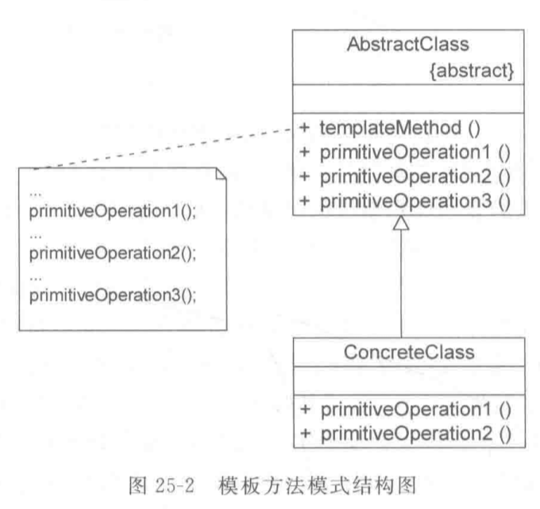

代码实现

```java
public abstract class AbstractClass {
    public void templateMethod() {
        basicMethodA();
        if (hookMethod()) {
            // ...
        }
    }
    
    public void basicMethodA() { }
    public abstract void basicMethodB() { }
    
    public boolean hookMethod() {
        return true;
    }
}

public class ConcreteClass {
    public void basicMethodB() { }
    
    // 可有可无，为了使 Hook 方法失效可以返回 false
    public boolean hookMethod() {
        return false;
    }
}
```

适用场景

1. 对一些复杂的算法进行分割，将其算法中固定不变的部分设计为模板方法和父类具体方法，而一些可以改变的细节由其子类来实现。即一次性实现一个算法的不变部分，并将可变的行为留给子类来实现。
2. 各子类中公共的行为应被提取出来并集中到一个公共父类中以避免代码重复。
3. 需要通过子类来决定父类算法中的某个步骤是否执行，实现子类对父类的反向控制。

优点

1. 在父类中形式化地定义一个算法，而由它的子类来实现细节的处理，在子类实现详细的处理算法时并不会改变算法中步骤的执行次序。
2. 是一种代码复用技术,在类库设计中尤为重要它提取了类库中的公共行为，将公共行为放在父类中，而通过其子类实现不同的行为，它鼓励用户恰当地使用继承来实现代码复用。
3. 模板方法模式可实现一种反向控制结构，通过子类覆盖父类的钩子方法来决定某特定步骤是否需要执行。
4. 在模板方法模式中可以通过子类来覆盖父类的基本方法，不同的子类可以提供基本方法的不同实现，更换和增加新的子类很方便，符合单一职责原则和开闭原则。

缺点

在模板方法模式中需要为每一个基本方法的不同实现提供一个子类，如果父类中可变的基本方法太多，将会导致类的个数增加，系统更加庞大，设计也更加抽象，此时可结合桥接模式进行设计。

### 访问者模式

概念：表示一个作用于某对象结构中的各个元素的操作访问者模式让用户可以在不改变各元素的类的前提下定义作用于这些元素的新操作。

> 用抽象的 `Visitor` 定义对元素集合的操作
>
> 用抽象的 `Element` 定义元素
>
> 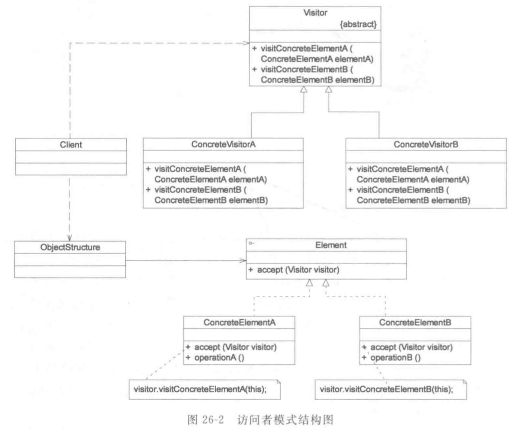

代码实现

```java
public abstract class Visitor {
    public abstract void visit(ConcreteElementA elementA);
    public abstract void visit(ConcreteElementB elementB);
    
    public abstract void visit(ConcreteElementC elementC) { }
}

public class ConcreteVisitor extends Visitor {
    public void visit(ConcreteElementA elementA) { }
    public void visit(ConcreteElementB elementB) { }
}

public abstract class Element {
    public void accept(Visitor visitor);
}

public class ConcreteElementA extends Element {
    public void accept(Visitor visitor) {
        visitor.visit(this);
    }
}

public class ObjectStructure {
    private List<Element> list = new ArrayList<Element>();
    
    public void accept(Visitor visitor) {
        Iterator i = list.iterator();
        
        while (i.hasNext()) {
            i.next().accept(visitor);
        }
    }
    
    public void addElement(Element element) { }
    public void removeElement(Element element) { }
}
```

适用环境

1. 一个对象结构包含多个类型的对象，希望对这些对象实施一些依赖其具体类型的操作。在访问者中针对每一种具体的类型都提供了一个访问操作，不同类型的对象可以有不同的访问操作。
2. 需要对一个对象结构中的对象进行很多不同的并且不相关的操作，而需要避免让这些操作 “污染” 这些对象的类，也不希望在增加新操作时修改这些类。访问者模式使得用户可以将相关的访问操作集中起来定义在访问者类中，对象结构可以被多个不同的访问者类所使用，将对象本身与对象的访问操作分离。
3. 对象结构中对象对应的类很少改变，但经常需要在此对象结构上定义新的操作。

优点

1. 增加新的访问操作时符合开闭原则。增加新的访问操作就意味着增加一个新的具体访问者类，无须修改源代码。
2. 将有关元素对象的访问行为集中到一个访问者对象中，而不是分散在个个的元素类中。类的职责更加清晰，有利于对象结构中元素对象的复用，相同的对象结构可以供多个不同的访问者访问。
3. 让用户能够在不修改现有元素类层次结构的情况下定义作用于该层次结构的操作。

缺点

1. 增加新的元素类时违背了开闭原则的要求。在访问者模式中。每增加一个新的元素类都意味着要在抽象访问者角色中增加一个新的抽象操作，并在每一个具体访问者类中增加相应的具体操作。
2.  访问者模式破坏了对象的封装性。访问者模式要求访问者对象访问并调用每一个元素对象的操作，这意味着元素对象有时候必须暴露一些自己的内部操作和内部状态，否则无法供访问者访问。
