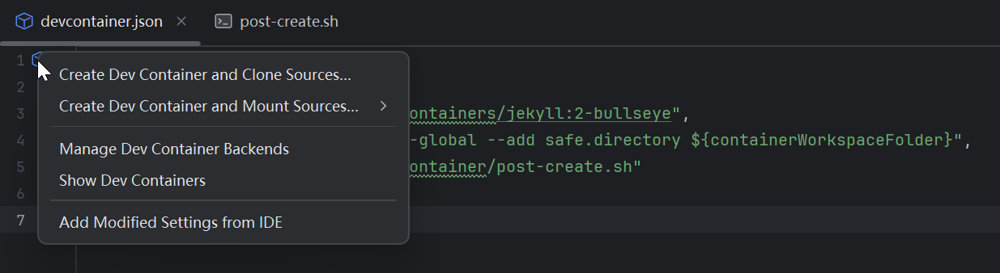
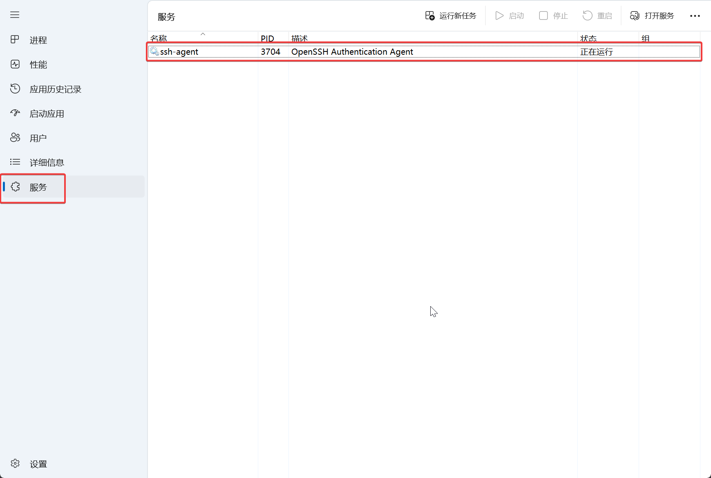
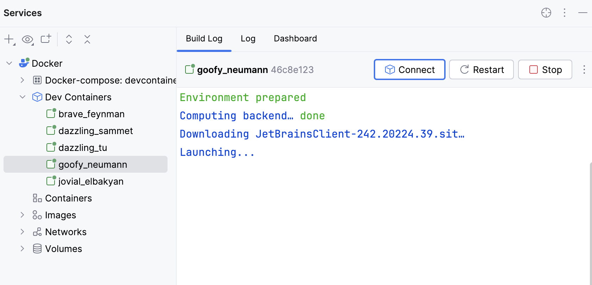
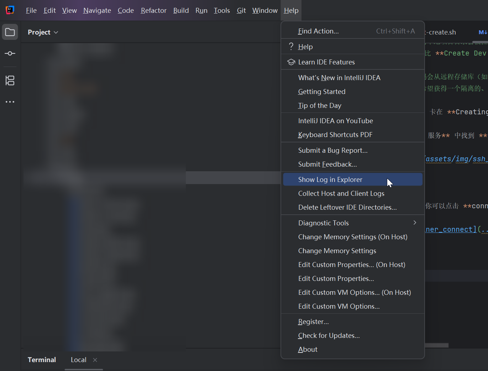

因为不想把本机的环境搞得乱七八糟，所以想到了 Dev Container 来进行开发，这样本机只需要 Git 环境和一个 IDE，其他的交给 Docker

但是不得不说，IDEA 官网的 [Dev Container 指导](https://www.jetbrains.com/zh-cn/help/idea/2025.1/connect-to-devcontainer.html#dev_container_scenarios) 过于简略，里面埋了很多坑，所以在此记录下中间走过的路，踩过的坑，以备后续翻阅

## 先决条件

- 你有一个包含 `.devcontainer` 文件夹和 `devcontainer.json` 文件的项目，该文件描述了实际的 Dev Container
  > 目前 `devcontainer.json` 文件的代码补全功能有限。 但是，以下属性是可用的：
  > - [构建属性](https://containers.dev/implementors/json_reference/#image-specific) 是受支持的
  > - [常规属性](https://containers.dev/implementors/json_reference/#general-properties)
  > - [Docker compose properties](https://containers.dev/implementors/json_reference/#compose-specific) 得到支持。
  > - [生命周期脚本](https://containers.dev/implementors/json_reference/#lifecycle-scripts)受支持。
  > - 在 [端口属性](https://containers.dev/implementors/json_reference/#port-attributes)中仅支持 label
  > - “[最低主机要求](https://containers.dev/implementors/json_reference/#min-host-reqs)” 不受支持
  > - [devcontainer.json 中的变量](https://containers.dev/implementors/json_reference/#variables-in-devcontainerjson)受到支持
  > 
  > 我的 `devcontainer.json` 是 Blog 模板自带的，比较简单：
  > ```javascript
  > {
  >     "name": "Jekyll",
  >     "image": "mcr.microsoft.com/devcontainers/jekyll:2-bullseye",
  >     "onCreateCommand": "git config --global --add safe.directory ${containerWorkspaceFolder}",
  >     "postCreateCommand": "bash .devcontainer/post-create.sh"
  > }
  >```
  > 有一个 `post-creat.sh` 用于初始化环境：
  > ```shell
  > #!/usr/bin/env bash
  > 
  > # add gem and bundle mirror.
  > gem sources --add https://mirrors.tuna.tsinghua.edu.cn/rubygems/ --remove https://rubygems.org/
  > bundle config mirror.https://rubygems.org https://mirrors.tuna.tsinghua.edu.cn/rubygems
  > 
  > if [ -f package.json ]; then
  >   bash -i -c "nvm install --lts && nvm install-latest-npm"
  >   npm i
  >   npm run build
  > fi
  > ```

- 你可以访问 [GitHub](https://github.com/)
- 你的 PC 上已安装 [Git](https://git-scm.com/) 2.20.1 或更高版本
- 你的 PC 上有一个 [正在运行的 SSH 代理](https://www.jetbrains.com/zh-cn/help/idea/2025.1/using-ssh-keys.html)
  > 在 Windows 上，当你使用 SSH URL 从 GitHub 仓库构建一个 Dev Container 时，
  > `- git clone` 操作（将 仓库 源码克隆到连接到辅助容器的 Docker 卷）无法在没有运行 SSH 代理的情况下执行，
  > **并且这种情况下，IDEA 不会停止构建并报错，而是会一直卡在 Creating Dev Container...**
- 你的 PC 上已经安装了 [Docker](https://docs.docker.com/get-docker/) ，用于承载 Dev Container
  > Docker 安装时保持默认设置，另外，因为 Docker 依赖 Linux 的 namespace 技术做隔离，所以还需要在 Windows 上安装 WSL：
  > `wsl --install` 然后等待安装成功即可
- 你的 Docker 资源满足后端的 [最低系统要求](https://www.jetbrains.com/zh-cn/help/idea/2025.1/prerequisites.html)

## 构建 Dev Container

当你一切都准备好后，可以在 IDEA 中打开 `.devcontainer` 下的 `devcontainer.json` 文件

在左侧边栏点击 蓝色箱子图标，选择 **Create Dev Container and Clone Sources...** 或者是 **Create Dev Container and Mount Sources...**



前者会从你的远程 Git 仓库中 Clone 代码，后者会把你本地的代码挂载到容器中，根据自己的需要做选择

> 挂载源代码时，你的本地项目目录会被挂载（链接）到容器中，容器内的任何更改都会反映到你的本地文件中，
> 反之亦然。 此过程比 **Create Dev Container and Clone Sources...** 操作更耗时，但对于希望在本地 IDE 中编辑文件并在容器中运行它们的开发工作流可能会有所帮助
> 
> 克隆源代码时，代码会从远程存储库（如 GitHub）克隆到容器中。 虽然此过程比 **Create Dev Container and Mount Sources...** 操作更快，但请注意，整个 Git 存储库都会被检出。
> 然而，此操作对于希望获得一个隔离的、可复现的环境而不影响本地文件的情况非常有用

在构建时，有可能卡在 卡在 **Creating Dev Container...** 不动，这是因为你 PC 上的 SSH-Agent 没有启动

在 **任务管理器 -> 服务** 中找到 **ssh-agent** 手动启动即可



## 连接容器

等待容器创建好之后，你可以点击 **connect** 连接容器，进行开发



## IDEA 故障解决

如果遇到 IDEA 长时间没有反应，或者经常崩溃，可以检查下 IDEA 的日志

看看是哪里有问题，日志定位方式如下图


