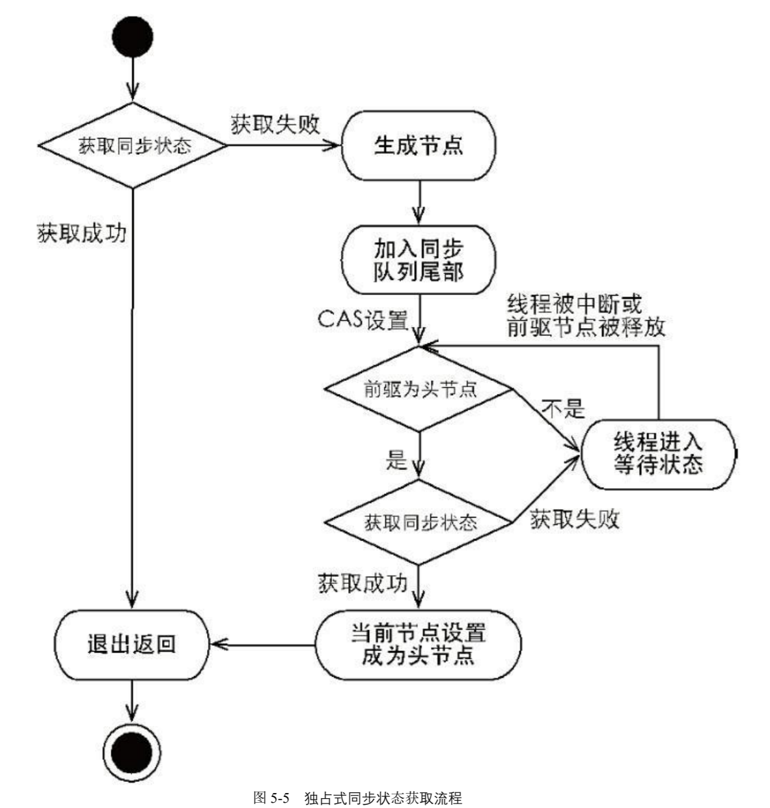
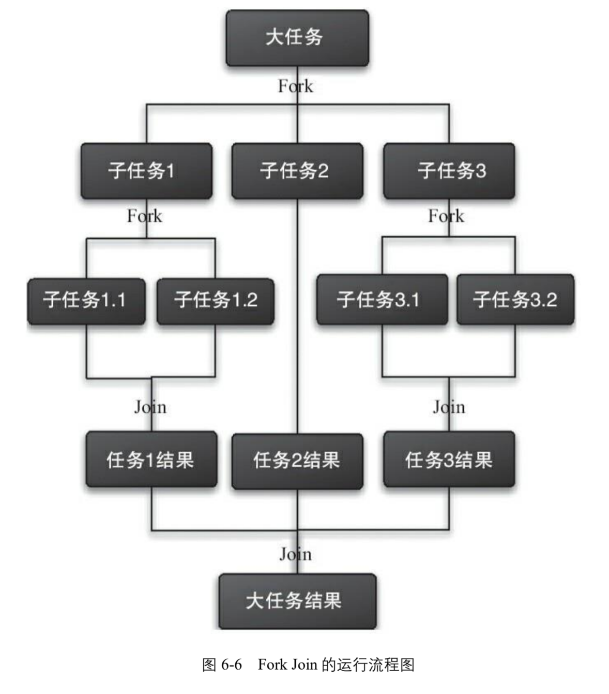
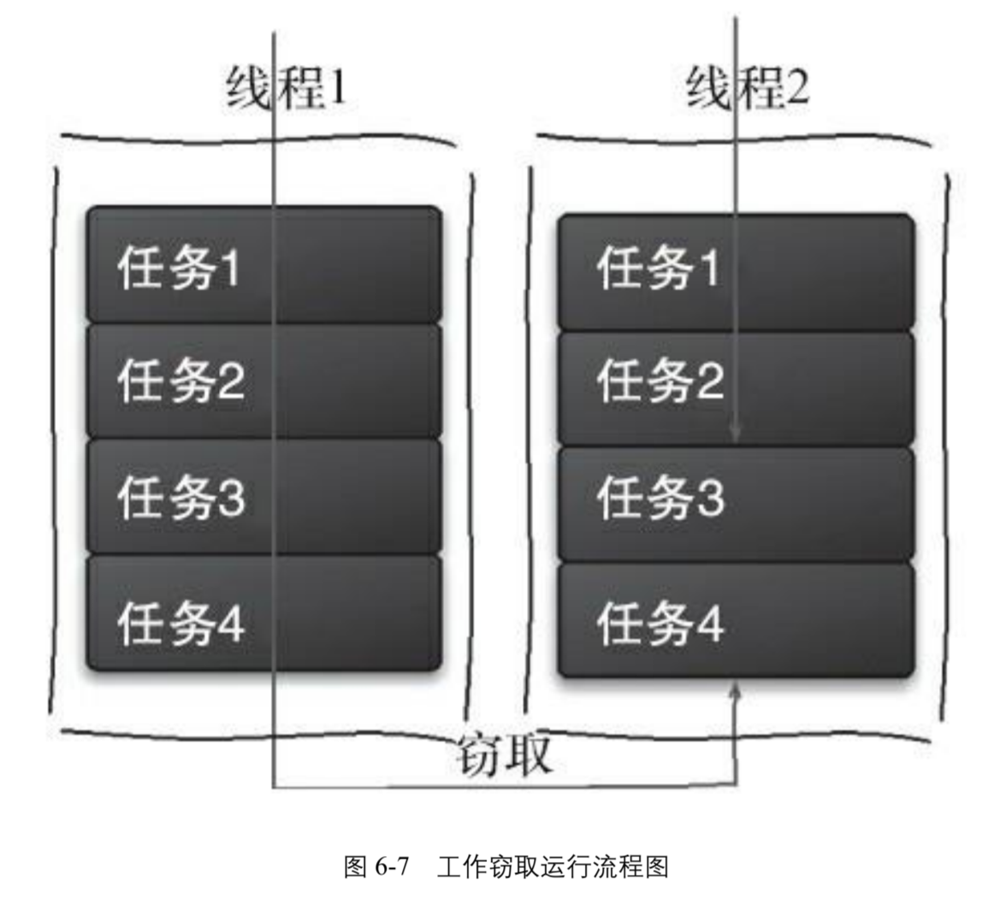

# 《Java 并发编程的艺术》阅读笔记

## 并发编程的问题

- **多线程不一定更快**
  
    线程越多，上下文切换就越频繁，CPU 用于执行计算任务的时间就越短。
    
- **减少上下文切换的办法**
    
    - **降低锁粒度。**锁竞争会导致抢锁失败的线程被挂起，产生一次上下文切换。所以通过降低锁的粒度，减少争抢同一把锁的线程数，可以减少上下文切换。
    - **CAS 代替加锁。**CAS 操作不涉及锁竞争，也可以减少上下文切换。不过需要注意 “ABA” 和 CPU 空转的问题。
    - **谨慎创建线程。**减少创建线程的数量，进而减少上下文切换。
    - **使用协程。**对于 CPU 密集型的任务，使用协程可以避免线程切换导致的上下文切换。
- **避免死锁的办法**
  
    从死锁的四个必要条件入手：
    
    - **互斥占有共享资源**
    - **占有状态请求其他共享资源**
      
        当需要用到多把锁时，一次性把所有的锁都拿到，中间某个锁获取失败则直接把已经获取的锁全部释放，破坏 “占有请求” 的状态。这其实也破坏了 “占有不可剥夺” 的状态。
        
    - **占有期间共享资源不可剥夺**
      
        使用 `lockInterruptibly()` 方法，线程在等待状态也可以响应中断，从而退出等待状态，有机会释放已经持有的资源。
        
    - **循环等待共享资源**
      
        当需要用到多把锁时，以确定的顺序加锁，避免出现循环等待。
    
- **并发编程需要考虑软硬件资源的限制**
  
    10 个线程可能对于 8 核 CPU 来说不多，但是对于 2 核 CPU 来说可能就有点多了；服务器的带宽只有 2Mb/s，某个资源的下载速度是 1Mb/s，系统启动 10 个线程下载资源，下载速度不会变成 10Mb/s；有数据库操作时，如果 SQL 语句执行非常快，而线程的数量比数据库连接数大很多，则某些线程会被阻塞，等待数据库连接。
    

## Java 并发机制的底层原理

- `volatile` **关键字原理**
  
    底层使用 `LOCK` 指令作为 `StoreLoad` 内存全屏障，禁止局部指令重排，使屏障指令之前的操作一定先于屏障指令之后的操作完成，其他 CPU 嗅探到总线上发生共享变量的修改之后，就会把自身对应的缓存行设置为无效，后续读取的时候，重新从主存中加载，从而实现实现共享资源的内存可见性。
    
    `Monitor` 锁的释放与 volatile 写具有相同的内存语义，锁的获取与 volatile 读具有相同的内存语义，这意味着，当释放锁时，临界区内的所偶修改都会被刷新到主存中，获取锁时，会从主存更新所有的共享变量。
    
- `synchronized` **关键字原理**
  
    实际上是通过修改锁对象对象头中 `MarkWord` 实现可升级锁。
    
    第一个线程进入临界区时，会使用 CAS 操作设置偏向锁和偏向线程 ID，再次进入临界区时，无需重复加锁，第二个线程进入临界区时，如果锁竞争失败，会把锁升级为轻量级锁状态，第三个线程进入临界区时，会尝试自旋竞争锁，如果失败，会把锁升级为重量级锁状态。
    
    重量级锁状态时，修饰同步代码块使用 `monitorenter` 和 `monitorexit`，修饰同步方法使用 `ACC_SYNCHRONIZED` 标志，两种方式最终都是通过获取对象关联的 `Monitor` 作为锁对象的。
    
- **原子类的原理**
  
    处理器底层通过 `LOCK` 前缀指令的总线锁和缓存锁保证缓存一致性，并提供了 `CMPXCHG` 指令用于 CAS 操作，这是原子类的主要实现手段。
    
    使用这个工具时，需要注意 ”ABA“ 问题、CPU 开销问题和锁粒度问题。 
    
    - 解决 “ABA” 问题，可以增加版本号或者时间戳控制，保证相同的值版本不同。
    - 缓解 CPU 开销问题，可以尽量缩短临界区的执行时间。
    - 处理锁粒度问题，可以把多个变量合并成一个变量用。或者直接使用悲观锁。

## Java 内存模型

- **线程之间的通信方式**
    - **共享内存**：通过共享 `volatile` 变量或者并发安全的集合来通信。这是 Java 的主要方式。
    - **消息传递**：通过消息队列或者线程池的阻塞队列，提供生产者和消费者之间的消息通信。
- **Java 内存模型是什么**
  
    规定了线程之间的通信或者协作方式，通过禁止特定情况下的编译器和 CPU 指令重排，决定了一个线程对共享变量的修改何时对其他线程可见，提供了共享变量的内存可见性保证
    
- **指令重排的类型**
    - **编译器级别的语句重排**：不改变单线程语义的前提下，重排列语句的执行顺序。
    - **CPU 级别的指令重排**：不破坏数据依赖的前提下，并行执行多条指令。
    - **内存级别的指令重排**
- **内存屏障的类型**
    - `LoadLoad`：保证屏障前的 `Load` 指令先于屏障后的 `Load` 指令执行
    - `LoadStore`：保证屏障前的 `Load` 指令先于屏障后的 `Store` 指令执行
    - `StoreStore`：保证屏障前的 `Store` 指令先于屏障后的 `Store` 指令执行
    - `StoreLoad`：保证屏障前的 `Store` 指令先于屏障后的 `Load` 指令执行
    
    X86 处理器的内存架构和 MESI 协议天然保证了 `LoadLoad`、`LoadStore`、`StoreStore` 的语义，但是，由于写缓冲区的存在，`StoreLoad` 的语义是没有被保证的，不过处理器提供了额外的指令（主要是 `LOCK`，很少用 `MFENCE`）让程序手动实现 `StoreLoad` 语义。
    
    Java 为了保证可移植性，不会只使用 `StoreLoad` 屏障，而是这四个屏障组合使用，对于 X86 处理器来说，除了 `StoreLoad` 屏障之外的屏障会被忽略。
    
- **happens-before 规则**
  
    JSR-133 内存模型使用 happens-before 规则，规定一个操作在什么情况下对另一个操作是可见的，如果 A happens-before B，那么 A 操作对 B 操作是可见的。
    
    > 当我们说 A 操作可见于 B 操作时，我们指的是 A 的操作结果可见于 B，并不意味着 A 的执行先于 B 发生。
    > {: .prompt-tip }
    
    一共有 8 个，但与开发者关系比较大的有 4 个规则：
    
    - **程序顺序规则**：同一个线程中，前面的操作 happens-before 于后面的操作
    - **监视器锁规则**：对一个 `Monitor` 锁的解锁 happens-before 于后续的加锁
    - **volatile 变量规则**：对一个 volatile 变量的写 happens-before 于后续的读
    - **传递性规则**：如果 A happens-before B，B happens-before C，那么 A happens-before C
- **顺序一致性模型**
  
    顺序一致是指，每个线程的每个操作对其他线程都是可见的，这样，所有线程看到的系统全局的操作顺序是一致的，这种情况下，每个线程都能得到预期内的执行结果。
    
    JMM 不对没有正确同步的程序保证顺序一致性，还未来得及将修改刷新到主存的操作对其他线程是不可见的，所以不同的线程看到的系统全局的操作执行顺序是不一致的，这种情况下，线程肯能会得到预期之外的执行结果。
    
- **`final` 字段的内存语义**
  
    通过 `StoreStore` 和 `LoadLoad` 屏障，禁止 `final` 字段的写入溢出到构造函数之外。不过在 X86 处理器下，这两个内存屏障都会被忽略，相当于没有使用内存屏障。
    
- **经典的 “双检锁” 方案需要注意 volatile 关键字修饰**
  
    为了在并发竞争激烈的场景下减少悲观锁的性能开销，经典的方案是 “双检锁”：
    
    ```java
    public class DoubleCheckedLocking {                     // 1
        private static Instance instance;                   // 2
        public static Instance getInstance() {              // 3
            if (instance == null) {                         // 4:第一次检查
                synchronized (DoubleCheckedLocking.class) { // 5:加锁
                    if (instance == null)                   // 6:第二次检查
                        instance = new Instance();          // 7:问题的根源出在这里
                }                                           // 8
            }                                               // 9
            return instance;                                // 10
        }                                                   // 11
    }                                                       // 12
    ```
    
    这种方案的根源在于 `new Instance()` 的操作不是原子的：
    
    ```java
    memory = allocate();    // 1：分配对象的内存空间 
    ctorInstance(memory);   // 2：初始化对象
    instance =memory;       // 3：设置 instance 指向刚分配的内存地址，即引用赋值
    ```
    
    初始化对象和引用赋值有可能被指令重排，所以 “双检锁” 方案的第四行代码有可能检查到的是一个尚未被初始化的对象，然后直接返回这个对象，导致后续可能出现 NPE 问题。
    
    不过，只需要在 `instance` 变量前加 `volatile` 关键字修饰，JMM 会保证第七行的引用赋值，即对 `volatile` 变量的写的结果，一定对第四行的判空操作是可见。
    
    ```java
    public class DoubleCheckedLocking {                     // 1
        private static volatile Instance instance;          // 2:使用 volatile 修饰
        public static Instance getInstance() {              // 3
            if (instance == null) {                         // 4:第一次检查
                synchronized (DoubleCheckedLocking.class) { // 5:加锁
                    if (instance == null)                   // 6:第二次检查
                        instance = new Instance();          // 7:问题的根源出在这里
                }                                           // 8
            }                                               // 9
            return instance;                                // 10
        }                                                   // 11
    }                                                       // 12
    ```
    
- **基于类的初始化锁也可以实现懒汉式单例模式**
  
    这种方式利用了 JVM 内部的类初始化锁，保证了同一时刻只有一个线程初始化这个类：
    
    ```java
    public class InstanceFactory {
        private static class InstanceHolder {
            public static Instance instance = new Instance();
        }
        public static Instance getInstance() {
            return InstanceHolder.instance;   // 这里将导致 InstanceHolder 类被初始化
        }
    }
    ```
    
    在这种模式下，引用的赋值会在类的初始化阶段进行，受到类初始化锁的保护，即使发生指令重排，对于其他线程来说也是不可见的。
    

## Java 并发编程

- **不要直接给线程设置优先级**
  
    所有线程的默认优先级是 5，通过 `setPriority()` 直接设置的优先级很有可能会被 OS 忽略。
    
- **线程的状态**
    - `NEW`：线程已创建，但尚未调用 `start()` 方法
    - `RUNNABLE`： 可运行态，包含了 OS 线程状态的就绪态和运行态
    - `BLOCKED`：阻塞态，线程阻塞于锁
    - `WAITING`：等待态，等待其他线程的通知
    - `TIME_WAITING`：超时等待态，带超时时间的等待态
    - `TERMINATED`：终止态，线程已执行结束
- **子线程会继承父线程的部分属性**
  
    优先级、守护线程标志、`ContextClassLoader` 和 可以继承的一部分 `ThreadLocal` 变量。
    
- **线程的中断机制通常用来优雅地结束线程**
  
    `target.interrupt()` 可以向目标线程发起中断，目标线程通过 `isInterrupted()` 或者捕获 `InterruptedException` 来判断当前线程是否被中断过，需要注意捕获异常的方式会清除中断标志，需要在异常处理结束后重新抛出或者重新设置中断标志位，让中断向上传播，以免出现预期之外的行为。
    
- **使用** `wait()` **和** `notify()` **实现简单场景下的线程同步**
  
    `wait()` 会把让当前线程释放锁，并把自己添加到等待队列中，设置状态为 `WAITING`，`notify()` 会把等待队列种的一个线程移动到同步队列中，设置状态为 `BLOCKED`。
    
    Java 官方文档明确要求，任何对 `Object.wait()` 的调用都**必须**放在一个循环中，以检查线程被唤醒后的条件是否满足。
    
    ```java
    // 经典的超时等待编程范式
    public synchronized Object get(long timeout) {
        long future = System.currentTimeMillis() + timeout;
        long remaining = timeout;
        Object result = null;
        while ((result == null) && remaining > 0) {
            wait(remaining);
            remaining = future - System.currentTimeMillis();
        }
        return result;
    }
    ```
    
- **使用** `ThreadLocal` **在多个线程之间隔离共享变量**
  
    每个 `Thread` 内部都有 `ThreadLocal.ThreadLocalMap` 保存了 `ThreadLocal → Copied Value` 的映射。在设置 `ThreadLocal` 变量时，会获取当前线程的 `ThreadLocalMap`，然后填充映射。
    
    需要注意 `ThreadLocal` 的滥用容易导致内存泄露问题。根本原因在于，`ThreadLocalMap` 中的 Key 是弱引用的，只要被 JVM 扫描到就会回收掉，但 Entry 是强引用的，这就会导致 Key 已经是 `null` 了，但是 Entry 还是无法被释放。
    
    解决这个问题需要在线程结束时显式调用 `threadLocalInstance.remove()` 方法清洗资源。
    

## Java 中的锁

- **不要在** `try` **块中获取锁**
  
    如果获取锁的中途发生异常，会导致锁 `finally` 中释放的锁的操作抛出另外的异常，掩盖了原本的异常信息。
    
- **AQS 的目的是为了给开发者提供更灵活的锁的实现基础**
  
    AQS 和 `Monitor` 锁一样，可以让多线程排队、阻塞、等待、唤醒，但是 `Monitor` 锁只能通过 `synchronized` 关键字使用，不够灵活，在复杂场景下的编程非常繁琐。
    
    于是 Java 官方就把多线程排队、阻塞、等待、唤醒的机制单独抽象到 AQS 里面，开发者可以自己实现 AQS 的子类，实现更加灵活的锁。并发包的作者（Doug Lea）期望它能够成为实现大部分同步需求的基础。
    
    Java 官方也提供了 AQS 的实现，比如：`Sync`、`FairSync` 和 `NonfairSync`，用于实现 `ReentrantLock`、`ReentrantReadWriteLock`、`CountDownLatch`、`Semaphore`
    
- **AQS 的原理是什么**
  
    内部维护了一个 volatile 变量 `state`，用于表示锁的当前状态，在不同的实现里面，这个状态有不同的语义，在 `ReentrantLock` 里面代表重入次数，在 `CountDownLatch` 里面代表计数次数，在 `Semaphore` 里面代表公共资源的数量。
    
    还维护了一个 volatile 双向链表，作为同步队列，用于维护当前的锁竞争情况。
    
    里面的 `Condition` 实现了等待队列的语义。
    
    它使用了模板方法模式，自身没有必须子类实现的抽象方法，子类可以根据自己的需要，实现那些 `protect` 修饰的方法：
    
    - `tryAcquire`：尝试获取独占锁
    - `tryRelease`：尝试释放独占锁
    - `tryAcquireShared`：尝试获取共享锁
    - `tryReleaseShared`：尝试释放共享锁
    - `isHeldExclusively`：判断当前线程是否独占地持有资源，只有在使用 `Condition`（条件队列）时才需要实现。
    
    使用者只需要使用 final 方法：`acquire(int)`、`release(int)`，内部会自己调用开发者自己实现的上述几个方法，完成锁的正确获取和释放。
    
- **AQS 的加锁流程**
  
    
    
- `LockSupport` **的** `park` **方法可以传入 blocker 参数用于辅助诊断**
  
    不过通常我们不会直接使用这个类。
    
    JVM 在 Linux 中使用 `pthread_cond_wait` 系统调用实现，unpark 使用 `pthread_cond_signal` 系统调用实现。
    

## Java 并发容器和框架

- [**Java 并发容器的解析**](https://www.notion.so/Java-2786203f898c808bb556dd5328a1866a?pvs=21)
- **Fork/Join 框架可以用来执行那些可以逐层拆分的任务**
  
    
    
- **工作窃取可以充分利用 CPU 资源**
  
    假如我们需要做一个比较大的任务，可以把这个任务分割为若干互不依赖的子任务，为了减少线程间的竞争，把这些子任务分别放到不同的队列里，并为每个队列创建一个单独的线程来执行队列里的任务，线程和队列一一对应。
    
    比如 A 线程负责处理 A 队列里的任务。但是，有的线程会先把自己队列里的任务干完，而其他线程对应的队列里还有任务等待处理。
    
    干完活的线程与其等着，不如去帮其他线程干活，于是它就去其他线程的队列里窃取一个任务来执行。而在这时它们会访问同一个队列，所以为了减少窃取任务线程和被窃取任务线程之间的竞争，通常会使用双端队列，被窃取任务线程从双端队列的头部拿任务执行，而窃取任务的线程从双端队列的尾部拿任务执行。
    
    
    
- **使用** `ForkJoinPool` **时需要注意分治阈值的设置**
  
    任务粒度太小可能会导致分治过深，任务数量爆炸，进而引发内存溢出的问题。
    
- **定义** `RecursiveTask` **或者** `RecursiveAction` **时可以直接让本线程执行其中一个子任务**
  
    ```java
    public static class MyTask extends RecursiveTask<Integer> {
        private static final int LIMIT = 2;
        private int start, end;
    
        public MyTask(int start, int end) {
            this.start = start;
            this.end = end;
        }
    
        @Override
        protected Integer compute() {
            int sum = 0;
            if (end - start <= LIMIT) {
                for (int i = start; i <= end; i++)
                    sum += i;
            } else {
                int mid = (start + end) / 2;
                MyTask leftTask = new MyTask(start, mid);
                MyTask rightTask = new MyTask(mid + 1, end);
                rightTask.fork();
                sum = leftTask.compute() + rightTask.join(); // 直接让本线程计算左子任务
            }
            return sum;
        }
    }
    ```
    
- `ForkJoinPool` **的原理是什么**
  
    `ForkJoinPool` 内部维护了一个指定并行度（默认等同于 CPU 核心数）的 `WorkQueue` 数组，每个 `WorkQueue` 封装了一个 `ForkJoinTask` 数组和对应的 `ForkJoinWorkerThread`。
    
    已有的 `ForkJoinWorkerThread` 不断地循环从自己的 `ForkJoinTask` 队头取任务，如果取不到，则随机从其他 `ForkJoinTask` 队尾窃取任务，如果窃取不到则 `park()`  自己。
    
    新任务到来时，会选择加入当前线程对应的工作队列，或者一个临时的外部队列。然后会尝试唤醒空闲线程或者创建新的线程。
    

## Java 中的线程池

- **性质不同的任务可以用不同规模的线程池分开处理**
  
    CPU 密集型任务应配置尽可能少的线程，如配置 Ncpu+1 个线程的线程池。
    
    由于 IO 密集型任务线程并不是一直在执行任务，则应配置尽可能多的线程，如 2*Ncpu。
    
    混合型的任务，如果可以拆分，将其拆分成一个 CPU 密集型任务和一个 IO 密集型任务，只要这两个任务执行的时间相差不是太大，那么分解后执行的吞吐量将高于串行执行的吞吐量。
    
    如果这两个任务执行时间相差太大，则没必要进行分解。可以通过 `Runtime.getRuntime().availableProcessors()` 获得当前设备的 CPU 个数。
    
- **可以使用自定义线程池记录任务的执行时间等信息**
- `CompletableFuture` **的实现原理**
  
    内部使用 CAS 操作维护了两个 volatile 变量，一个用来存任务执行结果的 `Object` 对象，还有一个用来封装依赖于当前任务的其他任务的 `Completion` 链表。
    
    当我们用 `thenApply`、`thenAccept` 等方法编排任务的时候，其实就是在构造一个 `Completion` 树，树中任意节点的任务执行完之后，调用 `postComplete()` 方法触发所有直接子节点的运行。