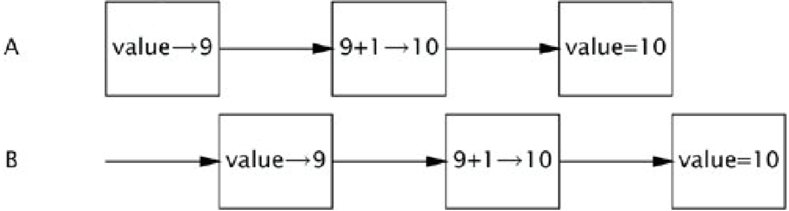

**目前的观感**

东西是好的，整体叙事结构也合理，但是每章内部的叙事逻辑有点混乱，加上形式化描述的使用，读起来不好读，心智负担比较大。需要通读全书之后，仔细梳理一番。

---

这本书的整体结构如下：

- Chapter 1：介绍并发解决什么问题，又带来什么问题。
- Part I：介绍并发和线程安全的理论，讲解如何用并发库构建线程安全的类。
  - Chapter 2&3：整本书的理论基石，探讨关于如何避免并发问题、如何构建线程安全的类以及如何确认线程安全的理论。
  - Chapter 4：探讨如何用线程安全的类构建更大的线程安全的类。
  - Chapter 5：探讨并发库提供的并发工具，包括线程安全的集合和同步器。
- Part II：讲解如何利用线程来提高并发应用的吞吐量和响应速度。
  - Chapter 6：探讨如何识别可并行化的任务并使用 task-execution 框架执行它。
  - Chapter 7：探讨如何让任务和线程在正常结束前提前终止，程序处理取消与关闭的方式，往往是区分真正稳健的并发应用程序与仅能勉强运行的并发程序的关键要素之一。
  - Chapter 8：探讨 task-execution 框架的一些高级特性。
  - Chapter 9：探讨在单线程子系统中提高响应速度的技术。
- Part III：讲解如何确保并发程序在可接受的性能下能确实按照期望运行。
  - Chapter 10：探讨如何防止程序因活跃性故障而无法继续执行。
  - Chapter 11：探讨如何提高并发代码的性能和可扩展性。
  - Chapter 12：探讨如何测试并发代码的正确性和性能。
- Part IV：讲解如何使用锁机制、原子变量、无锁算法和开发自定义同步器。

## Chapter 1 - Introduction

使用并发的好处包括：更好地利用多核处理器、简化复杂任务的建模、简化异步事件的处理、提升应用响应速度。

并发带来的问题包括：

- **线程安全问题**：多个线程的执行顺序是随机的，执行顺序的不安全（不安全序列）会导致意外的结果。

  ```java
  /**
   * 经典的并发问题案例
   * 
   * 这段代码期望每个线程得到唯一的 value，但实际执行起来却不能达到目的
   */
  public class UnsafeSequence {
      private int value;
      
      public int getNext() {
      	return value++;
  	}
  }
  ```

  问题的核心在于 `value++` 看似是一个操作，但实际上会被编译成三个操作：读值、改值、写值。

  如果某一时刻两个线程 A 和 B 读到了相同的 value，那么它们 `getNext()` 会得到相同的值。

  

- **活跃性故障问题**：线程的活跃性指的是一个线程最终能够取得进展并完成其任务的能力。单线程活跃性问题的形式是死循环。多线程的活跃性问题的形式则可能是死锁、饥饿和活锁问题。这种问题往往依赖线程的执行顺序，不好复现。
- **性能问题**：多线程的上下文切换和线程同步会引入额外的开销，这可能会导致应用程序的请求服务时间和响应时间延长、吞吐量降低、资源消耗增加和拓展性降低等问题。

## Chapter 2 - Thread Safety

这一章讲了以下概念：

- 什么是线程安全
- 原子性
- 锁
- 用锁保护状态
- 活跃性和性能

### 什么是线程安全？

如果一个对象是线程安全的，那么任何操作序列（对公共方法的调用以及对公共字段的读取或写入）都不应违反其任何不变量或后置条件。对线程安全类的实例执行的任何顺序或并发的操作都不会导致该实例处于无效状态。

> 不变量不是指常量，而是指对象状态的逻辑断言。
>
> 在对象生命周期的任何稳定点（即方法调用之间）都必须为真。它是对象 “有效状态” 的定义。
{: .prompt-info }

编写线程安全的代码，其核心在于控制对共享可变状态的访问。

> 非正式地讲，所谓状态，就是指对象及其引用对象的实例变量和静态变量。
{: .prompt-info }

可以从两个方面实现线程安全：

- **对于访问者**：使用同步技术控制线程的对共享变量的访问顺序。
- **对于被访问者**：使用访问修饰符控制变量的共享范围和可变性。

从控制变量共享范围的角度上讲，良好的封装有助于实现线程安全的对象。

更进一步地，无状态的对象总是线程安全的。

```java
/**
 * 这个类没有状态，它总是线程安全的
 */
public class StatelessFactorizer implements Servlet {
    public void service(ServletRequest req, ServletResponse resp) {
        BigInteger i = extractFromRequest(req);
        BigInteger[] factors = factor(i); 
        encodeIntoResponse(resp, factors);
    }
}
```

---

### 原子性

若从执行操作 A 的线程视角观察，当另一个线程执行操作 B 时，要么能观察到 B 已全部执行完成的状态，要么完全观察不到 B 的任何执行效果，则称操作 A 与 B 彼此之间具有原子性。若某个操作对于所有作用于同一状态的操作（包括其自身）都满足原子性，则该操作本身是原子操作。

大多数竞态条件的特征是：利用可能过时的观察结果做出决策或进行计算。像 `value++` 这样的 “读、改、写” 操作就是典型的竞态条件。

```java
public class LazyInitRace {
    private ExpensiveObject instance = null; 
    public ExpensiveObject getInstance() {
        // 这里的先检查后决策是典型的竞态条件
        if (instance == null)
        	instance = new ExpensiveObject(); 
        return instance;
    }
}

public class UnsafeCountingFactorizer implements Servlet {
    private long count = 0;
    
    public long getCount() { return count; } 
    
    public void service(ServletRequest req, ServletResponse resp) {
        BigInteger i = extractFromRequest(req);
        BigInteger[] factors = factor(i);
        // 这里的 ++count 操作是典型的竞态条件
        ++count;
        encodeIntoResponse(resp, factors);
    }
}
```

可以使用原子类实现原子操作。

```java
public class CountingFactorizer implements Servlet {
    // 使用原子类
    private final AtomicLong count = new AtomicLong(0);
    
    public long getCount() { return count.get(); }
    
    public void service(ServletRequest req, ServletResponse resp) {
        BigInteger i = extractFromRequest(req);
        BigInteger[] factors = factor(i); 
        // 执行原子操作
        count.incrementAndGet();
        encodeIntoResponse(resp, factors);
	}
}
```

### 锁

需要维护多个共享变量时，仅引入额外的原子类并不能使达到线程安全的目的。

```java
/**
 * 因数分解器，它会缓存上次因数分解的结果
 * 这个例子使用两个原子变量来分别维护两个共享变量，但是会产生预期之外的结果
 */
public class UnsafeCachingFactorizer implements Servlet {
    private final AtomicReference<BigInteger> lastNumber = new AtomicReference<BigInteger>();
    private final AtomicReference<BigInteger[]> lastFactors = new AtomicReference<BigInteger[]>();
    
    public void service(ServletRequest req, ServletResponse resp) {
        BigInteger i = extractFromRequest(req);
        if (i.equals(lastNumber.get()))
        	encodeIntoResponse(resp, lastFactors.get() ); 
        else {
            BigInteger[] factors = factor(i); 
            // 这两个操作各自是原子的，但是一起出现时，不代表也是原子的，仍然会有并发问题
            lastNumber.set(i);
            // 在这个稳定点，不变量被破坏，实例处于无效状态
            lastFactors.set(factors); 
            encodeIntoResponse(resp, factors);
        }
    }
}
```

Java 内置了 `synchronized` 关键字作为互斥锁。

可以通过传入不同的锁对象和控制同步代码块的大小来控制锁的粒度。粒度过粗的锁会导致程序的性能下降。

```java
/**
 * 在实例方法上使用 synchronized 关键字，以当前对象的监视器作为锁对象
 */
public class SynchronizedFactorizer implements Servlet {
    @GuardedBy("this") private BigInteger lastNumber;
    @GuardedBy("this") private BigInteger[] lastFactors;
    
    // synchronized 关键字直接作用在方法上，强制所有线程串行化执行此方法，性能较差
    public synchronized void service(ServletRequest req, ServletResponse resp) {
        BigInteger i = extractFromRequest(req); 
        if (i.equals(lastNumber))
        	encodeIntoResponse(resp, lastFactors); 
        else {
            BigInteger[] factors = factor(i); 
            lastNumber = i;
            lastFactors = factors; 
            encodeIntoResponse(resp, factors);
        }
    }
}
```

`synchronized` 锁是可重入的，这意味着当持有锁的线程再次进入同步代码块时不会被阻塞。

```java
public class Widget {
    public synchronized void doSomething() {
    }
}
...
/**
 * 如果不可重入，这个例子会死锁，但 synchronized 锁是可重入的，所以不会死锁
 */
public class LoggingWidget extends Widget {
    public synchronized void doSomething() {
        System.out.println(toString() + ": calling doSomething"); 
        // 此处会尝试重入
        super.doSomething();
    }
}
```

### 用锁保护状态

对于那些可被多个线程访问的共享变量，对这些变量的所有访问操作都必须在同一把锁的保护下进行。在这种情况下，我们称该变量由该锁所保护。

对于每个涉及多个共享变量的不变量，该不变量的所有变量都必须由同一把锁保护。

多个原子操作的直接组合并不会形成一个大的原子操作 ，还需要额外借助锁来把这些原子操作的组合原子化。

### 活跃性和性能

线程的活跃性指的是一个线程最终能够取得进展并完成其任务的能力。而性能则包含请求服务时间、响应时间、吞吐量等。

不恰当的同步操作会导致大量线程被阻塞，导致这些被阻塞线程的活跃性降低。整个应用的响应时间和吞吐量等指标也会变差。

使用锁时，需要考虑这些问题：

- 应该避免在锁中执行耗时操作。

- 应该避免锁的粒度过大。

- 在性能可以接受的情况下，不要过早地优化锁，因为锁的优化往往会破坏代码的简洁性，从而导致其安全性受到影响。

  > 代码过于复杂是线程安全性问题的关键因素之一。
  {: .prompt-warning }

```java
/**
 * 这个例子降低了锁的粒度，但是代码变得不再简洁，增加了理解成本
 */
public class CachedFactorizer implements Servlet {
    @GuardedBy("this") private BigInteger lastNumber;
    @GuardedBy("this") private BigInteger[] lastFactors;
    @GuardedBy("this") private long hits;
    @GuardedBy("this") private long cacheHits;
    
    public synchronized long getHits() {
        return hits; 
    }
    
    public synchronized double getCacheHitRatio() {
    	return (double) cacheHits / (double) hits;
    }
    
    public void service(ServletRequest req, ServletResponse resp) {
    	BigInteger i = extractFromRequest(req);
    	BigInteger[] factors = null; 
        synchronized (this) {
    		++hits;
            if (i.equals(lastNumber)) {
    			++cacheHits;
    			factors = lastFactors.clone();
    		}
    	}
    	if (factors == null) {
    		factors = factor(i); 
            synchronized (this) {
    			lastNumber = i;
    			lastFactors = factors.clone();
    		}
    	}
        encodeIntoResponse(resp, factors);
    }
}
```

## Chapter 3 - Sharing Object

本章讨论了以下问题：

- 可见性
- 发布和逃逸
- 线程封闭
- 不可变性
- 安全发布

---

### 可见性

`synchronized` 关键字的作用不仅在于它可以保证多个操作的原子性，还在于它可以保证共享变量的可见性。

共享变量的可见性问题是指：线程在修改自身工作内存的共享变量之后，不会立刻将之刷新到共享内存，此时修改后的变量对于其他线程就是不可见的，当修改后的共享变量被刷新到共享内存时，它对于其他线程才首次变得 “可见”。

```java
public class NoVisibility {
    private static boolean ready; 
    private static int number;
    
    private static class ReaderThread extends Thread {
        public void run() {
            while (!ready)
            	Thread.yield();
            System.out.println(number);
        }
    }
    
    public static void main(String[] args) {
        new ReaderThread().start();
        // 这两个修改会保留在主线程的工作内存，对 ReaderThread 是不可见的，ReaderThread 看到的始终是旧的值
        number = 42;
        ready = true;
        // synchronized 关键字修饰的代码块中的所有修改，在退出代码块时都会被刷新到共享内存，保证了可见性
        synchronized (Main.class) {
            number = 42;
            ready = true;
        }
    }
}
```

保证共享变量的可见性，是我们需要使用锁的另一个原因。

Java 还提供了另一个用于保证可见性的工具：`volatile` 变量。

但是 `volatile` 变量无法保证并发操作的有序性，是一种比较弱的同步机制。

### 发布和逃逸

发布是指将对象或对象的状态的访问权限公开（非私有）。逃逸是指本不应该被发布的对象被意外公开的情况。

```java
// 最明目张胆的发布方式是将对象存储在 pinlic static 引用中，任何对象和线程都可以访问这个对象
public static Set<Secret> knownSecrets; 

public void initialize() {
	knownSecrets = new HashSet<Secret>();
}

---
    
// 本应该是私有的 states，通过 getStates() 被发布了，也就是说 states 发生了逃逸
class UnsafeStates {
	private String[] states = new String[] {"AK", "AL" ...};
    public String[] getStates() { return states; }
}; 

---

// 另一种比较隐蔽的逃逸方式，当 EventListener 这个内部类被发布时，ThisEscape 的 this 引用也会被隐式发布
public class ThisEscape {
    public ThisEscape(EventSource source) {
        source.registerListener(new EventListener() {
            public void onEvent(Event e) {
                doSomething(e); // 这里隐含使用了 ThisEscape.this，此时 ThisEscape 尚未完全初始化，处于失效状态
            }
    	});
    }
    
    private void doSomething(Event e) {
        // 可能依赖尚未初始化的状态
    }
}

// 修复方式是使用工厂方法，通过私有化构造方法，使得只有构造函数执行完毕的有效状态可以被暴露
public class SafeListener {
    private final EventListener listener; 
    
    private SafeListener() {
    	listener = new EventListener() {
            public void onEvent(Event e) {
                doSomething(e);
            }
        };
    }
   
    public static SafeListener newInstance(EventSource source) {
    	SafeListener safe = new SafeListener();
    	source.registerListener(safe.listener);
        return safe;
    }
}
```

只要一个私有状态可以通过非私有引用或者方法访问，那么这个私有状态就发生了逃逸，实际上就是发布的。

一旦状态发生了逃逸，那么不论外部线程是怎么访问这些逃逸状态的，都会增加发生并发问题的概率。

### 线程封闭

线程封闭是指将对象的访问权限限制在单个线程之内的技术。

只要一个对象只被一个线程访问，那么这个对象即使没有实现同步机制，因为不存在竞争，所以也可以实现线程安全。

线程封闭的一个特殊场景是堆栈封闭。就是指方法内部的局部变量，这些局部变量实际上存在于线程自身的虚拟机栈中。

```java
public int loadTheArk(Collection<Animal> candidates) {
    SortedSet<Animal> animals; 
    int numPairs = 0;
    Animal candidate = null; 
    
    // animals 被封闭在栈内，不要让这个集合引用及其内部元素被发布，否则这个对象会逃逸出栈外
    animals = new TreeSet<Animal>(new SpeciesGenderComparator()); 
    animals.addAll(candidates);
    
    for (Animal a : animals) {
        if (candidate == null || !candidate.isPotentialMate(a))
        	candidate = a;
        else {
            ark.load(new AnimalPair(candidate, a)); ++numPairs;
            candidate = null;
        }
	}
    
	return numPairs;
}
```

Java 提供了 ThreadLocal 机制实现线程封闭。

> ThreadLocal 的线程隔离特性很容易被滥用，尤其是将其作为创建 “隐藏” 方法参数的手段。与全局变量一样，线程局部变量可能会降低代码的可复用性，并在类之间引入隐藏的耦合关系，因此使用时应当格外谨慎。
{: .prompt-warning }

```java
// 设置 ThreadLocal 变量时，会获取当前线程的 ThreadLocalMap，维护 ThreadLocal → Copied Value 的映射。
private static ThreadLocal<Connection> connectionHolder
    = new ThreadLocal<Connection>() {
        public Connection initialValue() {
        	return DriverManager.getConnection(DB_URL);
        }
	};

public static Connection getConnection() {
    return connectionHolder.get();
}
```

### 不可变性

不可变性是指对象一经创建，其状态在整个声明周期内都不可以被修改的性质。

不可变对象总是线程安全的，因为它的状态无法被更改，自然就不涉及并发修改导致的一系列问题。

满足以下条件的对象是不可变对象：

- 它的状态一经创建便无法被修改
- 它所有的引用都被声明为 `final`
- 对象创建期间，所有状态都没发生逃逸

可以利用不可变对象构建线程安全的类，比如使用不可变对象（即对象一旦创建，其状态就不能被修改）来持有这些变量。

这种方式相比于加锁，会更加简洁。

```java
// 不可变对象 - 线程安全
class ImmutableAccount {
    // final确保不可变
    private final int balance;  
    private final String owner;
    
    public ImmutableAccount(int balance, String owner) {
        this.balance = balance;
        this.owner = owner;
    }
    
    // 需要 "更新" 时，创建新对象
    public ImmutableAccount update(int newBalance, String newOwner) {
        return new ImmutableAccount(newBalance, newOwner);
    }
}

// 使用示例
public class Bank {
    // 使用 volatile 保证可见性
    private volatile ImmutableAccount account = new ImmutableAccount(1000, "Alice");
    
    public void updateAccount() {
        // 创建新对象，而不是修改旧对象
        ImmutableAccount newAccount = account.update(1500, "Alice");
        account = newAccount;  // 原子性引用切换
    }
    
    public void checkBalance() {
        ImmutableAccount current = account;  // 获取当前引用
        // 即使其他线程在更新，这里看到的状态也是一致的
        System.out.println(current.getBalance() + " - " + current.getOwner());
    }
}
```

### 安全发布

要安全地发布一个对象，必须同时让其他线程能够访问该对象的引用以及其状态。一个正确构建的对象可以通过以下方式安全地发布：

- 从静态初始化块中初始化对象引用；
- 将其引用存储到一个 `volatile` 字段或原子引用中；
- 将对该对象的引用存储到一个正确构造的对象的 `final` 字段中；或者
- 将对该对象的引用存储到一个由锁妥善保护的字段中。

一个对象的发布要求取决于其可变性：

- 不可变对象可以通过任何机制发布；
- 不可变对象必须被确保安全地发布；
- 可变对象必须进行安全发布，并且必须具备线程安全性，或者需要通过锁进行保护。

---

在并发程序中使用共享对象最有用的策略包括：

- 使用线程封闭
- 使用只读对象
- 使用线程安全的对象
- 使用锁保护共享对象的访问

## Chapter 4 - Composing Objects

本章讨论了以下问题：

- 设计一个线程安全的类
- 实例封闭
- 委托式线程安全
- 为已有的线程安全类添加功能
- 文档化同步策略

---

### 设计一个线程安全的类

线程安全类的设计过程应该考虑两个要点：

- 识别对象状态中的变量和约束它们的不变量
- 在合适的类中制订策略来管理对象状态的并发访问

对象的状态由其内部声明的字段组成，如果持有另一个对象的引用，这么被持有对象的状态也是当前对象状态的一部分。

对象的状态是否合法，是由不变量判断的，换言之，状态的合法空间是由不变量确定的。

对象状态之间的流转，是通过方法的调用实现的，方法的调用是否合法，是由该方法的后置条件判断的，换言之，方法调用后的对象的合法状态空间是由该方法的后置条件确定的。

部分方法有前置条件，比如集合类的 `get()` 方法，前置条件要求集合中有元素，在单线程环境下，违反前置条件的调用会立刻失败，但是多线程环境下，有其他线程会修改集合的状态，有可能会等到前置条件被满足，Java 内部提供了 `wait/notify` 机制、`Condition`、`Semaphore` 等工具来处理这种场景。

在设计线程安全的类时，我们可以考虑尽量把一些字段定义为 `final`，并且尽量限制变量的取值，这样可以削减对象的合法空间，对象能流转的合法空间越小，出现并发问题的概率就越小。

> 如果一个对象及其引用的其他对象全是只读字段，怎么它的合法状态空间其实只有一个状态，就是它被创建出来时的状态，对于这种对象，只要保证它是被安全发布的，那么即使不使用任何同步机制，也可以保证它是线程安全的。
{: .prompt-tip }

```java
/**
 * 这个对象的状态包括 {stateA, stateB, {stateC}}
 * 其中 stateA 的合法空间为 [Integer.MIN_VALUE, Integer.MAX_VALUE]
 * stateB 的合法空间为 [Long.MIN_VALUE, Long.MAX_VALUE]
 * 这个对象的合法空间为 stateA 的合法空间 x stateB 的合法空间 x stateC 的合法空间
 */
class ThisObject {
    private int stateA;
    private long stateB;
    private OtherObject o;
    
    /**
     * 这个方法的后置条件是：新的 state 等于旧的 state + 1
     * 如果当前 state = 17，那么这个方法的后置条件确定的 stateA 的合法空间是 {18}
     */
    public void incrementA() {
        stateA++;
    }
}

/**
 * 这个对象的状态包括 {stateC}
 */
class OtherObject {
    private int stateC;
}
```

制订并发访问策略的职责归属哪个类也需要明确区分。

对于上述例子的 `stateC` 的并发访问，访问策略的制订的责任应该是 `ThisObject` 来承担还是由 `OtherObject` 来承担，这取决于 `OtherObject` 的引用会不会被其他对象持有。

如果 `OtherObject` 的引用会被其他对象持有，那么认为 `OtherObject` 对象的所有权是被共享的，这种情况下，应该由 `OtherObject` 自己实现对 `stateC` 的并发访问策略，因为 `ThisObject` 没办法控制持有 `OtherObject` 对象所有权的其他对象的访问策略。

如果可以确定 `OtherObject` 的引用会不被其他对象持有，那么认为 `OtherObject` 对象的所有权是独占的，这种情况下，应该由 `ThisObject` 实现对 `stateC` 的并发访问策略。

不过根据防御性编程的思想，我们应该总是假定情况是前者，也就是我们总是应该在 `OtherObject` 内部自己实现并发访问策略。

### 实例封闭

实例封闭是：将一个非线程安全的对象封装在另一个对象内部，然后通过封装对象的同步机制来保证线程安全。

核心思想是：不需要所有组件都是线程安全的，只要能控制所有对组件的访问路径，并通过适当的同步来管理这些访问，就可以构建出线程安全的类。

```java

public class PersonSet {
    // HashSet本身不是线程安全的
    private final Set<Person> mySet = new HashSet<Person>(); 
    
    // 用 PersonSet 对象自身作为锁，通过同步方法保证线程安全
    public synchronized void addPerson(Person p) {
        mySet.add(p);
    }
    
    public synchronized boolean containsPerson(Person p) {
        return mySet.contains(p);
    }
}
```

不过，使用私有锁是更加推崇的方式，这种方式提供了更强的安全性：

- 客户端代码无法获取私有锁
- 防止外部代码错误地参与同步策略
- 使用公有锁需要检查整个程序，而使用私有锁只需检查单个类

```java
public class PrivateLock {
    private final Object myLock = new Object(); // 私有锁
    @GuardedBy("myLock") Widget widget;
    
    void someMethod() {
        synchronized(myLock) { // 使用私有锁而不是this
            // 访问或修改widget状态
        }
    }
}
```

### 委托式线程安全

委托式线程安全是指：讲线程安全的职责简单委托给了内部已有的线程安全的类。

```java
public class CountingFactorizer {
    // 内部已有的线程安全的组件
    private final AtomicLong count = new AtomicLong(0);
    
    public void service() {
        // 无状态的操作
        count.incrementAndGet();
    }
    
    public long getCount() {
        return count.get();
    }
}
```

并不是说，只要类由多个线程安全的组件组成，整个类就自动是线程安全的。

```java
public class Range {
    private final AtomicInteger lower = new AtomicInteger(0);
    private final AtomicInteger upper = new AtomicInteger(0);
    
    // 问题：虽然每个组件都线程安全，但组合操作不是原子的
    public void setLower(int value) {
        if (value > upper.get()) {  // 第一步 - 检查
            throw new IllegalArgumentException();
        }
        // 此处可能由于其他线程的访问，导致 value > upper.get()，破坏了先决条件
        lower.set(value);  // 第二部 - 设置
    }
    
    public void setUpper(int value) {
        if (value < lower.get()) {
            throw new IllegalArgumentException();
        }
        upper.set(value);
    }
}
```

如果多个变量之间没有跨变量的不变量约束，那么这个类也是线程安全的。

```java
public class VisualComponent {
    // 两个独立的状态变量
    private final List<KeyListener> keyListeners = new CopyOnWriteArrayList<>();
    private final List<MouseListener> mouseListeners = new CopyOnWriteArrayList<>();
    
    public void addKeyListener(KeyListener listener) {
        keyListeners.add(listener); // 委托给线程安全的 List
    }
    
    public void addMouseListener(MouseListener listener) {
        mouseListeners.add(listener); // 委托给线程安全的 List
    }
    
    public void removeKeyListener(KeyListener listener) {
        keyListeners.remove(listener);
    }
    
    public void removeMouseListener(MouseListener listener) {
        mouseListeners.remove(listener);
    }
}
```

可以委托线程安全的情况：

- 状态变量相互独立
- 没有跨变量的约束条件
- 没有复合操作
- 内部状态没有被意外发布

需要额外同步的情况：

- 状态变量之间存在约束（如 `lower <= upper`）
- 有复合操作（检查然后行动）
- 操作涉及多个状态变量

### 为已有的线程安全类添加功能

主要有两种方式：

- 直接在原始类中添加新的方法（推荐）。但是只有在有原始类的源码的情况下才可以。
- 继承原有的类，在子类中添加新的方法。只推荐在没有原始类源码的情况下使用。

还有一种场景，两种方式都用不了。就是既没有源码，也没法继承的情况。比如要给 `Collections.synchronizedList` 包装的集合类添加原子操作时，对于这样的集合，可以使用一个额外的辅助类帮助实现线程安全，这也叫客户端锁定。

```java
/**
 * 这种方式并不能保证 list 的线程安全
 * putIfAbsent() 的锁对象是 ListHelper.this，而 list 的锁对象是它自身
 */
public class ListHelper<E> {
    public List<E> list = Collections.synchronizedList(new ArrayList<E>());
    ...
    public synchronized boolean putIfAbsent(E x) {
        boolean absent = !list.contains(x);
        if (absent)
            list.add(x); // 此时 list.contains(x) 可能已经是 true 了
        return absent;
    }
}

/**
 * 修复方式，让额外添加的操作使用同一把锁
 */
public class ListHelper<E> {
    public List<E> list = Collections.synchronizedList(new ArrayList<E>());
    ... 
    public boolean putIfAbsent(E x) {
        synchronized (list) {
            boolean absent = !list.contains(x); 
            if (absent)
            	list.add(x); 
            return absent;
        }
    }
}

/**
 * 这才是推荐的方式，监视器模式
 * 这种方式不关心 list 是否本身线程安全
 * 通过安全发布和委托式线程安全来保证新类的线程安全性
 */
public class ImprovedList<T> implements List<T> {
    private final List<T> list;
    
    public ImprovedList(List<T> list) { this.list = list; }
    
    public synchronized boolean putIfAbsent(T x) {
        boolean contains = list.contains(x); 
        if (contains)
        	list.add(x); 
        return !contains;
    }
    
    public synchronized void clear() { list.clear(); } // ... similarly delegate other List methods
}
```

### 文档化同步策略

制定同步策略需要做出一系列决策：

- 哪些变量要设为 `volatile`

- 哪些变量要通过锁进行保护

- 哪些锁要保护哪些变量

- 哪些变量要设为 `final` 或封闭在单个线程内

- 哪些操作必须是原子性的

  ......

为了方便未来的维护人员，这些决策应当文档化，其中，会影响类的公开可观察的锁定行为，应当作为类规范的一部分文档化。.

退一步讲，至少要记录该类所做出的线程安全保证：

- 它是否具有线程安全性？
- 它是否在持有锁的情况下进行回调操作？
- 是否存在任何特定的锁会影响其行为？

不要迫使客户端或未来的维护人员做危险的猜测：

- 如果不想承诺支持客户端锁定，那也没关系，但要明确说明。
- 如果想让客户端能够基于类创建新的原子操作，那么需要记录他们应该获取哪些锁才能安全地进行操作。
- 如果使用锁来保护状态，为未来的维护人员记录这一点是很有必要的。
- 如果使用更微妙的方法来保持线程安全性，也要记录下来，因为这对未来的维护人员来说可能并不明显。

## Chapter 5 - Building Blocks

本章讨论了以下问题：

- 同步集合
- 并发集合
- 阻塞队列和生产者消费者模式
- 阻塞和可中断方法
- 同步器
- 构建一个高效、可伸缩的结果缓存

---

### 同步集合

同步集合是指 `vector`、`hashtable` 和所有被 `Collections.synchronizedXxx` 包装的集合。

这些集合可以保证自己提供的每一个操作都是原子的，但是不保证复合操作的原子性。

典型的复合操作就是先检查后行动的模式。

```java
// 这两个操作都是先检查后行动的模式，行动的时候，检查条件可能已经发生变化
public static Object getLast(Vector list) {
    int lastIndex = list.size() - 1;
    return list.get(lastIndex);
}

public static void deleteLast(Vector list) {
    int lastIndex = list.size() - 1;
    list.remove(lastIndex);
}

// 需要加锁来保证复合操作的原子性，同步集合用于客户端锁定的锁对象一般就是集合对象自身
public static Object getLast(Vector list) {
    synchronized (list) {
    	int lastIndex = list.size() - 1; 
        return list.get(lastIndex);
    }
}

public static void deleteLast(Vector list) {
    synchronized (list) {
    	int lastIndex = list.size() - 1; 
        list.remove(lastIndex);
    }
}
```

对于集合来说，使用迭代器遍历也是一个复合操作。

迭代器遍历集合时，如果集合内容发生了变动，会抛出 `ConcurrentModificationException`，但出于性能考虑，检查并发修改的操作并没有被同步。所以抛异常只是一个尽力而为的机制，它预示着集合可能会出现并发问题。

```java
List<Widget> widgetList = Collections.synchronizedList(new ArrayList<Widget>());
... 
// May throw ConcurrentModificationException
for (Widget w : widgetList) // 这行代码会在编译时被替换为等价的迭代器语法
	doSomething(w);
```

为了保证遍历时不发生并发修改，需要在遍历之前加锁。此时需要格外谨慎，如果集合较大或者为每个元素执行的任务耗时较长，其他线程可能会等待很长时间。这会增加死锁的风险。即使不存在饥饿或死锁风险，锁保持的时间越长，也越容易出现锁竞争，导致应用的吞吐量和 CPU 利用率受到影响。

另外还需要注意有些操作隐含地使用了迭代器。

```java
public class HiddenIterator {
    @GuardedBy("this")
    private final Set<Integer> set = new HashSet<Integer>(); 
    
    public synchronized void add(Integer i) { set.add(i); } 
    
    public synchronized void remove(Integer i) { set.remove(i); }
    
    public void addTenThings() {
        Random r = new Random(); 
        for (int i = 0; i < 10; i++)
        	add(r.nextInt());
        // 这里会隐式调用 set.toString()，背后又会隐式使用迭代器迭代整个集合，这里需要提前加锁
        System.out.println("DEBUG: added ten elements to " + set); 
    }
}
```

### 并发集合

并发集合是指 Java 5.0 开始加入的 `ConcurrentHashMap`、`CopyOnWriteArrayList`、`ConcurrentLinkedQueue` 等。

不像同步集合将所有访问串行化，并发集合可以允许多个线程并发访问的同时保证线程安全，相比于同步集合，有更高的性能。

`ConcurrentHashMap` 通过锁的条带化技术使多个线程可以并发访问集合，且迭代器不会抛 `ConcurrentModificationException`，它的迭代器是弱一致性而非像同步集合提供的迭代器一样立即抛出异常。弱一致性迭代器能够容忍并发修改，会按照迭代器构建时元素的原有状态进行遍历，并且可能（但不保证一定会）反映出在迭代器构建之后对集合所做的修改。

高并发的代价是，像 `size` 和 `isEmpty` 这类作用在整个集合上的操作就不能期望它们的准确性了，因为这些操作的结果每时每刻都在变化，它们实际上只是估计值，不能反应集合的当前状态。

`CopyOnWriteArrayList` 则通过 Copy-On-Write 技术实现并发访问。集合在每次发生修改的时候都会复制一个副本，在副本上修改，然后变更引用。这样保证了写线程修改集合的时候，读线程仍然可以不加任何同步地访问原有集合。这种技术在读取远远多于写入的场景可以提供极高的性能。

它的迭代器也不会抛 `ConcurrentModificationException`，并且会准确地返回迭代创建时的元素状态，无论之后是否有任何修改。迭代器保留了迭代开始时所使用的底层数组的引用，该引用永远不会改变，因此这些迭代器只需短暂地进行同步操作，以确保数组内容的可见性即可。这样一来，多个线程可以对集合进行迭代，而不会相互干扰，也不会受到想要修改集合的其他线程的影响。

`LinkedBlockingQueue`、`ArrayBlockingQueue` 和 `PriorityBlockingQueue` 是生产者消费者模式的实现。生产者在队列满时阻塞，消费者在队列空时阻塞。前两者提供 FIFO 的队列实现，而后者提供基于优先级出队的队列实现。

使用这些队列需要时刻牢记，消费者并不总是一直在线的，所以尽量不要使用没有空间限制的队列，这会导致内存资源耗尽。而使用带空间限制的队列时，也需要考虑队列堆积时该怎么处理，主要有几种方式：增加消费者、减少生产者、持久化溢出的队列任务等。

还有一个特殊的队列：`SynchronousQueue`。它不提供用于存储任务的容量，而是在生产者生产出任务时直接将任务交到等待的消费者手上，这种队列可以最大程度地减少任务被消费的延迟，但是仅仅适合在消费者足够多，多到几乎任何时刻都存在等待的消费者时，这个队列才能物尽其用。

### 阻塞队列和生产者-消费者模式

阻塞队列在队列为空时会阻塞 `put` 操作，在队列满时会阻塞 `take` 操作，对于无界阻塞队列，因为永远不会队满，所以 `put` 操作永远不会阻塞，这种性质非常适合实现生产者-消费者模式。

生产者-消费者模式就是把一个任务分成了任务的生成和执行两个子任务，然后由单独的线程分别处理这两个子任务，其中，处理任务生成的线程叫生产者线程，生产者线程把生产出来的任务放在缓冲区中，处理任务执行的线程叫消费者线程，消费者线程从缓冲区中取任务执行。阻塞队列的特性使得它非常适合充当这个缓冲区。

>  一个线程是生产者的同时也可以是消费者，比如 A 生产任务给 B，B 执行完后生成新的任务给 C。
{: .prompt-tip }

这种模式允许生产者和消费者并发执行，有更好的性能，而且降低了代码之间的耦合。Java 的线程池就是一个经典的生产者-消费者模式的实现。使用这种模式时，需要处理队列饥饿和队列积压的问题。

当消费速率大于生产速率时，会出现队列饥饿，可能意味着需要增加生产者的线程数或者优化生产者的代码，获得更快的生产速率，或是降低消费者线程的数量，不过一般来讲，队列饥饿的这种情况是完全可以接受的。

需要谨慎处理的是队列积压的情况，此时生产速率大于消费速率，至少需要考虑这些问题：

- 使用有界阻塞队列，防止队列的无限制增长导致内存溢出
- 使用带超时时间的 `offer` 代替 `put`，一方面防止生产者被无限阻塞，另一方面防止下游阻塞扩散到上游
- 对于 `offer` 失败的任务，应该考虑将之持久化，防止任务丢失

Java 提供的阻塞队列主要有：`ArrayBlockingQueue` 和 `LinkedBlockingQueue`。

阻塞队列还可以实现“串行线程封闭”。利用阻塞队列串行传递对象的特点，确保一个可变对象在某一时刻只能被一个线程独占和修改。当一个原本由生产者独占和修改的可变对象通过阻塞队列传递给消费者线程时，对象的所有权就安全地转移了。

`LinkedBlockingQueue` 还实现了 `Deque` 接口，它是一个双端队列，适合实现工作窃取模式。

工作窃取模式下，生产者和消费者不再共享同一个阻塞队列，而是每个消费者都有自己的阻塞队列，当队列为空时，会去从其他消费者的阻塞对立的尾部窃取任务执行。

这种模式消除了集中的阻塞点，可以获得更进一步的性能提升，特别适合那些既是生产者也是消费者的线程使用，这种线程处理完一个任务，可能会生成多个新任务，可以把新任务直接放在自己的阻塞队列中。

### 阻塞和可中断方法

调用阻塞方法的方法会在被调用的方法阻塞时阻塞，所以调用阻塞方法的方法自己也是阻塞方法。

Java 的阻塞方法会抛出 `InterruptedException`，这意味着这个方法可以被中断，可以利用这个机制提前退出阻塞避免活跃性问题。

这个机制允许别的线程中断当前线程，并做一些事情，但是没有任何规范规定了这个时候应该做什么事情。

不过一般来说，对于 `InterruptedException` 有两种处理方法：

- 直接抛出或者简单记录日志后重新抛出，把处理中断的职责交给上层
- 如果没法再往上抛出，那么执行执行一些逻辑（一般是取消任务或资源清理等）后，重新置中断标志位，恢复中断

对于恢复中断的方案，之所以要重新恢复中断是因为 `InterruptedException` 被捕获后，当前线程的中断标志会被隐式清除，不恢复中断会导致上层无法发现当前线程被中断过，就不会执行一些任务取消或者优雅停机的逻辑，从而导致资源泄露或者无法停机的问题发生。

### 同步器

同步器是指能基于自身状态协调和控制多个线程的特殊对象。种类包括：

- 阻塞队列：队列空时 `take` 被阻塞，队列满时 `put` 被阻塞，它的状态就是指队列空或者满的二元状态。

  ```java
  /**
   * 阻塞队列的典型使用
   */
  class BlockingQueueExample {
      private final int PRODUCER_CNT = 2;
      private final int CONSUMER_CNT = 10;
      private final int CAPACITY = 10;
      private final BlockingQueue<Object> blockingQueue = new ArrayBlockingQueue<>(CAPACITY);
  
      public void useCase() {
          Runnable producerTask = () -> {
              while (true) {
                  try {
                      blockingQueue.put(new Object()); // 在队列满时会阻塞
                  } catch (InterruptedException e) { // 可以被其他线程中断以提前结束阻塞
                      handleInterruptedException();
                  }
              }
          };
  
          Runnable consumerTask = () -> {
              while (true) {
                  try {
                      Object object = blockingQueue.take();// 在队列空时会阻塞
                      // ...
                  } catch (InterruptedException e) { // 可以被其他线程中断以提前结束阻塞
                      handleInterruptedException();
                  }
              }
          };
  
          for (int i = 0; i < PRODUCER_CNT; i++)
              new Thread(producerTask).start();
          for (int i = 0; i < CONSUMER_CNT; i++)
              new Thread(consumerTask).start();
      }
  
      private void handleInterruptedException() {
          System.out.println("something wrong");
          Thread.currentThread().interrupt(); // 如果不重新抛出异常，那么需要恢复中断状态，让中断向上传播
      }
  }
  ```

- 信号量：资源耗尽时 `acquire` 被阻塞，它的状态就是当前可用的资源数量。

  ```java
  /**
   * Semaphore 的典型使用
   */
  class SemaphoreExample {
      private final int RESOURCE_QUOTA = 10;
      // 用 1 初始化时，Semaphore 可以当不可重入的互斥锁用
      private final Semaphore semaphore = new Semaphore(RESOURCE_QUOTA); 
  
      public void useCase() {
          Runnable taskWithResource = () -> {
              try {
                  semaphore.acquire(); // 没有足够的资源时，会被阻塞
                  // ...
              } catch (InterruptedException e) {
                  handleInterruptedException();
              } finally {
                  semaphore.release(); // 资源使用完后释放
              }
          };
  
          for (int i = 0; i < 12; i++)
              new Thread(taskWithResource).start();
      }
  
      private void handleInterruptedException() {
          System.out.println("something wrong");
          Thread.currentThread().interrupt(); // 如果不重新抛出异常，那么需要恢复中断状态，让中断向上传播
      }
  }
  ```

- 闭锁：到达解锁点的线程数未达到规定数量时，调用 `await` 的线程会被阻塞 ，它的状态就是解锁点要求达到的线程数。

  ```java
  /**
   * Latch 的典型使用
   */
  class LatchExample {
      private final int LATCH_COUNT = 10;
      private final CountDownLatch countDownLatch = new CountDownLatch(LATCH_COUNT);
  
      public void useCase() {
          Runnable task = () -> {
              // ...
              countDownLatch.countDown(); // 解锁点
          };
  
          for (int i = 0; i < LATCH_COUNT; i++)
              new Thread(task).start();
  
          try {
              countDownLatch.await(); // 达到解锁点的线程数没有达到 LATCH_COUNT 之前，当前线程会被阻塞
          } catch (InterruptedException e) {
              handleInterruptedException();
          }
      }
  
      private void handleInterruptedException() {
          System.out.println("something wrong");
          Thread.currentThread().interrupt(); // 如果不重新抛出异常，那么需要恢复中断状态，让中断向上传播
      }
  }
  ```

- 屏障：到达屏障点的线程数未达到规定数量时，已经到达屏障点的线程会被阻塞，它的状态就是屏障点要求达到的线程数。

  ```java
  /**
   * Barrier 的典型使用
   * reset() 需要谨慎使用，它会释放当前所有被阻塞的线程
   */
  class BarrierExample {
      private final int BARRIER_CNT = 10;
      private final Runnable barrierAction = () -> System.out.println("Good Job!");
      private final CyclicBarrier cyclicBarrier = new CyclicBarrier(BARRIER_CNT, barrierAction);
  
      public void useCase() {
          Runnable preAction = () -> {
              while (true) {
                  try {
                      // ...
                      int awaitRank = cyclicBarrier.await();
                      System.out.println("I reached await point at: " + awaitRank);
                  } catch (InterruptedException e) {
                      handleInterruptedException();
                  } catch (BrokenBarrierException e) { // 屏障点的任意一个线程被中断或者等待超时，都会导致其他线程抛出 BrokenBarrierException
                      System.out.println("mission failed: barrier has been broken.");
                      throw new RuntimeException("Broken Barrier", e);
                  }
              }
          };
  
          for (int i = 0; i < BARRIER_CNT; i++)
              new Thread(preAction).start();
      }
  
      private void handleInterruptedException() {
          System.out.println("something wrong");
          Thread.currentThread().interrupt(); // 如果不重新抛出异常，那么需要恢复中断状态，让中断向上传播
      }
  }
  
  /**
   * Exchanger 的典型使用
   * 它是屏障的一种特殊形式，一般用于双方安全交换数据
   */
  class ExchangerExample {
      private final Exchanger<Object> exchanger = new Exchanger<>();
  
      public void useCase() {
          Runnable taskA = () -> {
              Object objectA = new Object();
              Object objectB = null;
              try {
                  objectB = exchanger.exchange(objectA); // 把 objectA 安全发布给另一个线程的同时安全拿到 objectB
              } catch (InterruptedException e) {
                  handleInterruptedException();
              }
              // do something with object B
          };
  
          Runnable taskB = () -> {
              Object objectB = new Object();
              Object objectA = null;
              try {
                  objectA = exchanger.exchange(objectA); // 把 objectB 安全发布给另一个线程的同时安全拿到 objectA
              } catch (InterruptedException e) {
                  handleInterruptedException();
              }
              // do something with object A
          };
  
          new Thread(taskA).start();
          new Thread(taskB).start();
  
      }
  
      private void handleInterruptedException() {
          System.out.println("something wrong");
          Thread.currentThread().interrupt(); // 如果不重新抛出异常，那么需要恢复中断状态，让中断向上传播
      }
  }
  ```

换言之，同步器是指具有这样的结构的对象：它们会封装一些参数状态，并根据这些参数决定到达同步器的线程是允许放行还是强制等待，并提供了用于操作这些状态的方法。

### 构建一个高效、可伸缩的结果缓存

见原书。原书在此处循序渐进地构建了一个简单的计算结果缓存。只解决了并发问题，类似于过期问题、驱逐问题的其他问题没有涉及。

## Chapter 6 - Task Execution

本章讨论了以下问题：

- 在线程中执行任务
- Executor 框架
- 发现可以利用的并行性

### 在线程中执行任务

虽然多线程可以将子任务并行化以提高响应速度和吞吐量，但这不意味着线程数越多越好。

线程数越多，耗费的系统资源越多，无限制地创建线程最终会导致系统资源耗尽，尤其是内存资源。

另外，线程越多，数据竞争的可能性越大，花费在线程创建销毁和上下文切换的时间也会越多。

所以，在当前数量的线程可以充分利用 CPU 的情况下，增加更多的线程数是有害的。

### Executor 框架

Executor 框架提供的线程池可以解决无限制创建线程导致的资源耗尽问题。

> Java 中任务执行的主要抽象不是 Thread，而是 Executor
{: .prompt-tip }

它是基于生产者-消费者模式实现的，新任务被放入内部的阻塞队列中，一组 Worker 线程不断从队列中取任务、执行任务。

使用 Executor 可以方便地切换不同的执行策略，所谓执行策略主要涵盖以下几方面的内容：

- 任务在哪个线程中执行？
- 任务执行的顺序是怎样的？
- 可以并发执行几个任务？
- 可以排队几个任务？
- 过载时，哪个任务应该被驱逐，驱逐后应该怎样通知应用？
- 任务执行前后应该做什么动作？

`Executor` 接口本身很简单，只有一个 `executor` 方法，但它是为提供不同执行策略的多个线程池提供了最基本的约定。

```java
public interface Executor {
    void execute(Runnable command);
}
```

Java 类库通过 `Executors` 的静态工厂方法提供了几个线程池实现，每个线程池都有自己预定义的执行策略：

- `newFixedThreadPoo`：固定最大线程数量的线程池，线程空闲时不销毁。
- `newCachedThreadPool`：不限制最大线程数量的线程池，每个线程的空闲存活时间为 60 秒。
- `newSingleThreadExecutor`：只有一个线程的线程池，线程空闲时不销毁。
- `newScheduledThreadPool`：不限制最大线程数和空闲存活时间的线程池，可以执行定时任务。解决了 `Timer` 的单线程执行导致的调度精度和异常恢复问题。

> 除了 `CachedThreadPool` 之外，这些自带的线程池，默认的阻塞队列都是无界的，但 `CachedThreadPool` 又不限制最大线程数量。所以在生产环境中，一般不使用这几个自带的线程池。
{: .prompt-warning }

`ExecutorService` 在 `Executor` 的基础上添加了用于生命周期管理的方法：

```java
/**
 * 线程池的生命周期有三个阶段：Running、Shutdown 和 Terminated。
 */
public interface ExecutorService extends Executor {
    // 优雅关闭，线程池进入 Shutdown 状态，拒绝接收新任务，会把当前已经入队的任务全部执行完，之后进入 Terminated 状态
    void shutdown();
    // 突然关闭，线程池进去 Shutdown 状态，尝试取消当前正在执行的任务，并返回尚未执行的任务列表，之后进入 Terminated 状态
    List<Runnable> shutdownNow();
    // 判断现在线程池是否处于 Shutdown 状态
    boolean isShutdown();
    // 判断现在线程池是否处于 Terminated 状态
    boolean isTerminated(); 
    // 等待线程池进入 Terminated 的状态，超时返回 false
    boolean awaitTermination(long timeout, TimeUnit unit) throws InterruptedException;
    // ... additional convenience methods for task submission
}
```

一般会在 `shutdown` 之后紧接着调用  `awaitTermination`，达到同步关闭的效果。

### 发现可以利用的并行性

基本的思路是，把 IO 密集型任务和 CPU 密集型任务拆分开来，将二者并行化。再尝试将二者进一步地划分为更小的子任务。

然后把划分好的子任务包装成 `Runnable` 或者 `Callable`，交给线程池执行，搭配 `Future` 获取任务执行结果。

> Future 代表了任务的生命周期，并提供了用于测试任务是否已完成或被取消、获取其结果以及取消任务的方法。Future 的定义中隐含着任务的生命周期只能向前推进，而不能向后倒退。一旦任务完成，它就会永远保持该状态。
{: .prompt-info }

搭配 `CompletionService` 可以将任务的提交和获取解耦，减少编程复杂度。

`CompletionService` 的实现原理很简单，它会把新任务包装成 `FutureTask` 的子类 —— `QueueingFuture`，这个类重写了 `FutureTask` 的 `done` 方法，把完成的任务放在内部的阻塞队列中，这个方法会在任务完成后自动调用。

```java
/**
 * CompletionService 的典型使用
 */
public class Renderer {
    private final ExecutorService executor;
    
    Renderer(ExecutorService executor) { 
        this.executor = executor; 
    }
    
    void renderPage(CharSequence source) {
        final List<ImageInfo> info = scanForImageInfo(source);
        CompletionService<ImageData> completionService = new ExecutorCompletionService<ImageData>(executor); 
        for (final ImageInfo imageInfo : info)
        	completionService.submit(new Callable<ImageData>() {
    			public ImageData call() {
        			return imageInfo.downloadImage();
    			}
    		});
        
    	renderText(source); 
        
        try {
            for (int t = 0, n = info.size(); t < n; t++) {
    			Future<ImageData> f = completionService.take(); 
            	ImageData imageData = f.get();
    			renderImage(imageData);
            }
        } catch (InterruptedException e) {
    		Thread.currentThread().interrupt();
        } catch (ExecutionException e) {
    		throw launderThrowable(e.getCause());
        }
    }
}
```

为了避免使用 `get` 获取任务结果时被长时间阻塞，最好给每个任务设置一个超时时间，或者直接使用带超时时间的 `get`。

## Chapter 7 - Cancellation and Shutdown

本章讨论了以下问题：

- 取消任务
- 停止一个基于线程的服务
- 处理异常的线程终止
- JVM 关闭

### 取消任务

想在任务执行完成之前提前取消任务的场景一般有：

- 用户主动发起取消请求
- 任务执行时间超出限制
- Race 模式，也叫最快返回策略，提交多个任务，只取第一个完成的任务，其他任务需要被取消
- 一个线程发现影响整个系统的无法恢复的错误时，可能需要取消所有其他正在执行的任务
- 应用停止运行时，需要优雅地取消所有正在执行的任务，防止出现状态不一致

取消任务的朴素想法是，维护一个 Cancel Flag，任务执行期间不断轮询这个 Flag，如果发现 Flag 被设置，那么就终止任务。

```java
public class PrimeGenerator implements Runnable {
    private final List<BigInteger> primes = new ArrayList<BigInteger>();
    // 使用 volatile 保证内存可见性，这个 flag 被设置为 true 时，取消当前线程的执行
    private volatile boolean cancelled;
    
    public void run() {
        BigInteger p = BigInteger.ONE; 
        while (!cancelled ) {
            p = p.nextProbablePrime(); 
            synchronized (this) {
                primes.add(p);
            }
        }
    }
    
    public void cancel() { 
        cancelled = true; 
    }
    
    public synchronized List<BigInteger> get() {
    	return new ArrayList<BigInteger>(primes);
    }
}
```

这种方式最大的缺点在于如果执行的任务被长时间阻塞，那么即使 Flag 被设置，线程也没有机会去检查，导致任务长时间无法被取消。

最严重的情况下，如果被阻塞队列的 `take` 方法阻塞，那么这个线程永远无法停止执行。

Java 没有提供主动提前终止任务的方法，而是提供了一种交互式的终止方式，让一个线程中断另一个线程，表达希望另一个线程终止的意图，然后另一个线程中捕获 `InterruptedException` 响应中断，执行任务取消逻辑。这是在 Java 中取消任务的最佳实践。

> 在 API 或语言规范中，并没有规定中断与任何特定的取消语义之间存在关联，但在实际应用中，如果将中断用于除取消之外的其他用途，那么这种做法会非常脆弱，而且在大型应用程序中也难以维持。
{: .prompt-warning }

```java
public class Thread {
	public void interrupt() { ... } 
    public boolean isInterrupted() { ... } 
    // 检查当前线程的中断状态，是主动清除当前线程中断标志的唯一手段，需要谨慎使用
    // 另一种被动的手段是捕获 InterruptedException
    // 如果你调用了这个方法，那你一定要做点什么，然后恢复中断或者重新抛出中断，不能直接把中断给吞掉
    // 直接吞掉会导致调用栈的上层对象出现异常行为
    // 如果你执行的任务，没有阻塞方法，那也可以使用这个方式轮询中断标志
    public static boolean interrupted() { ... }
    ...
}

/**
 * 中断示例
 */
class PrimeProducer extends Thread {
    private final BlockingQueue<BigInteger> queue;
    
    PrimeProducer(BlockingQueue<BigInteger> queue) {
    	this.queue = queue;
    }
    
    public void run() {
        try { 
            BigInteger p = BigInteger.ONE;
            // 这里的轮询其实没啥必要，因为里面的 put 是阻塞方法，会响应中断
            // 少数场景下，可能会使用这种方式获得一点响应性的提升（因为在阻塞前检查了标志位）
            while (!Thread.currentThread().isInterrupted())
                queue.put(p = p.nextProbablePrime());
        } catch (InterruptedException consumed) {
        	/* 清理现场 */
            Thread.currentThread().interrupt(); // 恢复中断标志位
        } 
    }
    public void cancel() { interrupt(); }
}
```

