## 各章节内容

**第一部分：别再欺骗自己了 (Stop Lying to Yourself)**

核心思想：数据是治疗创业妄想的良药，要学会区分虚荣指标与实实在在的行动指标。

* **第 1 章 我们都在说谎 (We're All Liars)**

   创业者容易陷入认知偏差，需要依靠数据而非直觉来验证假设，避免自欺欺人。

* **第 2 章 创业的记分牌 (How to Keep Score)** 

  好的数据指标应该是可比较的、简单易懂的比率，并且能够直接改变你的行为（区分“虚荣指标”与“可执行指标”）。

* **第 3 章 你把生命献给谁 (Deciding What to Do with Your Life)** 

  在开始看数据前，先用“精益画布”明确你的创业愿景和目标，弄清楚你为什么要追踪这些数据。

* **第 4 章 以数据为导向与通过数据获取信息 (Data-Driven vs. Data-Informed)** 

  不要盲目成为数据的奴隶，而应让数据为人类的直觉和灵感提供决策依据（数据导向而非数据驱动）。

**第二部分：找到当前的正确指标 (Finding the Right Metric for Right Now)**

核心思想：不同的商业模式（6种）和不同的创业阶段（5个），关注的指标完全不同。

* **第 5 章 数据分析框架 (Analytics Frameworks)** 

  介绍了AARRR（海盗指标）、精益画布等主流框架，帮助你系统性地梳理业务逻辑。

* **第 6 章 第一关键指标的约束力 (The Discipline of One Metric That Matters - OMTM)** 

  在任意特定时间点，创业团队应只关注一个能对当前阶段产生最大影响的关键指标，以聚焦资源。

* **第 7 章 你所在的商业领域 (What Business Are You In?)** 

  识别你属于哪种商业模式原型，因为不同模式的核心驱动力和关注指标截然不同。

* **第 8 章 商业模式一：电子商务 (E-commerce)** 

  核心在于转化率、客单价和复购率，重点是让访客购买并成为回头客。

* **第 9 章 商业模式二：SaaS (SaaS)** 

  核心在于降低流失率（Churn）和提高月经常性收入（MRR），确保用户终身价值（LTV）大于获客成本（CAC）。

* **第 10 章 商业模式三：免费移动应用 (Free Mobile App)** 

  核心在于下载量、活跃度（DAU/MAU）和应用内付费/广告变现，重点是抢占用户的碎片时间。

* **第 11 章 商业模式四：媒体网站 (Media Site)** 

  核心在于访客停留时间和点击率，通过优质内容吸引流量并将其转化为广告库存。

* **第 12 章 商业模式五：用户生成内容 (User-Generated Content)** 

  核心在于活跃用户比例和内容生成量，重点是培养内容互动和社区参与感。

* **第 13 章 商业模式六：双边市场 (Two-Sided Marketplaces)** 

  核心在于买卖双方的匹配效率（流动性），重点是解决“鸡生蛋，蛋生鸡”的供需平衡问题。

* **第 14 章 创业阶段的划分 (What Stage Are You At?)** 

  创业过程分五个阶段（移情、黏性、病毒性、营收、规模化），不同阶段的目标和指标必须动态调整。

* **第 15 章 阶段1：移情 (Empathy)** 

  通过定性访谈验证是否发现了用户真实的痛点，以及解决方案是否可行（问题/方案匹配）。

* **第 16 章 阶段2：黏性 (Stickiness)** 

  验证最小可行产品（MVP）是否有人用且愿意留下，重点关注留存率和参与度。

* **第 17 章 阶段3：病毒性 (Virality)** 

  验证产品是否具备自传播能力，重点关注病毒系数和传播周期，以低成本获取用户。

* **第18 章 阶段4：营收 (Revenue)** 

  验证商业模式的盈利能力，重点优化成本结构，确保单位经济效益（LTV > CAC）成立。

* **第 19 章 阶段5：规模化 (Scale)** 

  验证能否在不同市场高效扩张，重点关注渠道效率、后台性能和生态系统建设。

* **第 20 章 模式+阶段=你该关注的指标 (Model + Stage = Your Metric)** 

  将你的商业模式与当前所处阶段结合，确定你当下唯一需要关注的核心指标（OMTM）。

**第三部分：底线在哪里 (Lines in the Sand)**

核心思想：通过行业基准数据（Benchmarks）来判断你的业务表现是好是坏。

* **第 21 章 我是否足够优秀 (Am I Good Enough?)** 

  了解行业的平均水平（基准线），以此作为参考坐标来判断自己的数据表现是否合格。

* **第 22 章 电子商务：底线在哪里** 

  提供了电商行业的转化率、购物车放弃率等关键指标的行业基准值。

* **第 23 章 SaaS：底线在哪里** 

  提供了SaaS行业的流失率、获客成本及转化率的行业基准值。

* **第 24 章 免费移动应用：底线在哪里** 

  提供了移动应用的留存率、平均用户收入（ARPU）等行业基准值。

* **第 25 章 媒体网站：底线在哪里** 

  提供了媒体网站的点击率、页面停留时间等行业基准值。

* **第 26 章 用户生成内容：底线在哪里** 

  提供了UGC平台的用户参与度、内容创建比例等行业基准值。

* **第 27 章 双边市场：底线在哪里** 

  提供了双边市场的交易抽成比例、增长速度等行业基准值。

**第四部分：应用 (Putting It to Work)**

核心思想：如何在组织内部建立数据文化并推动变革。

* **第 28 章 销售变革 (Elite/B2B)** 

  在 B2B 销售中，要将精益思维应用于长销售周期和复杂的决策链条管理。

* **第 29 章 企业内部创业 (Intrapreneurs)** 

  大企业内部创新需要建立独立的 “沙盒” 机制，以平衡创新风险与现有业务的冲突。

* **第 30 章 组织文化 (Culture)** 

  建立数据驱动的组织文化，鼓励开放透明、基于事实的决策，并容忍失败。

* **第 31 章 结语 (Conclusion)** 

  从此时此刻开始，诚实面对数据，从小处着手，持续迭代，停止空想。

## 阅读计划

- **略过**：第四部分（第 28-31 章）
- **浏览**：第三部分（第 21-27 章）
- **摘录**：第一部分（第 1-4 章）
- **精读**：第二部分（第 5-20 章）

## 第一部分：别再欺骗自己了 (Stop Lying to Yourself)

核心思想：数据是治疗创业妄想的良药，要学会区分虚荣指标与实实在在的行动指标。

### 第一章：我们都在说谎 (We're All Liars)

- 骗骗兄弟可以，别把自己也骗了。要用数据研判自己的处境，验证自己的想法，而不是相信自己对投资人吹的泡泡。
- 你无法管理你无法衡量的东西。
- 用 MVP（最小可行化产品）实验自己的想法，然后用数据验证结果

### 第二章：创业的记分牌 (How to Keep Score)

- 数据分析的目标是：在资金耗尽前，找到正确的产品和市场
- 什么是好的数据指标：
  - 可比较的：“本周用户转化率高于上周” 比 “转化率 2%” 更有意义
  - 简单易懂的：复杂的指标不容易交流
  - 比率化的：比率不仅是天然的可比较指标，还可以反映不同指标之间的正负相关性
  - 结果导向的：数据应该能够影响最终的行动，这是它的意义

- 看似正向的数据可能并没有反应正向的结果。比如：客户的服务评分，这个数据的初衷是提高服务质量，但结果却是服务人员花了更多时间说服客户给高分。
- 数据之间是存在耦合的。比如：转化率和购买所需时间结合起来可以反映现金流情况，病毒传播系数和传播周期可以反应产品的普及速度。
- 找出正确的数据指标需要牢记 5 点：
  1. 定性和定量指标结合
  2. 选择会为之行动的指标而不是看起来很美好的虚荣指标
  3. 探索性指标和报告性指标结合，前者是推测性质的，用于洞见市场先机，后者是事务性的，用于日常运营
  4. 先见性指标和后见性指标结合，前者预测未来，后者解释过去
  5. 相关性指标和因果性指标结合

- 不同的行业有也应该有不同的 KPI（关键绩效指标）

- 定量数据是客观的，但不好准确获取；定量数据更好获取，但是掺杂了相当大一部分主观因素

- 像是 “总注册用户数” 和 “当前活跃用户数” 是典型的虚荣指标，这两个指标会随着时间不断增长，应该关注的是 “当前活跃用户数占总注册用户数的比例”，这才是能够反应当前决策正确性的好指标

- “单位时间新用户数” 是一个值得关注的指标，把广告投放在不同的平台，一周后把新用户分类，这样就可以直观反应不同平台的投放效果

- 需要提防的 8 个虚荣指标：点击量、页面浏览量（PV，广告商除外）、访问量、独立访客数、粉丝/好友/点赞数量、网站停留时间/浏览页数、收集到的用户邮件地址数量、下载量（付费应用除外）

  这些指标都是 “看上去很美” 单调递增指标，需要着重避免。

  > 思考：那确实由递增指标反应商业模式（比如广告商）岂不是无敌，永远赢。
  >
  > Gemini 回复：
  >
  > 这是一个非常敏锐且有趣的误解！你的推论看似符合逻辑（既然PV涨就能赚钱，那只要刷 PV 就赢了），但实际上，这恰恰掉进了《精益数据分析》书中反复强调的 **“虚荣指标” 陷阱**。
  >
  > 简单直接的回答是：**以 PV（页面浏览量）为核心的广告模式不仅不是“无敌”，反而可能是目前互联网商业模式中“最脆弱、最难赚钱”的一种。**
  >
  > 书里这句话的意思是：“只有你的商业模式是卖广告的，PV 才算是个**相关指标**（因为你的收入公式包含PV）；对于其他业务，PV 几乎是垃圾指标。”
  >
  > 以下是为什么 “依靠递增的 PV” 并不能让你 “永远赢” 的几个核心原因：
  >
  > #### 1. 虚荣指标 vs. 实际价值 (Quantity vs. Quality)
  > **PV 是极易被操纵和注水的。**
  >
  > *   **作弊容易：** 你可以写脚本自动刷新页面，PV 瞬间爆炸。但广告主（金主）不是傻子，他们有反作弊机制，这种 “假 PV” 一分钱都换不来，甚至会导致账号被封。
  > *   **破坏体验：** 为了提高 PV，很多网站把一篇 500 字的文章拆成 10 页（点击 “下一页” 看一段），或者搞很多诱导点击。结果是 PV 涨了，但 **用户体验极差**，用户以后再也不来了（留存率暴跌）。
  > *   **结论：** 虚高的 PV 如果没有真实的用户注意力做支撑，就是泡沫。
  >
  > #### 2. 广告界的通货膨胀 (Inventory vs. Price)
  > 在广告行业，**PV 代表的是 “库存”（Inventory）**。
  > *   **供需关系：** 互联网上的页面是近乎无限的。当你的PV暴涨（库存激增），而广告主的需求没有同比例增长时，**eCPM（每千次展示获得的收入）就会暴跌**。
  > *   **例子：** 以前 1000 个 PV 能赚 10 块钱；你通过手段把 PV 翻了 10 倍，结果广告主发现效果变差了，把单价压低到 1000 个 PV 只给 1 块钱。你累死累活，最后赚的钱其实没变。
  >
  > #### 3. 广告主的进化：从展示到效果
  > 书里这句话写的时候（2013年左右），展示广告（CPM）还比较主流。但现在的数据分析环境下，广告主变得非常精明：
  > *   他们不再单纯为 “展示（PV）” 买单，而是为 **“转化（CPA/CPS）”** 或者 **“点击（CPC）”** 买单。
  > *   如果你的 PV 很高，但从来没有人点击广告，或者点了广告不买东西，广告主就会把你拉黑。
  > *   **无敌的幻觉破灭：** 你以为拥有无限的 PV 就拥有无限的钱，实际上广告主看的是 **CTR（点击率）** 和 **ROI（投资回报率）**。无效的 PV 越多，你的转化数据反而越难看。
  >
  > #### 4. 什么是真正的“赢”？
  > 对于广告模式的网站，现在的**北极星指标（OMTM）**早就不是单纯的 PV 了，而是：
  > *   **停留时长：** 用户真的在看内容吗？
  > *   **完读率：** 用户看到广告位了吗？（Valid Impressions）
  > *   **回访率：** 用户明天还会来吗？
  >
  > #### 总结
  > 作者在图中的意思是：**“别看PV这种烂指标了，除非你是卖广告的，被迫没办法才得看它。”**
  >
  > 他是在**贬低 **PV 这个指标的普适性，而不是在夸赞广告模式的优越性。依靠 PV 增长的模式，往往陷入 “为了刷数据而牺牲用户体验” 的死循环，这在精益数据分析中属于典型的 **“贪大求全” 的错误方向**。

- 所有的信息都可以分为四类：

  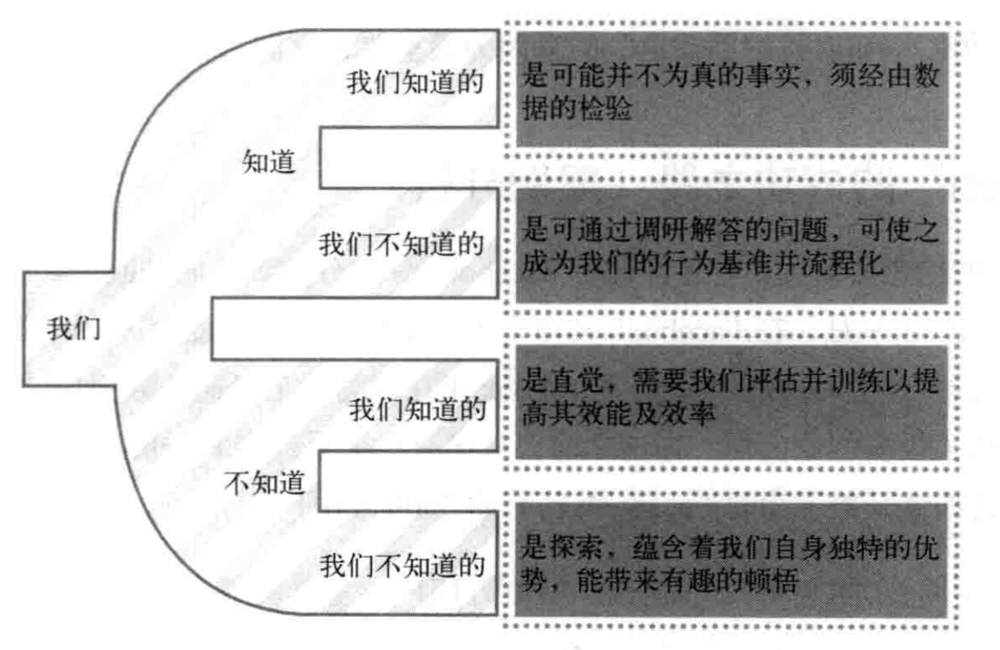

- 销售漏斗的经典模型（AIDA 模型）

  1. 认知 (Awareness)： 潜在客户知道你的存在（比如看到了广告）。
  2. 兴趣 (Interest)： 客户对你的产品产生了兴趣（比如点击了链接，浏览了官网）。
  3. 决策 (Decision/Desire)： 客户在对比考虑，有购买意向（比如加入了购物车，或者咨询了客服）。
  4. 行动 (Action)： 客户完成了购买（比如刷卡支付）

  其核心在于两个词：转化率和漏水点

  - 转化率 (Conversion Rate)： 从上一层到下一层，留下了百分之多少的人？
    - *公式：* (下一层人数 / 上一层人数) × 100%
  - 漏水点 (Drop-off Point)： 人是在哪一步跑掉的？

- 先见性指标的典型例子是销售漏斗的潜在客户数量，你可以根据这个大致预测未来可以获得的新客户数

- 两个数据之间的相关性意味着你可以预测未来，因果性意味着你可以改变未来

- 因果关系一般是多因素共同作用的结果，现实中很难找到 100% 的因果关系

- 可以通过控制变量法验证因果关系，但是只有在样本数足够大的情况下，才可以抹平其他自变量的影响

- 测试就是通过市场细分、同期群分析或 A/B 测试来比较两个样本的不同

- 细分市场就是一群拥有共同特征的人，这个特征可以是任何条件，对比不同细分市场的数据可以发现潜在的问题和增长点

- 同期群分析是相似群体随时间的变化，也叫纵向研究。通过比较不同的同期群，你可以知道：从总体上看，关键指标的表现是否越来越好了。例子：

  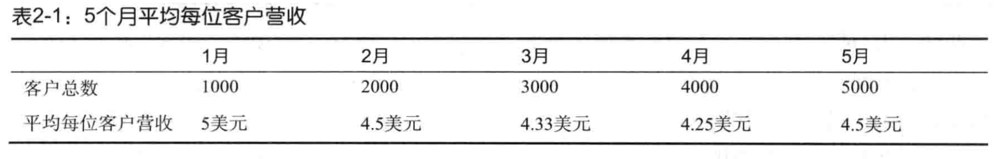

  从这个表中看不出来网店的生意究竟是越来越好还是每况愈下，这个数据把每个月注册的新用户和老用户的消费差异给抹平了，这是有失偏颇的。

  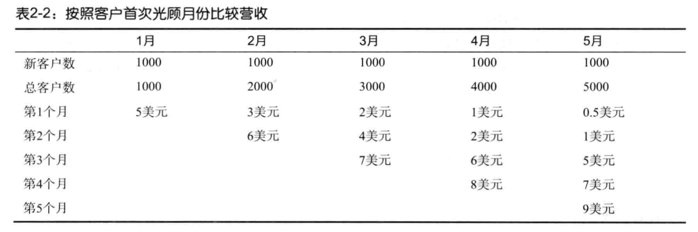

  这张表把新用户和老用户区分开统计，可以明显看到第 5 个月首次光顾的客户消费额是第一个月首次光顾的客户的消费额的接近 2 倍，同时所有客户的消费额都在首月开始迅速下降。

  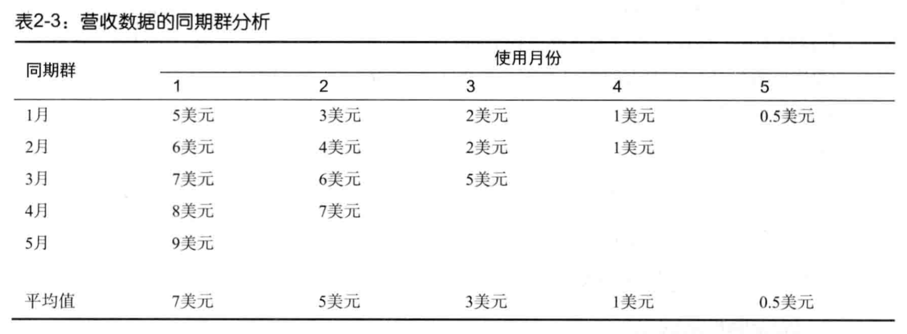

  另外，也可以按照用户的店龄进行同期群分析。这个数据反映出用户的消费从首月开始迅速衰减。

  单看表 2-1 不知道网店的经营情况，但是看同期群分析可以看到用户的首月消费明显上升的同时，消费下降的趋势也有所减缓，说明网店正在茁壮成长。

- A/B 测试是指在同一时间段对不同被试群体提供不同的体验，观察结果，也叫横向研究。但是这种方法要求样本量足够多，多到足以抹平其他自变量的影响。

- 多变量分析法是指同时对多个属性进行测试，原理是利用统计学方法剥离出单个影响因子对结果中某一指标的相关性。适合在样本量不够做 A/B 测试的时候使用。

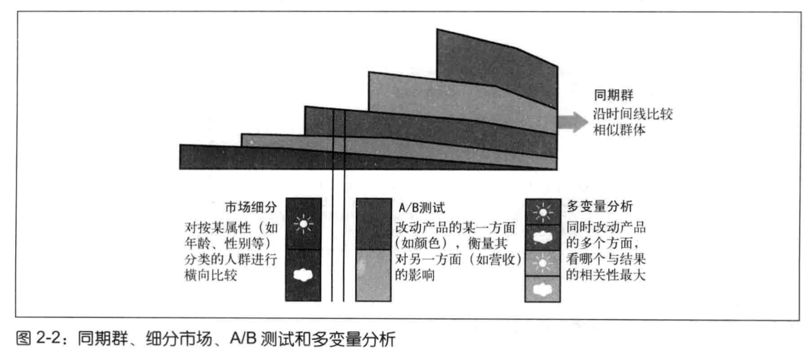

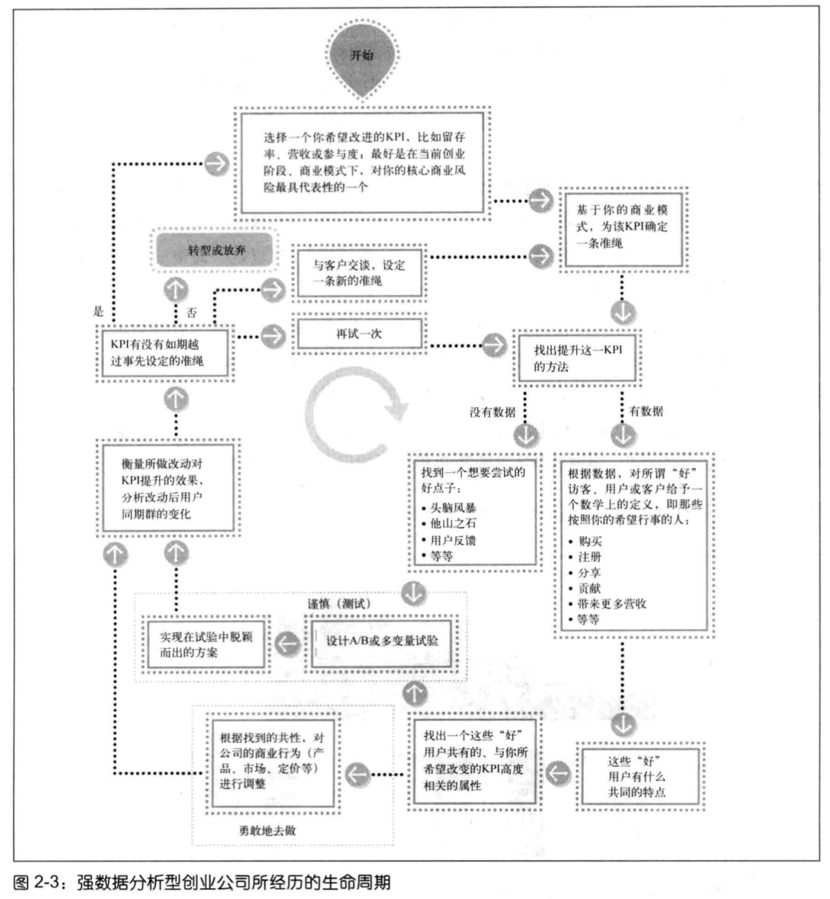

### 第 3 章 你把生命献给谁 (Deciding What to Do with Your Life) 

精益画布是呈现在一张纸上的可视化简明商业计划书，体现你正在进行的、可付诸行动的商业计划。它是阿什.莫瑞亚以亚历山大.奥斯特瓦德的商业模式画布为基础改进而成的。如下图：

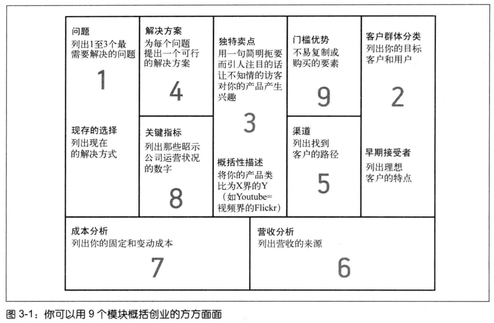

在你不确定是否真的找到了一个好的创业机会时，问一下自己上图的 9 个问题。

### 第 4 章 以数据为导向与通过数据获取信息 (Data-Driven vs. Data-Informed) 

- 过于以数据为导向，滥用数据会导致陷入局部优化地狱，忽视大局。

- 人类负责灵感，机器负责验证。必须坚持用人类的判断来调和机器的自动优化。如果单纯依靠数据和软件，很快就能算出，网页上衣着暴露的女人图片带来的点击率远比其他形式的内容高得多。但这样得来的高点入率只会是短期的成功，迟早会被其对品牌形象造成的损害所抵消。

- 优化的核心是找到给定函数的最大值或最小值。机器虽然具备一定寻找最优解的能力，但其解的范围不可能超过约束条件所规定的区间。这和群山中湖水的最低水位不如海平面那么低有异曲同工之妙，周围的限制导致湖水只是群山中的最低点。

- 需要避免的数据陷阱：

  1. 假设数据没有噪声。分析之前需要检查数据的有效性和实用性。

  2. 忘记归一化。譬如，统计一个热门婚礼目的地列表。你大可以统计每个城市每年有多少人乘坐飞机来结婚，但如果不根据该城市每年的旅客量进行归一化，你得到的只会是一个热门旅游城市列表。

     > 换言之，如果你不除以总人数（归一化），你找到的所谓 “婚礼之都” 其实就是北京、上海、纽约这种 “人最多的城市”，这句废话不需要做数据分析都知道。只有除以总人数，你才能把 “巴厘岛”、“三亚”、“马尔代夫” 这种真正的垂直领域王者挖出来。

  3. 排除异常点。在排除异常点之前一定要经过充分讨论证实该数据确实是异常数据。

  4. 使用合法异常点建立普适模型。即使异常点是合法数据，也不意味着应该用它去建立普适模型。

  5. 忽视季节性。时间序列分析时，一定要考虑季节性因素。

  6. 抛开基数谈增长。基数很小的时候，一个新用户都会导致增长率大幅上升，此时谈增长率没什么意义。

  7. 数据呕吐。如果你不知道什么数据对你是有用的，那么即使你的仪表盘再大再漂亮，都没有用处。

  8. 谎报军情的指标。你希望快速响应，于是设置了很多阈值很低的警报，大多数警报都无关紧要，久而久之，你也就不把警报当回事了

  9. 拒绝不同来源的数据。把不同来源的数据结合在一起可能有意想不到的发现。

     > 高质量客户的邮编地址是否集中于寿司店多的地区?"这可能给你带来极好的新想法用于试验，甚至影响你的增长决策。

  10. 关注噪音。一定要抛开虚荣指标看问题。

## 第二部分：找到当前的正确指标 (Finding the Right Metric for Right Now)

核心思想：不同的商业模式（6种）和不同的创业阶段（5个），关注的指标完全不同。

### **第 5 章 数据分析框架 (Analytics Frameworks)** 

#### 戴夫.麦克卢尔的海盗指标框架

"海盗指标"这一术语由风险投资人戴夫.麦克卢尔创造，得名于五个成功创业关键元素的首字母缩写。麦克卢尔将创业公司最需要关注的指标分为五大类：**获取用户（Acquisition）、提高活跃度（Activation）、提高留存率（Retention）、获取营收（Revenue）和自传播（Referral），简称 AARRR。**

图 5-1 显示了我们对这一模型的解读，它描述了用户/客户/访客须经历的五个环节，以便企业获取价值。价值不仅直接源于客户购买行为（获取营收），还来自客户作为推销者（自传播）和内容产生者（留存率）所带来的营收。

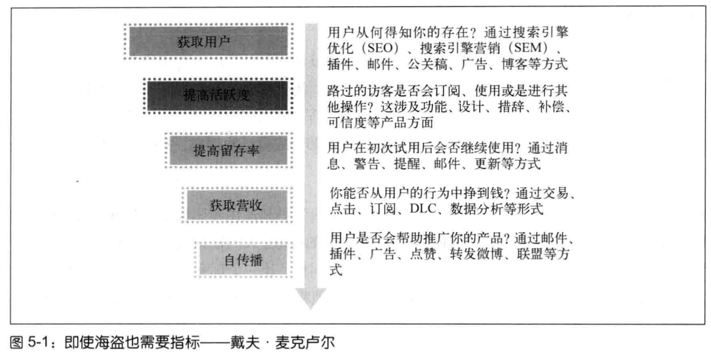

这五个指标并不一定遵循严格的先后顺序。例如，用户可能先推荐某一个产品后再购买，或者在光顾很多次后再注册，但这五个指标确实是一个帮助你思考创业增长所需要素的好框架（如表 5-1 所示）。

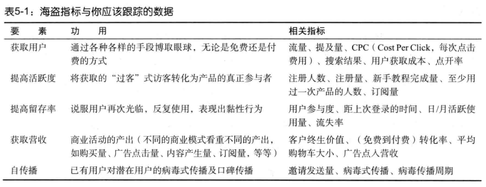

#### 埃里克.莱斯的增长引擎说

- **黏着式增长引擎**

  重点在于让顾客成为回头客，并且持续使用你的产品，最重要的 KPI 是客户留存率，其次是流失率和使用频率。这个概念与 AARRR 的提高留存率阶段类似。

  长期黏性往往来自于产品为用户创造的价值，比如 Gmail 和印象笔记的用户数据还有 MMO 游戏的用户成就和虚拟物品。

  > 思考：游戏中设置一些相对难以完成的成就和稀有的物品其实是提高用户黏着性的一种手段

- **病毒式增长引擎**

  最大的吸引力在于它利滚利的模式带来的指数级增长性质，最重要的 KPI 是病毒式传播系数（每个用户带来的新用户数量），其次是病毒传播周期（完成一次邀请需要的时间）和病毒类别。

- **付费式增长引擎**

  就是产品付费，然后把赚到的钱再投入一部分用于获客。建议在确认产品具有黏着式增长引擎和病毒式增长引擎之后再开启这个引擎。最重要的 KPI 是 CLV（客户终身价值）和 CAC（客户获取成本），只有在 CLV > CAC 时，投入才是值得的，实践中还要看客户盈亏平衡时间，也就是客户多久付清你获取他花的成本。

#### 阿什.莫瑞亚的精益创业画布

对于精益创业画布中的每一个模块，都有一组相关指标需要特别关注，如表 5-2 中所列（实际上画布本身就包含了一个叫 "指标" 的模块，需要在你对画布做出改动时相应地更新）。

这些指标的作用有二：

- 验证模块中的假设，证明你的一纸商业计划书是贴合实际的
- 或是否定你的假设，把你的画布打回白纸重画。

表中的个别指标可能会因创业的类型而异，但基本原理对所有的创业者都很有价值。

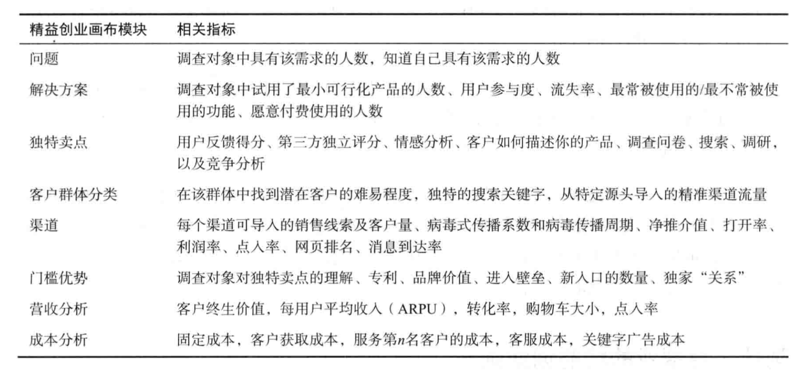

#### 肖恩.埃利斯的创业增长金字塔

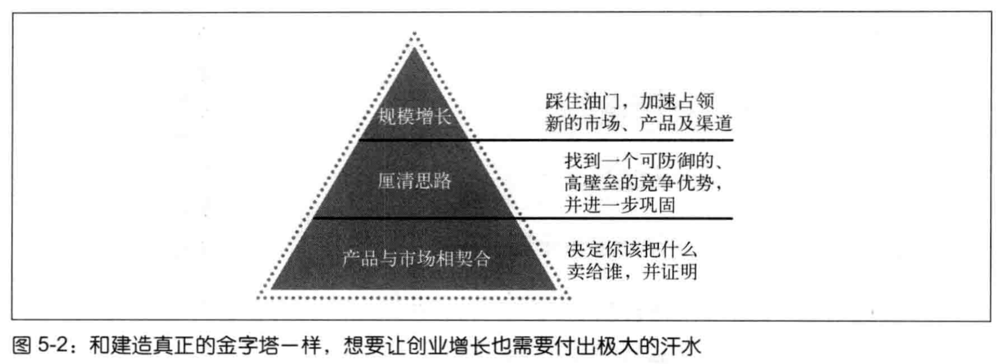

当然，使用这一框架最大的问题是：如何确定已达到产品与市场的契合点？

为此，肖恩设计了一份简单的问卷（参见 survey.io），你可以把它发送给客户，以确定你是否已准备好进人加速增长阶段。问卷中最重要的一个问题是：“如果不能再使用这个产品或服务，你的感受是什么？”。在肖恩的经验中，如果 40%（或以上）的人回答他们会 “非常失望”，就说明你已找到了契合点，是时候放心踩油门了。

> 网站打不开了

#### 长漏斗

“长漏斗” 是一种分析方法，能够帮你理解你最初是如何获得客户的注意力的，以及客户从最初得知该网站到发生你所期望的行为(例如完成一次购物、生产一些内容、分享一段信息)的全过程。

通常，对整个漏斗全阶段的监控要求，在起始阶段向数据中注人一些用于跟踪的特征，这样，用户在你的网站中走到哪儿，你就能跟踪到哪儿：当下的许多数据分析方案包都可以做到这点。例如，图 5-3 显示了由 Google Analytics 提供的社交访客流程分析。

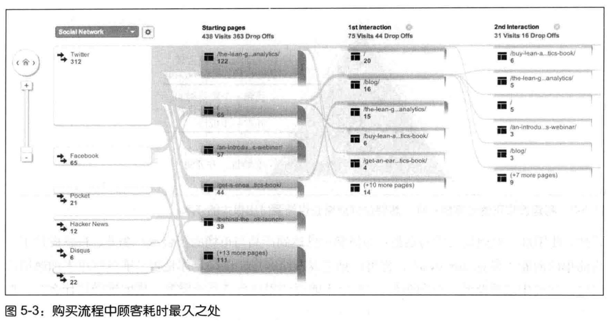

#### 精益数据分析模型

取众家之长，并强调了数据指标。

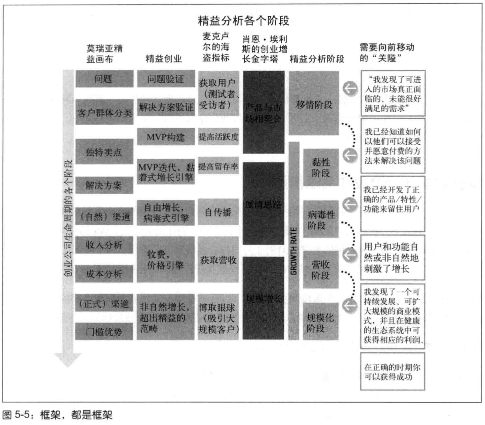

### 第 6 章 第一关键指标的约束力 (The Discipline of One Metric That Matters - OMTM) 

- 在不同的阶段应该只专注一个指标，也叫 OMTM（One Metric That Matters，第一关键指标）
- 专注一个指标不代表只看一个指标，其他关键指标也可以收集起来供日后追踪。
- 应该选择尽可能少的数据作为跟踪对象，避免精力被无关紧要的指标分散，进而迷失目标
- 定好 OMTM 后，需要合理确定它的初始基线

### 第 7 章 你所在的商业领域 (What Business Are You In?) 

- 你的商业模式决定了你需要关注的指标

- 所有的商业模式都有两个特征：一、目标是增长；二、需要三大引擎之一驱动增长

- 要区分真正有价值的用户和无价值甚至是有害的用户。改进产品，增长优质用户比例的同时，驱逐劣质用户。

- 可以通过拼凑五种不同的维度，创造不同的商业模式。

  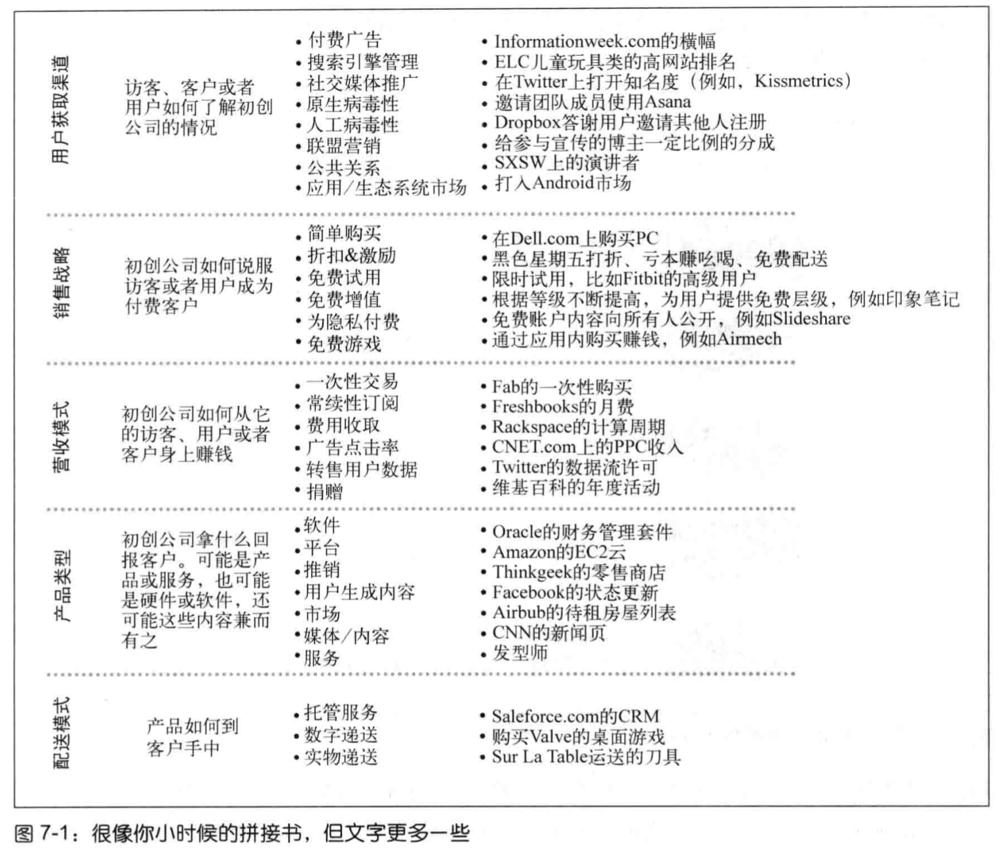

  比如，可以如下图所属概述 DropBox 的商业模式。

  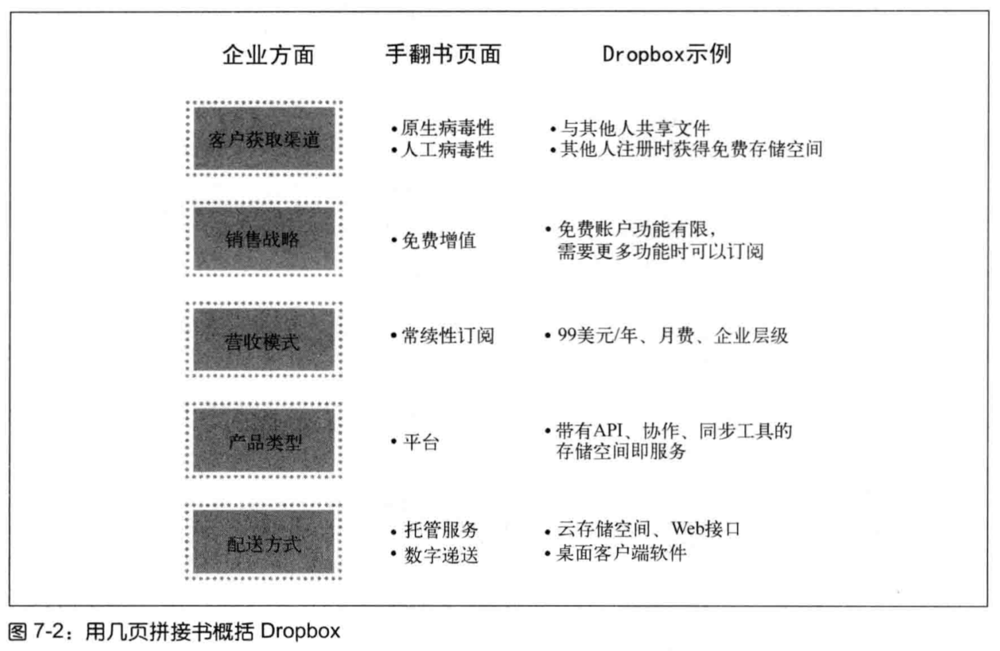

### 第 8 章 商业模式一：电子商务 (E-commerce) 

简而言之，电商公司的主营业务就是让访客在其网店上买东西。

早期的电子商务模式由一个相对简单的 “漏斗” 构成：访客浏览网页 - 点击喜欢的商品详情页 - 点击购买 - 填写购买信息 - 支付 - 完成交易。这是最经典的转化漏斗。

现在的电子商务模式要复杂得多，很多买家直接搜索想购买的商品，商家会通过主动推荐商品等。

电商的盈利模式十分简单：以物换钱。

凯文.希尔斯特罗姆根据年度**重复购买率（去年曾在某家网站买过东西的买家，有多少今年还在这家网站购买）**划分了电商的三种模式：

- 如果今年的重复购买率不足 40%，则经营重心应当放在新用户的获取上。有 70% 的电商公司会在成熟后进入这一模式。回头客少不一定是坏事，比如卖眼睛的电商公司最好把精力放在客户推荐机制上，而不是试图向同一个人卖多副眼镜。
- 如果今年的重复购买率为 40%~60%，则应该兼顾新用户的获取和回头客的招揽。使每位顾客的年均购买数达到 2~2.5 次最好
- 如果今年的重复购买率为 60% 以上，则经营中心应该放在客户忠诚度上，鼓励忠诚的回头客更加频繁地消费。只有不到 10% 的电商公司可以在成熟时达成这个成就。

如果运营时间不足一年，可以使用 90 天重复购买率预测所处的模式。

- 90天内重复购买率达到 1%~15% 说明你处于用户获取模式。
- 90天内重复购买率达到 15%~30% 说明你处于混合模式。
- 90天内重复购买率达到 30% 以上说明你处于忠诚度模式。

每种模式之间没有严格的优劣之分，它的目的是让人弄明白目前处于什么状态，应该做什么。

总的来说，电商模式的公司应该关注以下指标：

#### 转化率

访客中发生购买行为的比例。

可以按照人群、商品、访客来源等多重标准，分类讨论转化率，以观察哪些因素可以提高转化率。

这个指标是衡量电商健康程度最基本的指标之一。

#### 年均购买率

全年总购买次数 / 全年活跃用户总数。

这个柱子不是越高越好，取决于你卖的东西，如果卖的东西本身就是很少更新换代的，那么这个值低点也没问题。

#### 购物车的大小

电商领域中，这个代指客单价，也就是单笔订单的规模，平均每个客户在结账时，购物车里装了多少钱的东西。

你可以根据这个来确定最有油水的客户群体。

#### 弃买率

1 - 转化率。

这个数值分解在购物的每个环节才是有意义的。你可以看到在哪个环节造成了最大的损失。

#### 客户获取成本（CAC）

为了拉到一个新客人所花的所有营销费用。

你可以根据这个计算每个客户的盈利多少：利润 = 销售收入 - 获客成本 - 货运/运营成本。

#### 平均每位客户的营收

总营收 / 客户数。

**这个是其他关键数字的综合指标，是衡量网店健康程度的唯一最终标准。**

#### 客户搜索的关键词

可以在搜索引擎后台拿到，比如 Google Analytics。

知道客户是为什么来你的网店，这很重要。也可对网店内部的搜索进行分析。

首先，需要弄清楚大家在找些什么。如果用户搜索后没有找到心仪结果，或是搜索后点了后退按钮，则说明店内没有他们要找的东西。其次，如果有大量搜索指向某一特定的商品分类，则说明可能需要调整一下该类别的位置，或是将其加人首页，看看能否更快、更好地抓住人们对这一产品类别的需求,进而卖出更多商品。

#### 推荐接受率

点开推荐商品的客户数量 / 看到推荐商品的客户数量。

根据不同的推荐方式划分，可以知道客户最容易接受哪种推荐方式。

根据不同的客户群体划分，可以知道哪些客户最容易接受推荐。

对比推荐池中的商品和之外的商品，可以知道商品推荐带来了多少额外营收。

#### 病毒性

主要是病毒系数（平均每个人推荐多少人购买）

病毒性够高可以压低获客成本。而且因为基本都是信任的人的分享，所以分享价值也是很高的。

划分不同的分享方式，可以看到哪种分享方式可以带来最高的病毒传播效率。

#### 邮件列表点入率

中国人大部分消费者不通过邮件交流，略过。

#### 运送时间和库存可供率

尽量缩短运送时间有助于提高竞争力，获取更优质的客户。

库存可供率对销售额有明显影响。给销售火爆的商品分配更多的库存是更明智的选择。

## 第三部分：底线在哪里 (Lines in the Sand)

TODO