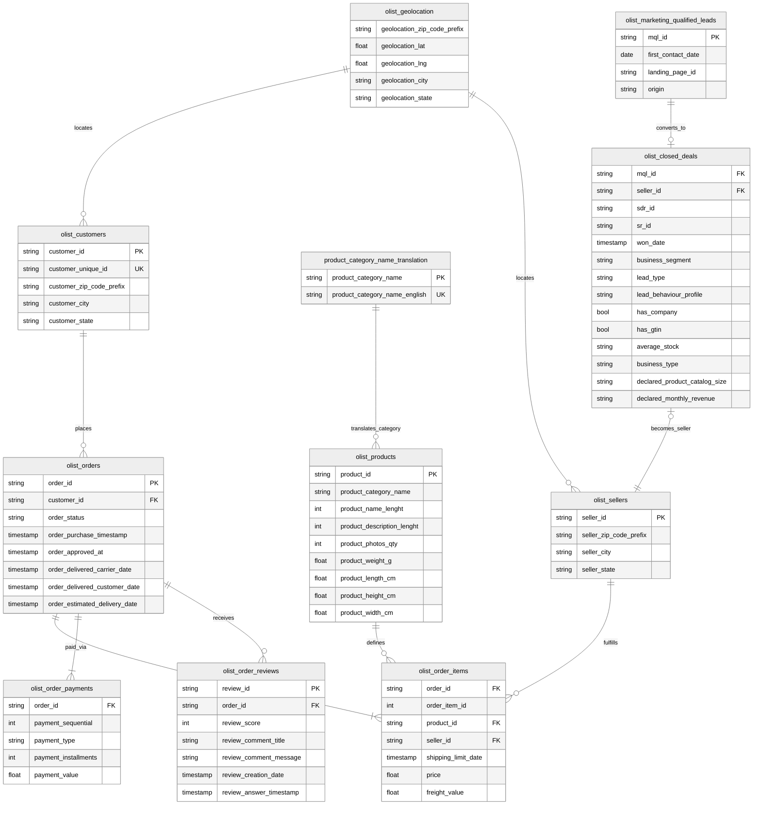

**数据集来源**：

- [Brazilian E-Commerce Public Dataset by Olist](https://www.kaggle.com/datasets/olistbr/brazilian-ecommerce)
- [Marketing Funnel by Olist](https://www.kaggle.com/datasets/olistbr/marketing-funnel-olist)

> 这是真实的商业数据，所有商店和合作伙伴的文本都已替换为《权力的游戏》中的家族名称。
{: .prompt-tip }

**分析背景假设**：

[Olist](https://olist.com/) 作为一个连接商家和买家的平台，近期面临**营销转化率不稳定且物流差评增多**的情况。领导要我通过分析**找出高质量商家的特征，并优化用户的购物体验**。

## 整体分析框架

为保证分析的深度与可落地性，这个案例在**[描述性统计](https://www.spsspro.com/help/descriptive/)**的基础上，还基于**[跨行业数据挖掘标准流程（CRISP-DM）](https://www.ibm.com/docs/zh/spss-modeler/saas?topic=dm-crisp-help-overview)**的思想和 Olist 的 **[Marketplace 业务模式](https://zhuanlan.zhihu.com/p/565026406)**，构建了从 “营销获客” 到 “履约交付” 的全链路分析闭环。

整个分析框架主要分为四个阶段：

1. **数据架构与全貌认知**

   这一阶段的目标是理清 11 张数据表的 **[ER 关系](https://www.visual-paradigm.com/cn/guide/data-modeling/what-is-entity-relationship-diagram/)**，构建可供分析的宽表模型。

   - 语义标准化：数据源的网站已经给出了所有字段的准确语义。
   - 业务逻辑映射：数据源的网站已经给出了现成的 Data Schema。

   在二者的基础上，结合 Olist 的业务模式，画出 ER 图即可。

2. **数据清洗**

   这一阶段的目标是将原始脏数据转化为高质量的分析资产。

   - 数据质量审计：检查数据的完整性（`Null` 值分布）、一致性（价格异常值、状态冲突）、唯一性（主键查重）和分布合理性（偏度和峰度），并以合适的方式处理非法数据（剔除或填充）。但数据源本身质量很高，这里只讲讲一些常用的清洗思路。

   - 时效特征构造：计算 `delta_delivery_time`（实际送达 - 预计送达），用于量化物流延迟程度。
   - 地理特征处理：利用地理坐标计算商家与买家间的物理距离，为物流分析提供归因依据。
   - 多语言处理：将葡萄牙语的 `product_category` 映射为英语，确保可读性。

3. **指标体系构建与假设提出**

   这一阶段的目标是采用**[目标-策略-衡量（OSM）模型](https://zhuanlan.zhihu.com/p/1945238646325249909)**，将业务问题转化为可量化的数据指标。

   - 营销侧指标体系：建立从[营销合格线索（MQL）](https://www.shuziqianzhan.com/article/2383.html)到活跃商家中间各环节的[转化漏斗（Conversion Funnel）](https://www.shopify.com/zh/blog/ecommerce-funnel)，重点关注**[渠道转化率（CVR）](https://advertising.amazon.com/zh-cn/library/guides/conversion-rate#1)**与**转化耗时（Time To Conversion）**。
   - 运营侧指标体系：
     - 北极星指标：[成交总额（GMV）](https://wiki.mbalib.com/wiki/GMV)、订单量。
     - 效率指标：订单核销率、[物流按时交付率（OTD）](https://mbb.eet-china.com/blog/642052-398254.html)。
     - 体验指标：[净推荐值（NPS）](https://www.ibm.com/cn-zh/think/topics/net-promoter-score)替代指标（Review Score 平均分）。
   - 提出假设：
     - *H1*：来自特定渠道（如 Paid Search）的商家具有更高的[生命周期价值（LTV）](https://zhuanlan.zhihu.com/p/51914694)。
     - *H2*：物流延迟天数与客户评分之间存在显著的负相关非线性关系。

4. **归因洞察与可视化叙事**

   这一阶段的目标是通过可视化验证假设，并输出可执行的商业建议。

   - 全链路漏斗分析：打通营销表与订单表，评估不同来源商家的后续销售表现，优化市场投放策略。
   - RFM 用户/商家分层：基于 **[Recency-Frequency-Monetary 模型](https://blog.ocard.co/knowhow/crm-rfm-analysis/)**对商家进行价值分层，识别 “金牌商家” 特征。
   - 地理空间分析：绘制巴西物流热力图，识别 “高延迟、低评分” 的物流黑洞区域，提出仓储布局建议。
   - 归因分析：探究影响差评（Review Score < 3）的核心因子（是产品质量还是物流速度？）。

## 数据架构与全貌认知

**目标**：目标是理清 11 张数据表的 ER 关系，构建可供分析的宽表模型。

数据源网站已经给出了所有字段的准确语义和 Data Schema，这里根据已有信息画出 ER 图即可。



## 数据清洗

**目标**：将原始脏数据转化为高质量的分析资产。

### 数据质量审计

首先需要明确，质量审计并不是要把所有字段的值全部清洗到一尘不染，对于大数据量的分析来说，有偶尔的脏数据是可以容忍的，况且显示世界的业务是很复杂的，有时候根本无法判断某个字段的值到底是不是合法的，这里只需要让数据绝大部分可用即可。

面对 Olist 数据集复杂的 11 张表结构，手动逐个检查字段不仅效率低下，而且很容易遗漏异常。为此，我构建了一个基于 Pandas 的通用数据审计脚本。该工具能自动计算当前目录的 `dataset` 文件夹下所有 `csv` 文件数据集的缺失率、基数分布、偏度峰度等 10+ 项关键指标，并把最终的审计结果保存在当前目录下的 `audit_report.xlsx` 文件中。

```python
import glob
import os.path

import pandas as pd
from pandas.core.dtypes.common import is_numeric_dtype, is_datetime64_any_dtype
from tqdm import tqdm

pd.set_option('display.width', None)
pd.set_option('display.max_columns', None)


def audit_dataframe(df: pd.DataFrame) -> pd.DataFrame:
    """
    DataFrame 数据质量审计脚本

    :param df: 要审计的 DataFrame
    :return: 审计结果
    """

    row_cnt, col_cnt = df.shape
    audit_stat = []

    # 按列统计数据
    for col in df.columns:
        col_stat = {}
        # 列基本信息
        col_series = df.loc[:, col]
        col_type = col_series.dtype
        col_stat.update({
            'column': col,
            'type': col_type,
        })
        # 基础描述性统计
        col_missing_cnt = col_series.isna().sum()
        col_missing_pct = col_missing_cnt / row_cnt
        col_unique_cnt = col_series.nunique()
        col_unique_pct = col_unique_cnt / row_cnt
        col_stat.update({
            'missing': col_missing_cnt,
            'missing_pct': col_missing_pct,
            'unique': col_unique_cnt,
            'unique_pct': col_unique_pct,
        })
        # 数值型统计
        if is_numeric_dtype(col_series):
            col_stat.update({
                'min': col_series.min(),
                'max': col_series.max(),
                'mean': col_series.mean(),
                'median': col_series.median(),
                'std': col_series.std(),
                'zero': (col_series == 0).sum(),
                'zero_pct': (col_series == 0).sum() / row_cnt,
                'negative': (col_series < 0).sum(),
                'negative_pct': (col_series < 0).sum() / row_cnt,
                'skewness': col_series.skew(),
                'kurtosis': col_series.kurt(),
            })
        # 日期型统计
        elif is_datetime64_any_dtype(col_series):
            col_stat.update({
                'min': col_series.min(),
                'max': col_series.max(),
                'range': (col_series.max() - col_series.min()).days if not col_series.isna().all() else None
            })
        else:
            col_stat.update({
                'top': str(col_series.mode().iloc[0])[:20],
                'top_cnt': col_series.value_counts().iloc[0],
                'top_pct': col_series.value_counts().iloc[0] / row_cnt,
            })
        audit_stat.append(col_stat)

    audit_df = pd.DataFrame(audit_stat).set_index('column')
    return audit_df


def audit_all_dataset(folder_path):
    """
    遍历并审计文件夹下的所有 csv 文件

    :param folder_path: 目标文件夹
    :return: None
    """

    csv_files = glob.glob(os.path.join(folder_path, '*.csv'))

    if not csv_files:
        print(f'未能在 {folder_path} 中发现 csv 文件')
        return

    print(f'找到 {len(csv_files)} 个 csv 文件，开始审计')
    writer = pd.ExcelWriter('audit_report.xlsx')

    for file_path in tqdm(csv_files, desc="Processing Files"):
        file_name = os.path.basename(file_path).replace('.csv', '')
        try:
            dataset = pd.read_csv(file_path)
            audit_df = audit_dataframe(dataset)
            audit_df.to_excel(writer, sheet_name=file_name[:30])
        except Exception as e:
            print(f'处理 {file_name} 时出错：{e}')

    writer.close()
    print('审计结束，审计报告保存在 audit_report.xlsx}')


if __name__ == '__main__':
    audit_all_dataset('./dataset')

```

例如，这是对 `olist_customers_dataset` 的审计数据结果：

```
                            type  missing  missing_pct  unique  unique_pct                   top  top_cnt   top_pct     min      max          mean   median           std  zero  zero_pct  negative  negative_pct  skewness  kurtosis
column                                                                                                                                                                                                                               
customer_id               object        0          0.0   99441    1.000000  00012a2ce6f8dcda20d0      1.0  0.000010     NaN      NaN           NaN      NaN           NaN   NaN       NaN       NaN           NaN       NaN       NaN
customer_unique_id        object        0          0.0   96096    0.966362  8d50f5eadf50201ccdce     17.0  0.000171     NaN      NaN           NaN      NaN           NaN   NaN       NaN       NaN           NaN       NaN       NaN
customer_zip_code_prefix   int64        0          0.0   14994    0.150783                   NaN      NaN       NaN  1003.0  99990.0  35137.474583  24416.0  29797.938996   0.0       0.0       0.0           0.0  0.779025 -0.788204
customer_city             object        0          0.0    4119    0.041422             sao paulo  15540.0  0.156274     NaN      NaN           NaN      NaN           NaN   NaN       NaN       NaN           NaN       NaN       NaN
customer_state            object        0          0.0      27    0.000272                    SP  41746.0  0.419807     NaN      NaN           NaN      NaN           NaN   NaN       NaN       NaN           NaN       NaN       NaN

```

一般来讲，我们解读审计报告，主要是检查数据的完整性、一致性、唯一性还有分布合理性：

- **完整性检查**

  关注指标：`missing_pct`

  - 完美：`missing_pct == 0`
  - 可容忍：`0 <= missing_pct <= 0.05`，通常可以用均值或者众数填充，或者直接删除对应的行
  - 无法容忍：`missing_pct > 0.3`，除非这个字段本身就是 “稀疏” 的，比如 “备注” 字段，否则这列没有分析价值
  - 直接删除：`missing_pct > 0.8`

- **一致性检查**

  关注指标：`min`、`max`、`zero_pct`、`negative_pct`、`negative_pct`

  - 异常零值：对于某些字段（如“身高”、“价格”、“耗时”），0 是没有物理意义的。如果 zero_pct > 0，说明存在脏数据。
  - 异常负值：对于“年龄”、“销售额”、“库存”等字段，min < 0 或 negative_pct > 0，说明存在逻辑错误。
  - 极值检查：如果 `max` 远大于 `mean + 3 * std`，或者 `max` 是 `median` 的数百倍，说明存在极端离群值。

- **唯一性检查**

  关注指标：`unique_pct`、`unique` 、`top_pct` 

  - 单一值：`unique == 1`，此列没有额外的信息贡献，建议直接删除
  - 低方差： `top_pct > 0.95`，此列 95% 的数据都是同一个值，可能冗余太大，分析价值不高
  - 主键判定：`unique_pct == 1`，如果此列是主键列，但是不满足条件，那么这列数据可能不干净
  - 高基数：`type` 是 `object/category`，但 `unique_cnt` 非常大（接近行数）。说明这可能是一个杂乱的文本字段（如用户评论），而不是分类字段，需要 NLP 处理。

- **分布合理性检查**

  关注指标：`mean` vs `median`、`skewness`、`kurtosis`

  - 偏态分布：如果 `abs(skewness) > 3`，说明数据分布严重倾斜（长尾）。虽然不一定是脏数据，但在建模前通常需要做对数变换。

  - 均值偏移：如果 `mean` 和 `median` 差异巨大（例如 `mean=1000`、`median=10`），通常暗示有巨大离群值拉高了均值。

    
