**数据集来源**：

- [Brazilian E-Commerce Public Dataset by Olist](https://www.kaggle.com/datasets/olistbr/brazilian-ecommerce)

> 这是真实的商业数据，所有商店和合作伙伴的文本都已替换为《权力的游戏》中的家族名称。
{: .prompt-tip }

## 全文概览：Olist 增长瓶颈诊断与破局策略

### 背景与现状

Olist 当前 GMV 增长面临结构性挑战。数据表明，GMV 几乎完全依赖新客拉动，老客复购率极低（近乎 0%）。在新客红利边际递减的背景下，这种 “一次性收割” 的模式不可持续。

### 核心洞察

通过对业务数据、用户评价（NLP）及物流链路的深层拆解，发现两大核心症结：

1. “高运费+弱履约” 双重挤压用户体验：平均运费占比高达 16% 以上，且实际物流耗时（平均 13 天）长、破损率高。NLP 分析证实，物流延误与暴力分拣是导致差评和用户流失的头号杀手。
2. 圣保罗物流中心超负荷：地理空间分析显示，圣保罗首都圈承担了全国大部分物流压力，且东部地区存在明显的长尾延时，单一仓储结构已成履约瓶颈。

### 战略建议

基于数据诊断，提出 “短-中-长” 三步走策略以打破增长僵局：

- **短期（运营侧）- 预期管理与转化平衡**：
  - 动作：优化预计送达时间算法。当前预留 100% 冗余过于保守，建议将冗余降至 50%，并针对东部地区实施差异化缓冲。
  - 预期：提升页面转化率，在不显著增加客诉风险的前提下，利用现有流量最大化 GMV。
- **中期（商品侧）- 提升 LTV（生命周期价值）**：
  - 动作：针对耐用品主导的现状，推行 “耐用+易耗” 凑单策略（如买床单推洗涤剂）。
  - 预期：通过提升客单价（AOV）分摊物流成本，缓解 “运费过高” 痛点，人为制造复购需求。
- **长期（基建侧）- 降本提效**：
  - 动作：在巴伊亚州（东部）建立前置仓（RDC）。
  - 预期：分流圣保罗压力，将东部地区履约时效缩短 3-5 天，从根本上改善用户体验，构建复购基础。

## 了解 Olist 商业模式

Olist 是一个 B2B2C 的平台，为长尾中小商家提供将 SKU 一站分发到各大电商平台的服务，为他们提供在各大电商平台的信用背书，降低中小商家入驻大平台的门槛。对于大平台来说，Olist 是一个超级大卖家，依托众多中小商家，提供了海量 SKU。
**Olist 的利润主要来自 SaaS 软件的订阅费（月费/年费）和每笔订单的佣金抽成。**

> 上述只针对 2016~2018 年间的 Olist，现在的 Olist 的业务版图已经扩展了非常多。

## 选定北极星指标

任何商业公司的最终目的都是盈利，个人思路是：从利润开始层层拆分，**每层只拆分成长性更高的那个指标**。

- 第一次拆分：$利润 = 营业额 \times 利润率$
- 第二次拆分：$营业额 = 订阅费收入 + 佣金收入$
- 第三次拆分：$佣金收入 = 总交易额(GMV) \times 佣金率$

再往下拆会不得不产生信息损失，导致决策信息失真，所以这里**选择 GMV 作为北极星指标**。

## 理解数据集结构

数据源网站已经给出了所有字段的准确语义和 Data Schema，这里根据已有信息画出 ER 图。

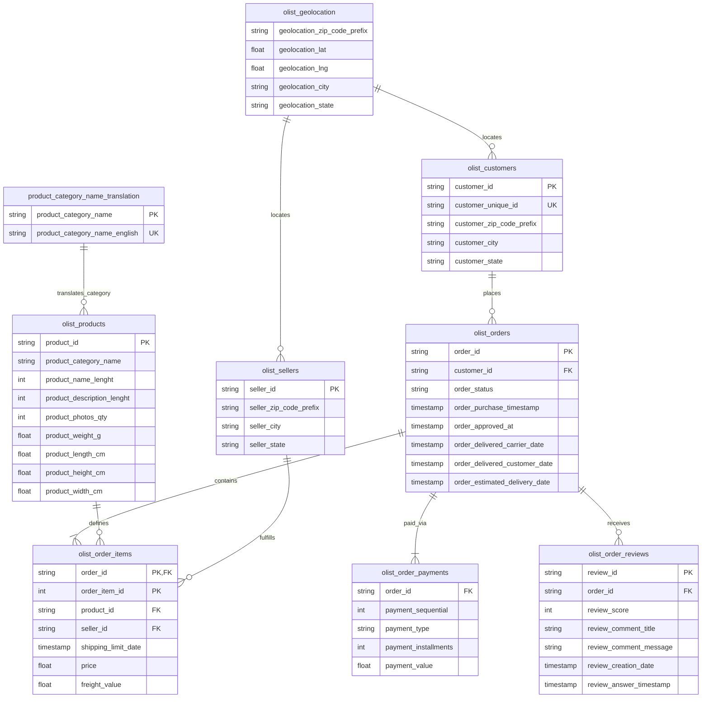

## 探索性数据分析与问题拆解

从北极星指标入手，同期群多维度观察，发现并层层拆解问题。

单纯的 GMV 只是一个随着时间不断增长的 “虚荣指标”，实际需要洞察的是它的（年/月/季度）变化率。

利用 `olist_orders_dataset` 和  `olist_order_items_dataset` 计算 GMV 变化率之前首先要审计和清洗数据。

```python
------------------------------------
  olist_orders_dataset 审计结果
------------------------------------


                                                                          alerts    type  count  missing  missing_pct  unique  unique_pct                   top  top_cnt   top_pct
column                                                                                                                                                                            
order_id                                             may_pk_or_uk | may_need_nlp  object  99441        0     0.000000   99441    1.000000  00010242fe8c5a6d1ba2        1  0.000010
customer_id                                          may_pk_or_uk | may_need_nlp  object  99441        0     0.000000   99441    1.000000  00012a2ce6f8dcda20d0        1  0.000010
order_status                                                        too_many_top  object  99441        0     0.000000       8    0.000080             delivered    96478  0.970203
order_purchase_timestamp                             may_pk_or_uk | may_need_nlp  object  99441        0     0.000000   98875    0.994308   2017-11-20 10:59:08        3  0.000030
order_approved_at                             missing_need_handle | may_need_nlp  object  99441      160     0.001609   90733    0.912430   2018-02-27 04:31:10        9  0.000091
order_delivered_carrier_date                                 missing_need_handle  object  99441     1783     0.017930   81018    0.814734   2018-05-09 15:48:00       47  0.000473
order_delivered_customer_date  missing_need_handle | may_pk_or_uk | may_need_nlp  object  99441     2965     0.029817   95664    0.962018   2016-10-27 17:32:07        3  0.000030
order_estimated_delivery_date                                                     object  99441        0     0.000000     459    0.004616   2017-12-20 00:00:00      522  0.005249

------------------------------------
  olist_order_items_dataset 审计结果
------------------------------------

                                                              alerts     type   count  missing  missing_pct  unique  unique_pct                   top  top_cnt   top_pct   min      max        mean  median         std   zero  zero_pct  negative  negative_pct  skewness    kurtosis
column                                                                                                                                                                                                                                                                                
order_id                                                               object  112650        0          0.0   98666    0.875863  8272b63d03f5f79c56e9     21.0  0.000186   NaN      NaN         NaN     NaN         NaN    NaN       NaN       NaN           NaN       NaN         NaN
order_item_id        check_polar_valid | high_skewed | may_high_kurt    int64  112650        0          0.0      21    0.000186                   NaN      NaN       NaN  1.00    21.00    1.197834    1.00    0.705124    0.0    0.0000       0.0           0.0  7.580356  103.857361
product_id                                                             object  112650        0          0.0   32951    0.292508  aca2eb7d00ea1a7b8ebd    527.0  0.004678   NaN      NaN         NaN     NaN         NaN    NaN       NaN       NaN           NaN       NaN         NaN
seller_id                                                              object  112650        0          0.0    3095    0.027474  6560211a19b47992c366   2033.0  0.018047   NaN      NaN         NaN     NaN         NaN    NaN       NaN       NaN           NaN       NaN         NaN
shipping_limit_date                                                    object  112650        0          0.0   93318    0.828389   2017-07-21 18:25:23     21.0  0.000186   NaN      NaN         NaN     NaN         NaN    NaN       NaN       NaN           NaN       NaN         NaN
price                                                                 float64  112650        0          0.0    5968    0.052978                   NaN      NaN       NaN  0.85  6735.00  120.653739   74.99  183.633928    0.0    0.0000       0.0           0.0  7.923208  120.828298
freight_value                                                         float64  112650        0          0.0    6999    0.062130                   NaN      NaN       NaN  0.00   409.68   19.990320   16.26   15.806405  383.0    0.0034       0.0           0.0  5.639870   59.788253
```

存在一些缺失率低于 3% 的字段，不影响整体分析，无需处理。

**在 TableauBI 中对 GMV 可视化处理后，可以明显发现 GMV 持续高波走低，经营情况不容乐观。**


**北极星问题**：为什么 GMV 增长动力不足

回答这个问题，需要进一步拆分 GMV，看到底是哪个子指标导致 GMV 持续走低。

这里的拆分方式有很多，但是根据 MECE 原则，一般优先把 GMV 拆分为 $订单量 \times 订单均价$。

**对比订单量和订单均价与 GMV 的定基变化率，可以明显看到 GMV 几乎完全是由订单量驱动的。**


也就是说，GMV 的异常趋势主要是因为订单量的增长动力不足。

**问题 1**：为什么订单量增长动力不足

**猜想 1.1**：消费端增长动力不足，新买家少了或者老买家走了

**猜想 1.2**：供给端供应能力不足，新卖家少了或者老卖家走了

所以我们可以进一步拆分：$订单量 = 新买家订单 + 老买家订单$ 或 $订单量 = 新卖家订单 + 老卖家订单$

列出新老买家订单量的逐月占比和买家逐月留存率，可以清晰地观察到，问题出在消费端：

**几乎所有订单都来自新买家，老买家复购意愿极低，这种模式下，新买家开发到瓶颈后，消费端乏力会自然显现。**

**猜想 1.1 证实，猜想 1.2 证伪。**


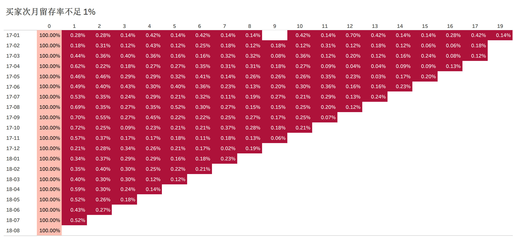

**问题 2**：为什么买家不愿意复购

**猜想 2.1**：商品本身不需要频繁复购

**猜想 2.2**：购买体验差导致不愿意再复购。

首先分析商品本身耐用性的问题，看看是不是买的东西就是比较耐用，不用复购。

对比新老买家的商品购买偏好，发现没有明显区别，但问题出在：

**买家买的东西大多数都是耐用品，本身复购率就比较低。**

**猜想 2.1 证实。**


| 英文分类名      | 中文含义                 | 产品属性      | 复购频率                                                  |
| --------------- | ------------------------ | ------------- | --------------------------------------------------------- |
| bed_bath_table  | 床上用品、卫浴、桌布     | 半耐用品      | **低**。一套床单或毛巾通常可以使用 1-2 年。               |
| sports_leisure  | 运动与休闲（器材、服装） | 耐用品/消费品 | **中低**。运动器材（如哑铃、帐篷）属于典型耐用品。        |
| furniture_decor | 家具装饰（灯具、挂饰等） | 硬耐用品      | **极低**。装修或布置房间是一次性需求。                    |
| health_beauty   | 健康美容（仪器、化妆品） | 消费品        | **中**。虽然护肤品是消耗品，但 Olist 上有很多是美容仪器。 |
| housewares      | 家用器具（厨具、小家电） | 耐用品        | **低**。锅铲、烤箱等家电除非损坏，否则很少复购。          |

然后分析用户体验的问题，主要关注差评，发现：

**很多买家的购物体验也并不好。**

**猜想 2.2 证实。**

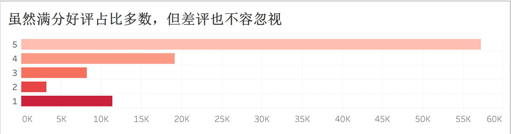

**问题 3**：为什么买家不愿意在平台上购买易耗品

**假设 3.1**：运费太贵，不值得在平台上买

图中可以观察到，Olist 各月的订单均价在 120 雷亚尔左右，而运费均价在 20 雷亚尔左右，运费单价比约 16.33%。

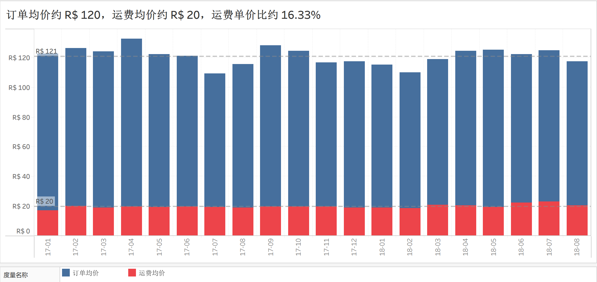

根据 DIEESE 发布的数据，巴西 2017-2018 年平均单项易耗品价格通常在 3 至 30 雷亚尔之间。

另外，根据 2017-2018 年 Correios 官方资费表，针对 1kg 以下的小包裹（易耗品典型重量）：

| 服务类型     | 距离/范围          | 2017-2018 基础起步价 (雷亚尔) | 备注                 |
| ------------ | ------------------ | ----------------------------- | -------------------- |
| PAC (经济)   | 同城/州内          | 18.00 - 22.00                 | 包含基础挂号与保险费 |
| PAC (经济)   | 跨州 (如 SP 到 RJ) | 25.00 - 32.00                 | 随距离增加显著跳涨   |
| SEDEX (快递) | 同城               | 20.00 - 28.00                 | 时效快，但价格更高   |

可以看到，最便宜的基础起步价都已经接近单件易耗品本身的价值了，运费单价比远超 16.33%。

**猜想 3.1 证实。**

**假设 3.2**：物流太慢，满足不了短期需求的时效性要求

**问题 4**：为什么买家的购物体验不好

**假设 4.1**：商品本身问题（质量、虚假宣传、挂羊头买狗肉等）

**假设 4.2**：物流问题（物流延期、暴力分拣、货物丢失等）

后面提出的三个假设可以一起验证，这里需要 NLP 介入对订单评论进行情感分析和主题词提取。

```python
import os
import sys

# 配置 HuggingFace 镜像
os.environ['HF_ENDPOINT'] = 'https://hf-mirror.com'

import nltk
import pandas as pd

# 配置打印时不折叠字段
pd.set_option('display.width', None)
pd.set_option('display.max_columns', None)

from bertopic import BERTopic
from nltk.corpus import stopwords
from sklearn.feature_extraction.text import CountVectorizer


def ensure_nltk_resources():
    """
    确保 NLTK 资源存在，用于停用词处理

    :return: None
    """
    try:
        nltk.find('corpora/stopwords')
    except LookupError:
        print('正在尝试下载 NLTK stopwords...')
        try:
            nltk.download('stopwords')
        except Exception as e:
            print(f'\nNLTK 资源下载失败:{e}')
            sys.exit(1)


def sense_analysis():
    """
    情感分析处理

    :return: None
    """
    print("--- 程序已启动，正在初始化，请稍候... ---")
    # 1. 确保 NLTK 停用词可用
    ensure_nltk_resources()
    pt_stopwords = stopwords.words('portuguese')
    # 剔除无意义的口水词
    extra_stopwords = ['ol', 'bo', 'bababa', 'jjjj', 'io', 'td', 'ta', 'bommm']
    pt_stopwords.extend(extra_stopwords)
    # 2. 读取并清洗数据
    reviews = pd.read_csv('./dataset/olist_order_reviews_dataset.csv')
    reviews = reviews.dropna(subset=['review_comment_message'])
    reviews = reviews[reviews['review_comment_message'].str.strip() != '']
    reviews = reviews.loc[reviews['review_score'] < 5, :]
    reviews['clean_text'] = reviews['review_comment_message'].str.lower()
    print(f'评论清洗完成，有效评论量: {len(reviews)}')
    # 3. 初始化 BERTopic
    print('正在初始化 BERTopic 模型...')
    vectorizer_model = CountVectorizer(stop_words=pt_stopwords)
    topic_model = BERTopic(
        language='multilingual',
        embedding_model='sentence-transformers/paraphrase-multilingual-MiniLM-L12-v2',
        vectorizer_model=vectorizer_model,
        verbose=True,
        nr_topics='auto'
    )
    # 训练模型
    topics, probs = topic_model.fit_transform(reviews['clean_text'])
    # 4. 获取主题列表
    topic_info = topic_model.get_topic_info()
    print('\n主要主题列表 (Top 20):')
    print(topic_info.head(20))
    top_20_topics = topic_info.head(20).copy()
    # 6. 导出结果
    # 将主题 ID 映射回原始数据
    output_path = './dataset/bad_reviews_top_topics.csv'
    top_20_topics.to_csv(output_path, index=False)
    print(f'\n结果已导出至: {output_path}')


if __name__ == '__main__':
    sense_analysis()
```

**分析结果显示卖家的差评主要来自：少发货、物流延迟、暴力分拣等。**

**猜想 3.2、4.1、4.2 证实。**


| **主题 ID** | **样本数量** | **主题标签 (Name)**  | **关键词 (Representation)**        | **代表性评论内容 (中译)**                                    |
| ----------- | ------------ | -------------------- | ---------------------------------- | ------------------------------------------------------------ |
| **-1**      | 8875         | **未分类/综合投诉**  | 产品, 购买, 物流, 店铺, 收到, 期限 | **"订单显示已送达但我没收到"**, "提前送达且质量很好", **"只收到了两个中的一个"** |
| **0**       | 534          | **数量缺失**         | 单位, 两件, 仅, 收到, 购买, 零件   | **"买了2个单位只收到1个!!", "我买了两个，结果只发了一个。"** |
| **1**       | 526          | 总体好评             | 好, 棒, 推荐, 不错, 喜欢, 顶级的   | "好", "很好", "非常推荐"                                     |
| **2**       | 507          | 提前送达(质量)       | 提前, 快速, 期限, 收到, 质量       | "比预期提前送达，产品非常好!", "产品提前到了。"              |
| **3**       | 410          | **配送时效**         | 提前, 期限, 延迟, 准时, 延期       | "提前到货", "在期限内送达", **"物流稍有延迟"**               |
| **4**       | 371          | **包装破损**         | 箱子, 错误, 压扁, 包装, 缺陷, 损坏 | **"包装很差，箱子都压扁了", "产品收到时包装盒是坏的。"**     |
| **5**       | 346          | **颜色错误**         | 颜色, 蓝色, 黑色, 错误, 粉色, 白色 | **"颜色不对", "买了粉色结果发了黑色。虽然产品不错但颜色错了。"** |
| **6**       | 341          | 优质/推荐            | 棒, 优秀, 质量, 漂亮, 推荐         | "产品很好", "质量非常好的产品"                               |
| **7**       | 289          | **逾期未达(日期)**   | 2018, 日期, 预计, 今天, 还没收到   | **"预计27号送达，今天29号了还没收到!", "一直没收到货也没发票。"** |
| **8**       | 285          | **邮局自提问题**     | 家里, 邮局, 去取, 运费, 住宅       | **"我付了送货上门的运费，却得自己去邮局取货！", "产品没送到家。"** |
| **9**       | 258          | 手表类目             | 手表, 卡西欧, 表带, 女款, 盒子     | "手表非常好", **"没收到手表", "手表没送达"**                 |
| **10**      | 234          | **订单查询/无回应**  | 订单, 包裹, 还没, 联系, 没人       | **"还没收到我的订单", "联系不上客服，订单还没到"**           |
| **11**      | 212          | **订单取消**         | 取消, 申请, 没收到, 已经           | **"逾期未送达我申请取消", "没收到货也没要求取消", "申请了取消结果还是发货了"** |
| **12**      | 182          | 状态正常             | OK, 一切正常, 正常, 顺利           | "一切 OK", "全部正常", "符合预期"                            |
| **13**      | 167          | 性价比/有用          | 好, 比较, 价格, 柔软, 实用         | "非常好", "非常实用", "考虑到价格很不错"                     |
| **14**      | 163          | **无法评价(未收到)** | 还没, 收到, 目前, 无法评价         | **"目前还没收到产品，无法给出评价"**, **"还没收到货"**       |
| **15**      | 162          | 店铺推荐             | 店铺, 推荐, 棒, 购买, 恭喜         | "推荐这家店", "店铺和产品都值得推荐"                         |
| **16**      | 153          | 家具/椅子类          | 椅子, 靠背, 组装, 螺丝, 缺少       | **"少发了一把椅子"**, "椅子不错", **"买了5把目前只收到了4把"** |
| **17**      | 146          | 物流极速             | 快速, 效率, 速度, 超快, 服务       | "物流非常快", "送货效率很高"                                 |
| **18**      | 138          | **退款/未收到**      | 收到, 没收到, 退款, 完整           | **"没收到产品", "要求全额退款"**                             |

数据证实，巴西买家对未能如约送达的容忍度很低。

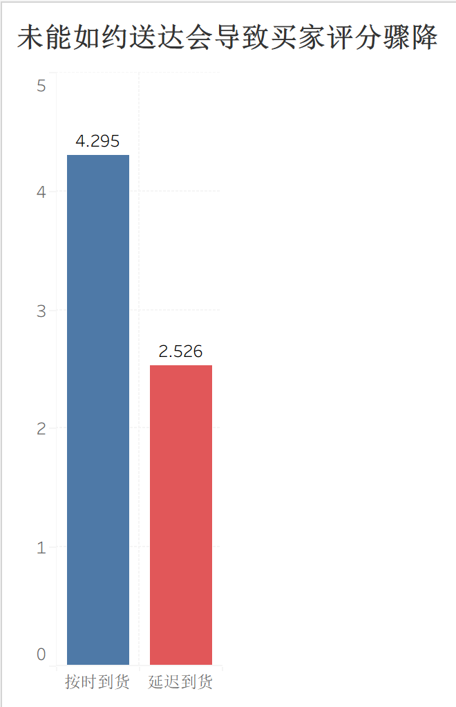

另外，对差评卖家进行帕累托分析，发现差评的分布是极其分散的，不是少数卖家导致的大量差评。

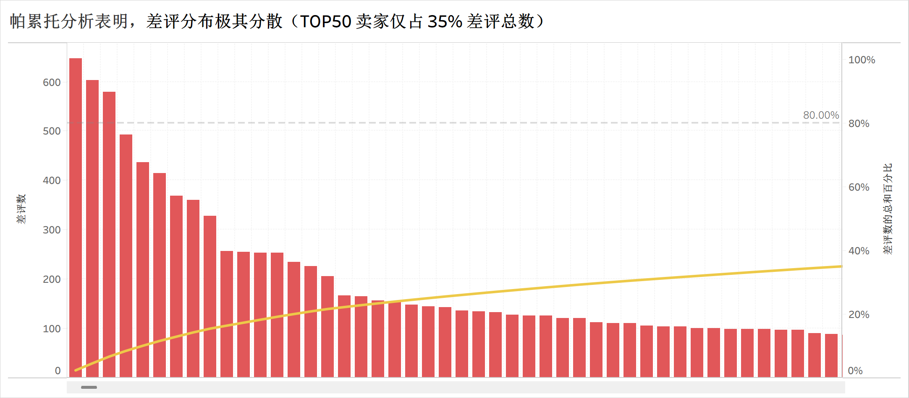

## 物流问题数据分析

根据巴西权威电商研究机构 Ebit/Nielsen 发布的《Webshoppers》年度报告（第 37-39 版）：

> 2017-2018 现状：巴西电商的平均承诺交付时间在 12-14 天，但实际妥投时间（Real Delivery Time）由于清关（跨境）或内陆支线物流的落后，往往落在 15-20 天 这一区间。

**数据显示，Olist 的平均妥投时间（13 天）已达到行业平均水平（14 天内），但其平均承诺时效（25 天）存在近 100% 的冗余空间，这种策略虽然保住了准时率，却大幅牺牲了对时效敏感客户的吸引力。**

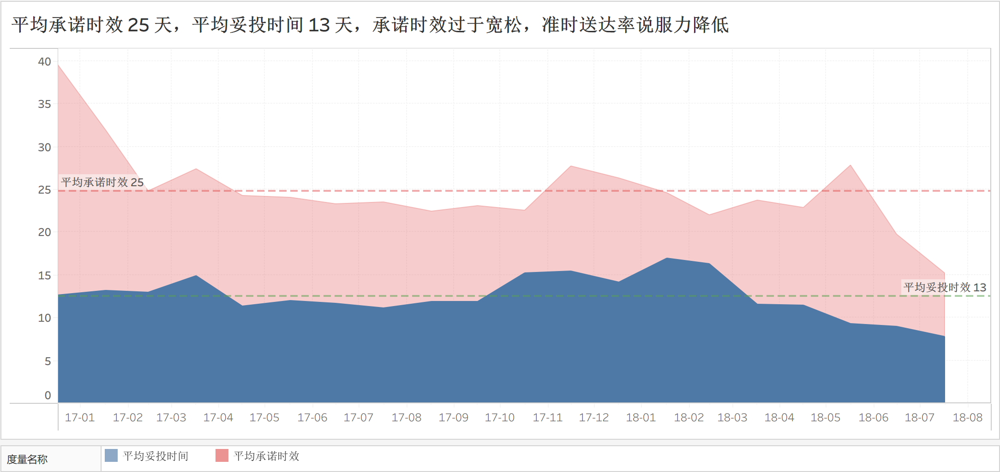

既然源数据计算得到的准时率没有可信度，那就以行业平均水准再算一遍准时率。

**果然，有接近半数订单的妥投时间未达行业平均水平，这是一个明显增长机会。**

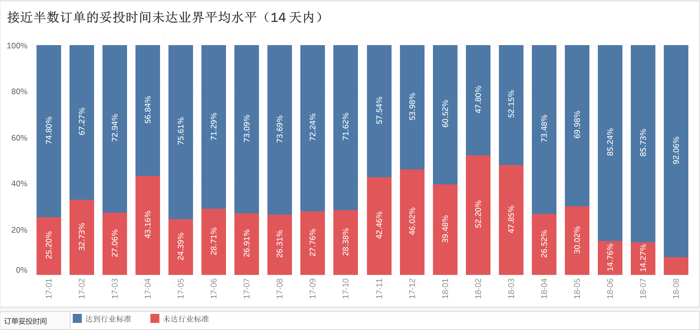

那些不及行业平均水准的订单，从用户下单到妥投，中间是哪个环节拖了后腿？

**从数据来看是物流运输环节最耗时，达到了 15~21 天，占总耗时的超过一半，另外，4~5 天的卖家处理时间也很难说得上是高效率。**

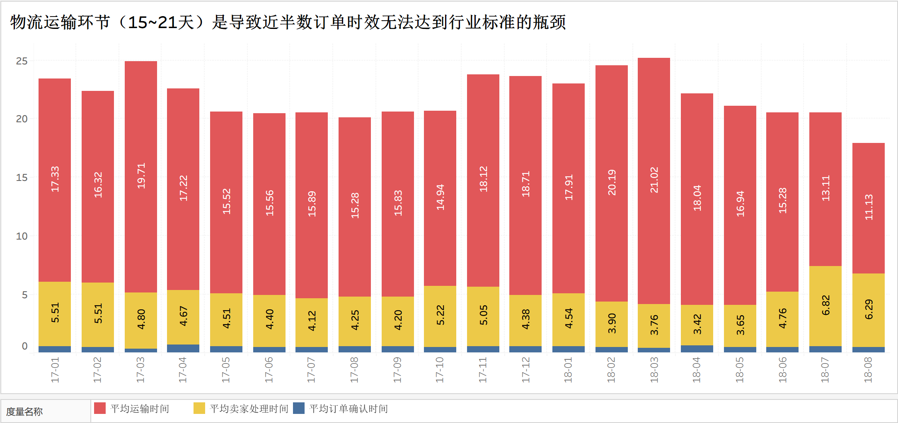

这里分支出两条分析思路：一方面需要分析物流时间为什么这么长，另一方面需要分析卖家处理时间为什么这么长。

**对延迟订单的可视化分析表明：**

- 巴西南部圣保罗首都圈承载了全国的物流压力，少量近端物流出现长时间延迟*（红色粗线）*
- 除了首都圈之外，长时间延迟的订单还出现在巴西东部

- 其他地域（西部、北部）的延迟订单数量很少

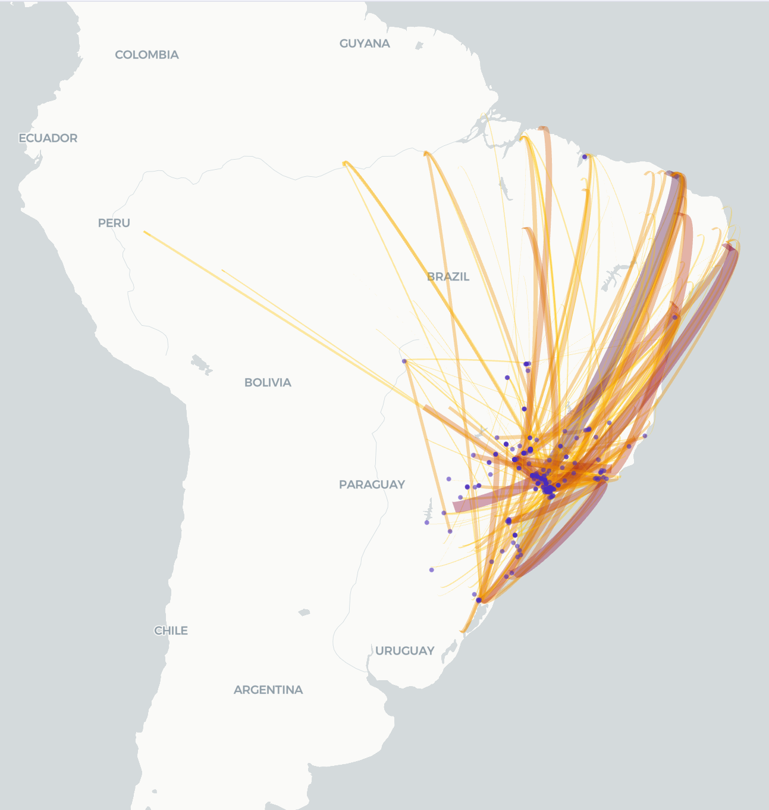

结合巴西全国各地域的订单需求占比图，可以谨慎地得出以下结论：

**圣保罗首都圈的物流分拣中转中心的数量和质量不足以承载全国的物流压力，这是当前出现物流延迟的根因。**

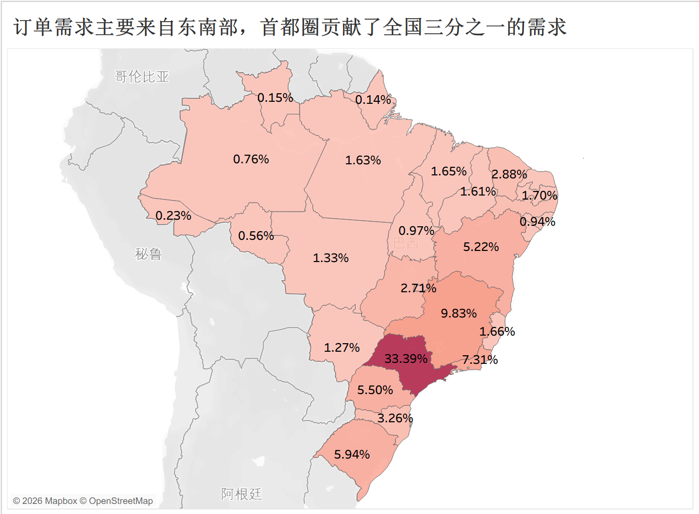

## 决策建议

> 此处理论上还应该给出收益测算，根据 ROI 决策，但是这需要用 Amazon 等平台侧的数据和物流侧的数据，但是 Kaggle 上面没有给这部分数据🫥。
{: .prompt-tip}

简单总结目前面对的问题：

**当前增长模式存在结构性隐患：GMV 虽由订单量驱动，但受限于 “高运费” 与 “弱履约” 的双重挤压，买家品类向低频耐用品集中，导致复购率极低。随着新客红利边际递减，单纯依赖拉新的增长模式已不可持续。**

但物流问题是一个行业整体问题，不是能短期解决的，这里需要分阶段考虑。

### 短期策略：缩短预期送达时间，提高转化率

现在的策略过于保守，预留了接近 100% 的冗余。可以考虑改为预留 50% 左右的冗余，但是对于东部地区额外增加 2 天的 Buffer。

这个策略的目的是吸引更多时间敏感型买家，把新客红利期稍微拖久一点，为更长期的策略争取时间，但治标不治本，而且也引入了更多订单会延期送达的风险。

### 中期策略：设置凑单策略，提高客单价

买家主要是买大件耐用品，可以在购买阶段推荐配套的小件货物，提高客单价。

这个策略的目的是在目前极短的买家留存周期内，榨取更多价值，提高 LTV，给 GMV 和订单量的之间稍微松松绑，让订单均价也承担部分增长压力，同样是治标不治本的策略。

### 长期策略：设置前置仓储，增加履约能力

在巴伊亚州设置前置仓储，分摊东部的物流压力，给圣保罗中心降压，提升整体的履约能力。

这个策略的目的是尽可能增加履约能力，这样可以最大程度上减少因为物流延迟带来的差评，更重要的是，Olist 的好评率提高对 Amazon 平台的搜索权重提升也是有正面作用的，也就是说，这个策略的好处不仅体现在可以降低买家流失率，还体现在能带来更多的新买家，维持 GMV 的持续增长。
