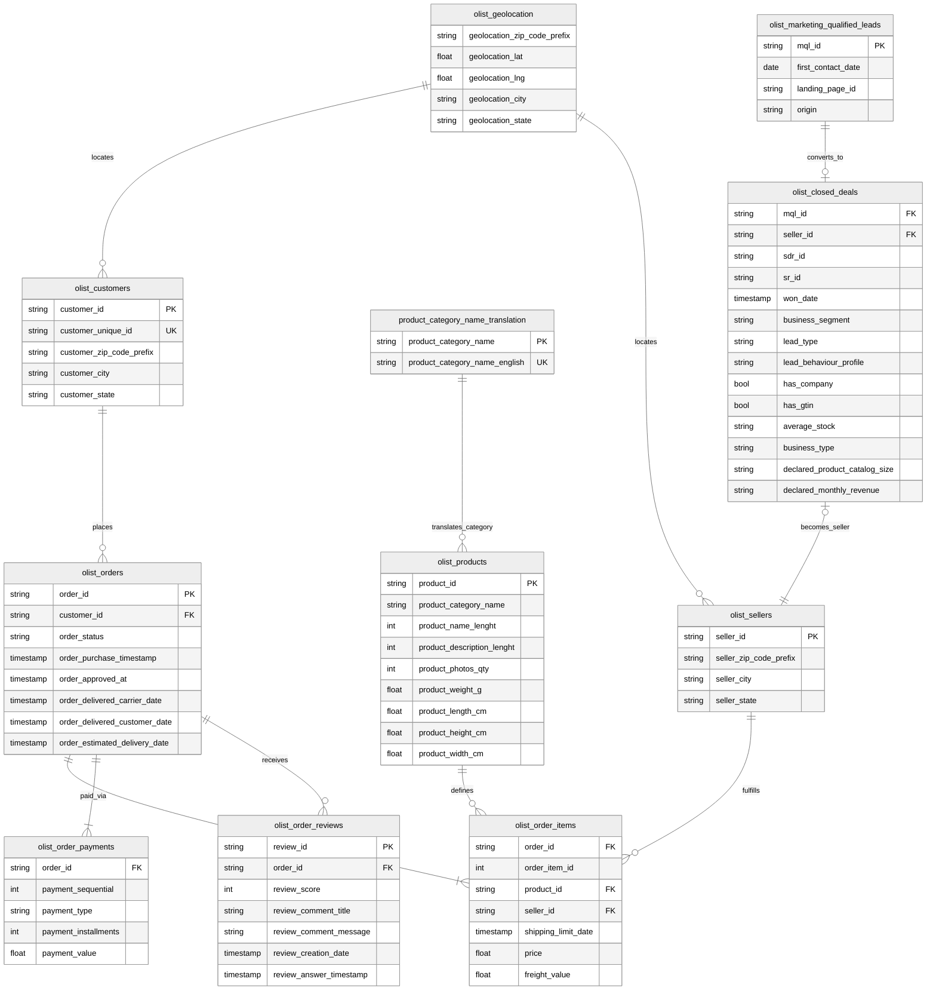

**数据集来源**：

- [Brazilian E-Commerce Public Dataset by Olist](https://www.kaggle.com/datasets/olistbr/brazilian-ecommerce)
- [Marketing Funnel by Olist](https://www.kaggle.com/datasets/olistbr/marketing-funnel-olist)

> 这是真实的商业数据，所有商店和合作伙伴的文本都已替换为《权力的游戏》中的家族名称。
{: .prompt-tip }

**分析背景假设**：

[Olist](https://olist.com/) 作为一个连接商家和买家的平台，近期面临**营销转化率不稳定且物流差评增多**的情况。领导要我通过分析**找出高质量商家的特征，并优化用户的购物体验**。

## 整体分析框架

为保证分析的深度与可落地性，这个案例在**[描述性统计](https://www.spsspro.com/help/descriptive/)**的基础上，还基于**[跨行业数据挖掘标准流程（CRISP-DM）](https://www.ibm.com/docs/zh/spss-modeler/saas?topic=dm-crisp-help-overview)**的思想和 Olist 的 **[Marketplace 业务模式](https://zhuanlan.zhihu.com/p/565026406)**，构建了从 “营销获客” 到 “履约交付” 的全链路分析闭环。

整个分析框架主要分为四个阶段：

1. **数据架构与全貌认知**

   这一阶段的目标是理清 11 张数据表的 **[ER 关系](https://www.visual-paradigm.com/cn/guide/data-modeling/what-is-entity-relationship-diagram/)**，构建可供分析的宽表模型。

   - 语义标准化：数据源的网站已经给出了所有字段的准确语义。
   - 业务逻辑映射：数据源的网站已经给出了现成的 Data Schema。

   在二者的基础上，结合 Olist 的业务模式，画出 ER 图即可。

2. **数据清洗**

   这一阶段的目标是将原始脏数据转化为高质量的分析资产。

   - 数据质量审计：检查数据的完整性（`Null` 值分布）、一致性（价格异常值、状态冲突）和唯一性（主键查重），并以合适的方式处理非法数据（剔除或填充）。

   - 时效特征构造：计算 `delta_delivery_time`（实际送达 - 预计送达），用于量化物流延迟程度。
   - 地理特征处理：利用地理坐标计算商家与买家间的物理距离，为物流分析提供归因依据。
   - 多语言处理：将葡萄牙语的 `product_category` 映射为英语，确保可读性。

3. **指标体系构建与假设提出**

   这一阶段的目标是采用**[目标-策略-衡量（OSM）模型](https://zhuanlan.zhihu.com/p/1945238646325249909)**，将业务问题转化为可量化的数据指标。

   - 营销侧指标体系：建立从[营销合格线索（MQL）](https://www.shuziqianzhan.com/article/2383.html)到活跃商家中间各环节的[转化漏斗（Conversion Funnel）](https://www.shopify.com/zh/blog/ecommerce-funnel)，重点关注**[渠道转化率（CVR）](https://advertising.amazon.com/zh-cn/library/guides/conversion-rate#1)**与**转化耗时（Time To Conversion）**。
   - 运营侧指标体系：
     - 北极星指标：[成交总额（GMV）](https://wiki.mbalib.com/wiki/GMV)、订单量。
     - 效率指标：订单核销率、[物流按时交付率（OTD）](https://mbb.eet-china.com/blog/642052-398254.html)。
     - 体验指标：[净推荐值（NPS）](https://www.ibm.com/cn-zh/think/topics/net-promoter-score)替代指标（Review Score 平均分）。
   - 提出假设：
     - *H1*：来自特定渠道（如 Paid Search）的商家具有更高的[生命周期价值（LTV）](https://zhuanlan.zhihu.com/p/51914694)。
     - *H2*：物流延迟天数与客户评分之间存在显著的负相关非线性关系。

4. **归因洞察与可视化叙事**

   这一阶段的目标是通过可视化验证假设，并输出可执行的商业建议。

   - 全链路漏斗分析：打通营销表与订单表，评估不同来源商家的后续销售表现，优化市场投放策略。
   - RFM 用户/商家分层：基于 **[Recency-Frequency-Monetary 模型](https://blog.ocard.co/knowhow/crm-rfm-analysis/)**对商家进行价值分层，识别 “金牌商家” 特征。
   - 地理空间分析：绘制巴西物流热力图，识别 “高延迟、低评分” 的物流黑洞区域，提出仓储布局建议。
   - 归因分析：探究影响差评（Review Score < 3）的核心因子（是产品质量还是物流速度？）。

## 数据架构与全貌认知

**目标**：目标是理清 11 张数据表的 ER 关系，构建可供分析的宽表模型。

数据源网站已经给出了所有字段的准确语义和 Data Schema，这里根据已有信息画出 ER 图即可。

## 数据清洗

