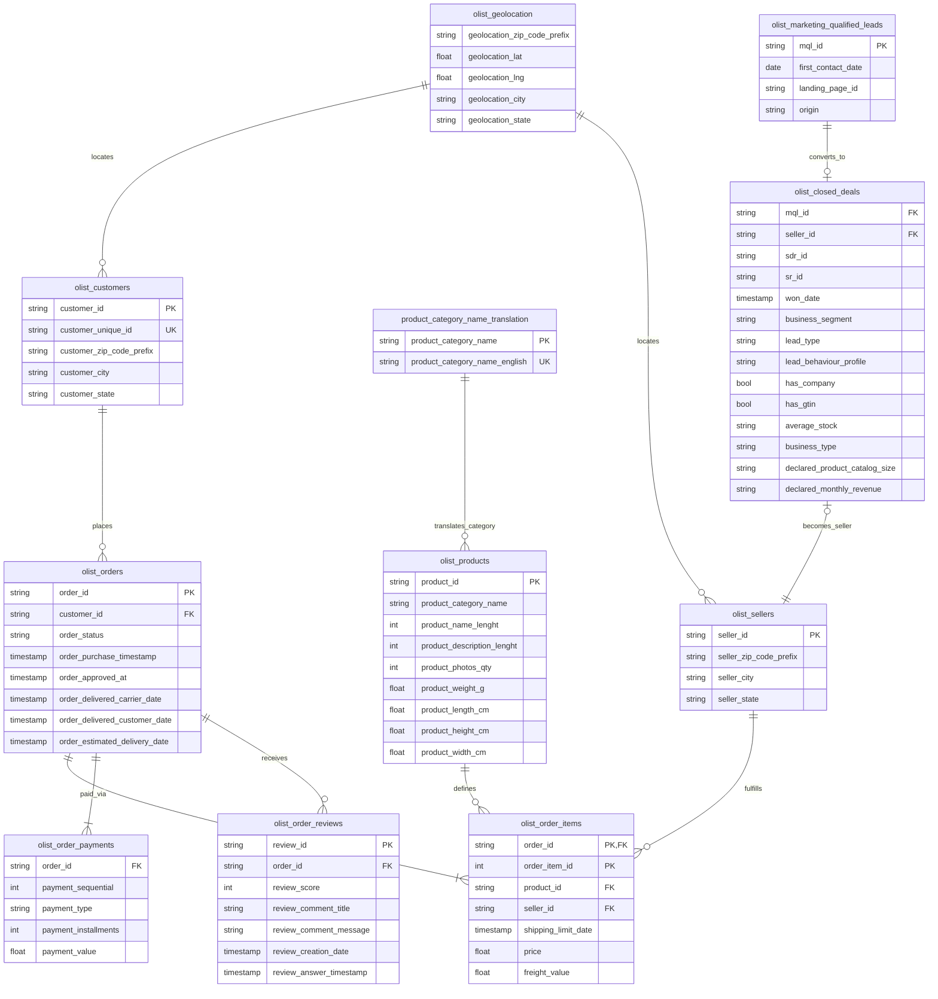
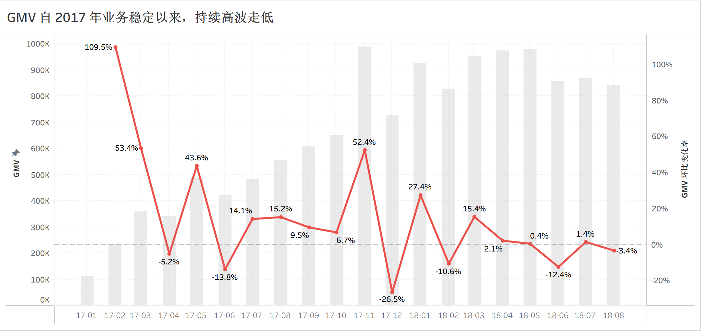
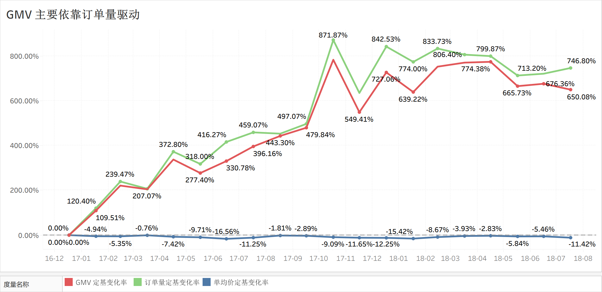
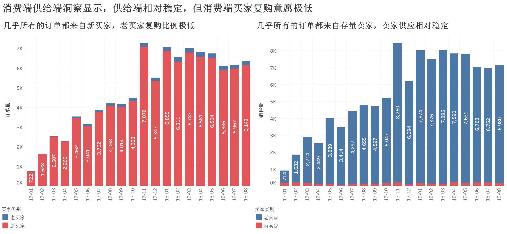
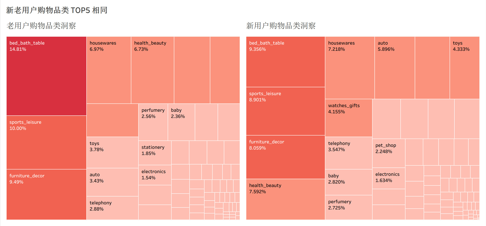

**数据集来源**：

- [Brazilian E-Commerce Public Dataset by Olist](https://www.kaggle.com/datasets/olistbr/brazilian-ecommerce)
- [Marketing Funnel by Olist](https://www.kaggle.com/datasets/olistbr/marketing-funnel-olist)

> 这是真实的商业数据，所有商店和合作伙伴的文本都已替换为《权力的游戏》中的家族名称。
{: .prompt-tip }

## 了解 Olist 商业模式

Olist 是一个 B2B2C 的平台，为长尾中小商家提供将 SKU 一站分发到各大电商平台的服务，为他们提供在各大电商平台的信用背书，降低中小商家入驻大平台的门槛。对于大平台来说，Olist 是一个超级大卖家，依托众多中小商家，提供了海量 SKU。
**Olist 的利润主要来自 SaaS 软件的订阅费（月费/年费）和每笔订单的佣金抽成。**

> 上述只针对 2016~2018 年间的 Olist，现在的 Olist 的业务版图已经扩展了非常多。

## 选定北极星指标

任何商业公司的最终目的都是盈利，所以个人思路是：从利润开始层层拆分，**每层只拆分成长性更高的那个指标**。

- 第一次拆分：$利润 = 营业额 \times 利润率$
- 第二次拆分：$营业额 = 订阅费收入 + 佣金收入$
- 第三次拆分：$佣金收入 = 总交易额(GMV) \times 佣金率$

再往下拆会不得不产生信息损失，导致决策信息失真，所以这里**选择 GMV 作为北极星指标**。

## 理解数据集结构

数据源网站已经给出了所有字段的准确语义和 Data Schema，这里根据已有信息画出 ER 图即可。



## 探索性数据分析与问题拆解

从北极星指标入手，同期群多维度观察，发现并层层拆解问题。

单纯的 GMV 只是一个随着时间不断增长的 “虚荣指标”，我们实际需要洞察的是它的（年/月/季度）变化率。

利用 `olist_orders_dataset` 和  `olist_order_items_dataset` 计算 GMV 变化率之前首先要审计和清洗数据。

```python
------------------------------------
  olist_orders_dataset 审计结果
------------------------------------


                                                                          alerts    type  count  missing  missing_pct  unique  unique_pct                   top  top_cnt   top_pct
column                                                                                                                                                                            
order_id                                             may_pk_or_uk | may_need_nlp  object  99441        0     0.000000   99441    1.000000  00010242fe8c5a6d1ba2        1  0.000010
customer_id                                          may_pk_or_uk | may_need_nlp  object  99441        0     0.000000   99441    1.000000  00012a2ce6f8dcda20d0        1  0.000010
order_status                                                        too_many_top  object  99441        0     0.000000       8    0.000080             delivered    96478  0.970203
order_purchase_timestamp                             may_pk_or_uk | may_need_nlp  object  99441        0     0.000000   98875    0.994308   2017-11-20 10:59:08        3  0.000030
order_approved_at                             missing_need_handle | may_need_nlp  object  99441      160     0.001609   90733    0.912430   2018-02-27 04:31:10        9  0.000091
order_delivered_carrier_date                                 missing_need_handle  object  99441     1783     0.017930   81018    0.814734   2018-05-09 15:48:00       47  0.000473
order_delivered_customer_date  missing_need_handle | may_pk_or_uk | may_need_nlp  object  99441     2965     0.029817   95664    0.962018   2016-10-27 17:32:07        3  0.000030
order_estimated_delivery_date                                                     object  99441        0     0.000000     459    0.004616   2017-12-20 00:00:00      522  0.005249

------------------------------------
  olist_order_items_dataset 审计结果
------------------------------------

                                                              alerts     type   count  missing  missing_pct  unique  unique_pct                   top  top_cnt   top_pct   min      max        mean  median         std   zero  zero_pct  negative  negative_pct  skewness    kurtosis
column                                                                                                                                                                                                                                                                                
order_id                                                               object  112650        0          0.0   98666    0.875863  8272b63d03f5f79c56e9     21.0  0.000186   NaN      NaN         NaN     NaN         NaN    NaN       NaN       NaN           NaN       NaN         NaN
order_item_id        check_polar_valid | high_skewed | may_high_kurt    int64  112650        0          0.0      21    0.000186                   NaN      NaN       NaN  1.00    21.00    1.197834    1.00    0.705124    0.0    0.0000       0.0           0.0  7.580356  103.857361
product_id                                                             object  112650        0          0.0   32951    0.292508  aca2eb7d00ea1a7b8ebd    527.0  0.004678   NaN      NaN         NaN     NaN         NaN    NaN       NaN       NaN           NaN       NaN         NaN
seller_id                                                              object  112650        0          0.0    3095    0.027474  6560211a19b47992c366   2033.0  0.018047   NaN      NaN         NaN     NaN         NaN    NaN       NaN       NaN           NaN       NaN         NaN
shipping_limit_date                                                    object  112650        0          0.0   93318    0.828389   2017-07-21 18:25:23     21.0  0.000186   NaN      NaN         NaN     NaN         NaN    NaN       NaN       NaN           NaN       NaN         NaN
price                                                                 float64  112650        0          0.0    5968    0.052978                   NaN      NaN       NaN  0.85  6735.00  120.653739   74.99  183.633928    0.0    0.0000       0.0           0.0  7.923208  120.828298
freight_value                                                         float64  112650        0          0.0    6999    0.062130                   NaN      NaN       NaN  0.00   409.68   19.990320   16.26   15.806405  383.0    0.0034       0.0           0.0  5.639870   59.788253
```

存在一些缺失率低于 3% 的字段，不影响整体分析，无需处理。

**在 TableauBI 中对 GMV 可视化处理后，可以明显发现 GMV 持续高波走低，经营情况不容乐观。**



发现问题后，需要找问题根因，手段是进一步拆分 GMV，看到底是哪个子指标导致 GMV 持续走低。

这里的拆分方式有很多，但是根据 MECE 原则，我们一般优先把 GMV 拆分为 $订单量 \times 订单均价$。

**对比订单量和订单均价与 GMV 的定基变化率，可以明显看到 GMV 几乎完全是由订单量驱动的。**



也就是说，GMV 的异常趋势主要是订单量出了问题。那为什么订单量会出问题。

考虑到 Olist 当时作为初创公司的背景，可以往两个方面考虑：新用户少了或者老用户走了。

所以我们可以进一步拆分：$订单量 = 新用户订单 + 老用户订单$

**列出新老用户订单量的逐月占比，可以清洗地观察到，几乎所有订单都来自新用户，老用户复购比例极低。**



那现在的问题就更清晰了，新用户开发接近瓶颈，但老用户又留不下来。那用户为什么不复购呢？

我们需要把新老用户都买了什么商品拉出来看看，是不是大多数用户买的东西本身就不是易耗品呢？

**可视化展示，新老用户的购物模式没有明显区别，并不是因为商品本身的属性导致用户不复购，**



至此，我们有充足的理由去看看用户的订单评论，主要是看差评。

这里需要 NLP 接入进行情感分析，和主题词提取。

