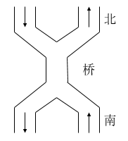

# 其他 PV 问题

## 入库问题

问题描述：

> 在一个仓库中可以存放 A 和 B 两种产品，要求：
>
> 1. 每次只能存入一种产品；
> 2. A 产品数量  $$ - $$  B 产品数量  $$ < M $$ ；
> 3. B 产品数量  $$ - $$  A 产品数量  $$ < N $$ 。
>
> 其中， $$ M, N $$  是正整数，试用 PV 操作描述产品 A 和 产品 B 的入库过程。

解法：

```c
semaphore diffAB = M - 1; // A - B 可容忍的数量差
semaphore diffBA = N - 1; // B - A 可容忍的数量差
semaphore mutex = 1; // 仓库互斥

A() {
    while (1) {
        P(diffAB);
        P(mutex);
        stockinA();
        V(mutex);
        V(diffBA);
    }
}

B() {
	while (1) {
		P(diffBA);
		P(mutex);
		stockinB();
		V(mutex);
		V(diffAB);
	}
}
```

## 面包店销售问题

问题描述：

> 面包师有很多面包，由  $$ n $$  名销售人员。每名顾客进店后取一个号，并且等待叫号，当一名销售人员空闲时，就叫下一个号。试设计一个使销售人员和顾客同步的算法。

解法：

```c
semaphore mutex_get = 1; // 取号记录互斥锁
semaphore mutex_call = 1; // 叫号记录互斥锁

int num_get =  0; // 取号记录
int num_call = 0; // 叫号记录

Seller() {
	while (1) {
		P(mutex_call);
		if (num_call < num_get) {
			++num_call;
			V(mutex_call);
			
			sell();
		} else {
			V(mutex_call);
		}
	}
}

Customer() {
	while (1) {
		P(mutex_get);
		++num_get;
		V(mutex_get);
		
		waiting_for_call();
	}
}
```

## 和尚喝水问题

问题描述：

> 某寺庙有小和尚、老和尚若干，有一水缸，由小和尚提水入缸供老和尚引用。水缸可容  $$ 10 $$  桶水，水取自同一井中。水井径窄，每次只能容一个桶取水。水桶总数为  $$ 3 $$  个。每次入缸取水仅为一桶，且不可同时进行。试给出有关从缸取水、入水的算法描述。

解法：

```c
semaphore empty = 10; // 水缸余量
semaphore full = 0; // 水量
semaphore well = 1; // 水井互斥锁
semaphore vat = 1; // 水缸互斥锁
semaphore barrel = 3; // 水桶

Young_monk() {
	while (1) {
		P(empty);
		P(barrel);
		
		P(well);
		drill();
		V(well);
		
		P(vat);
		pour();
		V(vat);
		V(full);
		
		V(barrel);
	}
}

Old_monk() {
	while (1) {
		P(full);
		P(barrel);
		
		P(vat);
		fetch();
		V(vat);
		V(empty);
		
		drink();
		
		V(barrel);
	}
}
```

## 南北过桥问题

问题描述：

> 有桥如下图所示，车流如箭头所示。
>
> 
>
> 1. 假设桥上每次只能有一辆车行驶，试用 PV 操作控制信号灯实现交通管理。
> 2. 假设桥上不允许两车交会，但允许同方向多辆车一次通过，试用 PV 操作控制信号灯实现交通管理。

1. 解法：

   ```c
   semaphore bridge = 1; // 桥互斥锁
   
   N2S_i() {
   	P(bridge);
   	drive();
   	V(bridge);
   }
   
   S2N_i() {
   	P(bridge);
   	drive();
   	V(bridge);
   }
   ```

2. 解法：

   ```c
   semaphore bridge = 1; // 桥互斥锁
   semaphore mutex_n2s = 1; // 北到南通行数的互斥锁
   semaphore mutex_s2n = 1; // 南到北通行数的互斥锁
   
   int count_n2s = 0; // 北到南通行数
   int count_s2n = 0; // 南到北通行数
   
   N2S_i() {
   	P(mutex_n2s);
   	if (count_n2s == 0) {
       	P(bridge);
   	}
   	++count_n2s;
   	V(mutex_n2s);
   	
   	drive();
   	
   	
   	P(mutex_n2s);
   	--count_n2s;
   	if (count_n2s == 0) {
       	V(bridge);
   	}
   	V(mutex_n2s);
   }
   
   S2N_i() {
   	P(mutex_s2n);
   	if (count_s2n == 0) {
       	P(bridge);
   	}
   	++count_s2n;
   	V(mutex_s2n);
   	
   	drive();
   	
   	
   	P(mutex_s2n);
   	--count_s2n;
   	if (count_s2n == 0) {
       	V(bridge);
   	}
   	V(mutex_s2n);
   }
   ```


## 录像厅问题

问题描述：

> 假设一个录像厅有  $$ 0 $$ 、 $$ 1 $$ 、 $$ 2 $$  三种不同的录像片可由观众选择放映。录像厅的放映规则为：
>
> 任何时刻最多只能放映一种录像片，正在放映的录像片是自动循环放映的。最后一个观众主动离开时结束当前录像片的放映。
> 选择当前正在放映录像片的观众可立即进入，允许同时有多位选择同一种录像片的观众同时观看，同时观看的观众数量不受限制。
> 等待观看其他录像片的观众按到达顺序排队，新的录像片开始放映时，所有等待观看该录像片的观众可一次进入录像厅同时观看。

```c
semaphore video_hall = 1; // 代表放映室的使用权
semaphore mutex_count_v0 = 1; // 对变量 count_v0 的互斥锁
semaphore mutex_count_v1 = 1; // 对变量 count_v1 的互斥锁
semaphore mutex_count_v2 = 1; // 对变量 count_v2 的互斥锁

int count_v0 = 0; // 用于记录正在观看 0 类录像片的观众数量
int count_v1 = 0; // 用于记录正在观看 1 类录像片的观众数量
int count_v2 = 0; // 用于记录正在观看 2 类录像片的观众数量

Audience_0() {
	while (1) {
		P(mutex_count_v0);
		if (count_v0 == 0) { // 第一个观看 0 类影片的观众占有放映室的使用权
			P(video_hall);
		}
        ++count_v0;
		V(mutex_count_v0);

		watch_v0();

		P(mutex_count_v0);
		--count_v0;
		if (count_v0 == 0) { // 最后一个观看 0 类影片的观众让出放映室的使用权
			V(video_hall);
		}
		V(mutex_count_v0);
	}
}

Audience_1() {
	while (1) {
		P(mutex_count_v1);
		if (count_v1 == 0) { // 第一个观看 1 类影片的观众占有放映室的使用权
			P(video_hall);
		}
        ++count_v1;
		V(mutex_count_v1);

		watch_v1();

		P(mutex_count_v1);
		--count_v1;
		if (count_v1 == 0) { // 最后一个观看 1 类影片的观众让出放映室的使用权
			V(video_hall);
		}
		V(mutex_count_v1);
	}
}

Audience_2() {
	while (1) {
		P(mutex_count_v2);
		if (count_v2 == 0) { // 第一个观看 2 类影片的观众占有放映室的使用权
			P(video_hall);
		}
        ++count_v2;
		V(mutex_count_v2);

		watch_v2();

		P(mutex_count_v2);
		--count_v2;
		if (count_v2 == 0) { // 最后一个观看 2 类影片的观众让出放映室的使用权
			V(video_hall);
		}
		V(mutex_count_v2);
	}
}
```
